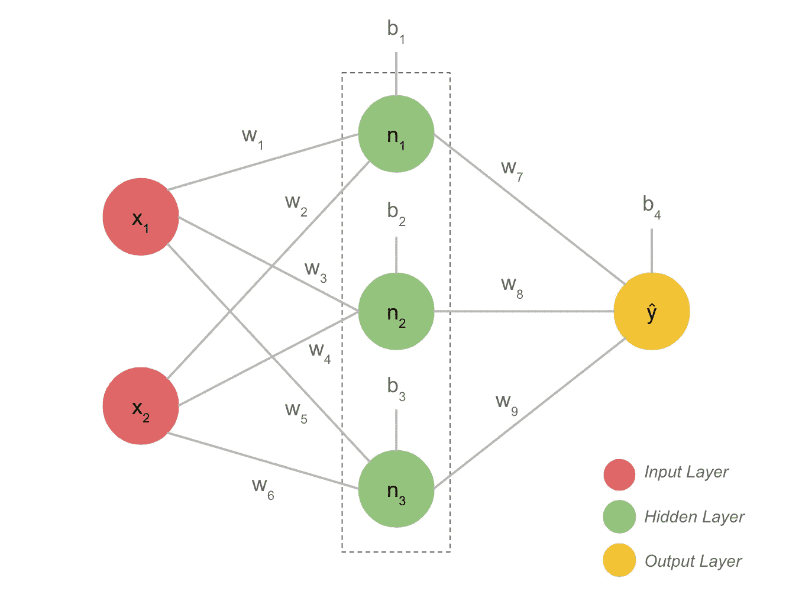
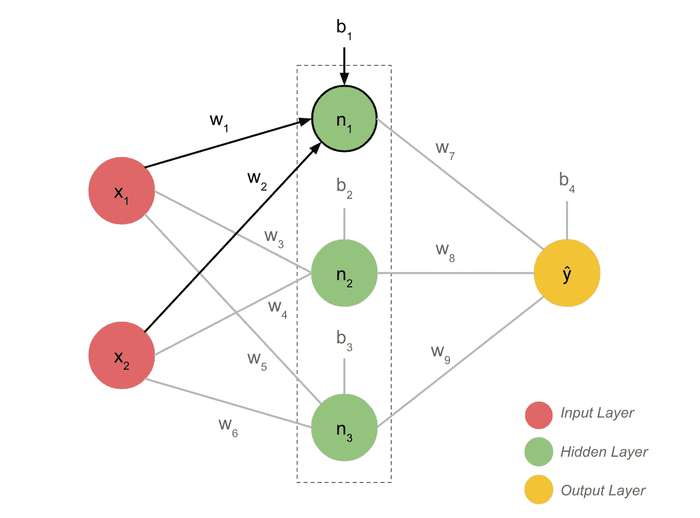
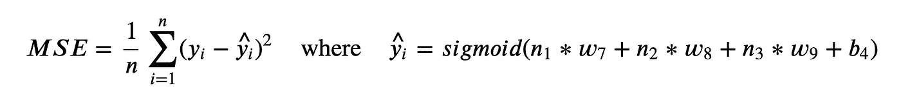
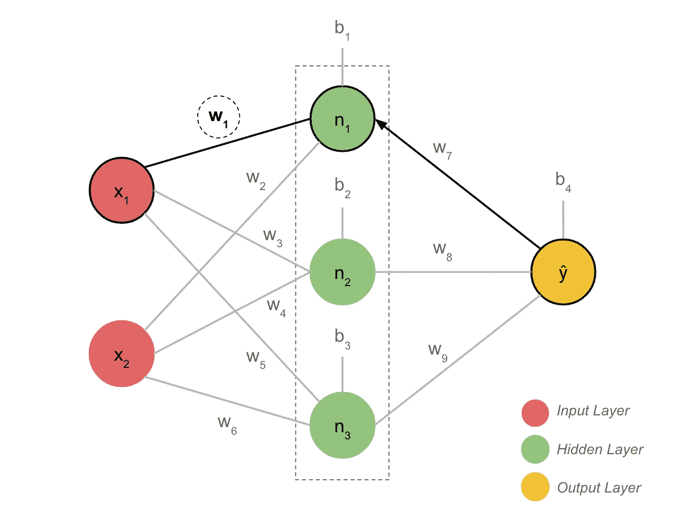
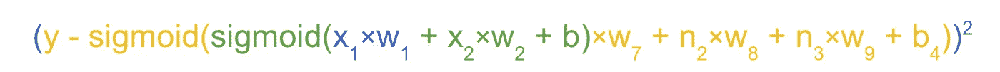
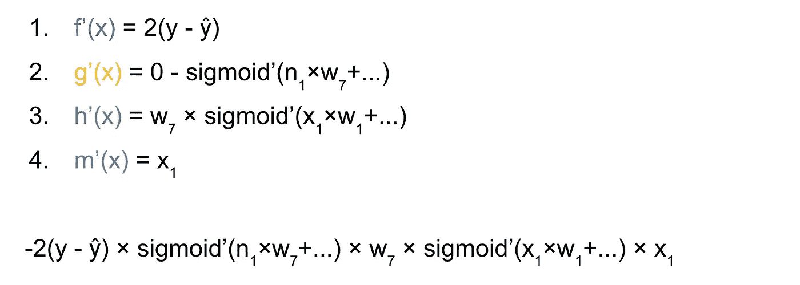
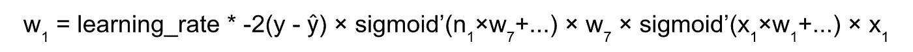
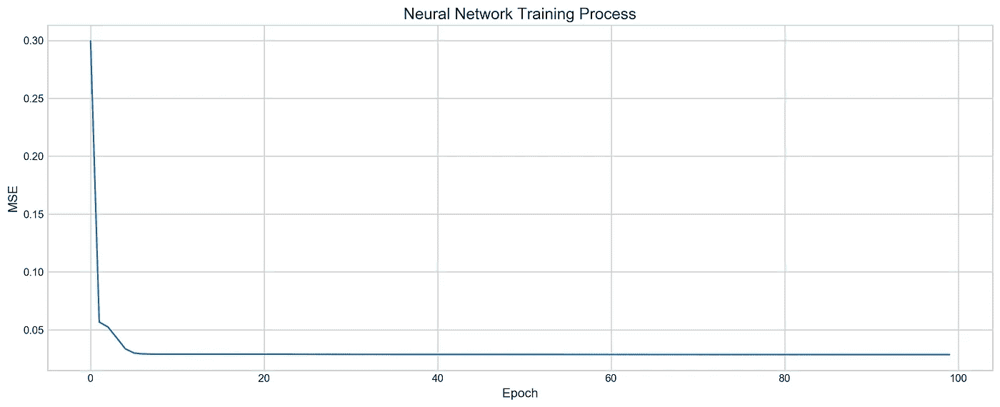

# 如何从零开始构建神经网络

> 原文：<https://towardsdatascience.com/how-to-build-neural-network-from-scratch-d202b13d52c1?source=collection_archive---------35----------------------->


安妮·斯普拉特的照片

如何从头开始建立一个简单的神经网络的分步教程

# 介绍

在这篇文章中，我们将用一个隐藏层和一个 sigmoid 激活函数从头开始构建我们自己的神经网络。我们将仔细研究导数和链式法则，以便对反向传播的实现有一个清晰的了解。我们的网络将能够以与 Keras 模拟相同的精度解决线性回归任务。

你可以在这个 [GitHub 库](https://github.com/arseniyturin/neural-network-from-scratch)中找到这个项目的代码。

# 什么是神经网络？

我们曾经将神经网络视为神经元的互连层，左侧是输入层，中间是隐藏层，右侧是输出层。视觉上更容易消化，但最终，神经网络只是一个将其他函数作为输入的大函数；并且取决于网络的深度，这些内部函数也可以将其他函数作为输入，等等。那些内部功能实际上是“层”。让我们看一下我们将要构建的网络图:



神经网络体系结构

它有一个具有两个特征的输入层，一个具有三个神经元的隐藏层和一个输出层。隐藏层中的每个神经元是一个 sigmoid 激活函数，它将输入值(x1，x2)、权重(w1，…，w6)和偏差(b1，b2，b3)作为输入，并产生范围从 0 到 1 的值作为输出。

开始时，我们给权重和偏差分配从 0 到 1 的随机值。


隐藏层中的第一个神经元

输出层仅包含一个神经元，其工作与隐藏层的神经元相似。你可能已经猜到 **ŷ** 实际上是我之前提到的那个大函数。

我们上面描述的网络类型被称为 **Dence Network** ，因为神经元与来自前一层的元素完全连接，在我们的情况下是**输入**。

## 我们如何训练一个神经网络？

需要理解的最关键部分是，神经网络仅通过调整权重和偏差来训练**以最小化输出误差。训练过程由**前馈**和**反向传播**组成。前馈预测输出，反向传播调整权重和偏差以最小化输出误差，即预测值和真实值之间的差异。**

# 前馈

当我们想预测产量时，我们使用前馈函数。该函数采用输入 x1 和 x2，这些输入值与权重和偏差一起进入隐藏层中的神经元，每个神经元返回值[0–1]；然后输出层获取这些值并产生输出。

让我们仔细看看隐藏层中的第一个神经元，了解它实际上在做什么。



前馈过程

正如我前面提到的，每个神经元只是一个 sigmoid 函数:


类似于线性回归，我们有斜率和截距等参数来进行预测，在神经网络中，我们有权重和偏差。


隐藏层中的第一个神经元

每个神经元将产生一个值[0-1],我们将用它作为输出层的输入。在一些神经网络中，没有必要将输出层作为 sigmoid 或任何其他激活函数，它可以只是来自前一层的值的总和。


输出层中的神经元

该函数的代码如下所示:

```
def sigmoid(x): return 1 / (1 + np.e**-x)def feedforward(x1, x2): n1 = sigmoid(x1 * w1 + x2 * w2 + b1)
    n2 = sigmoid(x1 * w3 + x2 * w4 + b2)
    n3 = sigmoid(x1 * w5 + x2 * w6 + b3)
    y_hat = sigmoid(n1 * w7 + n2 * w8 + n3 * w9 + b4) return y_hat
```

预测完值后，我们可以使用均方差(MSE)将其与真实值进行比较。

## 为什么使用偏见？

偏置的作用是为神经元提供一个不受前几层影响的额外参数，因为它与前几层没有任何联系。

# 反向传播

起初，我们的网络在预测方面做得很糟糕，因为权重和偏差只是随机数。现在反向传播开始帮助我们训练这些参数。

每次网络做出预测时，我们用 MSE 来与真实值进行比较，然后我们回过头来调整每个权重和偏差，以稍微减少误差。



均方误差(mean square error)

为了理解反向传播，我们应该知道几个要素:

1.  导数——改变每个权重和偏差的方向
2.  链式法则——如何获取每个重量
3.  梯度下降——调整权重和偏差的迭代过程

## 派生物

感谢导数，我们总是知道我们在哪个方向改变每个参数(使它稍微变大或变小)。假设我们想要调整一个权重 **(w = 0.75)** ，以便使 MSE 稍微小一点。为了做到这一点，我们应该对这个重量取一个函数的偏导数。然后我们把数字代入导出函数，得到一个数字( **0.05** )，正数或者负数。然后我们从我们的重量中减去这个数字( **w -= 0.05** )。调整就是这么做的。这应该发生在网络中的每个权重上。

因为网络最终是非常复杂的函数，很难找到隐藏在无数其他函数中的参数的导数。幸运的是，衍生品有一个链式法则，它简化了我们的这一过程。

## 链式法则

如果我们需要找到一个函数包含另一个函数的导数，我们使用链式法则。


这条规则说，我们对外部函数求导，保持内部函数不变，然后我们用内部函数的导数乘以所有的东西。

## 梯度下降

一旦我们知道了所有的导数，我们就可以在每次反向传播时逐渐调整每个权重和偏差。这里需要知道的重要一点是，梯度下降有一个学习率参数，它通常是一个很小的数字，我们将其添加到导数的结果中，以减慢或加快训练。

## 训练重量 1 的示例

让我们来练习一下如何对 **w1** 求偏导数。一旦我们理解了它对一种重量的工作原理，对其他重量的实现就很容易了，因为在大多数情况下，这几乎是完全相同的过程。



反向传播

现在，对 **w1** 求偏导数，我们应该从 MSE 函数开始。它是包含网络中所有其他函数的根函数。


举重训练

众所周知，MSE 是真实值和预测值的平方差 **(y-ŷ)** 。如果我们展开整个网络，看看 **w1** 在里面的位置，它看起来像这样:



神经网络的 Matryoshka

我们现在应该记住，网络是一个包含其他函数的函数，为了调整该函数中的每个参数，我们需要使用链式法则:


链式规则表示

剩下的就是对每个函数求导。对于 **w1** 它有四个导数，但是对于 **w8** 它只有三个，因为它位于 **ŷ** 并且我们不需要去那么深的地方。



关于 x1 的导数

最后，我们得到了这个看起来可怕的方程，它解释了 **w1** 如何影响 MSE。让我们详细说明每一步发生了什么。

首先，我们对 MSE (y-ŷ)求导，也就是 2(y-ŷ，因为 x 的导数是 2x，同样的规则也适用于这里。我们没有像链式法则要求的那样，接触平方函数内部的内容。

然后我们对(y-ŷ)对ŷ求偏导数，得到(0-sigmoid'(…))。记住ŷ是一个 sigmoid 函数。因为它是通向重量 w1 的主要路径。接下来，我们取另一个 sigmoid 函数关于 **n1** 的偏导数，最后是 x1*w1 的最后一个导数，也就是 **x1** ，因为 **w1** 的导数是 1，系数 x1 保持不变。然后我们乘以每个导数，我们就可以开始了。

综上所述，我们得到:



权重 1 的反向传播

其中学习率是一个小数字，通常范围从 0.01 到 0.05，但也可以更大。同样的逻辑，我们适用于寻找所有其他的重量和偏见。

你可以想象，如果我们有数百个神经元，我们将有数千个权重和偏差，因此为了说明的目的，我们将神经元的数量保持得非常少。其余代码请看 [GitHub](https://github.com/arseniyturin/neural-network-from-scratch) 。

# 在真实数据上测试网络

我们的网络在根据两个参数预测房价方面做得非常好:收入中位数和平均房间数。数据取自 sklearn 图书馆的“california_housing”数据集。该网络收敛相当快，仅超过 6 个历元，结果 MSE = 0.028，与我从 Keras analog 得到的结果完全相同。



学习过程

# 结论

我们的网络非常适合教育目的，但它有局限性:我们不能改变隐藏层中神经元的数量，也不能向网络中添加另一层。我们只有一个激活函数，我们的网络只能解决简单的任务，如线性回归。如果我们想用它来解决分类问题，我们需要找到交叉熵或 Softmax 损失函数的导数。所有这些变化都可以在当前的设置中完成。

如果你有任何问题或难以理解的地方，请在评论中告诉我。

感谢您的阅读。