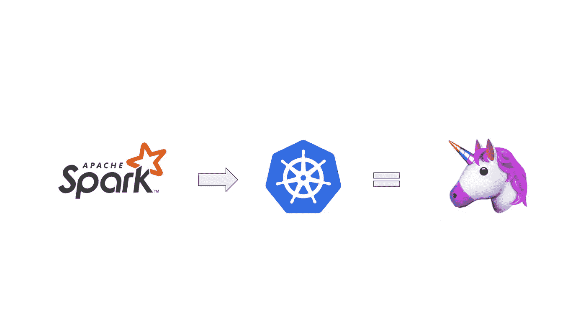

# 如何在 60 分钟内从源代码构建 Spark 并将其部署到 Kubernetes 集群

> 原文：<https://towardsdatascience.com/how-to-build-spark-from-source-and-deploy-it-to-a-kubernetes-cluster-in-60-minutes-225829b744f9?source=collection_archive---------4----------------------->

## 通过这篇 Spark 教程，登上 Kubernetes 的大数据宣传列车



天作之合？来源: [Spark Logo](https://commons.wikimedia.org/wiki/File:Apache_Spark_logo.svg,) ， [k8s Logo](https://en.wikipedia.org/wiki/Kubernetes) ， [Emoji](https://emojipedia.org/unicorn/)

**动机/前奏**

在我的上一篇文章中，我解释了 Hadoop 生态系统的大致情况，你可以在这里阅读。那篇文章最重要的是结尾，我将公然抄袭我的另一篇文章，因为它也是这篇文章的开头:

> 现在，如果你在过去几年中一直在收听 Hadoop 的生态系统，你会看到市场上最大的两家公司——cloud era 和 Hortonworks — [在大约一年前](https://techcrunch.com/2019/01/03/cloudera-and-hortonworks-finalize-their-merger/?guccounter=1&guce_referrer=aHR0cHM6Ly93d3cuZ29vZ2xlLmNvbS8&guce_referrer_sig=AQAAAFdWl96BCgH521hvgxIYTl5hVRxsg-B6Nj6_q5C9nY3_SVtz7qmGHpnGmuLxoZhv7_OXLaYSmtuQlD2BcGGKqyaT_Vz_mgfpTaE7JZZ241vBM43dLmYQsoSiqK8lidE-92bDNI69PaxqA1Z6tnjx-kUAGfvrD9zL3Bvt6j4uufAo)Hadoop 大数据市场放缓时合并了。事实上，人们似乎对 Kubernetes 比对更老的 Hadoop 特定技术更感兴趣，如用于资源管理和编排的 YARN，对 PyTorch 等 DL 框架的快速采用，以及对老化的 Hadoop 堆栈的完美风暴的形成。尽管如此，像 Apache Spark 这样的项目仍在稳步前进，例如引入 Kubernetes 作为纱线的替代品。生态系统激动人心的时刻！

**简介**

本文的目标是向您展示 2020 年大数据生态系统中的一些酷孩子在做什么；它试图把东西塞进 Kubernetes(这是一件好事！).更具体地说，使用 Spark 的本地 Spark 驱动程序和执行器的实验性实现，其中 Kubernetes 是资源管理器(而不是 YARN)

…让我们在 60 分钟内完成这项工作:

1.  从 GitHub 克隆 Spark 项目
2.  用 Maven 构建火花分布
3.  在本地构建 Docker 映像
4.  使用多个执行器副本运行 Spark Pi 作业
5.  使用端口转发在浏览器中显示 Spark UI，并检查 Spark 作业

如果这么简单，我们为什么需要这篇文章？！请继续阅读，看看我第一次是如何花了*天*才弄明白的。

免责声明:您在 60 分钟内的里程数可能会有所不同，但在假设您通常知道如何在计算机上完成工作(包括设置本地 k8s 集群和运行 bash 脚本等)的情况下，这确实是可行的。此外，如果你有一台运行缓慢的计算机，构建 Spark 可能需要一段时间；)

既然大家都在船上，让我们在 Kubernetes 上部署 Spark。为此，您可以使用您的笔记本电脑运行的 mill minikube 设置，而不是在公共云中租用一台服务器来进行此练习。除非你想全押，在这种情况下，你刚刚被敬礼。

**步骤 1–3(克隆回购、构建 Spark、构建 Docker 映像):**

这实际上是乐趣的开始——在“最简单”的步骤上。好吧，系上安全带，看看这个(双关语):

如果你在这里克隆了官方的 Spark 库[，在 k8s](https://github.com/apache/spark) [这里](https://spark.apache.org/docs/latest/running-on-kubernetes.html)天真的按照官方的 Spark 运行指南运行 Spark，你就会碰到[我前几天在 Spark 的吉拉积压里开的这一期](https://issues.apache.org/jira/browse/SPARK-31165)。

也就是说，在 docker 文件中有多个错误的引用，因此简单地运行 docker 文件注释中描述的 docker 构建命令是行不通的。

> 更新:*好吧*，事实证明，你*实际上可以*运行文档中描述的东西，但前提是你必须非常注意。

而不是逃跑

```
./build/mvn -Pkubernetes -DskipTests clean package
```

你需要跑

```
dev/make-distribution.sh -Pkubernetes
```

这创造了一个火花*发行版*而不仅仅是普通的组装零件，但我想我跳过了他们教程中的细则，所以我相应地更新了这篇文章。

TL；灾难恢复要完成步骤 1-3，只需执行以下操作:

```
git clone [git@github.com](mailto:git@github.com):apache/spark.gitcd sparkdev/make-distribution.sh -Pkubernetescd distdocker build -t spark:latest -f kubernetes/dockerfiles/spark/Dockerfile .
```

此时，您应该在本地 Docker 注册表中有一个 Spark 的图像！

**步骤 4:在 Kubernetes 中使用多个执行器副本运行 Spark Pi 作业:**

我在上面链接的 Spark 文章中提到但没有解释清楚的事实是，由于 Kubernetes 的 RBAC(基于角色的访问控制)，您不能简单地将 Spark 部署到您的集群中，因为 Spark 需要对您的 Kubernetes 集群拥有一些额外的权限来管理 pods。这是由于 Spark 的架构——您部署一个 Spark 驱动程序，然后它可以在 pod 中创建 Spark 执行器，然后在工作完成后清理它们:


Spark 在 Kubernetes 上的架构来自他们的[文档](https://spark.apache.org/docs/latest/running-on-kubernetes.html)

TL；dr 我们需要为 Spark 创建一个 kubectl 服务帐户:

```
kubectl create serviceaccount sparkkubectl create clusterrolebinding spark-role --clusterrole=edit  --serviceaccount=default:spark --namespace=default
```

接下来是使用我们本地构建的 Docker 映像运行 Spark Pi:

```
bin/spark-submit \
--master k8s://https://kubernetes.docker.internal:6443 \
--deploy-mode cluster \
--name spark-pi \
--class org.apache.spark.examples.SparkPi \
--conf spark.executor.instances=2 \
--conf spark.kubernetes.container.image=spark:latest \
--conf spark.kubernetes.container.image.pullPolicy=Never \
--conf spark.kubernetes.authenticate.driver.serviceAccountName=spark \
local:///opt/spark/examples/jars/spark-examples_2.12-3.1.0-SNAPSHOT.jar 10000000
```

好吧，但是这里实际发生的事情。这就是如何将 Spark 驱动程序部署到 Kubernetes 集群中的方法！让我们来看看这些参数，这样你就可以自己动手了:

*   定义 Kubernetes 集群(使用 kubectl cluster-info 查找)。是的，需要有点怪异的 k8s://前缀。
*   定义部署模式(集群，duh)
*   定义 Spark Driver 的名称(这也是您的 pod 名称的开头)
*   定义火花 Pi 示例
*   在 Kubernetes 上运行 Spark Executor，其中有 2 个副本将由 Spark 驱动程序生成
*   使用我们的本地火花:最新图像
*   将 Kubernetes 映像提取策略定义为 Never，这样就可以使用具有该名称的本地映像。如果你不太熟悉 k8s 的内部工作原理，这肯定需要一分钟才能弄明白…
*   定义服务客户(还记得 RBAC 吗？)
*   指向带有参数 10000000 的本地 jar 路径(它与 other 文件中的所有其他示例一起被复制到指定的路径中)(如果您不知道这个数字的用途，请查看 Spark Pi 源代码和文档)。是的，local:///是正确的，而且不是错别字。

```
kubectl get pods
```

现在应该会返回一个正在运行的 pod 列表！不要担心它们最终被终止——这是这个实现的默认设置。

**第五步:使用端口转发显示 Spark UI**

```
kubectl port-forward <insert spark driver pod name> 4040:4040
```

然后，您应该能够在浏览器中通过上面的第一个命令使用 localhost:4040 访问 Spark UI，如下所示:


这是我的 localhost:4040 带端口转发的截图

您也可以像这样查看您的日志:

```
kubectl -n=default logs -f <insert spark driver pod name>
```

**结论**

如果您非常了解 Spark 和 Kubernetes，那么使用配置文件和 docker 文件进行这种精确的设置可能会非常简单，如果您不了解，那么这可能会是一场噩梦。我希望这将有助于你在几分钟内做到这一点！

你从这里去哪里？任何你想去的地方。本文的目标是让您快速使用一个新的 Spark 资源管理器。我建议你下一步用其他 Spark 应用程序来试验这个设置——我可能会在将来写一篇关于一些更复杂的例子的文章(如果我应该的话，请告诉我)。

和 Kubernetes 玩得开心！

**替代品**

这是 2020 年 4 月 20 日的更新，您也可以使用 Google 的原生 Kubernetes 操作器，它似乎很有前途，可以将手动部署步骤删除到您的集群中:

[](https://github.com/GoogleCloudPlatform/spark-on-k8s-operator) [## Google cloud platform/spark-on-k8s-运营商

### 这不是官方支持的谷歌产品。如果您目前正在使用 v1beta1 版本的 API，请…

github.com](https://github.com/GoogleCloudPlatform/spark-on-k8s-operator) 

它目前正被 Salesforce 和微软等公司用于生产，并且正在被优步和 Lyft 用于生产评估。未来要注意的事情！