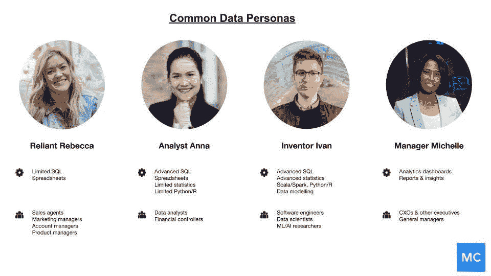
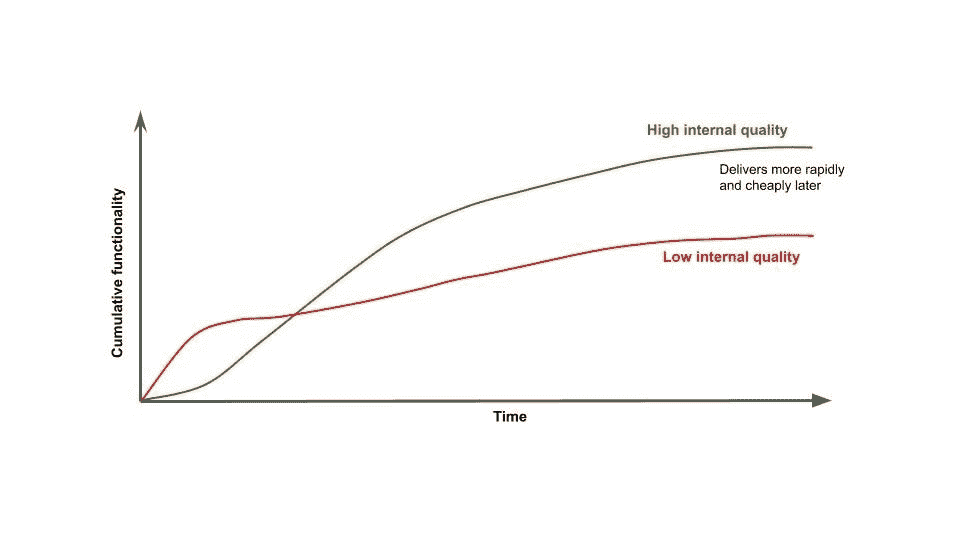

# 如何像构建产品一样构建您的数据平台

> 原文：<https://towardsdatascience.com/how-to-build-your-data-platform-like-a-product-6677e8abe318?source=collection_archive---------8----------------------->

## 从(标准开发。)零到真正的数据英雄

图片由 [Unsplash](http://unsplash.com) 上的 [Austin Distel](https://unsplash.com/photos/744oGeqpxPQ) 提供。

*在过去的几年里，许多公司已经将数据平台作为大规模聚合、处理和利用数据的有效方式。尽管数据平台越来越受欢迎，但是，关于如何成功构建数据平台的文献却很少。*

[*巴尔摩西*](https://www.linkedin.com/in/barrmoses) *、CEO&*[*蒙特卡洛*](http://montecarlodata.com) *和* [*阿图尔古普特*](https://www.linkedin.com/in/atulgupte/) *、前* [*优步数据平台团队产品经理*](https://eng.uber.com/uber-data-platform-2019/) *分享设计数据平台的建议，最大化数据对您组织的价值和影响*

你的公司喜欢数据。很多。你的老板要求今年增加人手，以加强你的数据工程团队(Presto 和 Kafka 和 Hadoop，哦，我的天！).你的数据副总裁经常潜伏在你公司的 Eng-Team Slack 频道，以了解人们对[迁移到雪花](https://www.montecarlodata.com/how-to-migrate-to-snowflake-like-a-boss/)的“感受”。你的 CEO 甚至想成为数据驱动型，不管这意味着什么。说数据是贵公司的重中之重是一种保守的说法。

> 为了满足贵公司对数据贪得无厌的胃口，您甚至可能正在构建一个复杂的多层数据生态系统:换句话说， [**一个数据平台**](https://looker.com/definitions/data-platform) 。

数据平台的核心是所有数据的中央存储库，处理数据的收集、清理、转换和应用，以生成业务洞察。对于大多数组织来说，构建数据平台不再是一件美好的事情，而是一件必要的事情，许多企业从竞争中脱颖而出，因为他们能够从数据中收集可操作的见解，无论是改善客户体验、增加收入，还是定义自己的品牌。

就像许多人将[数据本身视为产品](https://hbr.org/2018/10/how-to-build-great-data-products)一样，像[优步](https://eng.uber.com/uber-big-data-platform/)、 [LinkedIn](https://engineering.linkedin.com/teams/data) 和[脸书](https://engineering.fb.com/category/data-infrastructure/)这样的数据优先公司也越来越多地将数据平台视为“产品”，拥有专门的工程、产品和运营团队。然而，尽管数据平台无处不在且广受欢迎，但在谁在使用它们、如何使用它们以及工程师和产品经理如何优化这些体验方面，数据平台往往缺乏远见。

无论您是刚刚起步还是正在扩展，我们都将分享五个最佳实践来避免这些常见的陷阱，并构建您梦想中的数据平台:

# 使你的产品目标与业务目标一致

*将您的平台目标与您业务的总体数据目标保持一致非常重要。图片由 Unsplash 上的*[*John Schnobirch*](https://unsplash.com/photos/2FPjlAyMQTA)*提供。*

几十年来，数据平台被视为达到目的的手段，而不是“目的”，也就是你正在构建的核心产品。事实上，尽管数据平台为许多服务提供了动力，为驱动我们生活的应用提供了丰富的见解，但直到最近，它们才得到真正应有的尊重和关注。

当您构建或扩展您的数据平台时，您应该问的第一个问题是:**数据如何映射到您公司的目标？**

要回答这个问题，你得戴上你的数据平台产品经理的帽子。与具体的产品经理不同，[数据平台产品经理](https://medium.com/@wyattearp/making-the-shift-to-platform-product-management-15e1ee061b6a)必须了解全局与特定区域的目标，因为[数据会满足其他所有职能团队](https://www.montecarlodata.com/measuring-the-roi-of-your-data-organization/)的需求，从营销和招聘到业务开发和销售。

例如，如果你的业务目标是增加收入(要么做大，要么回家！)，数据是如何帮助你实现这些目标的？为了这个实验，考虑以下问题:

*   哪些服务或产品推动收入增长？
*   这些服务或产品收集哪些数据？
*   在使用这些数据之前，我们需要对其做些什么？
*   哪些团队需要这些数据？他们会用它做什么？
*   谁将有权访问这些数据或其生成的分析？
*   这些用户需要以多快的速度访问这些数据？
*   平台需要解决哪些合规性或治理检查(如果有的话)？

通过回答这些问题，您将更好地了解如何确定产品路线图的优先级，以及您需要为谁(通常是工程师)构建，还是为谁(包括分析师在内的日常平台用户)设计。此外，这种 KPI 开发和执行策略的整体方法为您的平台设置了跨团队的更可扩展的影响。

# 从合适的利益相关者那里获得反馈和认同

不言而喻，在整个产品开发过程中接受预先认可和反复反馈是数据平台之旅的必要组成部分。没有被广泛理解的是你应该关心谁的声音。

是的，你需要你的 CTO 或 VP 对最终产品的数据进行最终确认，但是他们的决定通常是由他们信任的顾问告知的:员工工程师、技术项目经理和其他日常数据从业者。

在为她的公司开发新的数据编目系统时，我们采访的一位产品经理在一家领先的运输公司花了 **3 个月**试图说服她的工程副总裁接受她的团队的想法，结果却被他的参谋长在一封电子邮件中拒绝了。

根据你公司的 DNA 考虑不同的策略。我们建议同时遵循以下三个步骤:

1.  销售愿景的领导力。
2.  向你的实际用户推销基本原理和日常使用案例。
3.  运用 [**以客户为中心的方法**](https://www.accenture.com/_acnmedia/PDF-88/Accenture-CMT-Industry-X0-Platform-Product-Management-PoV-October-2018.pdf) ，不管你在和谁说话。将平台定位为在您的数据生态系统中为不同类型的人物角色赋能的一种方式，包括您的数据团队(数据工程师、数据科学家、分析师和研究人员)和数据消费者(项目经理、高管、业务开发和销售人员等)。一个伟大的数据平台将使技术用户能够轻松高效地完成他们的工作，同时也允许技术含量较低的人物角色利用丰富的见解，或者在没有工程师和分析师太多帮助的情况下，根据数据整合可视化。

*在为公司构建数据平台时，你必须考虑各种各样的数据角色，包括工程师、数据科学家、产品经理、业务功能用户和总经理。(图片由 Atul Gupte 提供)*

> 在一天结束时，重要的是，这种体验培养了一个数据爱好者社区，他们可以一起构建、共享和学习。既然你的平台有潜力服务于整个公司，每个人都应该对它的成功感到投资，即使这意味着在这个过程中做出一些妥协。

# 优先考虑长期增长和可持续性，而不是短期收益

*考虑到短期可用性的数据解决方案通常更容易实施，但随着时间的推移，最终会比考虑到可持续性的平台更加昂贵。(图片由 Atul Gupte 提供。)*

与其他类型的产品不同，数据平台的成功不仅仅是因为它们有利于“率先上市”。由于数据平台几乎完全是内部工具，我们发现最好的数据平台是在考虑可持续性而不是特定功能的情况下构建的。

记住:你的客户就是你的公司，你公司的成功就是你的成功。这并不是说你的路线图不会改变几次(它会)，但是当你真的要改变时，要带着成长和成熟的想法去做。

例如，[优步的大数据平台](https://eng.uber.com/uber-big-data-platform/)历时五年建成，并随着业务需求不断发展；Pinterest 已经经历了几次核心数据分析产品的迭代；领衔群雄的是， [LinkedIn](https://softwareengineeringdaily.com/2019/10/23/linkedin-data-platform-with-carl-steinbach/) 自 2008 年以来一直在构建和迭代其数据平台！

> 我们的建议是:**选择对您的组织环境有意义的解决方案**，并根据这些期望和期限调整您的计划。有时，作为更大的产品开发战略的一部分，速赢可以帮助实现内部认同——只要它不是短视的。罗马不是一天建成的，你的数据平台也不是。

# 签署您的数据的基线指标以及您如何衡量它

如果您不能信任您的数据，那么您的数据平台有多好并不重要，但是数据质量对不同的利益相关者来说意味着不同的事情。因此，如果您和您的利益相关者在这个定义上不一致，您的数据平台就不会成功。

为了解决这个问题，重要的是为您的[数据可靠性、](https://www.montecarlodata.com/what-is-data-reliability/)设定基准预期，换句话说，就是您的组织在整个数据生命周期中提供高数据可用性和健康的能力。为软件应用程序可靠性设置清晰的服务水平目标(SLO)和服务水平指标(sli)是显而易见的。数据团队应该为他们的数据管道做同样的事情。

这并不是说不同的利益相关者会对“好数据”有相同的看法；事实上，他们可能不会，这没关系。与其将方钉安装到圆孔中，不如创建一个数据可靠性的基线指标，并在构建新的平台功能时，获得最小公分母的认可，这一点很重要。

> 我们建议选择一种新颖的测量方法([，就像这个](/data-quality-youre-measuring-it-wrong-8863e5ae6491)用于[数据停机](https://www.montecarlodata.com/the-rise-of-data-downtime/)，这将帮助整个公司的数据从业者在基线质量指标上保持一致。

# 知道何时构建与购买

您必须做出的第一个决定是，是从头开始构建平台，还是从供应商那里购买技术(或几种支持技术)。

虽然像优步、LinkedIn 和脸书这样的公司已经选择建立自己的数据平台，通常是基于开源解决方案，但这并不总是对你的需求有意义。虽然没有一个神奇的公式可以告诉你是建造还是购买，但我们发现购买是有价值的，直到你确信:

*   该产品需要使用敏感/机密信息(例如，财务或健康记录)运行，出于法规原因，这些信息不能与外部供应商共享
*   需要进行特定的定制，以便与其他内部工具/系统配合使用
*   这些定制足够小，供应商可能不会优先考虑它们
*   与购买相比，构建还有其他一些战略价值(例如，企业的竞争优势或有利于招聘人才)

我们采访的一家医疗保健初创公司的数据工程副总裁指出，如果他 20 多岁，他会想要建立。但是现在，在他快 30 岁的时候，他几乎只买。

“我有热情，”他说，“但是如果我有时间、精力和资源从头开始建立一个数据平台，那我就完了。我现在长大了，也更聪明了——我知道不该不相信专家。”

> 当谈到你可以把时间(更重要的是金钱)花在什么地方时，购买一个经过实践检验的真正解决方案，并有一个专门的团队来帮助你解决出现的任何问题，通常会更有意义。

# 下一步是什么？

从产品开发的角度来看，构建数据平台是一个令人兴奋的旅程，它将受益于应用。图片来自**。**

> *将您的数据平台构建为一个产品将有助于您确保围绕数据优先级达成更大的共识，实现数据质量和其他关键 KPI 的标准化，促进更大的协作，从而为您的公司带来前所未有的价值。*

*除了作为有效数据管理、可靠性和民主化的工具，将数据平台构建为产品的好处还包括:*

*   *指导销售工作(根据潜在客户的反应，让您了解应该将工作重点放在哪里)*
*   *驾驶应用产品路线图*
*   *改善客户体验(帮助团队了解您的服务难点是什么，什么有效，什么无效)*
*   *在整个公司范围内标准化数据治理和合规性措施(GDPR、CCPA 等)。)*

*乍看之下，构建数据平台似乎势不可挡，但如果方法正确，您的解决方案有可能成为整个组织的力量倍增器。*

****想了解关于构建可靠数据平台的更多信息？向*** [***巴尔摩西***](http://www.montecarlodata.com) ***和蒙特卡洛团队伸出援手。****

*本文由[巴尔·摩西](https://www.linkedin.com/in/barrmoses/)和[阿图尔·古普特](https://www.linkedin.com/in/atulgupte/)共同撰写。*