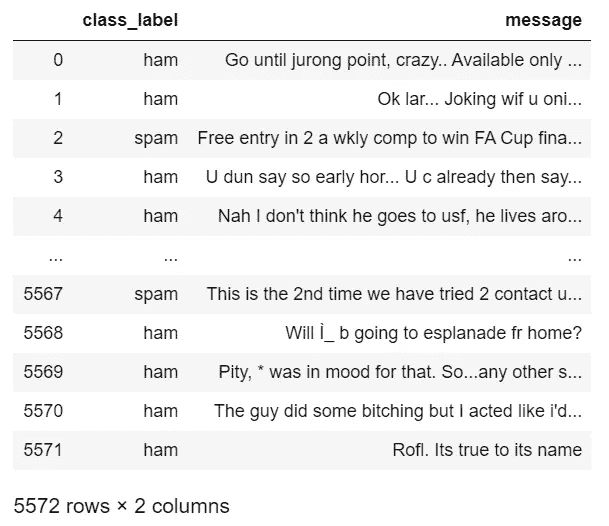
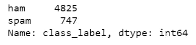
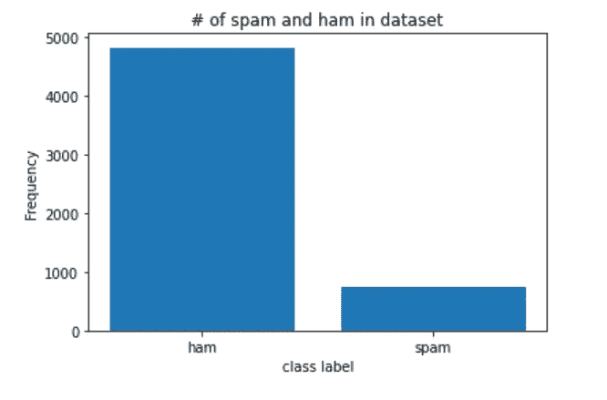
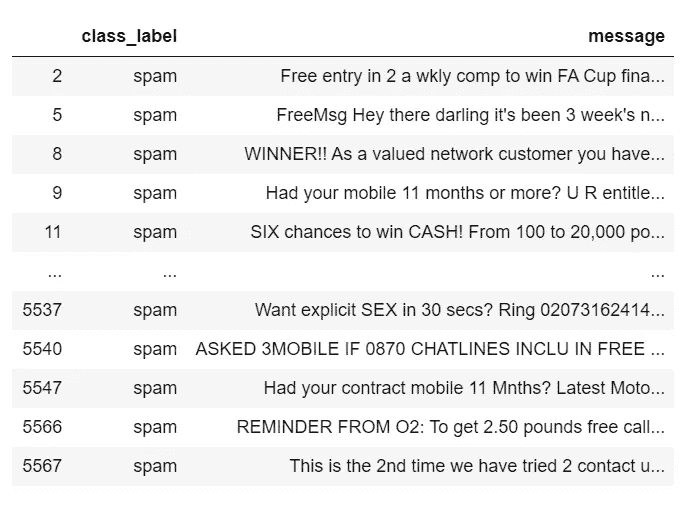
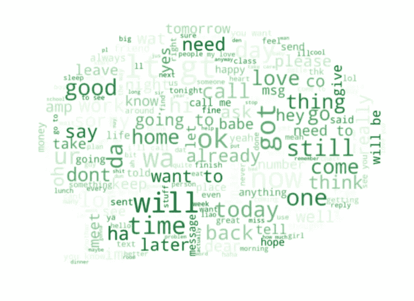
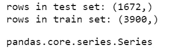
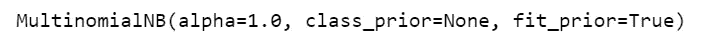
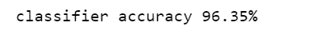
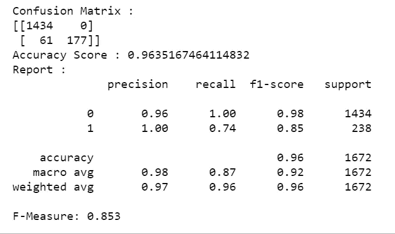
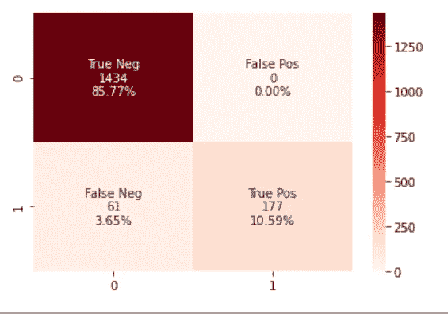

# 如何用 10 个步骤构建垃圾邮件分类器

> 原文：<https://towardsdatascience.com/how-to-build-your-first-spam-classifier-in-10-steps-fdbf5b1b3870?source=collection_archive---------5----------------------->

如果你刚刚开始机器学习，很有可能你会进行一个分类项目。作为一个初学者，我建立了一个垃圾短信分类器，但做了大量的研究，知道从哪里开始。在本文中，我将用 10 个步骤向您介绍我的项目，让您更容易使用 Tf-IDF 矢量器和朴素贝叶斯模型构建您的第一个垃圾邮件分类器！

# 1.加载并简化数据集

如果您在 pandas 中阅读，我们的 SMS 文本消息数据集有 5 列:v1(包含每条文本消息的分类标签 ham/spam)、v2(包含文本消息本身)和三个没有使用的未命名列。我们将 v1 和 v2 列分别重命名为 class_label 和 message，同时去掉其余的列。

```
import pandas as pd
df = pd.read_csv(r'spam.csv',encoding='ISO-8859-1')
df.rename(columns = {'v1':'class_label', 'v2':'message'}, inplace = True)
df.drop(['Unnamed: 2', 'Unnamed: 3', 'Unnamed: 4'], axis = 1, inplace = True)df
```



看看“5572 行 x 2 列”意味着我们的数据集有 5572 条短信！

# 2.浏览数据集:条形图

在开始处理数据之前，在分类问题中执行一些探索性数据分析(EDA)是一个好主意，以便可视化、从中获取一些信息或找到数据的任何问题。我们将查看我们有多少垃圾邮件，并为其创建一个条形图。

```
#exploring the datasetdf['class_label'].value_counts()
```



我们的数据集有 4825 封垃圾邮件和 747 封垃圾邮件。这是一个不平衡的数据集；火腿信息的数量远远高于垃圾信息的数量！这可能会导致我们的模型有偏差。为了解决这个问题，我们可以对我们的数据进行重新采样，以获得相同数量的垃圾邮件。

为了生成条形图，我们使用 Matplotlib 中的 NumPy 和 pyplot。



# 3.探索数据集:单词云

在我的项目中，我生成了垃圾邮件中最常出现的单词的单词云。

首先，我们将从数据集中过滤掉所有垃圾邮件。df_spam 是一个只包含垃圾消息的数据帧。

```
df_spam = df[df.class_label=='spam']df_spam
```



接下来，我们将把数据帧转换成一个列表，列表中的每个元素都是垃圾消息。然后，我们将列表中的每个元素连接成一个大的垃圾邮件字符串。该字符串的小写形式是我们创建单词云所需的格式。

```
spam_list= df_spam['message'].tolist()filtered_spam = filtered_spam.lower()
```

最后，我们将导入相关的库，并将我们的字符串作为参数传入:

```
import os
from wordcloud import WordCloud
from PIL import Imagecomment_mask = np.array(Image.open("comment.png"))
#create and generate a word cloud image
wordcloud = WordCloud(max_font_size = 160, margin=0, mask = comment_mask, background_color = "white", colormap="Reds").generate(filtered_spam)
```

显示后:


很酷吧。在我们的数据集中，垃圾短信中最常见的词是“免费”、“立即打电话”、“认领”、“中奖”等。

对于这个单词云，我们需要枕头库，只是因为我使用了遮罩来创建漂亮的语音气泡形状。如果您希望它是方形的，请省略 mask 参数。

类似地，对于业余消息:



# 4.处理不平衡的数据集

要处理不平衡的数据，您有多种选择。我在我的项目中得到了一个相当好的 f 值，即使是未采样的数据，但是如果你想重新采样，请看[这个](https://elitedatascience.com/imbalanced-classes)。

# 5.分割数据集

首先，让我们将类标签从字符串转换成数字形式:

```
df['class_label'] = df['class_label'].apply(lambda x: 1 if x == 'spam' else 0)
```

在机器学习中，我们通常将数据分成两个子集——训练和测试。我们将训练集以及它的已知输出值(在本例中，0 或 1 对应于垃圾邮件或火腿)提供给我们的模型，以便它学习我们数据中的模式。然后，我们使用测试集来获得模型在这个子集上的预测标签。让我们看看如何分割我们的数据。

首先，我们从 sklearn 库中导入相关的模块:

```
from sklearn.model_selection import train_test_split
```

然后我们分开:

```
x_train, x_test, y_train, y_test = train_test_split(df['message'], df['class_label'], test_size = 0.3, random_state = 0)
```

现在，让我们看看我们的测试和训练子集有多少条消息:

```
print('rows in test set: ' + str(x_test.shape))
print('rows in train set: ' + str(x_train.shape))
```



所以我们有 1672 条消息用于测试，3900 条消息用于训练！

# 6.应用 Tf-IDF 矢量器进行特征提取

我们的朴素贝叶斯模型要求数据要么在 Tf-IDF 向量中，要么在单词向量计数中。后者是使用计数矢量器实现的，但我们将通过使用 Tf-IDF 矢量器获得前者。

Tf-IDF 矢量器为短信中的每个单词创建 TF-IDF 值。Tf-IDF 值的计算方式是为出现频率较低的词赋予较高的值，以便由于英语语法而出现多次的词不会掩盖出现频率较低但更有意义和有趣的词。

```
lst = x_train.tolist()
vectorizer = TfidfVectorizer(
input= lst ,  # input is the actual text
lowercase=True,      # convert to lowercase before tokenizing
stop_words='english' # remove stop words
)features_train_transformed = vectorizer.fit_transform(list) #gives tf idf vector for x_train
features_test_transformed  = vectorizer.transform(x_test) #gives tf idf vector for x_test
```

# 7.训练我们的朴素贝叶斯模型

我们将我们的朴素贝叶斯模型(也称为多项式)拟合到 x_train 的 Tf-IDF 矢量版本，并将真实输出标签存储在 y_train 中。

```
from sklearn.naive_bayes import MultinomialNB
# train the model
classifier = MultinomialNB()
classifier.fit(features_train_transformed, y_train)
```



# 8.检查精确度和 f 值

是时候传入我们对应于 x_test 的 Tf-IDF 矩阵，以及真实的输出标签(y_test)了，来看看我们的模型做得有多好！

首先，让我们看看模型的准确性:

```
print("classifier accuracy {:.2f}%".format(classifier.score(features_test_transformed, y_test) * 100))
```



我们的准确度很高！然而，如果我们的模型变得有偏差，这并不是一个很好的指标。因此，我们执行下一步。

# 9.查看混淆矩阵和分类报告

现在让我们看看我们的混淆矩阵和 f-measure 分数，以*确认*我们的模型是否正常:

```
labels = classifier.predict(features_test_transformed)
from sklearn.metrics import f1_score
from sklearn.metrics import confusion_matrix
from sklearn.metrics import accuracy_score
from sklearn.metrics import classification_reportactual = y_test.tolist()
predicted = labels
results = confusion_matrix(actual, predicted)
print('Confusion Matrix :')
print(results)
print ('Accuracy Score :',accuracy_score(actual, predicted))
print ('Report : ')
print (classification_report(actual, predicted) )
score_2 = f1_score(actual, predicted, average = 'binary')
print('F-Measure: %.3f' % score_2)
```



我们的 f 值是 0.853，我们的混淆矩阵显示我们的模型只做了 61 个错误的分类。在我看来相当不错😊

# 10.我们混淆矩阵的热图(可选)

您可以使用 seaborn 库创建一个热图来可视化您的混淆矩阵。下面的代码就是这么做的。



这就是制作你自己的垃圾邮件分类器！总而言之，我们导入了数据集并对其进行了可视化。然后我们把它分成 train/test，转换成 Tf-IDF 向量。最后，我们训练了我们的朴素贝叶斯模型，并看到了结果！如果你愿意，你可以更进一步，把它部署成一个 web 应用程序。

## 参考资料/资源:

[1] D. T，混淆矩阵可视化(2019)，[https://medium . com/@ dtuk 81/混淆-矩阵-可视化-fc31e3f30fea](https://medium.com/@dtuk81/confusion-matrix-visualization-fc31e3f30fea)

1.  C.文斯，朴素贝叶斯垃圾邮件分类器(2018)，[https://www . code project . com/Articles/1231994/Naive-Bayes-Spam-Classifier](https://www.codeproject.com/Articles/1231994/Naive-Bayes-Spam-Classifier)
2.  H.Attri，使用 TF-IDF 算法的特征提取(2019)，[https://medium . com/@ hritikattri 10/Feature-Extraction-using-TF-IDF-algorithm-44 eedb 37305 e](https://medium.com/@hritikattri10/feature-extraction-using-tf-idf-algorithm-44eedb37305e)
3.  A.Bronshtein，Python 中的训练/测试拆分和交叉验证(2017)，[https://towardsdatascience . com/Train-Test-Split-and-Cross-Validation-in-Python-80 b 61 beca 4 b 6](/train-test-split-and-cross-validation-in-python-80b61beca4b6)
4.  **数据集**:[https://www.kaggle.com/uciml/sms-spam-collection-dataset](https://www.kaggle.com/uciml/sms-spam-collection-dataset)
5.  **完整代码**:[https://github . com/samimakhan/Spam-Classification-Project/tree/master/Naive-Bayes](https://github.com/samimakhan/Spam-Classification-Project/tree/master/Naive-Bayes)