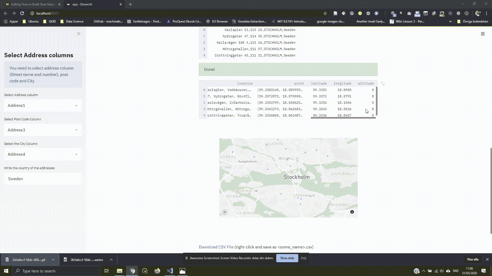

# 如何使用 Python 构建地理编码 Web 应用程序

> 原文：<https://towardsdatascience.com/how-to-build-your-geocoding-web-app-with-python-133e1e9e2d1a?source=collection_archive---------17----------------------->

## 易于遵循的指南和教程代码


格伦·卡斯滕斯-彼得斯在 [Unsplash](https://unsplash.com?utm_source=medium&utm_medium=referral) 上的照片

我们经常需要将地址转换为地理位置(纬度和经度)，这称为地理编码。您可以使用几个免费地理编码 API(当然有限制)。在本教程中，我将向您展示如何创建免费的地理编码应用程序，您可以拖放带有地址的 CSV 文件，并以 CSV 格式获取(下载)地理编码地址。

我们使用 [Geopandas](https://geopandas.org/index.html) 和 [Streamlit](https://www.streamlit.io/) 用 Python 构建地理编码应用。可选地，你需要一个像 Visual studio 代码这样的 IDE 来运行应用程序。让我们开始吧。我们首先导入库。

下面这张 GIF 展示了我们将要构建的一瞥。它将允许用户上传文件，并通过选择正确的栏目进行互动。


地理编码应用程序-上传 CSV 文件

## 简化基础知识

web 应用程序使用 Streamlit。Streamlit 是一个简单易用的纯 Python 的 web 应用构建库。我创建了一个 python 文件(app.py ),我们将使用它来编写代码。

让我们首先导入我们需要的库

```
import time
import base64import streamlit as stimport pandas as pd
import geopandas as gpdimport geopy
from geopy.geocoders import Nominatim
from geopy.extra.rate_limiter import RateLimiterimport plotly_express as px
```

我们首先创建标题，然后运行应用程序来测试它是否有效。

```
st.image(“geocoding.jpg”)st.title(“Geocoding Application in Python”)st.markdown(“Uppload a CSV File with address columns (Street name & number, Postcode, City)”)
```

Streamlit 使用一个定义良好的 API，您可以简单地立即开始使用。看看上面的代码，我打赌你能猜到它是做什么的。在代码的第一行，我们使用`st.image()`显示一幅图像。在第二行中，我们还使用`st.tittle()`将测试显示为 tittle。最后，我们使用`st.markdown()`显示文本。现在，让我们运行应用程序。

运行 Streamlit 就像在终端上写一样简单:

```
streamlit run app.py
```

运行应用程序将启动浏览器，如果没有错误，您可以看到应用程序正在运行。图像、标题和文本都在那里(见下图)。我们将继续致力于这个界面。


使用 Streamlit 的地理编码应用程序

## 上传 CSV 文件

上传文件，我们可以用`st.file_upoader()`。我们创建一个函数，允许我们使用`st.file_upoader()`与本地数据进行交互。

我们创建主函数，并在其中上传一个 CSV 文件。一旦 CSV 被上传，我们就可以使用 Pandas 来读取数据并显示数据的前几行。我们将在开发应用程序的过程中编辑这个主菜单。你可以在最后一部分——应用程序中找到这个函数的最终代码。

## 创建或选择地址列

我们需要一个可能格式化的地址列，在这个应用程序中，因此我们设计，以便它可以接受一个格式良好的列和地理编码或从数据中的列创建地址列。下面是一个格式正确的地址示例。它有街道名称和号码，邮政编码，城市和国家。

```
Karlaplan 13,115 20,STOCKHOLM, Sweden
```

以下两个功能允许用户选择他们想要的选项，然后在主菜单功能下处理选择。第一个从 DataFrame 列格式化并创建一个地址列。

下面的第二个函数只是选择一个可能格式化的列作为地址列。

## 地理编码

我们现在可以开始地理编码，下面的功能使用 nomim 地理编码器。该函数返回包含纬度和经度列的地理编码数据框。

一旦我们对数据进行地理编码，我们就可以在地图上显示它。下面这个函数使用 Plotly Express。要将图形传递给 Streamlit，可以使用`st.plotly_chart()`。请记住，您可以使用其他库来绘制数据。

## 下载地理编码 CSV 文件

对数据进行地理编码后，应用程序会再次显示带有纬度和经度的数据框。这将是很好的，也能够下载地理编码的数据。

要下载文件，我们可以编写下面的函数，它允许我们右键单击并用给定的名称保存文件。

## 该应用程序

将所有代码放在一起，地理编码应用程序代码如下所示。

如果我们愿意，我们可以添加更多的功能，并在此基础上构建其他用例。以下是如何在应用程序中下载地理编码文件的一瞥。



地理编码应用程序-下载地理编码文件

代码也存放在这个 Github 存储库中。

[](https://github.com/shakasom/geocoding) [## shaka som/地理编码

### Python 中的地理编码教程。通过在 GitHub 上创建帐户，为 shaka som/地理编码开发做出贡献。

github.com](https://github.com/shakasom/geocoding)