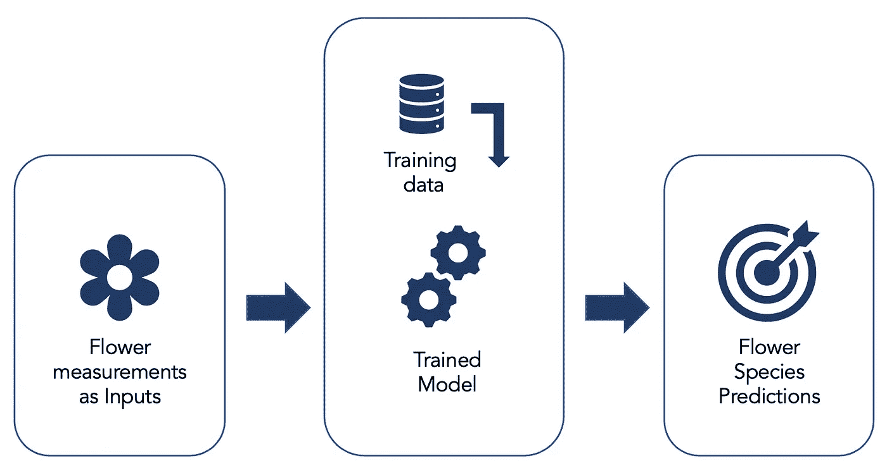
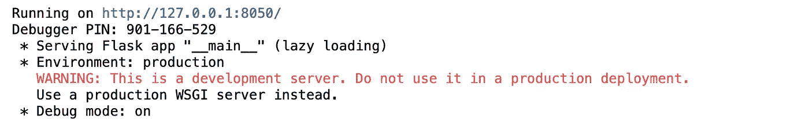
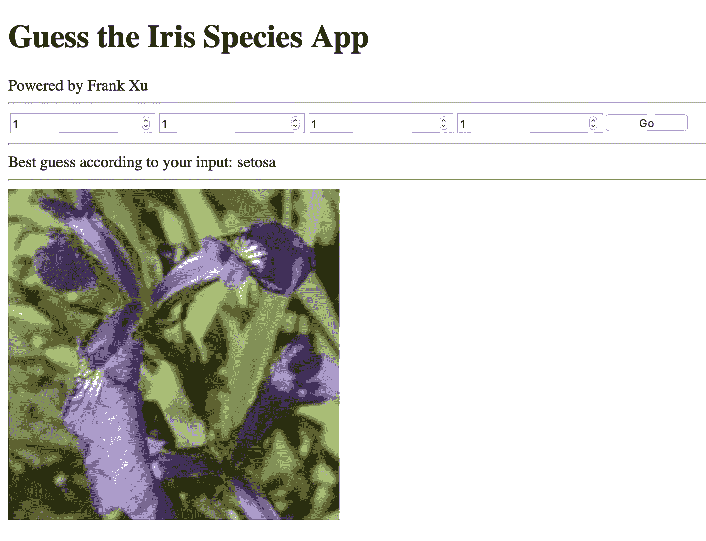
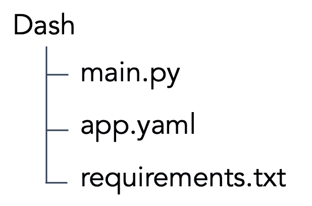
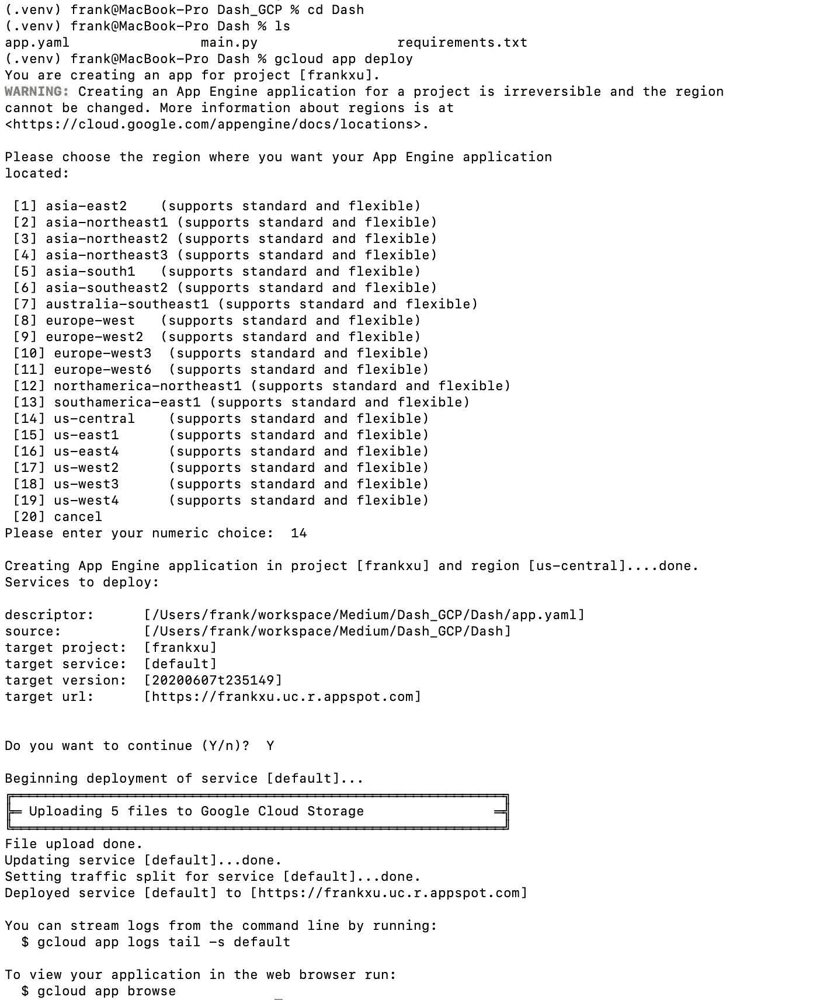

# 如何构建您的机器学习应用程序

> 原文：<https://towardsdatascience.com/how-to-build-your-machine-learning-application-e2b94c4527b5?source=collection_archive---------78----------------------->

## 通过 Google App Engine 构建和部署 Dash 应用

这比造一匹马容易多了

今天的机器学习不再是一件新奇或神奇的事情。事实上，所有的在线教程都让它变得和以前一样可行。只需从互联网上抓取大量代码并稍加调试，您的模型就可以运行了。然而，网上几乎没有资源告诉你如何向他人展示你的机器学习进展。无论是为产品原型、你的投资组合，还是向非技术人群解释你的模型的作用，**为你的机器学习项目构建一个应用程序总是一个很好的点睛之笔**。

什么是机器学习应用？让我给你举几个例子:

*   **虚拟个人助理**，比如 *Siri* 和 *Alexa* 。你的声音被用作输入，他们提取你的话语，并用相应的命令做出回应，通过他们用庞大的数据集训练的模型。
*   **垃圾邮件过滤**。关于传入电子邮件的基本信息用于确定电子邮件是否可能是垃圾邮件。
*   **产品推荐**。几天前，你在网上购买了一些运动鞋，突然，你和你室友的社交媒体开始收到运动鞋广告。你的浏览历史一些个人信息被用来为你推荐广告。

仔细想想，机器学习应用就在你身边。我必须承认，将一个应用程序工业化需要大量的时间和精力，但我们可以在云基础上构建我们自己的简单机器学习应用程序，而无需考虑所有的极限情况和负载测试。它可以作为一个完美的个人投资组合，或者用于开发测试。在*谷歌云服务*的帮助下，我们来构建一个应用吧！

**第一部分。建立模型**

我们将首先为这个应用程序建立我们的模型。让我们只使用*虹膜*数据集。我们从 *Scikit-learn* 加载 *Iris* 数据集，并在其上构建简单的逻辑回归:

第二部分。在本地构建应用程序

然后我们用*破折号*在本地构建 app。我们的目的是建立一个 web 界面，您可以在其中输入您为遇到的这种鸢尾花测量的不同值，它将返回基于输入预测的最可能的物种。

我们应用的工作流程

我知道这是一大段代码，但是请耐心听我说。首先，我们初始化应用程序。这里要介绍一下 flask，帮助用***Google app Engine***部署 App。

这里的第二部分是设置*应用布局*。代码在不同的部分进行了注释，并说明了它们的用途。**如果你没有任何前端经验，阅读起来会有点困难，但一定要相信学习过程**。这里我们不做任何计算，只是设置零件及其对应的 id。

这里的第三个部分是一个*回调函数*，它使得应用程序具有“交互性”。输出和输入是在实际函数之前说明的:我们有一个输出，对应于布局部分的输出区域。我们有五个输入，即 *GO* 按钮和 4 个花朵测量的数字输入。这里使用状态是为了确保应用程序只有在整个表单完成后才从用户那里获取值，你可以在这里[了解更多信息](https://dash.plotly.com/basic-callbacks)。这里的按钮决定只有在你按下按钮后才开始工作。

现在，如果您将所有这些代码放在一个笔记本或 python 文件中，并在本地运行它，您将获得这样的信息作为输出。

代码的输出

只需**点击 URL** 或**将其粘贴到您的浏览器**中，即可访问您构建的应用。请注意，这是 localhost，这意味着其他人无法通过此链接访问它，除非您设置了特殊的防火墙规则。

如果您输入 1 作为值，然后单击 GO 按钮…

**第三部分。部署应用程序**

我们现在已经有了本地运行的应用程序，但是如果你要和别人分享它，你需要和那个人分享你所有的代码和数据，并让他运行它。仅仅是环境的差异就已经够难调试的了，更不用说*如果你把它展示给你根本不会编码的老板*。这就是为什么我们需要使用云基础平台来部署它:你只需要配置一次，并通过一个简单的 URL 来共享它，就像这样:[https://frankxu.uc.r.appspot.com](https://frankxu.uc.r.appspot.com)(你实际上可以点击它并访问这个应用程序)。我们更喜欢谷歌云平台，因为每个用户都有 300 美元/年的免费积分。

在此之前，因为我们需要谷歌云引擎，让我们确保每个人都在同一页面上。你需要设置一个[活动的](https://console.cloud.google.com/home)谷歌云项目，然后[选择一个项目](https://console.cloud.google.com/projectselector2/home)并启用计费。然后，[在你的笔记本电脑上安装](https://cloud.google.com/sdk/install)和[设置](https://cloud.google.com/sdk/docs/initializing)Google Cloud SDK 工具，这样你就可以通过几行代码轻松部署你的 app。

首先要做的是**新建一个文件夹**，在这种情况下，我们姑且称之为 ***破折号*** 。在 Dash 下我们希望有三个文件: ***main.py*** 包含你所有的源代码， ***app.yaml*** 包含云部署设置，以及***requirements . txt***包含所有需要的包。

创建我们需要的文件的代码示例

在 ***main.py*** 中，只需将上面的所有代码按同样的顺序粘贴到其中，或者你也可以在这里访问它[。在 ***app.yaml*** 中，你会放入这样两行，分别指定你运行的环境和服务器名称。](https://github.com/Frank-Xu-Huaze/Medium/blob/master/Dash_GCP/Dash/main.py)

app.yaml 的内容

在***requirements . txt***中，简单放入一个你用过的 python 包的列表。

requirements.txt 内容

你可以在这里下载这三个文件。现在我们已经为部署做好了一切准备。

打开你的终端，进入 Dash 目录。根据您是否为此项目创建了应用程序，您可能需要先创建一个应用程序。选择应用程序所需的位置，然后在出现提示时输入 Y 继续，并等待几分钟以部署应用程序。

部署完成后，您可以进入 ***gcloud app 浏览*** 或者将网址粘贴到您的浏览器来浏览 app。加载需要几秒钟，但你应该会看到云服务的确切应用程序。**该应用程序将一直运行，直到您禁用它**(转到应用程序引擎下的设置)，并且链接是可共享的，这意味着只要有互联网，您就可以将其发送给任何人使用。将应用程序添加到你的作品集也不错，这肯定比普通的简历或演示文稿更令人印象深刻。

**下一步是什么？**希望本教程结束后，你能够建立自己的机器学习应用程序。玩玩 ***main.py*** 就行了，不要改它的初始化和定型部分，有问题多向技术社区学习。整个项目及相关文件可以在 [*my Github*](https://github.com/Frank-Xu-Huaze/Medium/tree/master/Dash_GCP) 找到。