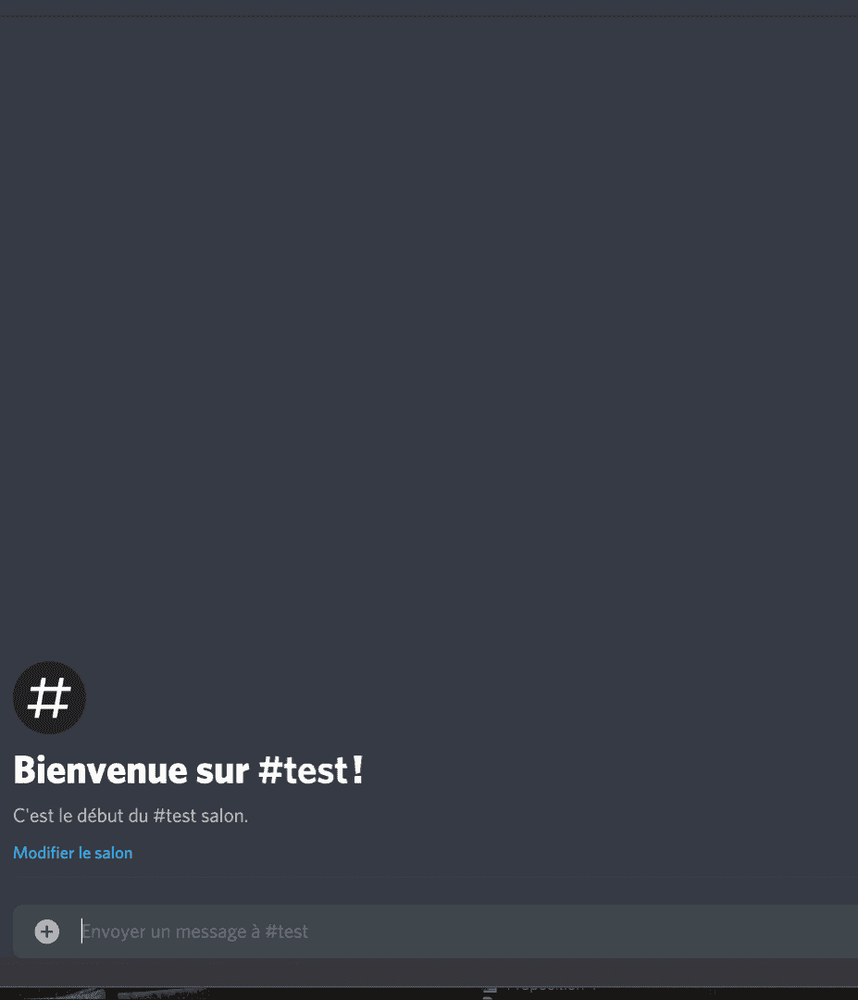
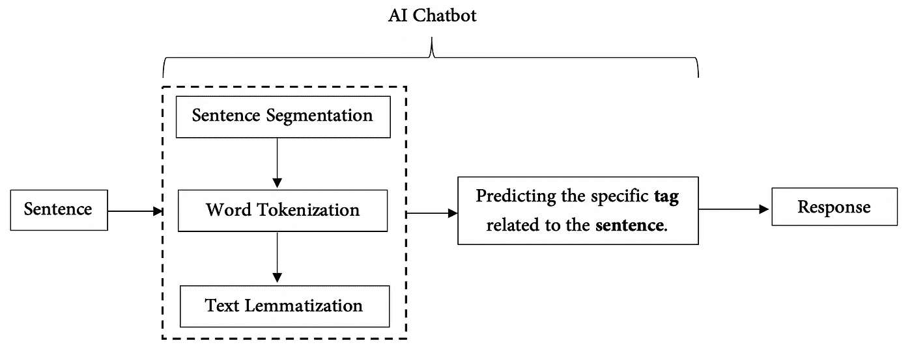
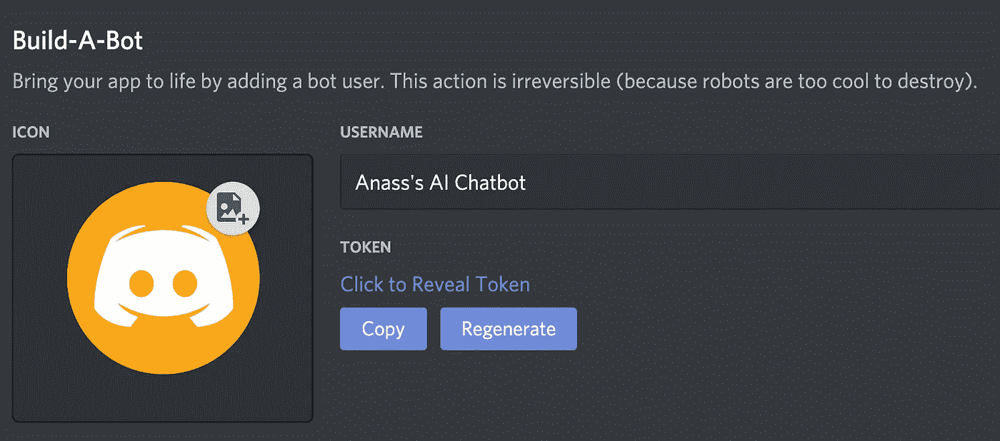

# 如何在 Discord 上构建自己的 AI 聊天机器人？

> 原文：<https://towardsdatascience.com/how-to-build-your-own-ai-chatbot-on-discord-c6b3468189f4?source=collection_archive---------4----------------------->

## 为初学者创建一个简单的人工智能聊天机器人的最简单方法

[亚历山大·奈特](https://unsplash.com/@agkdesign?utm_source=medium&utm_medium=referral)在 [Unsplash](https://unsplash.com?utm_source=medium&utm_medium=referral) 上拍照

参与项目是学习过程中最关键的阶段。在这一步，你必须能够将理论上所学的所有技能和知识运用到现实中。当涉及到人工智能或数据科学时，这变得更加重要。

随着我开始更深入地研究这个领域，我意识到找到应用项目并不是一件困难的事情。我们在很多领域几乎不用人工智能。因此，我们可以发现许多新的和不同的应用与其他领域，如医学，工程，会计等。尽管最困难的事情是知道为了完成这个特定的项目应该遵循什么样的步骤。

在这篇文章中，我将与你分享我在 Discord 上创建和构建自己的 AI 聊天机器人的亲身经历。

我在 Discord 上开发和部署的人工智能模型的例子

对于那些从未听说过 Discord 的人来说，这是一个流行的群聊应用，最初是为了给游戏玩家或极客提供一个建立社区和交谈的地方。关于 Discord 有趣的是它有一个开发者门户，在那里你可以做很多有趣的事情，比如部署你自己的 AI 聊天机器人。因此，您需要从[这里](https://discord.com/register?redirect_to=%2Fdevelopers%2Fapplications)注册并加入 Discord 开发者门户。

在我们开始真正的工作之前，我们先来谈谈，首先，我建造我的 AI 聊天机器人的步骤。实际上，这个项目是自然语言处理应用的一部分。NLP 或自然语言处理是一种通过人工智能让机器理解人类语言的技术。找出你需要知道的关于它的一切。

现在，我们准备好了。我们开始吧！

# 1.选择聊天机器人的功能

你的第一个任务是选择你希望你的聊天机器人提供什么服务。会不会只是一个简单的聊天机器人？能够回答正常问题并自己说话？还是希望它在日常工作中帮到你？或者建议每天吃一些健康的食物。好像很棒！不是吗？这第一步有助于了解您必须收集哪些具体数据。如果你的聊天机器人会回答一般的问题，并且是一个正常的说话者，那么你就不需要给它输入专门的文本数据。

照片由[斯潘塞·戴维斯](https://unsplash.com/@spencerdavis?utm_source=medium&utm_medium=referral)在 [Unsplash](https://unsplash.com?utm_source=medium&utm_medium=referral) 拍摄

我在这里提到了两个灵感来源:
- **健康膳食聊天机器人**:聊天机器人会根据你的营养需求(蛋白质、脂肪和碳水化合物)建议一餐。它必须与任何食物数据库相连接，这样它才能搜索到最适合你需求的食物。
- **提醒聊天机器人**:它给你一个关于你的会议和你添加到你的日程中的所有事情的概述。

# 2.收集或创建文本数据

在这一步中，您可以收集数据平台上可用的文本数据，也可以根据您想要制作的内容创建自己的数据。您可以下载许多开放数据集并根据您的项目进行调整。你可以从[这里](https://medium.com/@ODSC/20-open-datasets-for-natural-language-processing-538fbfaf8e38)查看。

如果您想创建自己的数据，最好遵循以下格式，这样您就可以使用我的主代码毫无问题地训练您的模型:

只要遵守格式，您可以添加任意数量的标签。AI 聊天机器人通常会学习所有新句子的**模式**，并将它们与**标签**相关联，以获得**响应**。我们将在下一部分更详细地解释它是如何做到这一点的。

# 3.构建和训练模型

我们在这个项目中遵循的 NLP 管道如下所示:

当用户写下一个句子并发送给聊天机器人时。该模型遵循 3 个基本步骤。第一步(句子分割)包括将书面文本分成有意义的单元。这些单元是第二步(单词标记化)的输入，其中它们被分成称为“**标记**”的更小的部分。这些记号对于寻找这种模式非常有用，并且被认为是词干化和词汇化的基础步骤[3]。第三步，词汇化指的是为了分析文本而对文本进行的词汇处理。之后，该模型将预测句子的标签，以便它可以选择适当的响应。

**你可以从** [**这里**](https://github.com/anasselhoud/AI-ChatBot) **查看与这一整部分相关的主要 python 代码。这段代码对于构建和训练模型非常重要。您可以修改它以满足您的项目需求。**

# 4.在不和谐中部署您的模型

一开始，你必须在[不和谐开发者门户](https://discord.com/developers/applications)上注册。完成后，访问[Discord 应用页面](https://discord.com/developers/applications)，点击**创建应用**。然后写下你的应用程序的名字。

当您点击**保存更改**时，您现在可以通过点击**添加机器人**按钮来创建您自己的机器人。之后，您需要通过点击**显示令牌来获取和复制您的令牌。**

这个令牌在您的 bot 主文件中使用，以便调用它。你需要使用`client:run('TOKEN')`，用上面复制的令牌替换`TOKEN`。

为了部署您的模型，您必须在主 python 文件的末尾添加以下代码:

不要忘记用您自己的代码来更改“TOKEN”。

一旦你运行了整个 python 代码，你就可以打开你的不和谐，开始和你的 AI 聊天机器人说话。只要你不中断 python 文件的运行，它就会保持在线。

很高兴有机会分享我构建一个简单有效的 AI 聊天机器人的经验。祝你好运！

# 参考

[1]德文·德尔菲诺，[“什么是不和谐？”:关于流行的群聊平台](https://www.businessinsider.com/what-is-discord?IR=T) (2020)，商业内幕，技术参考，你需要知道的一切。

[2] Bastien L，[Traitement naturel du langage:tout savoir sur Le 自然语言处理](https://www.lebigdata.fr/traitement-naturel-du-langage-nlp-definition) (2019)，Le Big Data，杂志 de l'IA。

[3]奎师那，[用 NLTK](https://www.guru99.com/tokenize-words-sentences-nltk.html) (2019)，Guru99，全民教育。