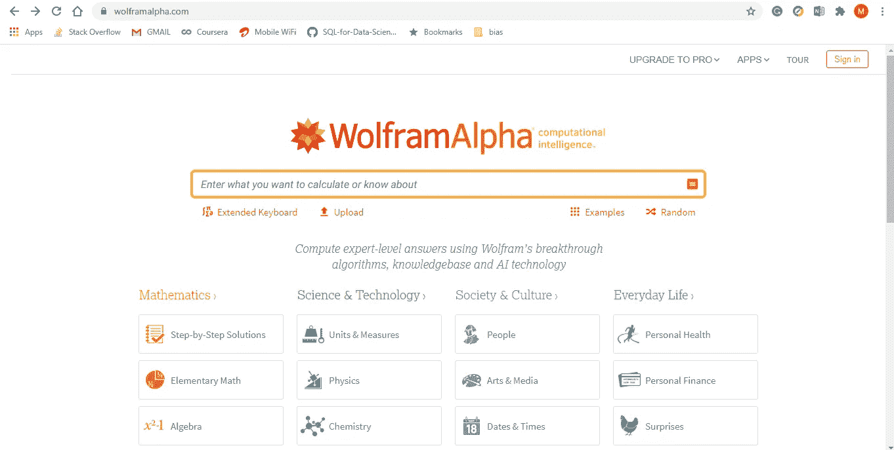
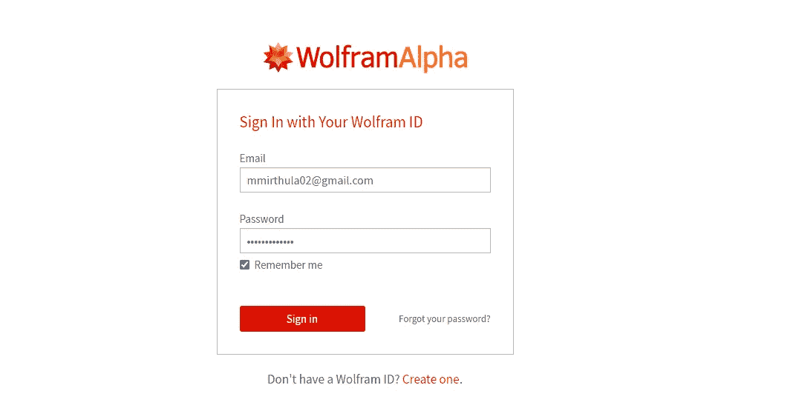
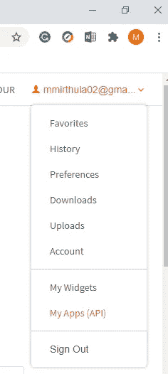
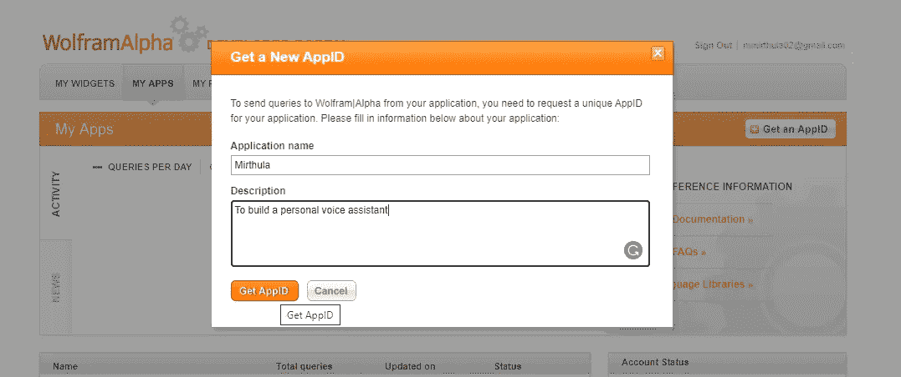
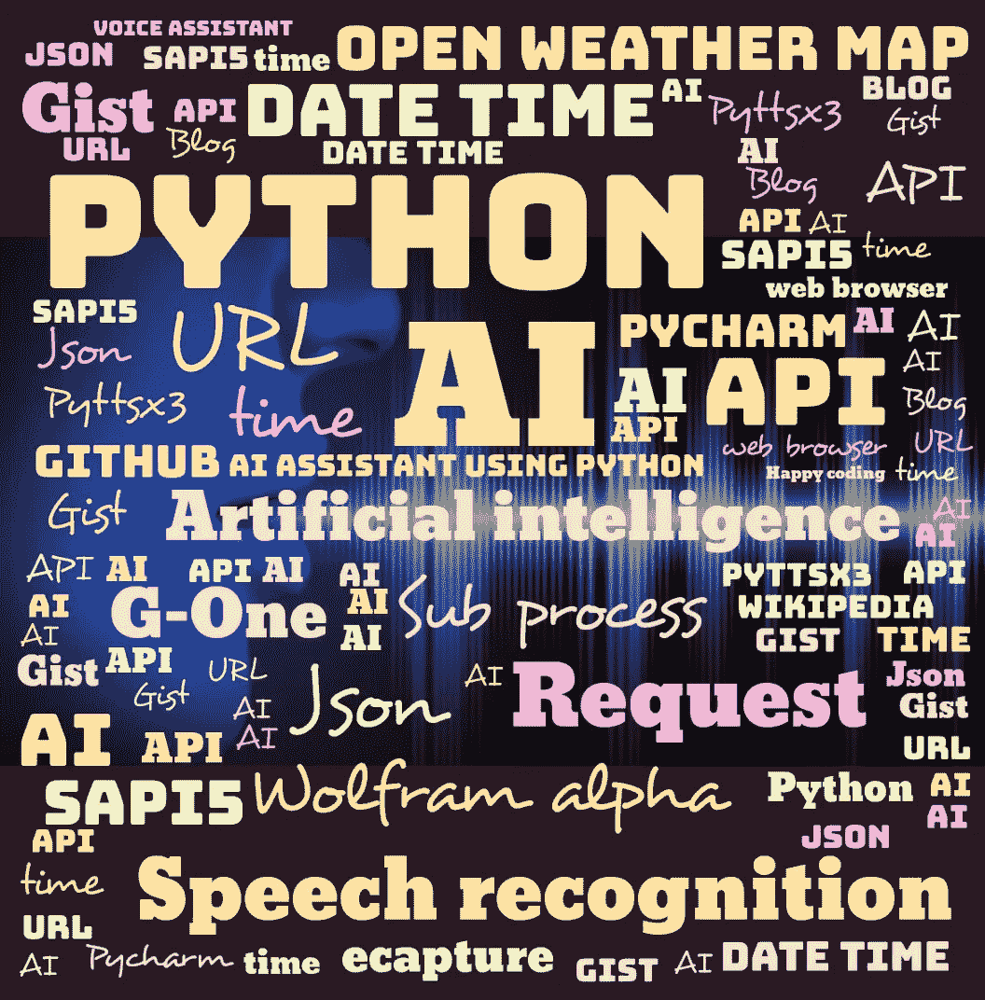

# 如何使用 Python 构建自己的 AI 个人助理

> 原文：<https://towardsdatascience.com/how-to-build-your-own-ai-personal-assistant-using-python-f57247b4494b?source=collection_archive---------0----------------------->

## ***打造你的 AI 助手指南:***

*人工智能个人助理是一款理解口头或书面命令并完成客户分配的任务的软件。这是弱人工智能的一个例子，它只能执行用户设计的任务。*

想像苹果 Siri、微软 Cortana、谷歌助手一样打造自己的个人 AI 助手？

你可以看看这个博客，通过几个简单的步骤就可以创建一个！

使用 python 编程语言，开发人员最常用的脚本可以用来构建您的个人人工智能助手，以执行用户设计的任务。

图片来源:Freepik

现在，让我们使用 python 为我们的个人语音助手编写一个脚本。

## **技能:**

*实现的语音助手可以执行以下任务，它可以打开 YouTube、Gmail、Google chrome 和 stack overflow。预测当前时间，拍摄照片，搜索维基百科以提取所需数据，预测不同城市的天气，从《印度时报》获得头条新闻，还可以回答计算和地理问题。*

语音助手的以下查询可以根据用户需要进行操作。

## **所需软件包:**

要构建个人语音助手，需要使用 pip 命令在您的系统中安装以下软件包。

1) **语音识别** —语音识别是家庭自动化和人工智能设备中使用的一项重要功能。这个库的主要功能是试图理解人类所说的话，并将语音转换成文本。

2) **pyttsx3** — pyttxs3 是 python 中的文本到语音转换库。该软件包支持 Mac os x、Windows 和 Linux 上的文本到语音引擎。

3) **维基百科** —维基百科是一个多语言的在线百科全书，许多人都在使用它，他们来自学术界，从大一新生到学生，再到希望获得某个特定主题信息的教授。python 中的这个包从维基百科中提取所需的数据。

4) **ecapture** —此模块用于从您的相机中捕捉图像

5) **日期时间** —这是 python 中的一个内置模块，它处理日期和时间

6) **os** —该模块是 python 中的标准库，提供与操作系统交互的功能

7) **时间** —时间模块帮助我们显示时间

8) **Web 浏览器** —这是 python 中的一个内置包。它从网上提取数据

9) **子进程** —这是一个标准库，用于处理各种系统命令，如注销或重启你的电脑。

10)**Json**-Json 模块用于存储和交换数据。

11) **请求** -请求模块用于发送所有类型的 HTTP 请求。它接受 URL 作为参数，并提供对给定 URL 的访问。

12)**wolfram Alpha**—Wolfram Alpha 是一个 API，它可以使用 Wolfram 的算法、知识库和 AI 技术来计算专家级的答案。Wolfram 语言使之成为可能。

## **实现:**

***导入以下库***

## **设置语音引擎:**

**pyttsx3** 模块存储在变量名引擎中。

**Sapi5** 是微软的文本到语音引擎，用于语音识别。

语音 Id 可以设置为 0 或 1，

0 表示男性声音

1 表示女声

现在定义一个函数 **speak** 将文本转换成语音。speak 函数将文本作为其参数，进一步初始化引擎。

**runAndWait:** 该函数在处理所有当前排队的命令时阻塞。它适当地调用引擎通知的回调，并在该调用之前排队的所有命令从队列中清空时返回。

## **启动问候用户的功能:**

为人工智能助手定义一个函数 **wishMe** 来问候用户。

**现在()。hour** 函数抽象当前时间的小时。

如果小时数大于零小于 12，语音助手会提示您“早上好”。

如果小时数大于 12 小于 18，语音助手会用下面的消息祝您“下午好”。

否则它会发出“晚上好”的信息

## **为您的人工智能助手设置命令功能:**

定义一个函数 **takecommand** 让人工智能助手理解并接受人类语言。麦克风捕获人类语音，识别器识别语音以给出响应。

异常处理用于处理运行时错误期间的异常，并且 **recognize_google** 函数使用 google audio 来识别语音。

## **主要功能:**

主函数从这里开始，人类给出的命令存储在变量**语句**中。

如果在用户给出的语句中有以下触发词，它调用虚拟助理说出以下命令。

## **技能 1——从维基百科获取数据:**

以下命令有助于从维基百科中提取信息。 **wikipedia.summary()** 函数有两个参数，用户给出的语句和需要从维基百科中提取多少句子存储在变量**结果中。**

## **技能 2——访问网络浏览器——谷歌浏览器、电子邮件和 YouTube:**

网络浏览器从网络上提取数据。 **open_new_tab** 函数接受 **URL** 作为需要访问的参数。

**Python 时间休眠函数**用于增加程序执行的延迟。我们可以使用这个函数在给定的**时间**内暂停程序的执行。

## **技巧三——预测时间:**

当前时间从 **datetime.now()** 函数中提取，该函数显示时、分、秒，并存储在变量名 **strTime 中。**

## 技能 4-获取最新消息:

如果用户想知道最新的新闻，语音助手被编程为通过使用网络浏览器功能从《印度时报》获取头条新闻。

## 技能 5-拍摄照片:

**ec.capture()** 功能用于从相机中捕捉图像。它接受 3 个参数。

**摄像头索引** —第一个连接的摄像头将显示为索引 0，下一个摄像头将显示为索引 1

**窗口名** —可以是变量，也可以是字符串。如果您不想看到该窗口，请键入 False

**保存名称** —可以给图像命名，如果您不想保存图像，请输入 false

## 技能 6-从网上搜索数据:

从**网络浏览器**中，通过将用户语句(命令)传递给 **open_new_tab()** 函数，您可以**搜索**所需的数据。

***用户*** : *嘿 G-One，请搜索蝴蝶的图片*

*语音助手打开谷歌窗口&从网络上获取蝴蝶图像。*

## 技能 7-设置您的人工智能助手来回答地理和计算问题:

这里我们可以使用名为 **Wolfram alpha API** 的第三方 API 来回答计算和地理问题。Wolfram 语言使之成为可能。**客户端**是为 wolfram alpha 创建的实例(类)。 **res** 变量存储 wolfram alpha 给出的响应。

要访问 wolfram alpha API，需要一个唯一的应用 ID，可通过以下方式生成:

1.  登录 wolfram alpha 的官方页面，如果您没有帐户，请创建一个帐户。

作者图片

2.使用您的 wolfram ID 登录

作者图片

3.现在你将看到网站的主页。前往右上角的帐户部分，在那里您可以看到您的电子邮件。在下拉菜单中，选择我的应用程序(API)选项。

作者图片

4.您将看到以下窗口，现在单击获取 APP_ID 按钮

作者图片

5.现在，您将看到以下对话框，给出一个合适的名称和描述，然后单击应用程序 ID 按钮，将生成一个应用程序 ID，这是一个唯一的 ID。使用 App Id use 可以访问 Wolfram alpha API。

作者图片

***人类*** *:嘿 G-One，加州的首府是哪里？*

***G-One 语音助手:*** *美国萨克拉门托*

## 技能 8-额外功能:

让你的人工智能助手回答以下问题会很有趣，比如它能做什么，谁创造了它，不是吗？

## 技能 9-预测天气:

现在，为了让你的人工智能助手检测天气，我们需要从打开的天气图中生成一个 API 键。

开放式天气地图是一项提供天气数据的在线服务。通过在官网生成一个 API ID，你可以使用 APP_ID 让你的语音助手在任何需要的时候检测所有地方的天气。这个天气检测需要导入的必要模块是 json 和 request 模块。

**city_name 变量**使用 **takeCommand()** 函数接受人类给出的命令。

**请求**模块的 **get** 方法返回一个**响应**对象。response 对象的 **json** 方法将 json 格式的数据转换成 python 格式。

变量 **X** 包含嵌套字典列表，该列表检查“COD”的值是否为 404，即是否找到了城市。

温度和湿度等数值存储在变量 **Y** 的主键中。

***人类:*** *嘿 G-One，我想获取天气数据*

***G-One:*** *城市名是什么？*

***人类:*** *喜马偕尔邦*

**G-One:** *开尔文单位的温度为 301.09，百分比湿度为 52，描述为小雨。*

## 技能 10-注销您的电脑:

这里的 **subprocess.call()** 函数用于处理系统函数，以注销或关闭您的 PC。这将调用你的人工智能助手自动关闭你的电脑。

万岁，我们终于打造了自己的 AI 语音助手。此外，你还可以给你的人工智能语音助手添加更多的功能来执行更多的任务。

作者图片

查看我的 GitHub 个人资料以获取代码:

[https://github . com/mmirthula 02/AI-Personal-Voice-assistant-using-Python](https://github.com/mmirthula02/AI-Personal-Voice-assistant-using-Python)

编码快乐！！