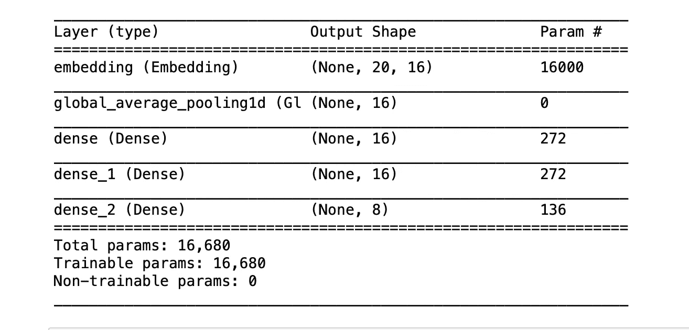
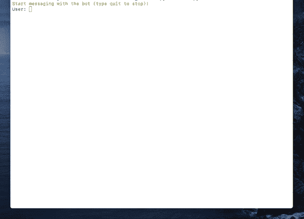

# 如何使用深度学习构建自己的聊天机器人

> 原文：<https://towardsdatascience.com/how-to-build-your-own-chatbot-using-deep-learning-bb41f970e281?source=collection_archive---------0----------------------->

## 实现智能聊天机器人解决方案的全面分步指南

如果您对开发聊天机器人感兴趣，您会发现有很多强大的机器人开发框架、工具和平台可以用来实现智能聊天机器人解决方案。使用深度学习，而不是使用任何 bot 开发框架或任何其他平台，从零开始开发一个简单、智能的聊天机器人怎么样？在本教程中，您可以了解如何使用深度学习和 Keras 开发端到端的特定领域智能聊天机器人解决方案。

来自 [flickr](https://www.flickr.com/photos/botreetech/45874656231/) 的[萨姆·伍德](https://www.flickr.com/photos/botreetech/)的照片

# 概念

在进入编码部分之前，首先，我们需要理解一些设计概念。由于我们要开发一个基于深度学习的模型，我们需要数据来训练我们的模型。但我们不会收集或下载任何大型数据集，因为这是一个简单的聊天机器人。我们可以创建自己的数据集来训练模型。为了创建这个数据集，我们需要理解我们要训练的意图是什么。“**意图”**是用户与聊天机器人交互的意图，或者聊天机器人从特定用户接收的每条消息背后的意图。根据您正在开发的聊天机器人解决方案的领域，这些意图可能会因聊天机器人解决方案的不同而不同。因此，了解你的聊天机器人与你将要工作的领域相关的正确意图是很重要的。

那为什么它需要定义这些意图呢？这是需要理解的非常重要的一点。为了回答问题、从领域知识库中搜索和执行各种其他任务来继续与用户对话，你的聊天机器人真的需要理解用户说什么或他们打算做什么。这就是为什么你的聊天机器人需要理解用户信息背后的意图(来识别用户的意图)。

如何让你的聊天机器人理解用户的意图，让用户觉得它知道他们想要什么，并提供准确的回答。这里的策略是定义不同的意图，并为这些意图制作训练样本，并使用这些训练样本数据作为模型训练数据(X)和意图作为模型训练类别(Y)来训练您的聊天机器人模型。

# 履行

## 必需的包

所需的 python 包如下，(这里我提到了我在开发中使用的包的版本)

## 定义意图

我将定义几个简单的意图和对应于这些意图的一堆消息，并根据每个意图类别映射一些响应。我将创建一个名为“intents.json”的 JSON 文件，包括如下数据。

## 数据准备

首先我们需要导入所有需要的包

现在我们加载 json 文件并提取所需的数据。

变量“ *training_sentences* ”保存所有的训练数据(即每个意图类别中的样本消息)，变量“ *training_labels* ”保存每个训练数据对应的所有目标标签。

然后我们使用 scikit-learn 提供的“ *LabelEncoder()* ”函数将目标标签转换成模型可理解的形式。

接下来，我们通过使用“*记号赋予器*”类对我们的文本数据语料库进行矢量化，它允许我们将词汇量限制到某个定义的数字。当我们使用这个类进行文本预处理任务时，默认情况下，所有标点符号都将被删除，将文本转换为空格分隔的单词序列，然后这些序列被拆分为标记列表。然后它们将被索引或矢量化。我们还可以添加“oov_token ”,它是“out of token”的一个值，用于在推理时处理词汇表之外的单词(token)。

使用“ *pad_sequences* ”方法使所有的训练文本序列大小相同。

## 模特培训

让我们为提议的模型定义我们的神经网络架构，为此我们使用 **Keras 的“*顺序*”模型类。**

我们的模型架构如下所示。

现在我们准备训练我们的模型。简单地说，我们可以用训练数据和标签调用“ *fit* ”方法。

训练后，最好保存所有需要的文件，以便在推理时使用。以便我们保存训练的模型、拟合的记号赋予器对象和拟合的标签编码器对象。

## 推理

好吧！！！！现在是时候检查我们的模型表现如何了。😊

我们将实现一个聊天功能，与一个真正的用户互动。当收到新的用户消息时，聊天机器人将计算新文本序列和训练数据之间的相似度。考虑到每个类别的置信度得分，它将用户消息分类到具有最高置信度得分的意图。

你可以看到它的工作非常完美！！！

## 与聊天应用程序集成

此外，您可以将训练好的聊天机器人模型与任何其他聊天应用程序集成，以便更有效地与现实世界的用户打交道。

我已经使用 flask 开发了一个应用程序，并将这个经过训练的聊天机器人模型与该应用程序集成在一起。

最终的解决方案是这样的，

## 最后的想法

我们讨论了如何从头开始使用深度学习开发聊天机器人模型，以及我们如何使用它来与真实用户互动。通过这些步骤，任何人都可以实现自己的与任何领域相关的聊天机器人。

作为进一步的改进，您可以尝试不同的任务来增强性能和功能。

*   **使用更多数据进行训练:**您可以向训练数据集中添加更多数据。一个包含大量意图的大型数据集可以产生一个强大的聊天机器人解决方案。
*   **应用不同的自然语言处理技术:**您可以向您的聊天机器人解决方案添加更多的自然语言处理解决方案，如 **NER** (命名实体识别)，以便为您的聊天机器人添加更多的功能。有了 NER 模型和你的聊天机器人，你可以很容易地找到任何出现在用户聊天信息中的实体，并使用它进行进一步的对话。你还可以添加一个**情感** **分析**模型来识别用户信息背后不同的情感基调，它会给你的聊天机器人增添一些色彩。
*   **尝试不同的神经网络架构:**你也可以用不同的超参数尝试不同的神经网络架构。
*   **添加表情符号:**你也可以在建立你的模型时考虑表情符号。

您可以从 [**Github**](https://github.com/amilavm/Chatbot_Keras) 资源库中找到本文的源代码。

希望你喜欢这篇文章，并继续关注另一篇有趣的文章。另外，我很高兴听到你的反馈。