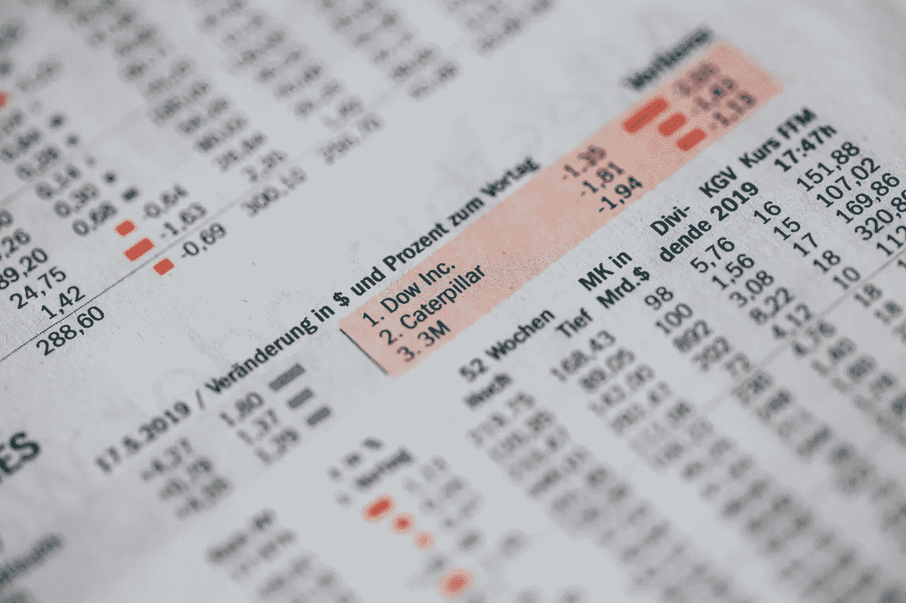
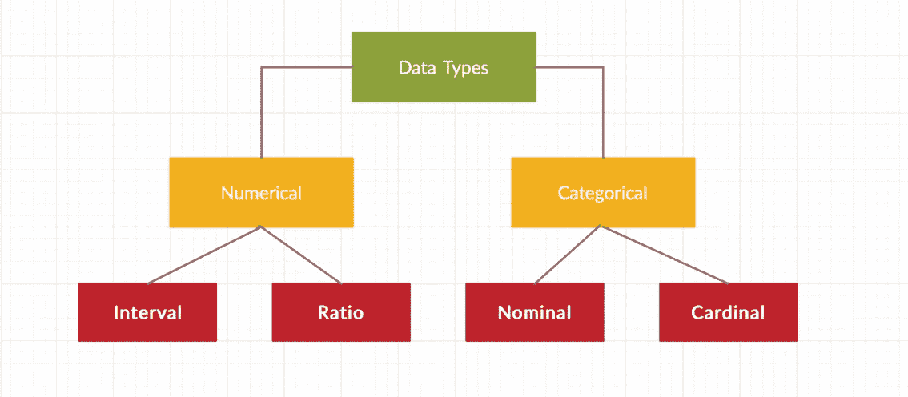
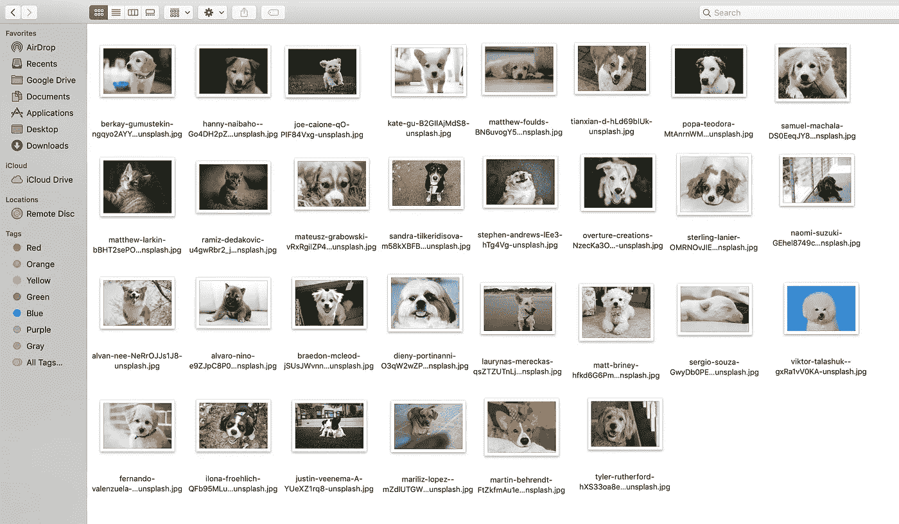

# 如何为数据科学项目构建自己的数据集

> 原文：<https://towardsdatascience.com/how-to-build-your-own-dataset-for-data-science-projects-7f4ad0429de4?source=collection_archive---------11----------------------->

## 听说过 BYOD:构建自己的数据集吗？



马库斯·斯皮斯克在 [Unsplash](https://unsplash.com/s/photos/data?utm_source=unsplash&utm_medium=referral&utm_content=creditCopyText) 上的照片

当我们谈论数据科学时，排在前面的是*数据。*

当我开始我的数据科学之旅时，它是芝加哥犯罪数据集或葡萄酒质量或沃尔玛销售——我可以得到的常见项目数据集。接下来，当我进行 IBM 数据科学专家认证时，我了解了 API 和对健壮数据集的访问，但这是有代价的！

对于一个初学数据的科学家来说，困境肯定是——学完理论后该做什么？当然，有大量的数据集可用，但免费的数据集很少给你解决实际问题的务实见解，或者有时它们太小，无法用于深度学习应用。

你想从一个项目开始，构建一个模型，运行结果，并积极寻找一个数据集？为什么不构建自己的数据集呢？

不用说，第一个选择是网络抓取。因此，在这个故事中，我将从介绍数据科学项目的数据类型和公认的数据格式开始，接下来，我将说明一种古怪的方式来废弃 Google 的独家数据集(这本身就是一个项目！)

注意:这需要 Python 的工作知识，并理解在 Python 中读写不同的文件格式。

# 数据科学中的数据类型介绍



作者图片

# a.数据

## 离散数据

离散数据具有不同且独立的值。例如:100 次抛硬币中的人头数。离散数据只有在具有确定值的情况下才会出现。这种类型的数据无法测量，但可以计数。

## 连续数据

连续数据表示可以测量的数据，具有单位，因此可以参与数学计算。例子:年龄，身高，体重，工资。连续数据可以用实数线上的区间来描述。

## 区间数据

区间值表示两个区间之间具有相同差值的有序单位。因此，当我们有一个包含有序数值的变量，并且我们知道这些数值之间的确切差异时，我们称之为区间数据。例如:60 度和 50 度之间的差是可测量的 10 度，80 度和 70 度之间的差也是可测量的 10 度。

## 比率数据

比率值也是具有相同差值的有序单位。比率值与区间值相同，不同之处在于它们有一个绝对零点。很好的例子是身高、体重、长度等。

比率数据可以相加、相减、相乘、相除，具有集中趋势的测量值—平均值、中值、众数、标准偏差和变异系数。

# b.分类数据

分类数据代表数据的特征。它可以是任何像一个人的性别，语言，收入≥50K 或<50K etc. Categorical data can also take on numerical values like 1 for female and 0 for male. (Note that those numbers don’t have mathematical meaning).

## Nominal Data

Nominal values represent discrete and unordered units and are used to label variables that have no quantitative value. When I say unordered, that means nominal data that has no order. Examples:

1.  Colors — red, green, yellow, blue, orange
2.  Seasons — Fall, Winter, Summer, Spring
3.  Type of bank accounts — Checking, Savings
4.  States — Illinois, New York, California, Michigan

Therefore, even if you change the order of values for nominal data, the meaning remains unchanged. A type of nominal data that contains only two categories (male and female) is called *二分法*

## 序数数据

序数值表示离散的和有序的单位。因此，除了排序问题之外，它几乎与名义数据相同。示例:

1.  字母等级— A、B、C、D、F
2.  服装尺寸——XS，小号，中号，大号，大号，XXL
3.  排名— 1、2、3
4.  教育——小学、高中、学士、硕士

由于有序性，序数数据通常用于处理非数字特征，如快乐、客户满意度等。

数据科学中可以使用的其他数据类型有:

1.  图像
2.  声音的
3.  录像
4.  文本
5.  时间序列

# 1.图像

## a.自带设备



作者图片

我确信我们每个人都曾是图像的收藏者。小狗，猫，演员，异国旅行目的地。这里什么都能用😄

在一生中，你会没有项目可做。

*问题陈述:*

1.  识别幼犬的品种
2.  检测小狗的情绪

从你的硬盘里找出你一生中所有的小狗图片。从 OpenCV、Python 图像库或 matplotlib 库开始读取图像。确保所有的图片都是一种文件格式:jpeg 或 png。一旦读取了图像，您就可以像使用 Googled 数据集构建任何其他模型一样进行操作。分成 70%–30%的训练和测试数据集，使用一些进行验证，您就得到您的数据集了！

想过吗？

## b.网页抓取

信不信由你，使用 Python 中的 google-image-downloader 下载一堆图像很容易

```
pip install googleimagedownloader
```

接下来，确保你有谷歌浏览器。获取与您正在运行的 Google Chrome 版本相对应的 Chromedriver 版本，并使用以下命令行代码从 Google Chrome 批量下载图像

```
$ googleimagesdownload -k "puppies" -s medium -l 200 -o dataset/train -i puppies -cd ~/chromedriver
```

该命令将使用关键字“小狗”从谷歌图片中抓取 200 张图片。它会将这些图像输出到:`dataset/train/puppies/`。`-cd`参数指向我们之前下载的“chromedriver”可执行文件的位置。

*声音好听吗？*

# 2.声音的

泰勒·斯威夫特、阿里吉特·辛格、黑粉红、BTS、J·巴尔文——从全球范围内选择你最喜欢的。

*问题陈述:*从音频文件中识别语言。

要构建自己的音频数据集，请在一个地方收集歌曲(音频文件)。唯一乏味的事情是收集足够多的歌曲来建立一个基于训练数据的模型，验证并测试它。其次，在 Python 中导入 mp3 文件可能是一项任务。

为了方便起见，我建议先把 mp3 文件转换成 WAV。你可以按照[文档](https://docs.python.org/3/library/wave.html)中关于如何在 Python 中读写 WAV 文件来开始你的工作。`wave`模块为 WAV 声音格式提供了一个方便的接口。

获得多样化音频的另一种方法是从 soundcloud 获取文件。互联网上有一些工具可以用来从 Soundcloud 下载 mp3 格式的音频。这无疑是一条漫长的道路，但是一旦你有了音频文件，就按照你在 Python 中对音频文件项目的理想做法去做。

# 3.录像

猜猜任何数量的游戏日期编辑工作！😛

*问题陈述:*

1.  识别一个人是否戴着口罩
2.  确定是否遵循了社交距离衡量标准——人与人之间的距离
3.  家庭安全系统——认识这个人吗？

对于视频，数据科学项目主要是面部识别项目，鉴于非常时期，许多类似于上述问题陈述的项目是由来自世界各地的数据科学家构建的。

为了建立一个视频数据集，你的来源可以是你的家庭视频，你戏弄你的兄弟姐妹，基本上是任何有人形和移动的东西。OpenCV 将再次成为你的英雄。OpenCV 提供了一个非常简单的接口来读取、写入和显示视频。

读取视频文件的第一步是创建一个 *VideoCapture* 对象。接受的视频格式是 *mp4* ，我相信它不需要美国格式转换，除非在 iPhones 上拍摄。

接下来，您可以应用面部识别算法来解决问题。

# 4.文本

接下来是从你的 Fitbit 或 iWatch 获取数据。

在我的一篇博客中，一位读者对这个数据科学项目的想法发表了评论，我在这里写的是如何创建自己的数据集！

如果你使用任何可穿戴设备，这可能会成为一个有趣的数据集——按照一般数据保护法规汇编的公司应该以良好格式的 csv 文件发送你的所有个人数据。接下来你知道的就是分析你自己的数据！

我最近从 Fitbit 下载了两年的健康数据。您可以按照流程从[这里](https://help.fitbit.com/articles/en_US/Help_article/1133)导出您的 Fitbit 账户数据。

感谢您的阅读！我希望你喜欢这篇文章。请务必让我知道，在您的数据科学之旅中，您希望在这个夏天构建和处理哪些数据集。

*快乐数据 Tenting！*

*免责声明:本文表达的观点仅代表我个人，不代表严格的观点。*

# 了解你的作者

拉什是芝加哥伊利诺伊大学的研究生。她喜欢将数据可视化，并创造有见地的故事。当她不赶着赶学校的最后期限时，她喜欢喝一杯热巧克力，写一些关于技术、UX 等的东西。