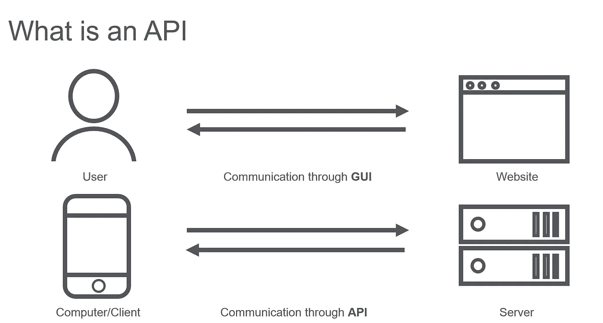
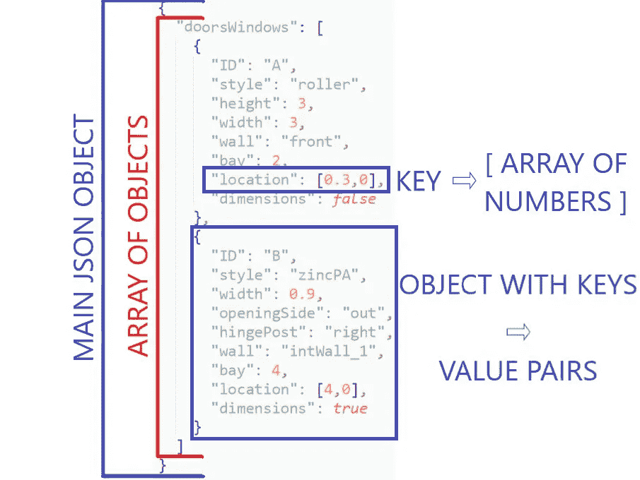
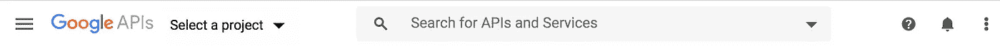
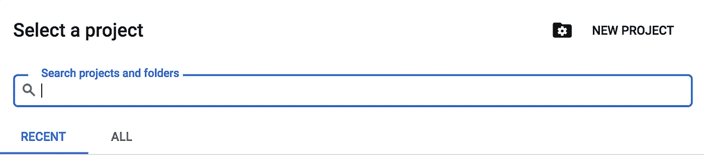
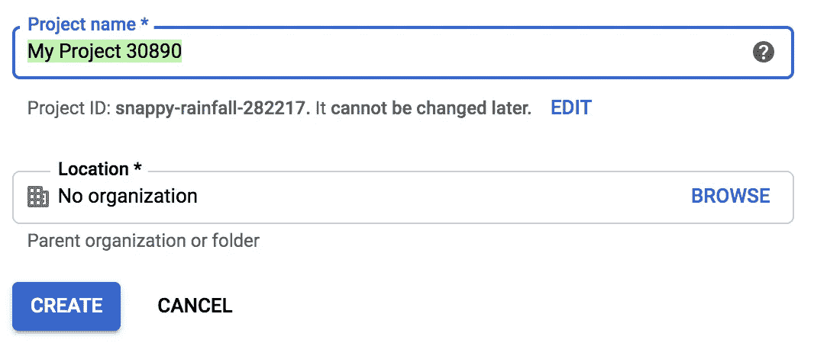
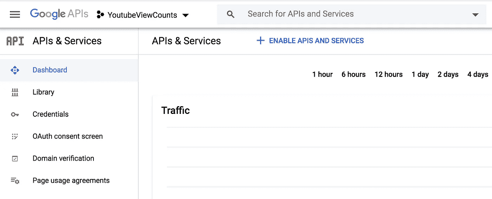
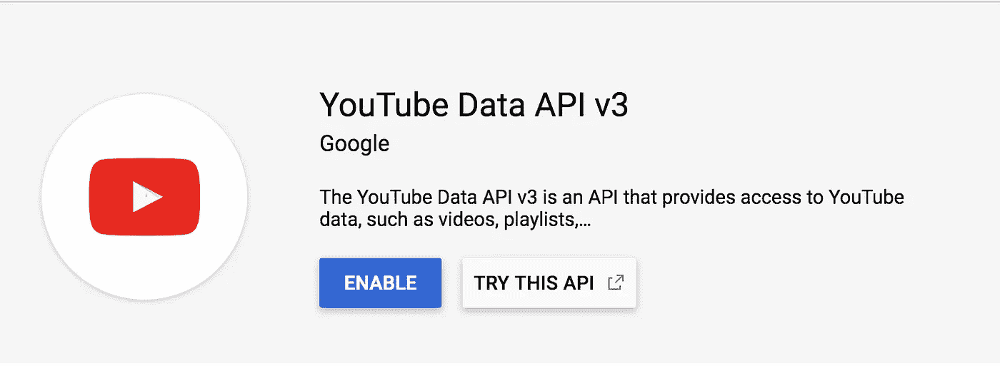
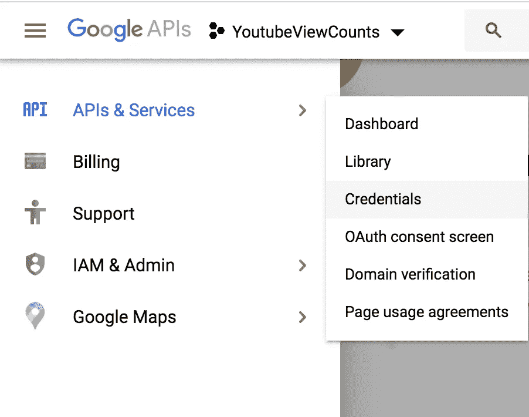
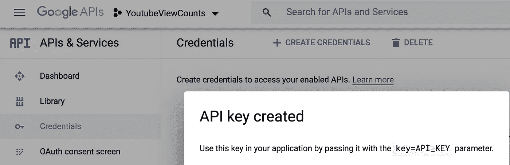

# 如何建立自己的 YouTube 评论数据集

> 原文：<https://towardsdatascience.com/how-to-build-your-own-dataset-of-youtube-comments-39a1e57aade?source=collection_archive---------8----------------------->

## 应用自然语言处理技术理解最新的黑粉色回归

## 使用 YouTube 数据 API 收集评论


基思·皮茨在 [Unsplash](https://unsplash.com/photos/RvPiAVE-zWo) 上的照片

这是涵盖文本数据收集、数据预处理和情感分析的系列文章的第一篇。在这篇文章中，我将具体谈谈为什么我想从 Blackpink 的最新音乐视频 [*中收集评论，你如何喜欢那个*](https://www.youtube.com/watch?v=ioNng23DkIM) *，*，然后向你介绍如何从任何你想要的视频中建立你自己的 YouTube 评论数据集。

如果你想切入正题，立即开始收集评论，你可以按照我的回购脚本:

[](https://github.com/XWilliamY/custom_yt_comments_dataset) [## xwillamy/custom _ yt _ comments _ dataset

### 你应该首先建立一个虚拟环境。您可以通过输入以下内容来创建 Python 3 虚拟环境…

github.com](https://github.com/XWilliamY/custom_yt_comments_dataset) 

要不，我们开始吧！

为了这个项目，我对分析 Blackpink 最新音乐视频的 YouTube 评论很感兴趣，该视频于 2020 年 6 月 26 日*发布，名为[How You Like That](https://www.youtube.com/watch?v=ioNng23DkIM)*。**

*黑粉色——“你觉得那辆 M/V 怎么样？”*

*[通过打破 24 小时内观看次数最多的 YouTube 剪辑、24 小时内观看次数最多的 K-Pop act、](https://www.nme.com/news/music/blackpink-break-multiple-world-records-with-how-you-like-that-video-2699364) [和最快达到 2 亿观看次数的视频](https://www.soompi.com/article/1410678wpp/blackpinks-how-you-like-that-sets-new-record-as-it-surpasses-200-million-views)等记录，Blackpink 向世界展示了它是一个值得重视的团体。然而，在《你喜欢怎样》之前，该组合的最后一张专辑 *Kill this Love* 于一年多前的 2019 年 4 月 4 日发行。从那时起到 2020 年 6 月 26 日，只剩下一首歌，与 Lady Gaga 合作的一首名为“[酸糖](https://www.youtube.com/watch?v=fnPn6At3v28)”**的歌曲。既然 Blackpink 已经为它的粉丝增添了更多关于他们自己的内容，我很想知道 blings(black pink 的官方粉丝名称)是如何回应的。***

> **粉丝们对这四名成员和他们的经纪人 YG 有什么看法？他们对 Blackpink 的最新歌曲和个人成员有什么看法？这些情绪在不同的语言中有所不同吗？**

**这些指导性问题促使我对他们音乐视频的评论进行情感分析。我选择 YouTube 作为数据源，不仅因为它是一个受欢迎的社交媒体平台，还因为它是第二大搜索引擎，截至 2017 年每月有 30 亿次搜索。这使得它成为娱乐公司推广其艺人新单曲和专辑的宝贵资源。此外，由于每个视频都附有评论部分，这些宣传视频也成为粉丝与艺术家和其他粉丝直接接触的论坛。**

**除此之外，**我还想挑战自己，从头开始构建和清理数据集**。我鼓励您也这样做，原因如下:**

1.  **接触网络抓取和使用 API:了解如何收集数据对于扩充现有数据集或创建新数据集来解决您可能对某个主题的疑问和假设非常有用。**
2.  **对数据进行更好的自定义:您可以更好地控制要包含在自定义数据集中的要素，并且可以在分析数据时根据需要进行更改。**
3.  **实践数据清理技术:通常情况下，公开可用的数据集已经被清理和修剪到一定程度。与此同时，由于俚语、缩写、拼写错误、表情符号以及讽刺和挖苦，YouTube 评论和一般社交媒体文本很难处理。清理这些类型的文本将迫使你考虑每种技术的有效性和后果。**

**对于这个项目，我选择通过 YouTube 的数据 API 查询评论来熟悉 API。下面几节将向您介绍我是如何收集感兴趣的评论的。假设您对 Python 有所了解。我还包含了对 API 和 JSON 的简短介绍。如果您已经熟悉它们，您可以直接跳到数据收集部分。**

# **API 和 JSON 快速入门**

## **什么是 API？**

****

**资料来源:Scopus，【https://blog.scopus.com/file/what-is-an-apijpg **

**API 是应用编程接口的缩写。它的作用是将用户的[请求发送给服务提供者，然后将服务提供者生成的结果返回给用户。](https://www.geeksforgeeks.org/introduction-to-apis/) Geeksforgeeks 使用了在在线网站上搜索酒店房间的例子；[API 将用户的请求发送到酒店预订的网站，然后从网站返回最相关的数据给预定的用户。](https://www.geeksforgeeks.org/introduction-to-apis/)从这个意义上说，API，尤其是那些由大公司生产的 API，为用户提供了获取感兴趣的数据的工具。**

## **JSON 是什么？**

****

**例子来自 https://www.shapediver.com/blog/json-objects-explained/[shape diver](https://www.shapediver.com/blog/json-objects-explained/)**

**根据 w3schools，JSON，JavaScript Object Notation 的缩写，[是一种存储和传输数据的轻量级格式](https://www.w3schools.com/whatis/whatis_json.asp)。JSON 的语法与 Python 中的字典非常相似。JSON 用花括号表示，它的数据存储在用逗号分隔的 key:value 对中。**

**了解这种数据格式很重要，因为它是 API 响应的最常见格式。例如，YouTube 数据 API 提供的响应是一个 JSON 对象。**

# **数据收集**

## **关于设置 YouTube API 证书的快速教程**

**1.前往[谷歌开发者控制台](https://console.developers.google.com/)并创建一个新项目。**

****

**单击向下箭头按钮**

****

**选择新项目选项(或选择现有项目)**

****

**并给它一个名字！**

**2.一旦你建立了一个新的项目，选择+启用 API 和服务**

****

**4.搜索 YouTube 数据 API v3 并点击启用。**

****

**5.然后回到凭证。你可以点击汉堡菜单，☰**

****

**6.选择+创建凭据，然后选择 API 密钥。**

****

**根据开发者文档，[我们不需要用户授权来获取关于公共 YouTube 频道的信息](https://developers.google.com/youtube/v3/quickstart/python)，所以我们只需要一个 API 密钥来收集视频评论。**

**7.最后，安装 Python 的 Google API 客户端。**

```
**pip install --upgrade google-api-python-client**
```

**如果你很好奇，你可以在这里阅读更多关于用 Python 设置 Google APIs 的内容:**

**[](https://developers.google.com/youtube/v3/quickstart/python) [## Python 快速入门| YouTube 数据 API | Google 开发者

### 本快速入门指南解释了如何设置一个简单的 Python 命令行应用程序，该应用程序向…

developers.google.com](https://developers.google.com/youtube/v3/quickstart/python) 

## 使用 YouTube 数据 API v3 查询 YouTube 评论

设置好凭据后，我们现在就可以开始收集评论了！我们将首先构建调用 YouTube API 的服务:

现在让我们来看看感兴趣的资源。为了获得 YouTube 上对特定视频的所有评论，我们需要发送一个对 [CommentThreads](https://developers.google.com/youtube/v3/docs/commentThreads/list) 的请求。Python 中对 commentThread 的请求示例如下所示:

```
# you only need to build the service once
service = build_service('path/to/apikey.json') response = service.commentThreads().list(
        part='snippet',
        maxResults=100,
        textFormat='plainText',
        order='time',
        videoId='ioNng23DkIM'
).execute()
```

在上面列出的参数中，有两个参数是必需的，`**part**`、**、**以及`**allThreadsRelatedToChannelId**`、`**channelId**`、`**id**`和`**videoId**`中的一个。对于`**part**`参数，我们需要传递一个由`**id**`、`**snippet**`和`**replies**`的任意组合组成的逗号分隔列表。`**snippet**` [关键字将返回关于评论线程和线程的顶级评论的基本细节，而](https://developers.google.com/youtube/v3/docs/commentThreads#replies.comments[]) `replies` [包含对顶级评论的回复列表。](https://developers.google.com/youtube/v3/docs/commentThreads#replies.comments[])

第二个必需的参数是一个过滤器，我们可以在`**allThreadsRelatedToChannelId**`、`**channelId**`、`**id**`和`**videoId**`之间选择。由于我只对 Blackpink 的*你喜欢那个*的 YouTube 评论感兴趣，所以我选择了按`**videoId**`过滤。

一个视频的 ID 可以从它的 YouTube 链接中获得。它们通常看起来像这样:

```
[https://www.youtube.com/watch?v=ioNng23DkIM](https://www.youtube.com/watch?v=ioNng23DkIM)
```

在这种情况下，视频 ID 将为 ioNng23DkIM。一般来说，视频 ID 跟在？v= '。

但有时链接可能如下所示，例如当您通过视频上的共享选项获得链接时:

```
[https://youtu.be/ioNng23DkIM](https://youtu.be/ioNng23DkIM)
```

在这种情况下，ID 将直接位于“youtu.be”之后。

我们可以用跟随函数的[来处理这两种情况(尽管如果你要手动获取 YouTube 视频链接，这是不必要的。如果是这样的话，可以只复制链接的 ID 部分。)](https://stackoverflow.com/questions/45579306/get-youtube-video-url-or-youtube-video-id-from-a-string-using-regex)

## 决定感兴趣的项目

对于这个项目，我只对顶级评论、回复和喜欢的数量以及评论者是否也对视频进行了评级(喜欢)感兴趣，所以我只将字符串“snippet”传递给参数部分。

运行上面的代码后，您将得到一个 JSON 响应，其中的[看起来像下面的](https://developers.google.com/youtube/v3/docs/commentThreads/list):

```
{
  "kind": "youtube#commentThreadListResponse",
  "etag": etag,
  "nextPageToken": string,
  "pageInfo": {
    "totalResults": integer,
    "resultsPerPage": integer
  },
  "items": [
    [commentThread Resource](https://developers.google.com/youtube/v3/docs/commentThreads#resource)
  ]
}
```

感兴趣的项目是`**nextPageToken**`和`**items**`。先来说说`**items**`。关键字`**items**`包含一个`**commentThreads**`列表，每个`**commentThread**`由后面的[组成:](https://developers.google.com/youtube/v3/docs/commentThreads#resource)

```
{
  "[**kind**](https://developers.google.com/youtube/v3/docs/commentThreads#kind)": "youtube#commentThread",
  "[**etag**](https://developers.google.com/youtube/v3/docs/commentThreads#etag)": **etag**,
  "[**id**](https://developers.google.com/youtube/v3/docs/commentThreads#id)": **string**,
  "[**snippet**](https://developers.google.com/youtube/v3/docs/commentThreads#snippet)": {
    "[**channelId**](https://developers.google.com/youtube/v3/docs/commentThreads#snippet.channelId)": **string**,
    "[**videoId**](https://developers.google.com/youtube/v3/docs/commentThreads#snippet.videoId)": **string**,
    "[**topLevelComment**](https://developers.google.com/youtube/v3/docs/commentThreads#snippet.topLevelComment)": [**comments Resource**](https://developers.google.com/youtube/v3/docs/comments#resource),
    "[**canReply**](https://developers.google.com/youtube/v3/docs/commentThreads#snippet.canReply)": **boolean**,
    "[**totalReplyCount**](https://developers.google.com/youtube/v3/docs/commentThreads#snippet.totalReplyCount)": **unsigned integer**,
    "[**isPublic**](https://developers.google.com/youtube/v3/docs/commentThreads#snippet.isPublic)": **boolean**
  },
  "[**replies**](https://developers.google.com/youtube/v3/docs/commentThreads#replies)": {
    "[**comments**](https://developers.google.com/youtube/v3/docs/commentThreads#replies.comments[])": [
      [**comments Resource**](https://developers.google.com/youtube/v3/docs/comments#resource)
    ]
  }
}
```

因为我选择只将字符串`**snippet**`传递给 part 参数，所以我将只获得上面 JSON 资源的`**snippet**`部分。`**snippet**`是包含`**channelId**`、`**videoId**`、`**topLevelComment**`、`**canReply**`、`**totalReplyCount**`和`**isPublic**`的键和相应值的字典。

在这些资源中，我选择保存`**topLevelComment**`和`**totalReplyCount**`的值。然而，我们仍然没有访问到`**topLevelComment**`的实际文本内容。我们可以提取文本、顶级评论收到的赞数，以及评论者是否也通过索引到`**topLevelComment**`对象中对视频进行了评级。它是一个注释资源，看起来像这样:

```
{
  "[**kind**](https://developers.google.com/youtube/v3/docs/comments#kind)": "youtube#comment",
  "[**etag**](https://developers.google.com/youtube/v3/docs/comments#etag)": **etag**,
  "[**id**](https://developers.google.com/youtube/v3/docs/comments#id)": **string**,
  "[**snippet**](https://developers.google.com/youtube/v3/docs/comments#snippet)": {
    "[**authorDisplayName**](https://developers.google.com/youtube/v3/docs/comments#snippet.authorDisplayName)": **string**,
    "[**authorProfileImageUrl**](https://developers.google.com/youtube/v3/docs/comments#snippet.authorProfileImageUrl)": **string**,
    "[**authorChannelUrl**](https://developers.google.com/youtube/v3/docs/comments#snippet.authorChannelUrl)": **string**,
    "[**authorChannelId**](https://developers.google.com/youtube/v3/docs/comments#snippet.authorChannelId)": {
      "[**value**](https://developers.google.com/youtube/v3/docs/comments#snippet.authorChannelId.value)": **string**
    },
    "[**channelId**](https://developers.google.com/youtube/v3/docs/comments#snippet.channelId)": **string**,
    "[**videoId**](https://developers.google.com/youtube/v3/docs/comments#snippet.videoId)": **string**,
    "[**textDisplay**](https://developers.google.com/youtube/v3/docs/comments#snippet.textDisplay)": **string**,
    "[**textOriginal**](https://developers.google.com/youtube/v3/docs/comments#snippet.textOriginal)": **string**,
    "[**parentId**](https://developers.google.com/youtube/v3/docs/comments#snippet.parentId)": **string**,
    "[**canRate**](https://developers.google.com/youtube/v3/docs/comments#snippet.canRate)": **boolean**,
    "[**viewerRating**](https://developers.google.com/youtube/v3/docs/comments#snippet.viewerRating)": **string**,
    "[**likeCount**](https://developers.google.com/youtube/v3/docs/comments#snippet.likeCount)": **unsigned integer**,
    "[**moderationStatus**](https://developers.google.com/youtube/v3/docs/comments#snippet.moderationStatus)": **string**,
    "[**publishedAt**](https://developers.google.com/youtube/v3/docs/comments#snippet.publishedAt)": **datetime**,
    "[**updatedAt**](https://developers.google.com/youtube/v3/docs/comments#snippet.updatedAt)": **datetime**
  }
}
```

我们可以对响应进行如下索引:

```
comment = response['items']['snippet']['topLevelComment']['snippet']['textDisplay']
```

综上所述，我们可以使用下面的代码片段来获得感兴趣的数据点。

如果您对额外的数据点感兴趣，比如评论更新的时间，您可以这样写:

```
published_at = item['snippet']['topLevelComment']['snippet']['updatedAt']
```

对于`**commentThreads**`资源来说，另一个有趣的价值是`**nextPageToken**`。每当我们提交一个请求，我们就会在`**items**`列表中获得`**maxResults**` 个评论。我们可以获得的最大结果数限制在 1 到 100 之间。因此，如果一个视频有超过 100 条评论，我们将需要多次调用 API。`**nextPageToken**`帮助我们直接从下一页开始评论，而不是从头再来。我们只需要稍微修改一下我们的 API 调用:

```
response = service.commentThreads().list(
    part='snippet',
    maxResults=100,
    textFormat='plainText',
    order='time',
    videoId='ioNng23DkIM',
    pageToken=response['nextPageToken']
).execute()
```

注意，我们的第一次服务调用不需要`**nextPageToken**`。相反，我们使用从当前 JSON 响应中获得的`**nextPageToken**`来调用服务对象。

## 把所有的放在一起

下面的函数将帮助我们从 YouTube 视频中获取评论:

如果你觉得合适，可以随意改变功能！在导入必要的库(#1)之后，我更改了函数的参数，以包含一个额外的变量 csv_filename (#2)。#3、#5 和#6 中概述了保存感兴趣特征的列表、为这些数据点建立索引的代码以及将数据点保存到列表中的代码。然后，我将 JSON 响应中每一项的所需特性逐行保存到 csv 文件(#7)。在我们检查了 JSON 响应中的每一项之后，我们检查是否有 nextPageToken (#8)。如果没有，我们将以字典的形式返回我们感兴趣的数据点(#9)。

# 后续步骤

为了使这个程序更加模块化，我们还可以做更多的事情。例如，我们可以编写一个函数，接受一个关键字列表并返回一个包含每个给定关键字相关信息的字典，而不是为每个特性编写一个硬编码列表(#2、#5)。我们还可以编写一个字典来映射长的、复杂的索引，比如将`published_at`映射到速记。例如:

```
shorthand = {
    'updated_at' : item['snippet']['topLevelComment']['snippet']['updatedAt']
}
```

这将涉及到第一次的一些工作，以简化以后的事情。幸运的是，这些函数(以及更多)已经在包装器库中可用 [youtube-data-api](https://github.com/mabrownnyu/youtube-data-api) 。

然而，如果你想收集现成的评论，我的 repo 包含如何运行提供的脚本[get _ comments _ of _ video _ id . py](https://github.com/XWilliamY/custom_yt_comments_dataset)的说明。

请注意，Google 确实对您可以进行的 API 调用数量设置了每日限额。这个额度定在[每天 1 万条左右](https://developers.google.com/youtube/v3/getting-started)，变成我一天能收集到的差不多 25 万条评论。为了解决这些限制，我创建了两个 API 键来收集更多的注释。

# 包扎

在本文中，我们了解了如何使用 YouTube 数据 API (v3)从感兴趣的视频中收集 YouTube 评论。在我的下一篇文章中，我们将遵循经典的 NLP 管道来预处理我们的数据以进行情感分析。

感谢您跟随我踏上数据科学之旅！**