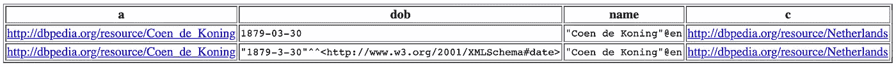

# 如何从维基百科建立你自己的领域数据集或语料库

> 原文：<https://towardsdatascience.com/how-to-build-your-own-datasets-or-corpora-from-wikipedia-3eb35d78baac?source=collection_archive---------35----------------------->

## 维基百科(Python 库)|美汤| MediaWikiAPI | DBpedia | SPARQL


在 [Unsplash](https://unsplash.com?utm_source=medium&utm_medium=referral) 上由 [James L.W](https://unsplash.com/@fragilejames?utm_source=medium&utm_medium=referral) 拍摄的照片

[维基百科](https://www.wikipedia.org/)是 21 世纪最值得信赖和众包的数字信息财富，如果有任何疑问，我们可以参考它来回答问题，了解网络系列的情节，找到电影演员的生物数据，了解更多关于世界伟大领袖或震撼地球的灾难，了解过去和未来。

太戏剧化了，是吧？

维基百科是一个创建丰富数据集或语料库的伟大平台，因为它有自然语言内容以及名为 [DBpedia](https://wiki.dbpedia.org/) 的语义结构化数据库。

*本博客讨论了两种简单、快速和轻量级的方法来管理特定领域的数据集或从维基百科构建 coropra 来训练机器学习模型。*

那么，让我们来看看这些丰富的知识如何成为你下一个项目的输入数据。

# 方法 1:使用维基百科的传统抓取

这是你一定已经熟悉的东西——网络抓取。旁边还有[美汤](https://pypi.org/project/beautifulsoup4/)，维基百科现在有自己的刮痧库( [pypi 链接](https://pypi.org/project/wikipedia/))。

下面是一个简单的程序，使用维基百科，python 库，来抓取内容。

```
import wikipediaresults_list = wikipedia.search("<your_search_term>")wiki_search_results = []for each_result in results_list:
    wiki_page_result = {}
    wiki_page_obj = wikipedia.page(each_result)
    wiki_page_result['title'] = wiki_page_obj.title
    wiki_page_result['content'] = wiki_page_obj.content
    wiki_page_result['url'] = wiki_page_obj.url
    wiki_page_result['links'] = wiki_page_obj.links
    wiki_search_results.append(wiki_page_result)
```

## 限制:

这种方法的局限性是无论如何都不会刮擦表。

## 解决方案:

[Beautifulsoup](https://pypi.org/project/beautifulsoup4/) 和 [MediaWikiAPI](https://pypi.org/project/mediawikiapi/)

以下是使用 MediaWikiAPI 和 Beautifulsoup 从维基百科页面提取表格的示例代码:

```
from mediawikiapi import MediaWikiAPI
from bs4 import BeautifulSoupmediawikiapi = MediaWikiAPI()    
media_wiki_page = mediawikiapi.page(wiki_page_obj) # scrape the HTML with BeautifulSoup to find tables soup = BeautifulSoup(media_wiki_page.html(), 'html.parser')    
tables = soup.findAll("table", {"class": "wikitable"})print(tables[0])
```

我用维基百科、MediaWikiAPI 和 Beautiful Soup 创建了一个复合代码来抓取维基百科页面。这段代码抓取作为搜索词响应的页面，搜索词基本上是您感兴趣的主题或领域。更深入地说，这段代码还从所有搜索响应页面获取相关链接，并抓取它们的内容。

[链接到 GitHub 知识库](https://github.com/royn5618/Corpus_Builder_Wikipedia)使用维基百科抓取维基百科内容。

# 方法 2: DBpedia 和 SPARQL

## DBpedia

DBpedia 是通过从维基百科项目中提取实体及其关系创建的，并以 [N-Triples 格式](https://en.wikipedia.org/wiki/N-Triples)存储。换句话说，DBpedia 是一个 [RDF 图](https://www.w3.org/RDF/)数据库。这些数据库的特点是它们在存储数据的同时保留了嵌入的语义关系。

比如:“我叫纳芭妮塔，来自印度。我住在爱尔兰。”

N-triples 数据库会将您的这些信息视为:

```
entity:me    relation_type:name   "Nabanita"
entity:me    relation_type:country   "India"
entity:me    relation_type:residence   "Ireland"
```

一般来说，这种格式也称为:

```
**subject**          **predicate**                      **object**
*(about what?)*    *(what is the relationship?) *   *(the value.)*
```

## SPARQL

SPARQL 是 RDF 数据库查询语言。语法与其他传统的查询语言非常不同，但是目标非常相似，因此可读性很强。

## **SPARQL 查询的快照**

***目标:*** 在维基百科上获取运动员的详细信息，如出生日期、姓名和国家。另外，我希望名字是英文的。此外，国家是一个可选变量，即即使“国家”为空，我也需要运动员的信息。出生日期和姓名是必填项。

***结果 SPARQL 查询:***

```
PREFIX foaf: <http://xmlns.com/foaf/0.1/>    
PREFIX dbo: <http://dbpedia.org/ontology/>    
PREFIX dbr: <http://dbpedia.org/resource/>    
PREFIX dbp: <http://dbpedia.org/property/>    
PREFIX ling: <http://purl.org/linguistics/gold/> SELECT DISTINCT ?a, ?dob, ?name, ?c    
WHERE{
   ?a a dbo:Athlete; 
      dbo:birthDate ?dob;
      foaf:name ?name.    
   OPTIONAL{?a  dbo:country ?c}    
   FILTER(LANG(?name) = "en").    
} 
```

***查询解释:***

所有的*前缀*都是已经存在的标准定义或 RDF 词汇表。把它们当作进口货。在主查询中，我们选择不同的运动员(？a)哪一个是主体；出生日期(？dob)，名字(？姓名)和国家(？c)哪些是对象。在“WHERE”中，第一行表示—选择一个类型(用 *a* 或 rdfs:type 表示)dbo:athlete 的主题。rdfs:type 或 *a* 和 dbo:athlete 是预定义的词汇表。“；”是用来继续使用选定的主题，即'？一个。此外，我们选择 dbo:birthDate(预定义词汇)，值/对象将被检索为“？dob”和 foaf:name 一样？姓名。在“可选”中，我们选择相同主题的国家(？a)使用词汇 dbo:country 作为谓语，但我们说它是可选的。换句话说，即使 dbo:county 没有关联的值，也要检索结果。最后一行“过滤器”，根据变量“过滤语言”？name”并指定它应该是英文的。如果没有指定语言，那么 SPARQL 将检索不同语言的对象。因此，除非需要解决特定的目标，否则我们将会有不需要的重复数据。

***输出:***



输出看起来有点像这个图像(当限制为 2 时)。您可以在这里尝试执行自己的 SPARQL 查询。使用 SPARQL 的一个很大的优点是可以选择多种响应类型，包括 HTML、JSON 和 csv 文件格式。

## 如何在 Python 中执行 SPARQL 查询:

Python 有一个包装 SPARQL 服务的包装器，叫做 [SPARQLWrapper](https://pypi.org/project/SPARQLWrapper/) 。这可用于查询位于[https://dbpedia.org/sparql](https://dbpedia.org/sparql)的 SPARQL 端点并检索结果。在本例中，我检索了一个 json 对象，并将其规范化为 pandas 数据帧。

```
import pandas as pd
from SPARQLWrapper import SPARQLWrapper, JSON
from pandas.io.json import json_normalize# SPARQL query
query = '''PREFIX foaf: <http://xmlns.com/foaf/0.1/>    
PREFIX dbo: <http://dbpedia.org/ontology/>    
PREFIX dbr: <http://dbpedia.org/resource/>    
PREFIX dbp: <http://dbpedia.org/property/>    
PREFIX ling: <http://purl.org/linguistics/gold/>SELECT DISTINCT ?a, ?dob, ?ht, ?hpn, ?g, ?name, ?c    
WHERE{{
   ?a a dbo:Athlete; 
      dbo:birthDate ?dob;
      foaf:name ?name.    
   OPTIONAL{{?a  dbo:country ?c}}    
   FILTER(LANG(?name) = "en").    
}}'''# initialise the SPARQL endpoint
sparql = SPARQLWrapper('http://dbpedia.org/sparql')# set query
sparql.setQuery(query)# set the response format
sparql.setReturnFormat(JSON)# execute the query
results = sparql.query().convert()# normalize the json object to a pandas dataframe
df_results = json_normalize(results['results']['bindings'])
```

为了从维基百科中搜集所有运动员的数据，我创建了一个知识库，执行这个示例查询的稍微增强版本。

[链接到 GitHub 存储库](https://github.com/royn5618/DBPedia-Data-Scraping-using-Python)以使用 SPARQLWrapper 查询 DBpedia。

**总之，**这是我们搜集或查询维基百科内容并进行创作的两种方式

*   丰富且设计精良的数据集
*   训练自然语言处理模型的语料库
*   试用 SPARQL
*   为 DBpedia 项目做贡献

# 一些有用的资源:

## 要了解关于 RDF 数据库和链接数据的更多信息:

[](https://www.cambridgesemantics.com/blog/semantic-university/learn-rdf/) [## 学习 RDF

### 引言这一系列课程是对 RDF 的介绍，RDF 是语义网的核心数据模型，也是

www.cambridgesemantics.com](https://www.cambridgesemantics.com/blog/semantic-university/learn-rdf/) [](https://www.ontotext.com/knowledgehub/fundamentals/what-is-rdf/) [## 什么是 RDF？让数据的力量增加两倍

### RDF 代表资源描述框架，是 W3C 开发并同意的数据交换标准

www.ontotext.com](https://www.ontotext.com/knowledgehub/fundamentals/what-is-rdf/)