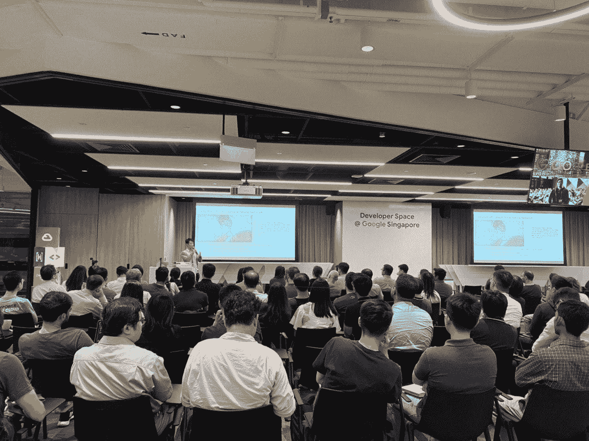

# 如何构建您的终极数据科学投资组合

> 原文：<https://towardsdatascience.com/how-to-build-your-ultimate-data-science-portfolios-ea0414d79a72?source=collection_archive---------18----------------------->

## 我对数据科学同事和低年级学生的建议

## 伟大的数据科学家创造重要的产品

建立你的投资组合

> “我将建立一个健身跟踪器来分析我的健身/饮食指标”
> 
> “我设计了这些 Tableau 仪表盘。没有计划，只是为了好玩”

几天前，我和一家知名初创公司的数据科学家/ ML 工程师进行了一次交谈。作为一个刚完成学业的专业人士，他雄心勃勃，热情高涨。他要求在谷歌与我会面，并记下我们谈论的一切。他真的很高兴分享他的数据科学项目，并愿意通过任何有趣的技术书籍，让他在他的 side hustles 和 Kaggle 竞争中领先。

如果他让你想起你自己或你那些有抱负的数据科学家朋友，你并不孤单。事实上，我发现许多数据和技术行业的大三学生和专业人士一直在利用他们的空闲时间/周末来建立他们的投资组合。数据科学是一个快速发展的行业，每个季度都有不断发展的趋势。在投资组合方面，你的选择是建立还是输给你的同行。

> 但是你有没有问过自己:“这是正确的方法吗？”

不要误会我，我很佩服他用无限的热情跟他谈建设他的副业。他分享了他有趣的学习经历，我毫不怀疑他会学到更多。但不知何故，他为自己的副业项目推广复杂技术技能的方式让我无法理解。

> 他们缺乏影响力。

# 在你有限的时间里做重要的事情

如果我们有时间做最好的投资组合。为什么我们把大部分时间花在展示我们的技术技能上，而不是我们产生的影响上？为什么我们优先关注 Kaggle 比赛，而不是解决我们朋友的问题，而数据分析可以解决这些问题？与其说你在 Kaggle 竞赛中排名第 30 位，不如说你用你的选股模型帮助你的同行赚了钱。

在我看来，这正是优秀的数据科学家和伟大的数据科学家的区别。

## 优秀与伟大的数据科学家:构建具有影响力的产品

一个优秀的数据科学家有一个庞大的学习知识库。他知道如何制作漂亮的仪表板。他建立了更好的神经网络模型来分类 MNIST 数据集。他运行高度复杂的交易算法，这需要一个人多年才能学会。

> 这很好，但还不足以产生影响。

要成为伟大的数据科学家，你需要的是一个伟大的产品和影响力。产品表明用户从中受益的价值。这表明你的技能给社会带来了影响。[最终，当你去参加数据科学面试时，你将需要证明你能够解决问题，并将价值带入表中](/ace-your-data-analytics-interviews-ef114606c5d7)。

因此，一位伟大的数据科学家使用他的仪表板来建立预测公式，以阻止冠状病毒传播到数百万人。一位伟大的数据科学家使用他的神经网络模型对网络钓鱼攻击进行分类，以保护[数百万用户免受劫持](https://www.cnet.com/news/google-chrome-can-now-warn-you-in-real-time-if-youre-getting-phished/)。本质上，一个伟大的数据科学家的投资组合中有受众、产品和影响。

## 你的产品将是你最终的投资组合

当你把你的产品作为一个投资组合进行交流时，不管你的教育背景如何，你都会成为一个主题专家(SME)。因此，Analytics 人力资源招聘人员会猎头你，而不是你寻找他们。当你去面试的时候，你会有令人兴奋的故事来讲述，而不是你所拥有的一系列无聊的技能/证书。

[就我而言，我的投资组合让我接触到了谷歌、脸书、维萨等大公司。在我的每一个兼职项目中，我都教我的同事用它来解决他们朋友的业务问题。我为那些有志于购买股票的金融朋友们设计了价值投资仪表盘。](/the-hidden-gems-of-writing-analytics-6db78fad5a51)[我创建了 Twitter 提取和情感分析，以提取关键主题和情感，供营销朋友提出营销活动。](/the-twitter-tale-of-indonesian-election-2019-pemilu-fb75cd084a32)

> 通过构建您的产品、了解您的受众并产生影响来构建您的最终产品组合。

# **打造终极投资组合的三大关键**

## 1.以对受众有影响的简单解决方案为目标

谁是你的观众。这永远是第一个要问的问题

当你对培养自己的技能比对培养观众更感兴趣时，危险就来了。让我抓住那个制造头条新闻的家伙。他计划建立一个健身追踪器来分析他自己的健身/饮食指标。伟大的项目，但对任何人都没有影响，除了他自己。

同样，我认识的许多有抱负的数据科学家/年轻同事只专注于构建复杂的模型，而没有为他们的受众带来价值。在网飞竞赛中，获胜团队不考虑实施其推荐模型所需的工程工作。虽然他们以惊人的准确性获胜，但他们的解决方案太复杂了。[结果，网飞浪费了 100 万美元来奖励一个他们无法采用的机器学习模型。](https://www.wired.com/2012/04/netflix-prize-costs/)

同样的，你应该把你的受众的需求放在心上来制作你的产品。这将迫使你建立一个更现实的数据分析管道。您分析真实的业务问题、提取脏数据、清理数据、特征工程、设计、部署和维护模型。

在大学和其他 MOOC 认证中，通常情况下，问题公式和干净的数据集已经为我们处理好了。因此，为真实受众构建解决方案将更具挑战性。但是，从长远来看，你会得到满意的建筑产品。在任何数据面试中，你积累故事来宣传你的真实项目，而不是吹嘘你的技术技能和 Kaggle 比赛。

## 2.根据您的领域知识构建解决方案

来源( [Unsplash](https://unsplash.com/photos/MYbhN8KaaEc)

我和很多从不同行业跳槽到数据/科技行业的大三学生和专业人士聊过。我曾与一位就读于新加坡国立大学(NUS)化学博士的女士交谈过，她向我寻求建议，在一家科技行业担任数据科学家。她从未在科技行业工作过，但她想学习 python 并从头开始发展她的编码技能。

虽然人们勇敢地跳到不同的专业领域是令人钦佩的，但我会强烈建议她在没有可靠计划的情况下不要这样做。毕竟，与成千上万已经完成 4 年学业的计算机科学或商业分析毕业生相比，她会有什么样的优势呢？当数据分析已经有这么多炒作的时候，你将如何赶上技术和竞争？

> 这是信仰的巨大飞跃。

因此，我建议她继续学习化学。我建议她先成为最好的化学家，然后冒险进入分析领域。为什么？因为她不需要从零开始。她已经拥有大量的化学领域知识，她可以学习制造化学产品和展示自己能力所需的必要分析技能。她不应该丢掉自己的专业知识。她应该把它作为一个平台，在分析领域找到自己的位置。

同样，如果你是金融专业的学生，建立股票研究工具。如果你是运营管理/工业工程专业的学生，建立六西格玛优化工具。这使您能够利用现有的知识来创建有意义的数据分析工作，而不是从第一天开始从头开始学习分析。

理想情况下，您应该达到帕累托比率，大多数数据分析工作都可以使用简单的模型(如线性回归和决策树)来解决。如果你正确使用你现有的领域知识，你 20%的努力应该已经产生了 80%的影响。

## 3.部署和交流您的解决方案

我在谷歌上关于 CNN 新加坡数据科学模型的演讲

如果你想成为一名伟大的数据科学家，你需要发表你的作品。开放你的解决方案，让其他人使用。让人们为你的 Github 做贡献。写并谈论它。越多的人在你的作品中发现价值，他们就越有可能传播你的产品。在未来，你将投入到建立你的投资组合和个人品牌中，同时在你的专业工作之外教育他人。

在我的例子中，我通常使用 [Github](https://github.com/VincentTatan) 让人们访问我的代码和在线学习，使用 [Youtube](https://www.youtube.com/channel/UCkdLA9vR9S_SbVKdfWuMyKg?view_as=subscriber) / [Medium](https://towardsdatascience.com/@vincentkernn) 以文字和视频的形式交流我的想法，最后使用 [Heroku](/deploy-your-first-analytics-project-9280ea31b0ac) 启动我的 Python 应用程序。我从我的解决方案中获得了收入和流量，这增强了我的知识对他人有益的价值。随后，构建产品让我能够在构建个人品牌和故事的同时掌控自己的工作。

# 结论

如果你玩得好，你会有很多好处。首先，你要建立自己的投资组合，并乐在其中，看看你产生的影响。第二，你推广自我品牌和工作机会和会议机会的在线可见性。最后，你训练自己写作和讲述故事来激励你的观众采取行动。所有这些优势都将为您成为伟大的数据科学家创造机会。

总之，要实现这些结果，您需要:

1.  **以简单有效的解决方案为目标**:专注于培养你的受众，而不仅仅是培养你的技能。
2.  **根据你的领域知识构建解决方案**:不要从零开始追求数据科学。利用您现有的才能和领域知识，为您的同行构建数据科学产品。
3.  **部署和宣传您的解决方案**:部署和推广您的产品。让许多人使用它，并记录你所产生的影响。作为一名伟大的数据科学家，它为您提供了更多的灵感和故事来增强您的学习。

索利·德奥·格洛丽亚

# 最后…

我真的希望这是一本很棒的读物，是你发展和创新的灵感来源。

请**在下面评论**提出建议和反馈。就像你一样，我也在学习如何成为一名更好的数据科学家和工程师。请帮助我改进，以便我可以在后续的文章发布中更好地帮助您。

谢谢大家，编码快乐:)

# 关于作者

Vincent Tatan 是一名数据和技术爱好者，拥有在 Google LLC、Visa Inc .和 Lazada 实施微服务架构、商业智能和分析管道项目[的相关工作经验。](https://bit.ly/2I8jkWV.?source=post_page---------------------------)

Vincent 是土生土长的印度尼西亚人，在解决问题方面成绩斐然，擅长全栈开发、数据分析和战略规划。

他一直积极咨询 SMU BI & Analytics Club，指导来自不同背景的有抱负的数据科学家和工程师，并为企业开发他们的产品开放他的专业知识。

最后，请通过 [**LinkedIn**](http://www.linkedin.com/in/vincenttatan/?source=post_page---------------------------) **，**[**Medium**](https://medium.com/@vincentkernn?source=post_page---------------------------)**或** [**Youtube 频道**](https://www.youtube.com/user/vincelance1/videos?source=post_page---------------------------) 联系文森特