# 把针扔在地上怎么算π

> 原文：<https://towardsdatascience.com/how-to-calculate-%CF%80-by-tossing-needles-on-the-floor-3e26ba027ab2?source=collection_archive---------36----------------------->

## 著名的布冯针问题

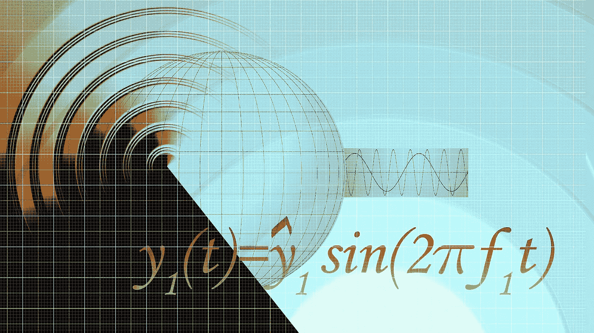

图片由[皮克斯拜](https://pixabay.com/fr/?utm_source=link-attribution&utm_medium=referral&utm_campaign=image&utm_content=95721)的 Gerd Altmann 提供

领先的进化生物学家和博学者[恩斯特·迈尔](https://en.wikipedia.org/wiki/Ernst_Mayr)描述法国博物学家、数学家和宇宙学家[乔治-路易·莱克勒克，孔德·德·布丰](https://en.wikipedia.org/wiki/Georges-Louis_Leclerc,_Comte_de_Buffon)(1707–1788)，如是说:

> “的确，[……]18 世纪下半叶自然历史中所有思想之父”
> 
> ——恩斯特·迈尔

他的作品，尤其是他的**一*36 卷的合集，受到了**的高度影响，涵盖了广泛的主题，包括材料科学、物理、化学和动物自然史。*****

## ***他对数学的贡献***

***乔治·路易·莱克勒克(后来的布丰伯爵)对数学的第一个重大贡献是他的《T21》一书，在书中他将微积分技术应用于概率理论。本文将要描述的著名问题[布冯针](https://en.wikipedia.org/wiki/Buffon%27s_needle)就是以他的名字命名的(见图 2)。***

***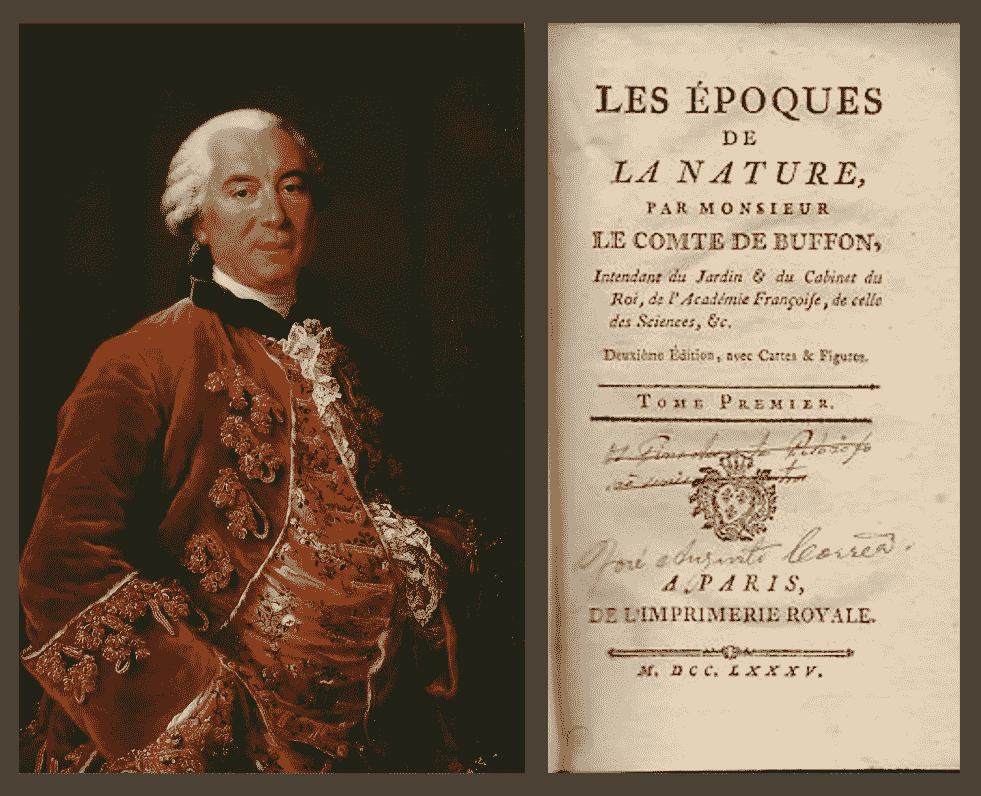***

***图 1:乔治-路易·莱克勒克，布丰伯爵，由著名肖像画家[弗朗索瓦-休伯特·德鲁艾](https://en.wikipedia.org/wiki/Fran%C3%A7ois-Hubert_Drouais)(左)([来源](https://en.wikipedia.org/wiki/Georges-Louis_Leclerc,_Comte_de_Buffon))。在他的书《自然的问题》(1778 年)中，莱克勒克提出行星是在太阳和彗星碰撞后形成的。***

# ***问题陈述***

***这个问题的简化形式可以表述如下:***

***考虑一根 2*长的针扔在一块 2*宽的木板地板上。针落在其中一个平行裂缝上的概率是多少？*****

***针尺寸和曲柄之间距离的具体选择是不相关的。在解决了这个特殊的情况之后，概括就很简单了(如下所示)。***

***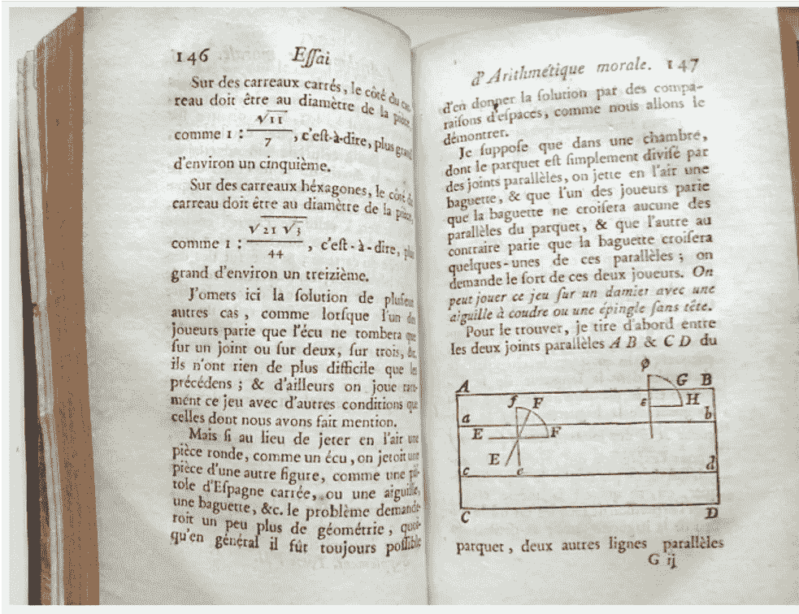***

***图 2:布冯问题初始提法的声明([来源](https://blogs.ethz.ch/kowalski/2008/09/25/buffons-needle/))。***

***正如我们将看到的，这个问题的解决方案允许人们估计π的值，这是一个完全出乎意料的结果。***

***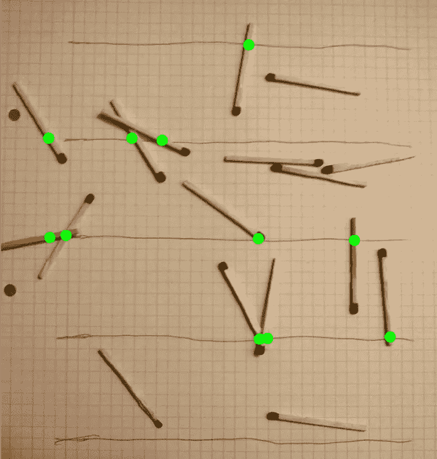***

***图 3:基于布冯针的问题寻找π的一个实验([来源](https://en.wikipedia.org/wiki/Buffon%27s_needle_problem))。***

## ***定义变量***

***图 4 和图 5 显示了描述针落在地板上时的位置和角度所需的变量( *x* ， *θ* )。变量 *x* 测量从针的中心到最近的平行线的距离。角度 *θ* 是针与扇形体 *OP* 之间的角度。***

**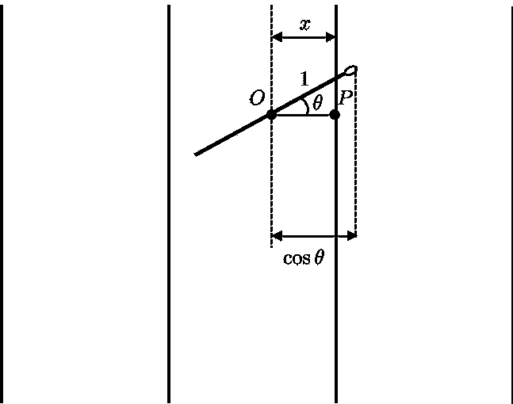**

**图 4:针落在其中一个裂缝上的情况。**

**( *x* ， *θ* )应该遵守两个限制，**

**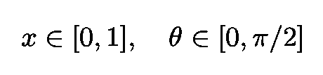**

**等式 1:(*x*， *θ* )变量遵守的两个限制。**

**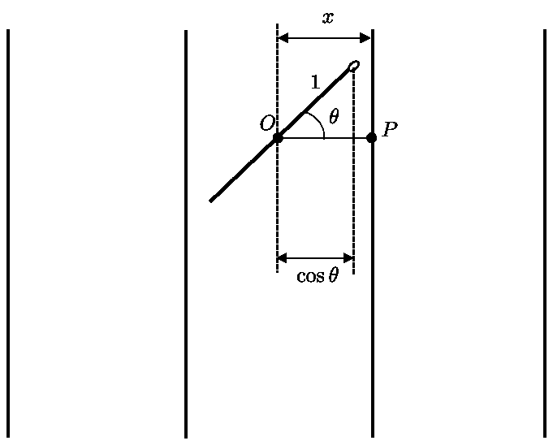**

**图 5:针没有穿过裂缝的情况。**

**如[席梦思](https://books.google.com.br/books?id=m1Q8AAAACAAJ&dq=simmons+calculus+with+analytic+geometry&hl=en&sa=X&ved=0ahUKEwivtaH7loDpAhXFH7kGHUdQBpgQ6AEIKDAA)所述，这相当于在矩形中选择 *x* 和 *θ* 的问题，例如:**

**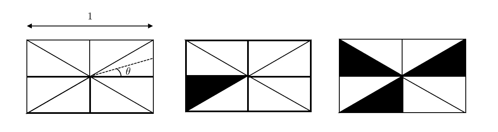**

**图 6:描述针落在地板上时的位置和角度相当于在这三个([源](https://books.google.com.br/books?id=m1Q8AAAACAAJ&dq=simmons+calculus+with+analytic+geometry&hl=en&sa=X&ved=0ahUKEwivtaH7loDpAhXFH7kGHUdQBpgQ6AEIKDAA))这样的矩形中选择 *x* 和 *θ* 。**

**现在注意，当指针穿过平行线(曲柄)时，遵守以下条件:**

**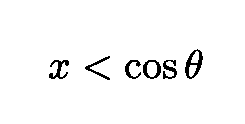**

**等式 2:当指针落在曲柄上时，x 和θ所遵循的条件。**

**图形上我们有:**

**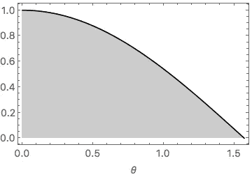**

**图 7:等式。2 用图形表示。纵轴测量 x ( [源](https://books.google.com.br/books?id=m1Q8AAAACAAJ&dq=simmons+calculus+with+analytic+geometry&hl=en&sa=X&ved=0ahUKEwivtaH7loDpAhXFH7kGHUdQBpgQ6AEIKDAA))。**

**使用 Eq。2，或者等效地，图 7，我们可以计算针落在平行裂缝上的概率:**

**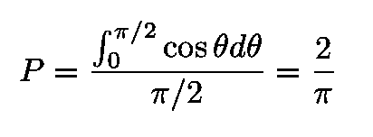**

**等式 3:指针落在曲柄上的概率。**

## **一般化**

**等式给出的不等式。2 可以概括为尺寸为 *L* 的针落在由 *d* 分开的平行裂缝之一上的问题:**

****

**等式 4:等式的推广。2 当平行线的距离为 *d.* 时，尺寸为 *L* 的针落在平行裂缝上**

**新的概率为:**

**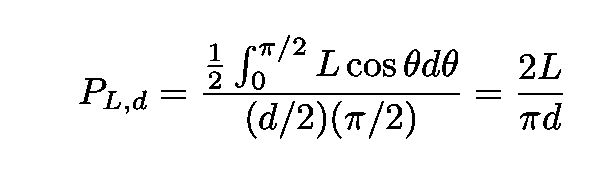**

**等式 5:当两条平行线之间的距离为 *d.* 时，尺寸为 *L* 的针落在平行线上的概率**

**但是，请注意，此计算仅对小于或等于 *d 的 *L* 有效。一般问题可分为两种情况:小针和大针。***

*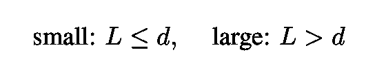*

*等式 6:问题可以分为这两种情况。*

*我们已经解决了第一个案子。让我们解决第二个问题。在这种情况下，我们可以利用 *x* 和 *θ* 的联合概率。假设两个分布都是均匀的，那么 *x* 的概率密度是 2/ *d* (对于*x*∈【0， *d* /2】，因为概率必须积分为 1)，并且 *θ* 的概率密度是 2/*π*θ∈【0，π/2】。因此联合概率是它们的乘积 4/(πd)，只有当 *x* 和 *θ* 的分布同时不为零时，联合概率才不为零。*

*整合联合分布后，我们得到:*

*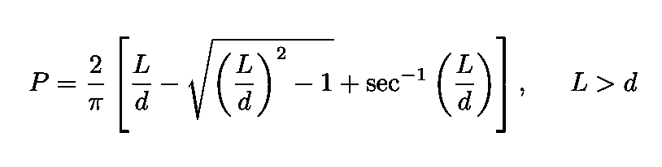*

*等式 7:长针情况下的概率 L>d。*

# *通过实验确定π*

*假设现在我们把 2 根 *"* 针扔到地板上，比方说，*n*= 10000 次。曲柄之间的距离也是 2*。它落在曲柄上的次数百分比由 *n* / *N* 给出，其中 *N* 代表投掷的总次数，而 *n* 是针落在曲柄上的次数。我们的计算表明:**

**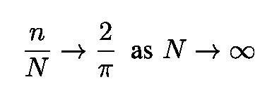**

**等式 8:根据我们的计算，随着投掷次数的增加，针落在裂缝上的次数的百分比应该接近 2/π。**

**因此，我们可以用这个简单的实验来估计常数π的值，即:**

**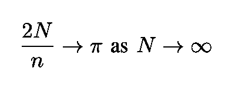**

**等式 9:如果我们把针在地板上扔很多次，我们可以估计常数π的值。**

**下面的动画展示了我们刚刚描述的实验的模拟。**

**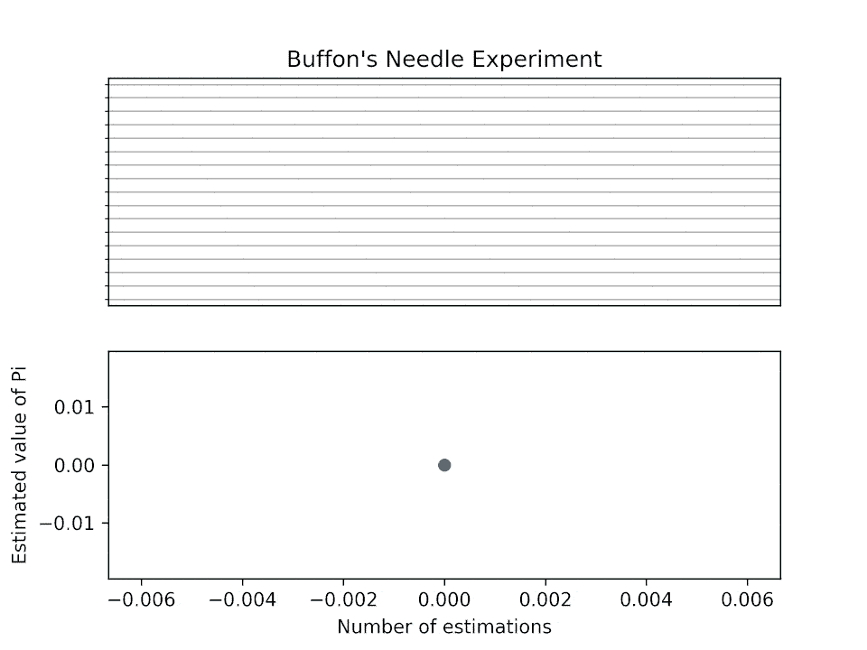**

**图 8:布丰针实验的模拟(使用 Python 3)。第二个图显示估计确实收敛于π ( [源](https://en.wikipedia.org/wiki/Buffon%27s_needle_problem#Estimating_%CF%80))。**

**感谢您的阅读，再见！一如既往，我们随时欢迎建设性的批评和反馈！**

**我的 [Github](https://github.com/marcotav) 和个人网站 [www.marcotavora.me](https://marcotavora.me/) 有一些关于数学和其他主题的有趣材料，如物理、数据科学和金融。看看他们！**