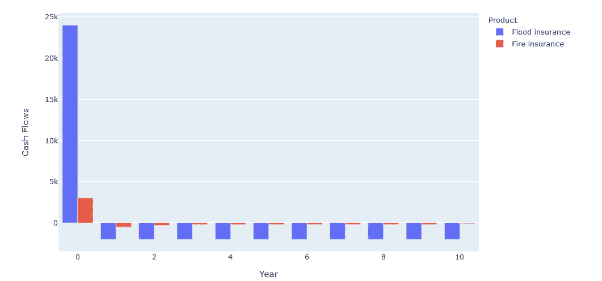

# 如何用 Python 计算贴现现金流

> 原文：<https://towardsdatascience.com/how-to-calculate-discounted-cash-flows-with-python-a88f12a48d5c?source=collection_archive---------26----------------------->

## 面向金融的 PYTHON

## 用熊猫、考拉和派斯帕克

# 时间有价值

*时间是有价值的——不仅仅是它给你的智慧，还有金钱的时间价值。*

凯文·Ku 在 [Unsplash](https://unsplash.com?utm_source=medium&utm_medium=referral) 上的照片

你一定听说过这个:

今天的 100 美元比明天的 100 美元更有价值。

它如此简单，却揭示了我们许多行为和决定背后的潜在原则:

*   投资或持有现金。投资让你赚取利息，而持有现金不会产生额外的价值。
*   提前支付或延期支付。推迟付款能让你在付款前通过投资赚钱。
*   是否进行一个项目。是的，如果项目的回报高于初始投资加上它本可以赚取的利息；

嵌入货币时间价值的其他领域包括保险定价、债券定价、企业估值等。

照片由 [Aron 视觉效果](https://unsplash.com/@aronvisuals?utm_source=medium&utm_medium=referral)在 [Unsplash](https://unsplash.com?utm_source=medium&utm_medium=referral) 上拍摄

# 时间与估值有什么关系？

为了回答这个问题，我们来输入一个模拟:坐好，挂紧。

## 你的彩票奖金决定

好消息！你刚刚中了一百万美元的彩票！

你有两个选择来得到现金。

*   选择一:今天就获得 80 万美元。
*   方案二:一年内获得 100 万美元。

假设你没有现金短缺，并假设你今天没有不合理地持有现金:你会选择哪个选项？

要回答这个问题，你肯定会问我:

*如果我投资，我能期望的投资回报是多少？*

问得好！比方说“ ***银行幻想*** ”提供一项年回报率为 10%的无风险投资。现在让我们为自己做出一个好的决定。

要比较这些选项，最简单的方法是通过考虑`Interest Rate`(投资回报)和投资期限(`t`)，将`Present Value`(今天的价值)转换为`Future Value`(一年后的价值)。

用期权 1 今天(`Present Value`)的 80 万美元，可以投资银行幻想的投资产品，一年(`Interest Rate`)获得 10%的回报(`t`)。这是 80，000 美元的投资回报。有了最初的钱，你在年底会有 880，000 美元。当然，对比年底的现金数额，方案二的 100 万美元是显而易见的选择。

所以现在决定很清楚了，你将选择选项 2，一年后获得 100 万美元。

用公式表达我们讨论过的思维过程，它是:

80 万美元一年的价值是多少，这一点很清楚。现在让我问你另一个问题:

未来的 100 万美元今天值多少钱？

为了推导它，我们可以把前面的公式反过来求解 PV。让我们试试:

将 1，000，000 美元转换成今天的价值，得出 909，091 美元。这相当于说，今天有 909，091 美元，你会把它投资到 Bank Fantasy 的产品中，到年底会有 100 万美元(909，091 美元加上 90，909 美元的投资回报)。

现在我们可以比较选项 1 的 800，000 美元和选项 2 的 909，091 美元。这又给了你同样的决定:选择选项 2！

## 分解公式

您现在知道如何计算今天的价值了。而这个过程叫做 ***贴现*** 。

为了简化贴现流程，我们可以将其分为两步:

1.  计算一个 ***折扣因子；***
2.  计算 ***的现值*；**

**折扣系数**

从前面讨论的现值公式中取分母。我们会有折扣因素。现值公式并不复杂，但没有必要重复使用除法和指数。该系数可以计算一次，然后简单地乘以未来的现金支付。

计算折扣系数

**现值**

计算贴现因子后，将贴现因子应用于未来值将得到现值。

**多重未来值**

也可能有多个未来值:

假设您有一个选项 3:第一年收到 50 万美元，第二年收到 50 万美元。

在这种情况下，总现值是用贴现因子分别贴现的所有未来值的总和。

计算现值

# 商业案例

好了——到现在为止，你已经是用彩票资金做决策的专家了。让我们尝试一个商业案例。

这一次，你从事保险产品定价工作。你被要求估计一项保险产品的价格，该保险产品涵盖五年的洪水风险。

**假设你写了一个合同，它:**

*   第一年年初从客户处收到 12，000 美元；
*   五年内每年年底向客户支付约 2000 美元的索赔；
*   你可以投资利率为 2.5%的美国政府债券；

**为了计算现值，我们需要做以下事情:**

1.  计算每年的贴现因子`Discount factor = 1 / (1 + r)^t`；

2.计算每年现金流量的现值`Present value = discount factor * Cash flows`；

3.把所有现金流的现值加起来；

总计`Present value`栏，你将获得 2706 美元的利润。加上前期收到的 12，000 美元和贴现到今天的五项未来费用，我们最终保持了 2，706 美元的利润。

💰所以…是的！你的公司将出售这种产品。

# 最后用 Python 代码！

## 为什么不超越

到目前为止，我们看到的例子非常简单。在现实中，我们很少只有几个现金流在未来发生。

*   ⚡ **卷**:如果你试图一次对多个产品估值，Excel 就变得有限；
*   **🤖自动化**:Python 逻辑可以作为函数编写一次，自动应用于类似的未来现金流，避免人工错误；
*   🚅**速度**:计算量大的时候 Excel 打开会比较慢，带收益率曲线的`vlookup`只会让它更容易崩溃，而 Python 可以轻松应对；

所以这是金融中最适合应用 Python 的领域之一。

照片由[吕山德元](https://unsplash.com/@lysanderyuen?utm_source=medium&utm_medium=referral)在 [Unsplash](https://unsplash.com?utm_source=medium&utm_medium=referral) 上拍摄

## 介绍我们的例子

所有的资料和代码都可以在这个代码库中找到[。](https://github.com/fyyying/python-in-finance/tree/master/discount_cashflows)

现在，我们将使用稍微复杂一点的现金流文件和收益率曲线文件作为示例。

**注意:**这里我们不再使用统一利率。相反，我们使用收益率曲线:更高的利率出现在更长的期限内，以反映更高的回报，如果人们必须将现金投入一种产品更长的时间，通常会要求更高的回报。

*   我们有两种产品:洪水险和火险；
*   两者都是美元；

预计现金流如下表所示:

两种产品的现金流

按年份划分的现金流模式

用于贴现的收益率曲线:

收率曲线

## 来自熊猫的帮助🐼

由于 Pandas 是按列操作的，所以同样的公式可以一次应用于整个列。

**步骤:**

1.  用`1 / (1 + df["Interest rate"])**df["Year"])`计算折扣系数；
2.  基于`Year`和`Currency`将收益率曲线文件与现金流文件合并；
3.  用`df["Cash flows"] * df["Discount factor"]`计算每年现金流量的现值；
4.  使用`groupby`汇总每个产品的`Present value`；

***⚡注*** :在 merge 函数中，使用 left join 将确保在这个过程中没有现金流被丢弃。在收益率曲线信息不完整的情况下，我们可以在应用`merge`后检测现金流文件中的`Null`值。

**完整的代码和结果:**

计算熊猫的贴现现金流

通过几行代码，您可以在不到一秒的时间内获得贴现现金流。

熊猫的贴现现金流

一旦我们按产品汇总了`Present value`:

按产品划分的总贴现现金流

我们将看看我们的产品是否有望盈利:

产品现值

在这种情况下，**是的**又来了两个！

## 现在有了考拉🐨

Databricks koalas 可以让您非常轻松地从小型本地操作过渡到大数据的分布式计算。

除了导入一个不同的库(以及库的别名`ks`而不是`pd`)，其余部分与上面的 Pandas 代码相同。

用考拉计算贴现现金流

## 闪亮的火花🌟

当数据变得足够大，熊猫无法再在内存中读取时，PySpark 就派上了用场。

要使用 PySpark 计算贴现现金流，您需要知道操作中涉及到广泛的转换。

`join` —加入 PySpark 是一个广泛的转变。这意味着在要连接的两个表匹配之前，有一个数据交换。

*   默认情况下，要连接的表将被分割成 200 个更小的文件(所谓的分区)用于分布式计算；
*   为了保证效率，我们将使用`broadcast`连接；
*   join 所做的是:它会将您选择的小表广播给大表的每个执行程序；
*   这样避免了数据的交换，因为小表是作为一个整体被所有的执行者消耗的；
*   要使用广播，您需要通过`broadcast(small_table)`或`small_table.hint("broadcast")`给小桌子一个提示；
*   这一步将在 Spark 3.0 的新版本中自动处理。但是在你安装新版本之前，我们不要忘记添加一个提示。💡

使用 PySpark 计算贴现现金流

这样，我们又一次得到了和以前一样的结果。

# 最后的话

贴现现金流的应用非常广泛:对你的商业项目、保险产品、债券、甚至公司进行估值。

由于容量和速度的限制，在 Excel 中贴现现金流比必要的要复杂得多&手动错误的几率更高。然而，使用 Python，它不超过十行代码。

现在你已经到了故事的结尾。你干得好！👏

如果你觉得这篇文章有用，请关注我的[推特](https://twitter.com/fu_yingying)简介🐼。我会继续发布关于 Python 的文章🐍金融、保险和估价。

请给你的任何问题留言，我会直接回答或者通过以后的文章来回答。

最后，我想感谢[德扬·西米奇](https://medium.com/u/974f70f18518?source=post_page-----a88f12a48d5c--------------------------------)和瑞秋帮我审阅我的帖子。

> 培养对学习的热情。如果你这样做了，你将永远不会停止成长。
> 
> *—安东尼·j·德安杰洛*