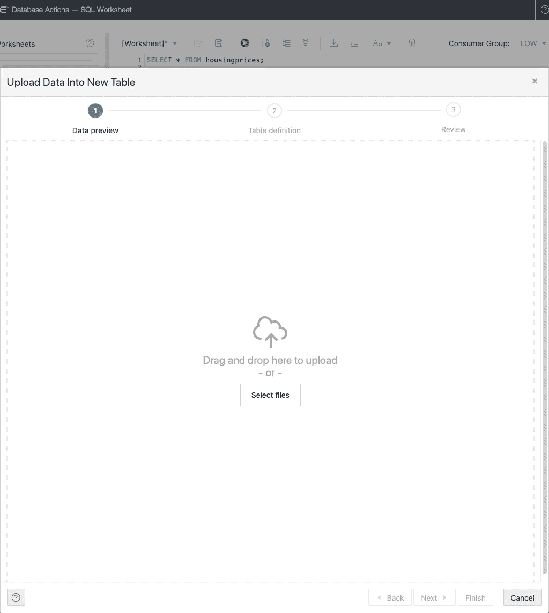
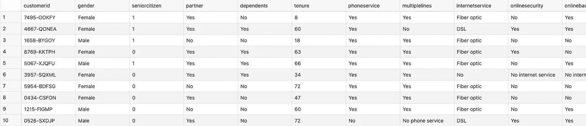
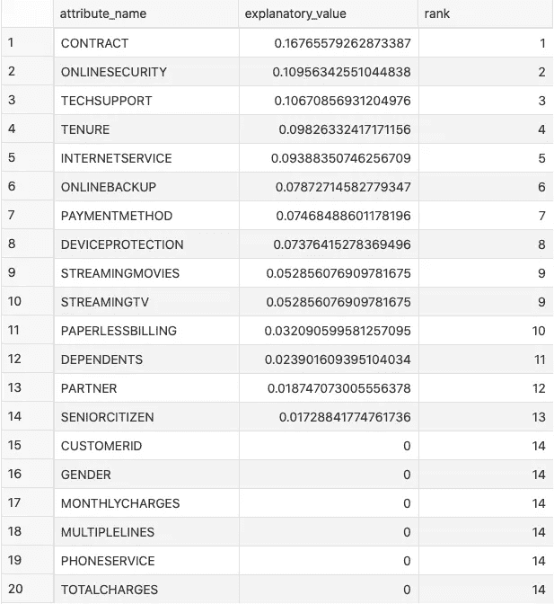

# 如何使用 SQL 计算特征重要性——基本指南

> 原文：<https://towardsdatascience.com/how-to-calculate-feature-importance-with-sql-the-essential-guide-400b5366a88c?source=collection_archive---------33----------------------->

## 是的，SQL 可以做到这一点。需要 5 行代码。

机器学习不再仅仅是 *Python* 和 *R* 的专利。用大家都知道的语言——*SQL*，可以直接在数据库中做很多事情。今天我们将探索如何用它来计算特性的重要性，大约有五行代码。

照片由 [Josiah Weiss](https://unsplash.com/@jsweissphoto?utm_source=unsplash&utm_medium=referral&utm_content=creditCopyText) 在 [Unsplash](https://unsplash.com/s/photos/waves?utm_source=unsplash&utm_medium=referral&utm_content=creditCopyText)

不想看书？看看我关于这个主题的视频:

在本文中，我们将使用 [Oracle 云](https://www.oracle.com/index.html)。这是免费的，所以请注册并创建一个 OLTP 数据库实例(版本 19c，有 0.2TB 的存储)。一旦完成，通过*SQL Developer Web*或任何其他工具建立连接。

至于数据集，我们将使用一个*电信行业变动*数据集，可从这里下载[。我之所以选择这个数据集，是因为它有许多功能，不需要任何手动准备。](https://www.betterdatascience.com/wp-content/uploads/2020/11/churn.csv)

这篇文章的结构如下:

*   什么是特征重要性？
*   数据集加载
*   SQL 的特性重要性
*   结论

# 什么是特征重要性？

要素重要性是一种根据输入要素(属性)对预测(用于预测目标变量)的有用程度为输入要素(属性)分配分数的技术。

这个概念对于预测建模是必不可少的，因为您希望只保留重要的特征，而丢弃其他特征。通过这样做，您可以减少维度和噪声。出于显而易见的原因，它还可以让您更好地理解您的数据。

此外，计算特征重要性可以提供对预测模型工作的洞察。通过了解重要性分数，您可以立即知道模型认为什么是最重要的，以及它为什么以这种方式进行预测。

此外，有一个定量的确认总是好的，不要工作在纯粹的假设上。

# 数据集加载

如果您正在跟进，您应该已经下载了[数据集](https://www.betterdatascience.com/wp-content/uploads/2020/11/churn.csv)。你必须用你选择的工具将它加载到数据库中——我用的是 *SQL Developer Web* ，但是你可以使用几乎任何东西。

加载过程很简单——点击*上传*按钮，选择数据集，然后点击几次*下一步*:

图 1-使用 SQL Developer Web 加载数据集(图片由作者提供)

我的存储在`churn`表中。让我们通过执行一条`SELECT * FROM churn`语句来看看里面有什么:

图片 2-流失数据集的前 10 行(作者图片)

现在，您可以继续进行要素重要性计算。

# SQL 的特性重要性

正如所承诺的，这将只需要几行代码。特征重要性通过`DBMS_PREDICTIVE_ANALYTICS`包的`EXPLAIN`过程获得。它需要三个参数:

*   `data_table_name`–存储源数据的地方
*   `explain_column_name`–目标变量的名称
*   `result_table_name`–存储特征重要性的新表格

下面是如何用代码实现它:

就是这样！现在，您可以用一个简单的`SELECT`语句来看看重要性。下面的表格对功能进行了排序，因此最重要的功能会首先显示:

结果如下:

图片 3-特征重要性(作者图片)

从前面的图像中，你可以立即看出什么是重要的，什么是不重要的。下一步是将这些信息用于预测模型。这有点超出了本文的范围，但是您可能希望继续进行分类建模。

事实证明，这也只能用 SQL 来执行！[下面是如何](https://www.betterdatascience.com/machine-learning-with-sql%E2%80%8A-%E2%80%8Aits-easier-than-you-think/)。

# 离别赠言

我想你没有想到用 SQL 计算特性重要性这么容易。但它是，就像数据库中的其他机器学习一样。SQL 仍然不是机器学习的语言，但我们可以说，随着这些最近的进步，未来看起来很有希望。

不要错过 SQL 系列的其他机器学习:

*   [使用 SQL 的机器学习(回归)](https://www.betterdatascience.com/sql-regression/)
*   [使用 SQL 的机器学习(分类)](https://www.betterdatascience.com/machine-learning-with-sql%E2%80%8A-%E2%80%8Aits-easier-than-you-think/)
*   [使用 SQL(时间序列)的机器学习](https://www.betterdatascience.com/time-series-forecasting-with-sql%E2%80%8A-%E2%80%8Aits-easier-than-you-think/)

请在下面的评论区留下你的想法。

## 加入我的私人邮件列表，获取更多有用的见解。

*喜欢这篇文章吗？成为* [*中等会员*](https://medium.com/@radecicdario/membership) *继续无限制学习。如果你使用下面的链接，我会收到你的一部分会员费，不需要你额外付费。*

 [## 通过我的推荐链接加入 Medium-Dario rade ci

### 作为一个媒体会员，你的会员费的一部分会给你阅读的作家，你可以完全接触到每一个故事…

medium.com](https://medium.com/@radecicdario/membership) 

*原载于 2020 年 11 月 12 日 https://betterdatascience.com***。**