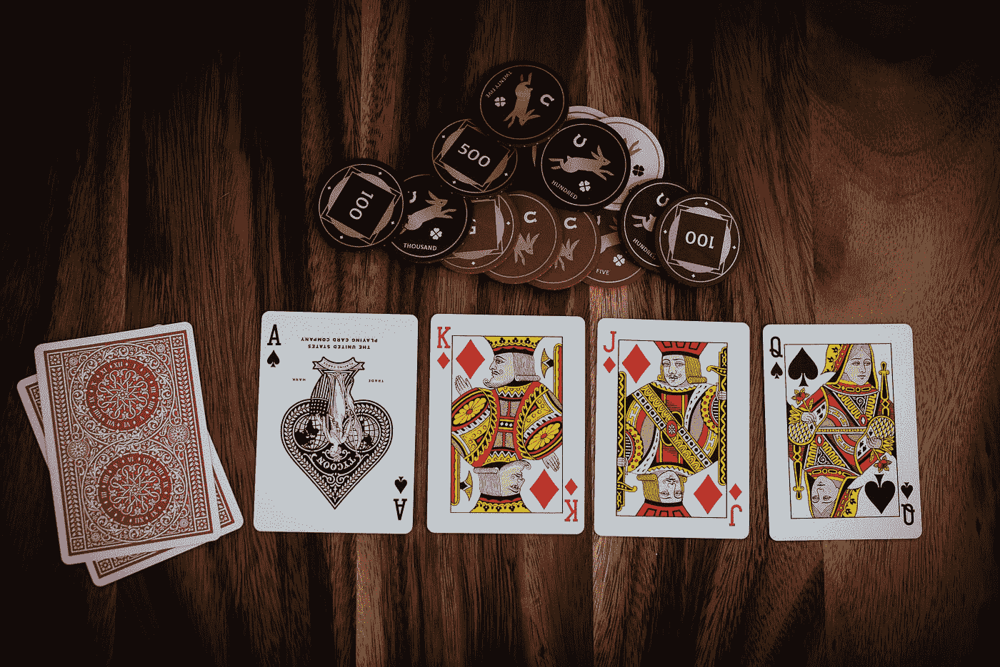
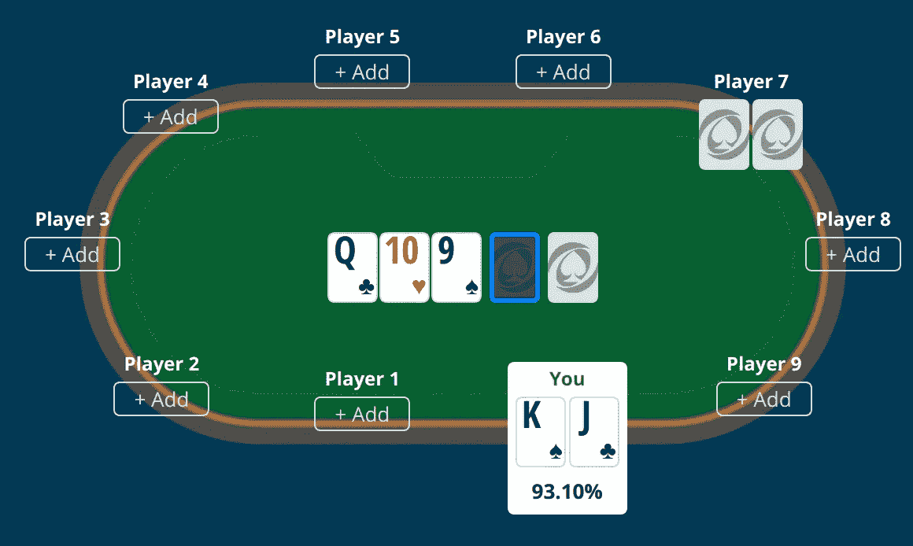
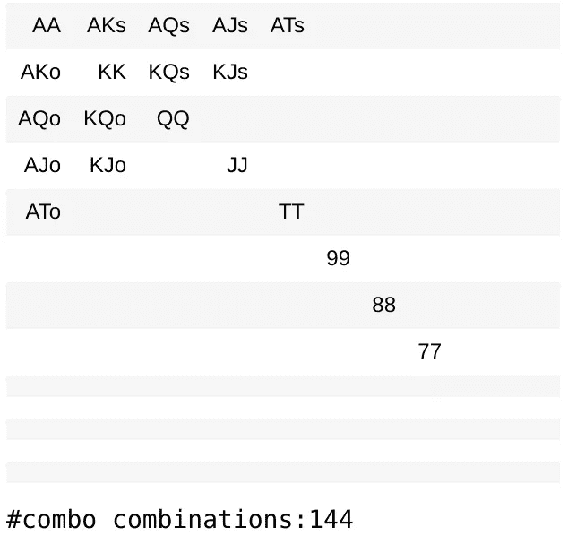
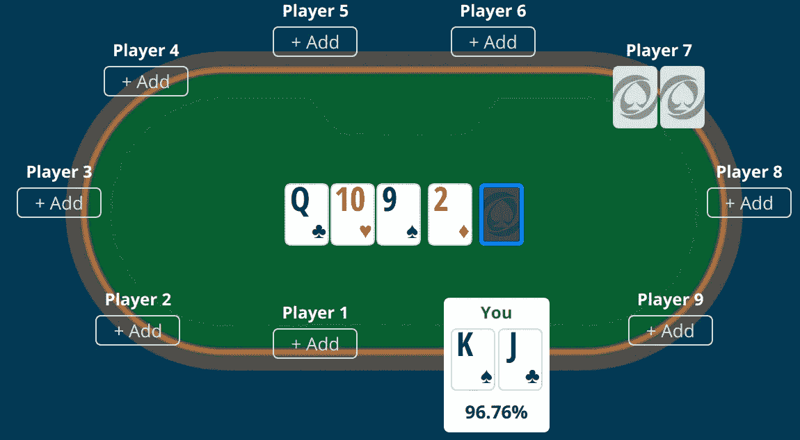
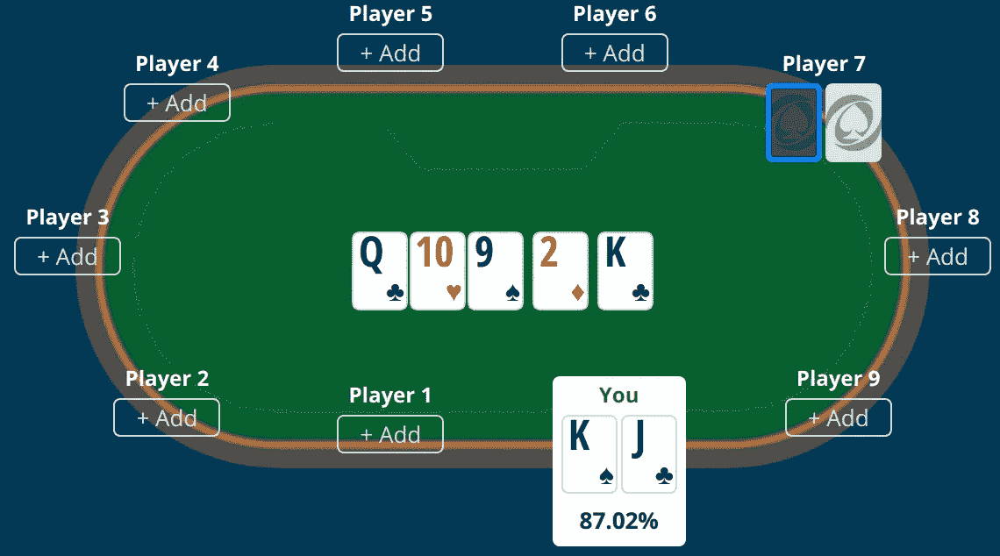
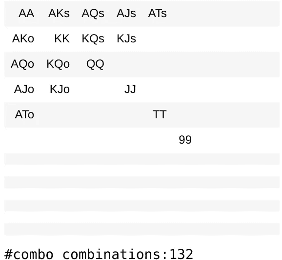
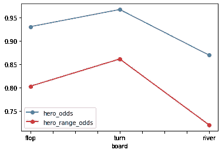

# 如何用 Python 计算扑克概率

> 原文：<https://towardsdatascience.com/how-to-calculate-poker-probabilities-in-python-75238c61421e?source=collection_archive---------4----------------------->

## 将扑克手变成扑克赔率

## 根据拉斯维加斯威尼斯人酒店一夜的真实故事改编



# 介绍

在本文中，我们将展示如何用 Python 表示基本的扑克元素，例如手牌和连击，以及如何计算扑克赔率，即在无限注德州扑克中赢/平/输的可能性。

我们提供了一个基于拉斯维加斯威尼斯人酒店*之夜真实故事的实用分析。*


内华达州拉斯维加斯威尼斯人酒店一日游。

我们将使用包 [**扑克**](https://poker.readthedocs.io/en/latest/index.html) 来代表手牌、连击和射程。我已经从[曾圣耀](https://github.com/ktseng/holdem_calc)扩展了扑克赔率计算器，因此它能够根据范围(一组可能的手牌)以及单手牌计算扑克概率。最终代码可在我的[回购](https://github.com/souzatharsis/holdem_calc)中获得。

# 失败

我拿到了黑桃国王和梅花杰克(♠J ♣).国王)我将使用 **poker.hand** 中的组合牌来构造我的牌。

我不记得翻牌前发生了什么，也不记得我的位置。但是，我记得翻牌前有人加注，翻牌后只剩下两个玩家:我和恶棍。

我们现在是单挑。翻牌圈出现了梅花 q、红心 10 和黑桃 9。是的，我翻到了顺子！

让我们在翻牌圈后计算我的赔率，假设事先不知道恶棍的牌，也就是说，在翻牌圈，我们将计算我的牌赢一对随机的底牌的可能性。

来自 **holdem_calc** 的函数 **calculate_odds_villan** 计算某一手德州扑克获胜的概率。这个概率是通过运行蒙特卡罗方法来近似计算的，或者是通过模拟所有可能的牌局来精确计算的。翻牌后计算确切的赔率很快，所以我们不需要蒙特卡洛近似法。这是我们的机会:

```
{'tie': 0.04138424018164999, 'win': 0.9308440557284221, 'lose': 0.027771704089927955}
```

在这一点上，我感觉非常好。面对一手随机牌，我只有 2.77%的机会输，超过 93%的机会赢。然而，那是乐观的。



翻牌。

考虑到翻牌前有人加注，翻牌圈后只剩下我和大坏蛋，所以大坏蛋很可能有牌，对吗？我们将这一组可能的牌称为*范围*。这是我们根据几个因素做出的推断，包括恶棍的行为、位置、赌注大小等。这个推论导致了一组我们认为恶棍可能有的*组合*。在这一点上，我在想这个恶棍:

*   一对 7 或更好的
*   ace/10 或更好
*   国王/杰克或更好

我们可以使用类别范围来表示此范围，如下所示:



这使得我们的反派组合从总共 51 * 52–1 = 2651 手牌减少到 144 种组合。让我们计算一下我的赔率，假设恶棍的范围。

```
{'tie': 0.11423324150596878, 'win': 0.8030711151923272, 'lose': 0.08269564330170391}
```

根据假设的范围，我的胜算从 93%降到了 80%。但是，我还是有 8.2%的极低输概率。在这一点上，我很舒服。但是我应该打赌吗？我当然希望大反派继续玩下去，不要弃牌。但他在翻牌圈拿到好牌的可能性有多大？让我们看看，如果我们一直玩到最后，他拿到一手牌的几率有多大。

```
High Card: 0.06978879706152433 
Pair: 0.3662891541679421 
Two Pair: 0.23085399449035812 
Three of a Kind: 0.09733700642791548 
Straight: 0.18498112437506367 
Flush: 0.0040608101214161816 
Full House: 0.04205693296602388 
Four of a Kind: 0.004560759106213652 
Straight Flush: 2.0406081012141617e-05 
Royal Flush: 5.101520253035404e-05 
```

如果我们一直玩到河牌圈，反派有很大机会做成一对(36%)甚至两对(23%)。他有很大的概率打顺子(18%)，甚至做成一盘(9.7%)或满堂彩(4%)。由于恶棍很有可能拿到一手合理的牌，所以我决定下大注，大约是底池的 2/3。反派坦克最后跟注。

# 转弯处

转牌圈来了，是方块 2。基本上，这是一张空白牌，也就是说，它不会改变我们的游戏。

```
{'tie': 0.0233201581027668, 'win': 0.9677206851119895, 'lose': 0.008959156785243741}
```

假设恶棍随机抽牌，我现在有 96%的胜算。



转弯。

然而，考虑到我对反面角色的假设范围，我的胜算从翻牌圈的 80%上升到了现在的 86%。我又下了大注，恶棍跟注，河牌来了。

```
{'tie': 0.10123966942148759, 'win': 0.8615702479338843, 'lose': 0.0371900826446281}
```

# 这条河

梅花国王是河(k·♣).)河牌中的国王更有可能让坏人拿到顺子。所以这对我来说是个坏消息。

```
{'tie': 0.11818181818181818, 'win': 0.8696969696969697, 'lose': 0.012121212121212121}
```

现在，我对随机牌的胜算从 96%降到了 87%。但我还是仅以 1.2%的极低概率在输。好吧，坏河也没那么坏，对吧？



这条河。

嗯，还有一个额外的因素。在翻牌圈和河牌圈，恶棍跟了我的大注。他可能有比我想象中更好的东西…对吗？然后我应该调整我的假设范围。

现在，我认为反派不再有 77 或 88 的组合，否则鉴于我的高注，他不会走那么远。我想他可能有一对 99 或更好的牌，可以用 99、10 或 QQ 来凑成一组。他也可能有 JJ 的中对和顺子听牌。或者 KK 和 AA 在转牌圈之前都是顶级对子。我决定保留 a 10 或更好的组合和 Jack 或更好的组合，因为有一种叫做*隐含赔率*的东西。隐含赔率是对如果你出局了，你能从赌注中赢得多少钱的估计。所以反派可能粘粘的等着打和局(他现在可能刚打了？？).因此，我将我的反派的更新范围定义如下:



现在反派的连击从 144 下降到 132。我们来计算一下更新后的赔率。

```
{'tie': 0.12, 'win': 0.72, 'lose': 0.16}
```

我现在有 72%的机会获胜(从 86%下降)，与我们在回合中的范围分析相比，我失败的机会从 3.7%增加到 16%。我决定过牌，坏人全押，下注金额约为底池的 70%。

一个基本和标准的河流策略告诉你以下内容:

1.  用你最弱的牌做河牌诈唬
2.  把你最强的股票作为价值赌注
3.  用中等强度的摊牌牌-值来检查牌，希望能摊牌

```
High Card: 0.0 
Pair: 0.5066666666666667 
Two Pair: 0.08 
Three of a Kind: 0.13333333333333333 
Straight: 0.28 
Flush: 0.0 
Full House: 0.0 
Four of a Kind: 0.0 
Straight Flush: 0.0 
Royal Flush: 0.0
```

根据赔率直方图，我们可以将恶棍可能的牌分为三种类型:

1.  虚张声势:他拿着{大牌，对子}，有 60.66%的几率
2.  中等强度牌:他有 0.8%的机会拿着{两对}
3.  价值下注(最大筹码):他有 41.33%的机会拿着{三条顺子}

反派全押有道理，他的中强度手牌概率太低，无法过牌。因此，我认为他要么是在虚张声势，比如因为错过了听牌，要么他拿着坚果，这是一个价值型下注。这种要么在你持有最少的时候虚张声势，要么在你持有很多的时候价值下注的基本策略有时被称为*两极分化*下注。反派在这里就是这么干的。

回头看看每种类型(诈唬、中等强度牌、价值下注)的概率，我基本上应该至少赢 60.66%的时间，这是一个保守的衡量标准，因为恶棍可能是价值下注 3。但是我应该打电话吗？

这里出现了另一个概念，叫做*底池赔率*。底池赔率是指跟注的价格相对于底池的大小。总而言之，如果我赢得底池的概率高于跟注价格与跟注后底池大小的比值，我应该跟注。让我们做一些数学计算:

1.  胜算≥ 60.66%(保守估计)
2.  买入价格= 0.7 *底池大小
3.  跟注后的底池大小= (1 + 0.7 + 0.7) *底池大小
4.  底池赔率=买入价格/买入后底池大小= 29%

我赢的机会至少是底池赔率的两倍。因此，我开始打电话。结果呢？恶棍翻牌。牌桌一旦安静下来，大家都会发出“哇”的一声，同时盯着牌桌上的王牌杰克，做出一个直过直的局面，让恶棍拿走了我所有的筹码。

# 讨论和结论

在本文中，我展示了如何用 Python 表示基本的扑克元素(例如，手牌和连击)以及如何在假设随机手牌和范围的情况下计算扑克赔率，同时讲述了威尼斯人一夜的真实历史。

我们展示了扑克是多么令人兴奋(而且可能很有趣)。下面，我展示了我的赢率是如何从翻牌到转牌，然后是河牌，假设恶棍随机发牌，以及推断范围。



我们注意到，即使最后的结果对我不利，我还是最有希望赢得这一局对决。这就是为什么扑克玩家说

> 你应该把注意力放在你做出的决定上，而不是你得到的结果上。

当然，本文中的所有分析都假设了一些范围和基本的扑克策略，它们形成了我在玩扑克时的思维模型，这里用 Python 实现。我不是职业扑克玩家，这手牌有很多玩法。我认为我犯了几个错误，例如，在翻牌前加注的情况下，低估了恶棍手握 AJ 的机会。

我很好奇其他人会如何使用这里使用的 Python 框架来分析这手牌。你可以随意选择[回购](https://github.com/souzatharsis/holdem_calc)。