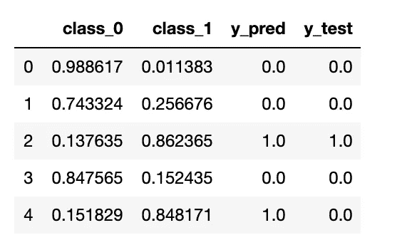
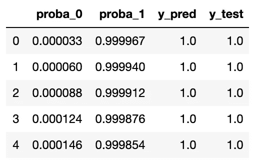
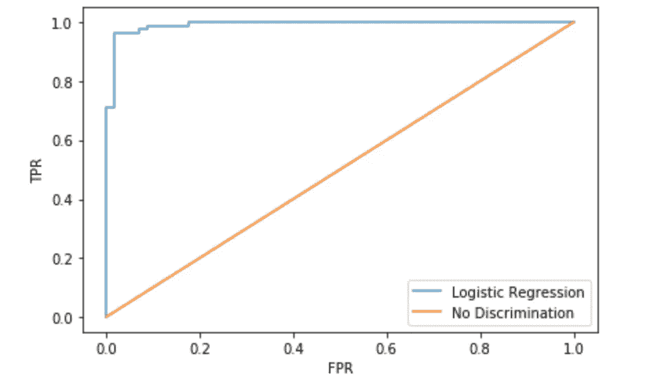
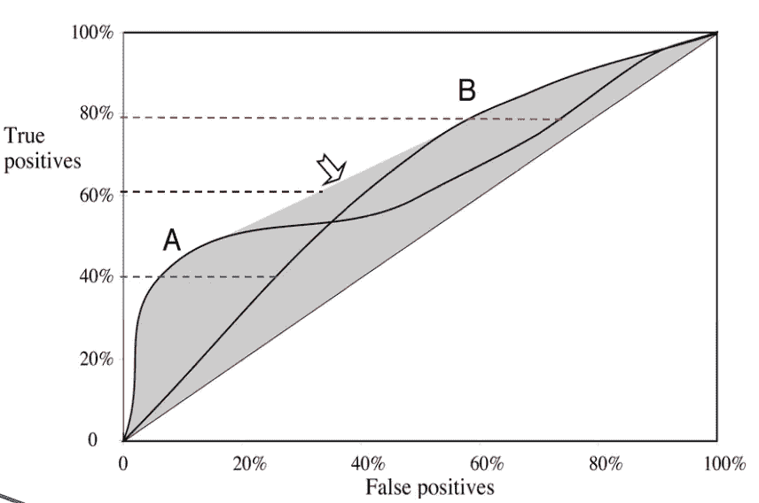
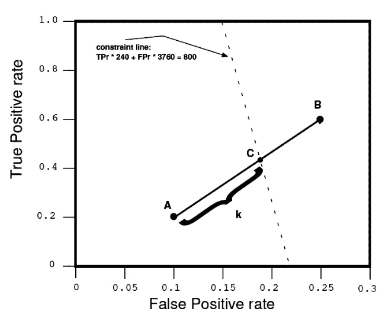

# 如何计算和使用 AUC 分数

> 原文：<https://towardsdatascience.com/how-to-calculate-use-the-auc-score-1fc85c9a8430?source=collection_archive---------5----------------------->

## 从理论到应用

于尔根·舍夫在 [Unsplash](https://unsplash.com?utm_source=medium&utm_medium=referral) 拍摄的照片

受试者操作特征(ROC)曲线是一个图表，允许我们评估二元分类器的性能。对于不平衡数据集，曲线下面积(AUC)分数是根据 ROC 计算的，并且是不平衡数据集的一个非常有用的指标。

在这篇文章中，我们将回顾这个理论，并用 Python 3.x 代码实现它。内容改编自维多利亚大学 [Maryam Shoaran](https://web.uvic.ca/~maryam/) 教授的[数据挖掘(SENG 474)](https://web.uvic.ca/calendar2020-01/CDs/SENG/474.html) 。

# 数据集和模型

对于这个例子，我们将使用 sklearn 上的[乳腺癌威斯康星州数据集](https://scikit-learn.org/stable/modules/generated/sklearn.datasets.load_breast_cancer.html)。在开始对模型评分并进入本帖的主题之前，我们将做以下工作:

*   在培训和测试之间拆分数据
*   特征缩放
*   拟合逻辑回归(LR)模型

# 阈值和预测

Photo by [炫铭](https://unsplash.com/@unspsh?utm_source=medium&utm_medium=referral) on [Unsplash](https://unsplash.com?utm_source=medium&utm_medium=referral)

当我们想到朴素贝叶斯(NB)或 LR 等分类器时，它们会产生实例概率或得分。该评分分类器可以与阈值一起使用，以生成诸如是或否的决定

因此，阈值分类是单调的，我们可以利用这一特性来创建 ROC 空间。关键思想表述如下:

> 相对于给定阈值被分类为阳性的任何实例对于所有较低的**阈值也将被分类为阳性。**

因此，对于 LR，如果分类器概率估计高于阈值，它将产生肯定的类别预测，否则它将产生否定的类别预测。

此外，许多离散分类器，如决策树或规则集，可以通过查看它们内部及其保存的实例统计信息来转换为评分分类器。例如，类比例可以作为一个分数，类决策只是最普遍的类。

在我们的示例中，我们在 LR 分类器上拟合数据，并在下表`df_pred`中总结结果:

# 建立 ROC 空间

照片由[延斯·约翰森](https://unsplash.com/@jens_johnsson?utm_source=medium&utm_medium=referral)在 [Unsplash](https://unsplash.com?utm_source=medium&utm_medium=referral) 上拍摄

ROC 图是从线性扫描创建的。根据上表中的信息，我们实施以下步骤:

*   按降序排列正类的概率
*   向下移动列表(降低阈值)，一次处理一个实例
*   一边走一边计算真阳性率(TPR)和假阳性率(FPR)

回想一下，TPR 和 FPR 的定义如下:

*   TPR =真阳性/所有阳性
*   FPR =假阳性/全部阴性

我们对上一节的数据帧进行了排序，并从中创建了一个名为`df_roc` 的新数据帧，如下所示:

信息排序后，我们运行下面的代码块，返回两个数组:一个用于 TPR，一个用于 FPR。

绘制我们的结果，我们得到熟悉的 ROC 曲线:

AUC 分数就是曲线下的面积，可以用[辛普森法则](https://en.wikipedia.org/wiki/Simpson%27s_rule)计算。AUC 分数越大，我们的分类器就越好。

# 凸包

约翰·吉本斯在 Unsplash 的照片

给定两个分类器 A & B，我们期望两个不同的 ROC 曲线。考虑下面的情节:

资料来源:Maryam [Shoaran](https://web.uvic.ca/~maryam/)

阴影区域被称为[凸包](https://en.wikipedia.org/wiki/Convex_hull)，我们应该总是在位于凸包上边界的点上操作。

例如，如果我们想要在`40%` TPR 下操作，我们选择对应于大约`5%`的 FPR 的分类器 A。或者，如果我们想要覆盖 TPR 的`80%`，我们选择比 a 给出更好的 FPR 的分类器 B

# 组合分类器

Pablo garcía saldaa 在 [Unsplash](https://unsplash.com?utm_source=medium&utm_medium=referral) 拍摄的照片

假设我们是一家保险公司，希望向客户推销保险单。然而，由于预算限制，我们只能接触到`4000`条线索中的`800`个客户。预期回应率是`6%`，它的意思是`240`会说是，`3760`会说不是

假设我们有两个分类器 A & B，使得 A 的最佳点是(FPR=0.1，TPR=0.2)，B 的最佳点是(FPR=0.25，TPR=0.6)。

如果我们的决定基于分类器 A，我们将期望以下候选数目:`0.1*3760 + 0.2*(240) = 424`。对于 B 来说就是:`0.25*3760 + 0.6*(240) = 1084`。

使用分类器 A，我们接触的人太少，而使用分类器 B，我们超出了预算。这个问题的解决方案如下图所示:

资料来源:Maryam [Shoaran](https://web.uvic.ca/~maryam/)

约束线上的点 C (0.18，0.42)位于 A 和 B 之间，它将给出我们期望的性能。我们将`k`计算为 C 位于 A & B 之间的[比例距离](https://en.wikipedia.org/wiki/Proportionality_(mathematics))，我们将其计算为`k=(0.18–0.1)/(0.25–0.1)=.53`。

在实践中，这意味着对于我们希望分类的每个点，遵循此过程以获得 C 的性能:

*   生成一个介于 0 和 1 之间的随机数
*   如果该数字大于 k，则应用分类器 A
*   如果数量小于 k，则应用分类器 B
*   重复下一点

# 结论

与任何数据科学问题一样，一个指标不足以说明全部情况。除了 AUC 之外，准确性、辐射和 f1 分数等指标可以让我们更多地了解分类器的情况。

# 参考

 [## SENG 474

### 数据挖掘导论。数据准备、模型构建和数据挖掘技术，如聚类…

网站 uvic.ca](https://web.uvic.ca/calendar2020-01/CDs/SENG/474.html)  [## sk learn . datasets . load _ breast _ cancer-sci kit-learn 0 . 22 . 1 文档

### sci kit-learn:Python 中的机器学习

scikit-learn.org](https://scikit-learn.org/stable/modules/generated/sklearn.datasets.load_breast_cancer.html)