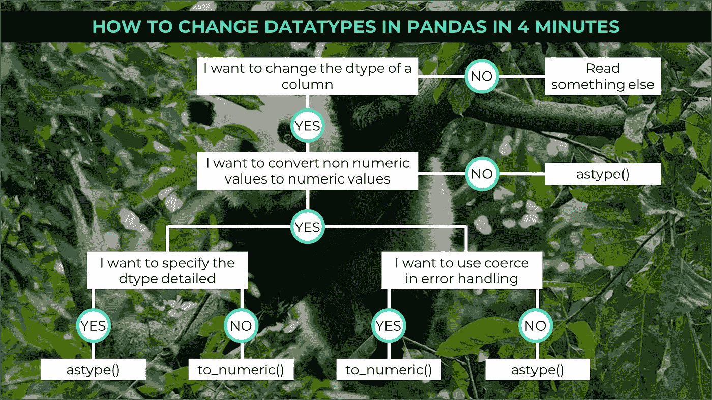

# 如何在 4 分钟内改变熊猫的数据类型

> 原文：<https://towardsdatascience.com/how-to-change-datatypes-in-pandas-in-4-minutes-677addf9a409?source=collection_archive---------10----------------------->

## 在 pandas 中有几个改变数据类型的选项，我将向您展示最常见的选项



当我第一次使用 pandas 时，我一开始并没有对不同的数据类型有一个总体的了解，也没有进一步考虑它们。最迟当你想做第一个算术运算时，你会收到警告和错误信息，所以你必须处理数据类型。我们将看看以下命令:

> 1.to _ numeric()-将非数字类型转换为数字类型(另请参见 to_datetime())
> 
> 2.astype()-将几乎任何数据类型转换为任何其他数据类型

我们将首先看一下用于转换非数字数据的`to_numeric()`。`astype()`是瑞士军刀，几乎可以把任何东西变成任何东西。我们开始吧！

## to_numeric()的使用

我们从创建数据帧开始:

```
>>> amount_list = [1,2,'3',2,'4',5]
>>> cost_list = [1,2,'3',2,'4',5]
>>> date_list = ['2020-01-03', '2020-02-03','2019-12-12','2019-11-14','2020-01-02','2020-02-03']
>>> category_list = ['XZ',1,3,'PT','LM',4]
>>> df = pd.DataFrame({'Date':date_list,'Items': 'Car Saxophone Curler Car Slingshot Duff'.split(),
 'Customer': 'Homer Lisa Marge Lisa Bart Homer'.split(),
 'Amount': amount_list, 'Costs': cost_list, 'Category':category_list})>>> df
         Date      Items Customer Amount Costs Category
0  2020-01-03        Car    Homer      1     1       XZ
1  2020-02-03  Saxophone     Lisa      2     2        1
2  2019-12-12     Curler    Marge      3     3        3
3  2019-11-14        Car     Lisa      2     2       PT
4  2020-01-02  Slingshot     Bart      4     4       LM
5  2020-02-03       Duff    Homer      5     5        4
```

我们的数据框架中有六列。第一列包含**日期**，第二和第三列包含**文本信息**，第四和第五列包含**数字信息**，第六列**字符串和数字**。

让我们检查第四和第五列的数据类型:

```
>>> df.dtypes
Date        object
Items       object
Customer    object
Amount      object
Costs       object
Category    object
dtype: object
```

正如我们所看到的，数据集的每一列都有数据类型 Object。当有文本或文本和非数字值的混合列时，使用此数据类型。我们现在用`pd.to_numeric()`改变金额列的数据类型:

```
>>> pd.to_numeric(df['Amount'])
0 1
1 2
2 3
3 2
4 4
5 5
Name: Amount, dtype: int64
```

所需的列可以简单地作为函数的参数，输出是新生成的数据类型为 int64 的列。如果我们有相应的小数位，Pandas 将输出数据类型 float。重要的是，转换后的列必须用旧列替换，或者必须创建一个新列:

```
>>> df['Amount'] = pd.to_numeric(df['Amount'])
>>> df.dtypes
Date        object
Items       object
Customer    object
Amount       int64
Costs       object
Category    object
dtype: object
```

使用`.apply`方法，也可以一次转换多个列:

```
>>> df[['Amount','Costs']] = df[['Amount','Costs']].apply(pd.to_numeric)
>>> df.dtypes
Date        object
Items       object
Customer    object
Amount       int64
Costs        int64
Category    object
dtype: object
```

很简单，对吧？不过，你可能注意到我们漏掉了最后一栏。这里显然有非数字值，它们也不容易转换。如果我们像以前一样尝试，我们会得到一条错误消息:

```
>>> pd.to_numeric(df['Category'])
Traceback (most recent call last):
  File "pandas\_libs\lib.pyx", line 1897, in pandas._libs.lib.maybe_convert_numeric
ValueError: Unable to parse string "XZ"**During handling of the above exception, another exception occurred: [...]
ValueError: Unable to parse string "XZ" at position 0**
```

`to_numeric()`接受错误论点。我们可以用`corce`和`ignore`。使用强制时，所有不可转换的值都存储为 nan，而使用忽略时，原始值将被保留，这意味着我们的列仍将具有混合数据类型:

```
>>> pd.to_numeric(df['Category'], errors='coerce')

0    NaN
1    1.0
2    3.0
3    NaN
4    NaN
5    4.0
Name: Category, dtype: float64
>>> pd.to_numeric(df['Category'], errors='ignore')

0    XZ
1     1
2     3
3    PT
4    LM
5     4
Name: Category, dtype: object
```

您可能已经注意到，Pandas 会自动选择数值数据类型。在大多数情况下，这当然就足够了，在整数和浮点之间做出决定就足够了。然而，有时我们有非常大的数据集，我们应该优化内存使用。这可以通过向下浇铸来实现:

```
>>> pd.to_numeric(df['Amount'],downcast='integer')

0    1
1    2
2    3
3    2
4    4
5    5
Name: Amount, dtype: int8
```

在这个例子中，熊猫选择了可以容纳所有值的最小整数。

## astype()的使用

使用`astype()`方法。您可以详细指定该列应该转换为哪种数据类型。参数可以简单地附加到列中，Pandas 将尝试转换数据。我们可以再举一次之前的例子:

```
>>> df['Amount'].astype(int)

0    1
1    2
2    3
3    2
4    4
5    5
Name: Amount, dtype: int32
>>> df['Amount'].astype(float)

0    1.0
1    2.0
2    3.0
3    2.0
4    4.0
5    5.0
Name: Amount, dtype: float64df['Amount'].astype(str)

0    1
1    2
2    3
3    2
4    4
5    5
Name: Amount, dtype: object
```

您可以专门定义数据类型:

```
>>> df['Amount'].astype(np.int64)

0    1
1    2
2    3
3    2
4    4
5    5
Name: Amount, dtype: int64
```

同样使用 astype()我们可以像以前一样一次改变几列:

```
>>> df[['Amount','Costs']].astype(int)

   Amount  Costs
0       1      1
1       2      2
2       3      3
3       2      2
4       4      4
5       5      5
```

与`to_numeric`的不同之处在于，我们只能使用`raise`和`ignore`作为错误处理的参数。Raise 是默认选项:显示错误，不执行任何转换。With ignore 错误将被忽略，无法转换的值将保持其原始格式:

```
>>> df['Category'].astype(int, errors='ignore')

0    XZ
1     1
2     3
3    PT
4    LM
5     4
Name: Category, dtype: object
```

## 结论

我们已经看到了如何用 to_numeric()和 astype()将列转换成熊猫。To_numeric()具有更强大的错误处理功能，而 astype()在转换方式上提供了更多的可能性。了解非数值会发生什么并明智地使用错误参数是很重要的。

[如果您喜欢中级和高级数据科学，并且还没有注册，请随时使用我的推荐链接加入社区。](https://medium.com/@droste.benedikt/membership)