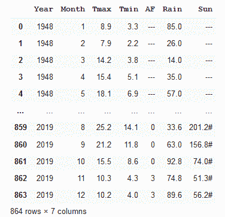

# 如何将半结构化文本转换成熊猫数据框架

> 原文：<https://towardsdatascience.com/how-to-change-semi-structured-text-into-a-pandas-dataframe-ef531d6baab4?source=collection_archive---------17----------------------->

## 使用 Python 和 Pandas，我将面向人类读者的文本文档转换成机器可读的数据帧


左边是半结构化数据，右边是熊猫数据框和图表——图片由作者提供

如今，你在互联网上找到的许多数据都被很好地格式化为 JSON、Excel 文件或 CSV。但有些不是。

我需要一个简单的数据集来说明我在 [Python](/plotting-with-pandas-an-introduction-to-data-visualization-8bd7c0831650) 和 [Julia](/starting-data-visualization-with-the-julia-langauge-and-jupyter-notebooks-289bc9f0cd09) 中关于数据可视化的[文章，并决定使用英国气象局公开发布的天气数据(英国伦敦)。](https://technofile.substack.com/)

问题是，这是一个文本文件，看起来像一个 CSV 文件，但它实际上是为人类读者格式化的。因此，我需要做一些清理和整理，以便能够创建一个熊猫数据框架和绘图。

这篇文章是关于我用来将这个半结构化文本文件转换成 Pandas 数据框架的不同技术，我可以用它来执行数据分析和绘制图表。

毫无疑问，我可以用文本编辑器转换文件——那会非常乏味。但是我认为用 Python 和 Pandas 编程会更有趣。此外，也许更重要的是，编写一个程序来下载和格式化数据意味着我可以自动更新数据，而不需要额外的努力。

有许多问题。首先，是文件的结构。数据被制成表格，但之前有一个自由格式描述，所以这是第一件必须要做的事情。其次，列名在两行中，而不是电子表格文件中常见的一行。然后，尽管它看起来有点像 CSV 文件，但没有分隔符:数据由数量可变的空格分隔。

最后，数据列的数量在文件中发生了部分变化。数据范围从 1948 年到现在，但 2020 年的数据在另一栏中被标注为“临时的”。

然后是数据的形式。早些年，一些数据丢失，丢失的数据用一串破折号表示。其他列有一个“#”附加到本来是数字的数据上。这些都不能被熊猫识别为数字数据。

为了让熊猫理解这些数据，这些问题都必须解决。

## 读取数据

这些数据属于公共领域，由英国气象局以简单的文本文件形式提供。您可以在本文顶部的图片中看到这种格式(以及生成的数据帧和从数据中绘制的图表)。

在 Pandas 中读取 csv 文件非常简单，虽然这不是一个传统的 csv 文件，但我将使用该功能作为起点。

Pandas 的函数 *read_csv* 通常用于读取本地文件或远程文件。不幸的是，这并不适用于 Met Office 文件，因为网站拒绝连接。我不是 100%确定，但我猜想这是因为它不喜欢该函数提供的 HTTP 头中的“用户代理”(用户代理通常是访问网页的浏览器的名称/描述——我不知道，随便，什么 *read_csv* 设置它)。

我不知道有什么机制可以让我更改 *read_csv* 的用户代理，但是有一个相当简单的方法:使用 *requests* 库。(*请求*库允许您设置包括用户代理在内的 HTTP 头。)

使用*请求*您可以将文件下载到一个 Python 文件对象，然后使用 *read_csv* 将其导入一个数据帧。这是代码。

首先导入我们将使用的库:

```
import pandas as pd
import matplotlib.pyplot as plt
import requests
import io
```

(如果您有任何缺失，您必须 *conda* / *pip 安装*它们。)

下面是下载数据的代码:

```
url = 'https://www.metoffice.gov.uk/pub/data/weather/uk/climate/stationdata/heathrowdata.txt'file = io.StringIO(requests.get(url).text)
```

等一下，我不是说要设置用户代理吗？好吧，碰巧的是，*请求*使用的默认设置似乎是 Met Office 网站可以接受的，所以没有任何进一步的调查，我只是使用了上面看到的简单函数调用。*请求*调用获取文件并返回文本。然后由 StringIO 转换成一个文件对象。

## 固定结构

现在我们差不多准备好读取文件了。我需要先看一下原始文件，它显示前 5 行是非结构化的文本。我需要跳过这些行来读取 csv 格式的文件。

接下来的两行是列名。我也决定跳过这些，提供我自己的名字。那些名字是*‘年’，‘月’，‘Tmax’，‘Tmin’，‘AF’，‘雨’，‘太阳’*。前两个很明显，Tmax 和 Tmin 是一个月的最高和最低温度，AF 是一个月中有空气霜冻的天数，Rain 是降雨量的毫米数，Sun 是日照的小时数。

我用这样的变量记录了这些事情:

```
col_names = ('Year','Month','Tmax','Tmin','AF','Rain','Sun')
comment_lines = 5
header = 2
```

这些将在 read_csv 调用中使用。

*read_csv* 需要为该特定作业设置一些其他参数。它需要知道文件中使用的分隔符，默认是逗号(还有什么？)但是这里的分隔符是一个空格字符，事实上不止一个空格字符。所以，我需要告诉熊猫这个(*分隔符=`* )。而且因为字段之间有几个空格，熊猫需要知道忽略这些( *skipinitialspace=True* )。

我需要告诉它应该跳过前几行(*skiprows = comment _ lines*+*header*)，不要把文件中的任何一行当作标题( *header=* None)和列名( *names=col_names* )。

最后，我知道到了 2020 年，列数会发生变化。这通常会引发异常，并且不会返回任何数据帧。但是设置 *error_bad_lines=False* 会抑制错误并忽略坏行。

下面是创建数据帧*天气*的结果代码。

```
weather = pd.read_csv(file,
   skiprows=comment_lines + header,
   header=None,
   names=col_names,
   delimiter=' ',
   skipinitialspace=True,
   error_bad_lines=False)
```

这将产生一个 dataframe，其中包含第一个坏行(有额外列的行)的所有数据。



第一个数据帧—作者提供的图像

个别数据项需要修复，但下一步工作是追加文件的其余部分。这一次，我将使用类似的参数再次读取该文件，但我将找到我刚刚读取的数据帧的长度，并跳过所有这些行。文件的剩余部分包含 8 列，所以我也需要添加一个新的列名。否则对 *read_csv* 的调用与之前类似。

```
file.seek(0)col_names = ('Year','Month','Tmax','Tmin','AF','Rain','Sun', 'Status')
rows_to_skip = comment_lines+header+len(weather)weather2 = pd.read_csv(file,
   skiprows=rows_to_skip,
   header=None,
   names=col_names,
   delimiter=' ',
   skipinitialspace=True,
   error_bad_lines=False)
```

另外，请注意，我必须使用 *seek(0)* 将指针设置回文件的开头，否则将没有任何内容可以读取，因为我们已经到达了文件的末尾。

结果如下:


第二个数据框架—作者提供的图像

类似于其他数据帧，但增加了一列。

下一个技巧是合并两个数据帧，为了正确地完成这个，我必须使它们具有相同的形状。因此，我有一个选择，删除第二个数据帧中的状态栏，或者在第一个数据帧中添加一个。出于本练习的目的，我决定不丢失状态信息，并在第一个。额外的一列称为状态，对于 2020 年的数据，其值为“临时”。因此，我将在第一个数据帧中创建一个状态列，并将所有值设置为“Final”。

```
weather['Status']='Final'
```

现在，我将第二个数据帧追加到第一个数据帧，并添加参数 *ignore_index=True* ，以便不复制索引，而是为组合的数据帧创建一个新的索引。

```
weather = weather.append(weather2, ignore_index=True)
```


组合数据框架—作者提供的图像

## 修复数据类型

现在我们必须处理每一列中的数据。让我们来看看数据类型。

```
weather.dtypes
```


初始数据类型—按作者分类的图像

正如您所看到的，Pandas 已经尽了最大努力来解释数据类型:Tmax、Tmin 和 Rain 被正确地识别为 floats，Status 是一个对象(基本上是一个字符串)。但是 AF 和 Sun 也被解释为字符串，尽管实际上它们应该是数字。这是因为 Sun 和 AF 列中的一些值是字符串'— -'(表示没有数据)或者数字附有#符号。

只有太阳一栏的日照时数带有#符号，所以第一件事就是去掉那一栏中的那个字符。字符串替换完成了这项工作；下面的代码通过用空字符串替换来删除字符。

```
weather['Sun']=weather['Sun'].str.replace('#','')
```

现在，Sun 列中的数字格式正确，但 Pandas 仍然将 Sun 和 AF 列数据视为字符串，因此我们无法将该列读取为数字，因此无法使用该数据绘制图表。

改变数据的表示很简单；我们使用函数 to_numeric 将字符串值转换成数字。使用这个函数，字符串将把字符串“123.4”转换成浮点数 123.4。但是我们要转换的列中的一些值是字符串'— -'，不能合理地解释为数字。

诀窍是将参数*错误*设置为*强制*。这将把任何不能被解释为数字的字符串强制转换为值 *NaN* (不是数字)，这在 Python 中相当于空数值。这正是我们想要的，因为这个数据帧中的字符串“--”表示“没有数据”。

下面是更正这两列中的值的代码。

```
weather['AF']=pd.to_numeric(weather['AF'], errors='coerce')
weather['Sun']=pd.to_numeric(weather['Sun'], errors='coerce')
```

数据帧现在看起来像这样:


调整了数据类型的数据框架—按作者分类的图像

您可以看到 NaN 值，如果我们再次查看数据类型，我们会看到:


新的数据类型—按作者分类的图像

现在所有的数字数据都是浮点值——这正是我们所需要的。

## 使用数据

为了说明这就是我们想要的，这里画了一张 2000 年的降雨量图。

```
weather[weather.Year==2000].plot(x='Month', y='Rain')
```


一个简单的图形——作者的图像

任务完成。

如果你想知道这篇文章顶部的图表是从哪里来的，这是绘制 1950 年、1960 年、1970 年、1980 年、1990 年、2000 年和 2010 年每月最高温度的代码。

```
ax = weather[weather.Year==1950].plot(x='Month', y='Tmax',
   label='1950')
ax = weather[weather.Year==1960].plot(x='Month', y='Tmax', 
   label='1960',ax=ax)
ax = weather[weather.Year==1970].plot(x='Month', y='Tmax',  
   label='1970',ax=ax)
ax = weather[weather.Year==1980].plot(x='Month', y='Tmax', 
   label='1980',ax=ax)
ax = weather[weather.Year==1990].plot(x='Month', y='Tmax', 
   label='1990',ax=ax)
ax = weather[weather.Year==2000].plot(x='Month', y='Tmax', 
   label='2000',ax=ax)
weather[weather.Year==2019].plot(x='Month', y='Tmax', label = 
   '2010', ax=ax, figsize=(15,10));
```


稍微详细一点的图表——作者提供的图片

您不太可能会发现需要对我在这里演示的文本文件进行完全相同的操作，但是我希望您可能会发现我的经验很有用，并且您能够将我在这里使用的技术用于您自己的目的。

感谢阅读，如果你想了解我发表的文章，请考虑在这里订阅我的免费简讯。

*更新:我在这里* *写了一个新的更通用版本的上述程序* [*。*](https://projectcodeed.blogspot.com/2021/02/an-alternative-method-for-changing-semi.html)