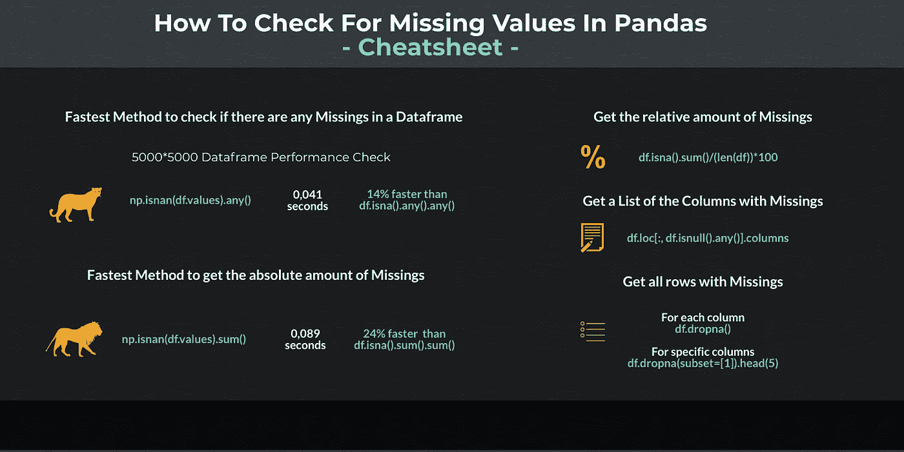

# 如何检查熊猫中缺失的值

> 原文：<https://towardsdatascience.com/how-to-check-for-missing-values-in-pandas-d2749e45a345?source=collection_archive---------11----------------------->

## 如何发现和鉴定熊猫缺失值的介绍



每一位数据科学家在日常工作中都会遇到问题。有必要弄清楚是否有遗漏，在哪里可以找到遗漏，以及遗漏发生的频率。基于此，数据科学家必须决定如何在进一步分析中处理缺失数据。

## 1)寻找失踪人员

寻找缺失通常是数据分析的第一步。在开始时，问题是是否有任何遗漏，如果有，有多少。通常情况下，Pandas 提供了几种方法来确定错过的次数。根据数据帧的大小，性能会有很大的差异。首先，我们简单地期望结果为真或假，以检查是否有任何遗漏:

```
df.isna().any().any()
True
```

这正是我们想要的。现在我们知道有失踪，但执行花了多长时间？

```
%timeit df.isna().any().any()
47.8 ms ± 1.24 ms per loop (mean ± std. dev. of 7 runs, 10 loops each)
```

我们来比较几种方法:

```
%timeit df.isnull().any().any()
46.2 ms ± 899 µs per loop (mean ± std. dev. of 7 runs, 10 loops each)%timeit df.isnull().values.any()
44.6 ms ± 731 µs per loop (mean ± std. dev. of 7 runs, 10 loops each)%timeit df.isna().values.any()
41.8 ms ± 229 µs per loop (mean ± std. dev. of 7 runs, 10 loops each)%timeit np.isnan(df.values).any()
41.3 ms ± 368 µs per loop (mean ± std. dev. of 7 runs, 10 loops each)
```

> 我们试过五种不同的方法，结果都一样。带 Numpy 的版本比最慢的版本快 14 %。

## 2)遗漏的频率(绝对)

我们已经在寻找丢失中看到了性能上的差异。第一步，我们只想知道是否有任何遗漏。现在我们还想知道我们的数据帧中有多少缺失。首先，我们再次看看我们期望的结果:

```
df.isna().sum().sum()
4600660
```

现在我们有了这样的信息，我们具有 2500 万个单元(5000*5000)的数据帧包含大约 460 万个缺失。

让我们看看这里的性能差异是否更大:

```
%timeit df.isna().sum().sum()
117 ms ± 2.15 ms per loop (mean ± std. dev. of 7 runs, 10 loops each)%timeit df.isnull().sum().sum()
115 ms ± 1.41 ms per loop (mean ± std. dev. of 7 runs, 10 loops each)%timeit np.isnan(df.values).sum()
89 ms ± 706 µs per loop (mean ± std. dev. of 7 runs, 10 loops each)
```

> 同样，Numpy 版本是最快的版本。这一次 Numpy 版本大约快了 24 %。

## 3)缺失的频率(相对)

有时，您可能只想确定每列缺失的相对频率，以决定是简单地删除还是替换缺失:

```
df.isna().sum()/(len(df))*100**0       17.98
1       18.90
2       18.66
3       18.02
4       18.70
        ...  
4995    18.88
4996    18.72
4997    18.68
4998    17.76
4999    19.32**
Length: 5000, dtype: float64
```

现在我们有了一个熊猫系列，我们可以随心所欲地处理它:

```
temp = df.isna().sum()/(len(df))*100print("Column with lowest amount of missings contains {} % missings.".format(temp.min()))
print("Column with highest amount of missings contains {} % missings.".format(temp.max()))**Column with lowest amount of missings contains 16.54 % missings.
Column with highest amount of missings contains 20.64 % missings.**
```

> Pandas 还可以用于量化和分析大型数据集中的缺失。

## 4)确定有缺失的列

在某些情况下，确定缺失的列并将它们与其他列分开处理可能会很有用:

```
>>> df.loc[:, df.isnull().any()].columnsInt64Index(**[   0,    1,    2,    3,    4,    5,    6,    7,    8,    9,
            ...
            4990, 4991, 4992, 4993, 4994, 4995, 4996, 4997, 4998, 4999]**,
           dtype='int64', length=5000)
```

在这种情况下，结果当然不那么令人兴奋—我们在每一列中都有一个缺失。

## 5)显示缺失的行

在数据分析的最后一步，您可能希望查看单个案例，以了解为什么会有遗漏以及如何处理它们:

```
>>> df.dropna()
Empty DataFrame
Columns: [0, 1, 2, 3, 4, 5, 6, 7, 8, 9, 10, 11, 12, 13, 14, 15, 16, 17, 18, 19, 20, 21, 22, 23, 24, 25, 26, 27, 28, 29, 30, 31, 32, 33, 34, 35, 36, 37, 38, 39, 40, 41, 42, 43, 44, 45, 46, 47, 48, 49, 50, 51, 52, 53, 54, 55, 56, 57, 58, 59, 60, 61, 62, 63, 64, 65, 66, 67, 68, 69, 70, 71, 72, 73, 74, 75, 76, 77, 78, 79, 80, 81, 82, 83, 84, 85, 86, 87, 88, 89, 90, 91, 92, 93, 94, 95, 96, 97, 98, 99, ...]
Index: []**[0 rows x 5000 columns]**
```

如您所见，我们的数据集中没有每列都包含缺失的行。在下一步中，我们可以指定要检查缺失的列:

```
>>> df.dropna(subset=[1]).head(5)
     0     1     2     3     4     5     ...  4994  4995  4996  4997  4998  4999
10    NaN   0.0   NaN   NaN   NaN   NaN  ...   NaN   NaN   NaN   NaN   NaN   NaN
136   NaN   0.0   NaN   NaN   NaN   NaN  ...   NaN   NaN   NaN   NaN   NaN   NaN
431   NaN   0.0   NaN   NaN   NaN   NaN  ...   NaN   NaN   NaN   NaN   NaN   NaN
435   NaN   0.0   NaN   NaN   NaN   NaN  ...   NaN   NaN   NaN   0.0   NaN   NaN
474   NaN   0.0   NaN   NaN   NaN   NaN  ...   NaN   NaN   NaN   NaN   NaN   NaN**[5 rows x 5000 columns]**
```

> 如果不为 dropna 函数指定列，将得到只包含缺失的行。为了进一步分析，指定一个或多个列作为子集是有意义的。

## 结论

我们已经知道如何确定数据帧中是否有缺失，如果有，有多少。Numpy 变体在每种情况下都是最快的，尽管性能差异只有在数据帧非常大的情况下才变得明显。

我们还看到，我们有无数的可能性以其他方式量化和可视化错过的数量。此外，我们还可以检查个别案例，以决定如何进一步进行分析。

[如果您喜欢中级和高级数据科学，并且还没有注册，请随时使用我的推荐链接加入社区。](https://medium.com/@droste.benedikt/membership)