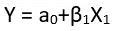
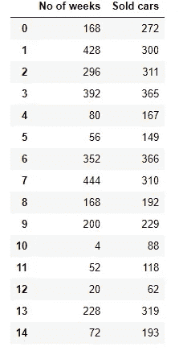
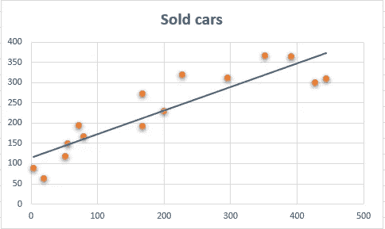
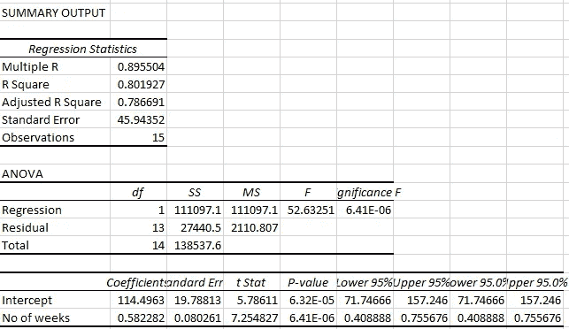
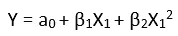
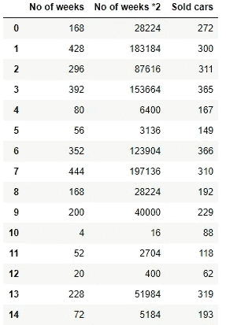
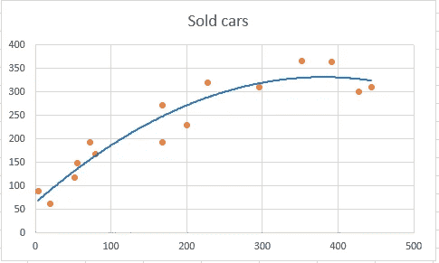
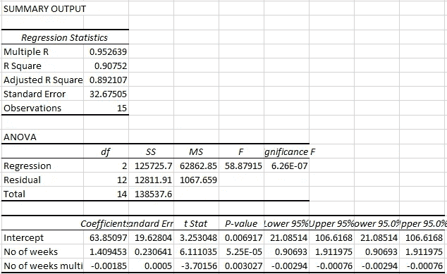
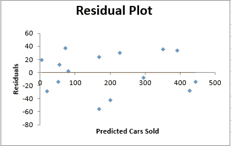
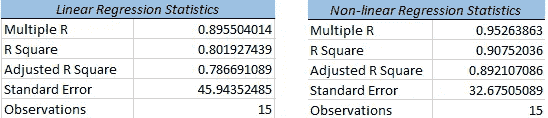

# 如何为数据集选择线性回归还是非线性回归

> 原文：<https://towardsdatascience.com/how-to-choose-between-a-linear-or-nonlinear-regression-for-your-dataset-e58a568e2a15?source=collection_archive---------12----------------------->

## 在线性和非线性回归之间进行选择以获得更好的模型拟合度和精确度的一般准则。

Justin Luebke 在 Unsplash 上拍摄的照片

任何数据科学家都从回归分析开始他们的旅程，因为它构成了所有预测建模的基础，人们可以轻松地联系到幕后的数学和统计数据，这对任何机器学习模型都是必不可少的。还需要了解在数据集上实施的各种不同的回归技术，以获得良好的准确性和最小的错误率 ✌️

在本文中，我们将通过一些图表和总结来确定哪些回归适合我们的数据集。此外，本文假设您事先了解回归概念及其假设。

## 👉**线性回归**

线性回归是一种非常常见的模型，用于对连续数据进行预测分析。下面是线性回归的方程式。

线性回归方程

让我们用下面的样本数据集来看一个例子。

线性回归数据集

根据周数(X 变量),我们需要预测售出的汽车数量。

下面是数据的散点图。

散点图的线性趋势线

从上面的原始散点图中，我们可以看到在末端有一个曲率，并且线性趋势线没有对该数据集进行公正处理。让我们建立一个回归模型并解释结果。

线性回归输出的汇总输出

根据上面的输出，R 平方为 0.80，标准误差为 45。我们也将尝试检查剩余的情节。

## 👉线性模型的残差图

观察值和观察值的平均值之差称为残差。这些对于回归非常重要，因为它们表明了模型在多大程度上解释了数据集中的变化。

残差图形成违反线性回归假设的曲线

从上面可以看出，残差形成了一个曲线模式，这违反了线性模型的一个主要假设。残差应该形成随机性，但不是导致基于一个误差预测另一个误差的任何类型的模式。因此，我们可以确定线性模型不适合我们的数据集。

## 👉非线性回归

多项式回归是线性回归的扩展，它拟合目标变量和独立变量之间的曲线关系。

多项式回归增加了额外的独立变量，这些变量是原始变量的幂。这里，我们将度取为 2，因此建立了一个二次回归模型。

非线性回归方程

下面是为二次回归模型创建的数据集。添加了一个额外的独立变量，即周数*2

为二次回归模型创建周数*2

让我们做一个散点图，并绘制一个多项式趋势线，以检查如何最好地拟合曲线。

散点图上的多项式趋势线

从上面可以看出，多项式趋势线试图比直线更好地拟合曲率。

让我们为之前创建的非线性数据集建立一个模型。

非线性回归模型的摘要输出

从上面的输出中，我们可以看到总体 R 平方值增加了 0.90，标准误差最小。

## 👉**二次模型的残差图**

具有随机误差的二次模型的残差图

从上面的图中，我们可以看到残差中存在随机性，这解释了方差，因此满足回归模型的假设。

比较线性和非线性回归输出

# 摘要

在本文中，我们了解了非线性回归模型如何更好地适用于由非线性回归输出和残差图确定的数据集。

在建立任何回归模型之前，查看散点图并检查回归线周围观察值的紧密拟合是非常重要的。此外，残差图在决策中也起着至关重要的作用。但是，应该记住，向非线性回归中添加更多的独立变量会使模型过度拟合。因此，在向非线性回归模型中添加更多变量时，需要格外小心。

感谢阅读，快乐学习！🙂