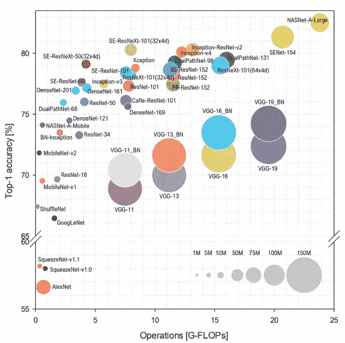
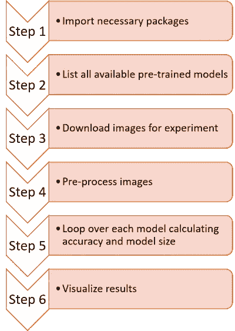
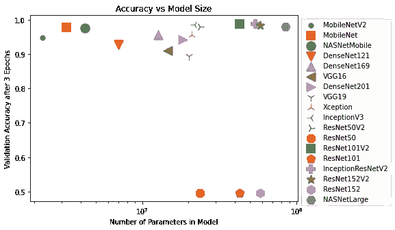

# 如何选择最佳的 Keras 预训练模型进行图像分类

> 原文：<https://towardsdatascience.com/how-to-choose-the-best-keras-pre-trained-model-for-image-classification-b850ca4428d4?source=collection_archive---------6----------------------->

## 有疑问的时候，用数据来决定！


选择过多。由[m . W .](https://unsplash.com/@mmw189?utm_source=medium&utm_medium=referral)在 [Unsplash](https://unsplash.com?utm_source=medium&utm_medium=referral) 拍摄的照片

决定在你的深度学习任务中使用哪个预先训练的模型，与经典的两难问题处于相同的水平，比如在网飞上看什么电影，在超市买什么麦片(附注:买糖最少、纤维含量最高的那种)。这篇文章将使用 Python 中的数据驱动方法来为`cats_vs_dogs` 数据集找出最佳的 Keras 预训练模型。这篇文章和提供的代码也将帮助您轻松地为您的问题数据集选择最佳的预训练模型。

# 目录

1.  [背景](#0014)
2.  [选择型号的标准](#f6be)
3.  [代码](#e84f)
4.  [资源](#2a6b)

# 背景

迁移学习是机器学习中的一种技术，我们可以采用在一项任务中开发的模型，并将其作为其他类似但不同的任务的起点。迁移学习在深度学习中非常流行，因为知识从一个“父”模型“迁移”到“子”模型意味着“子”模型可以用比“父”模型小得多的数据集训练到高精度。你可以在这个优秀的[【中帖】](/a-comprehensive-hands-on-guide-to-transfer-learning-with-real-world-applications-in-deep-learning-212bf3b2f27a)找到更多关于迁移学习的细节

像 TensorFlow 和 Pytorch 这样的高级深度学习框架通过在包本身中包含几个预先训练的模型，使得利用迁移学习的力量变得非常容易。例如，[【tensor flow Keras API】](https://www.tensorflow.org/api_docs/python/tf/keras)包含了 18 个在 [["ImageNet"]](https://en.wikipedia.org/wiki/ImageNet) 数据集上预训练的高度先进的模型架构。你可以把“ImageNet”想象成图像分类数据集的 SAT。

今天的大多数图像分类深度学习任务将从下载这 18 个预训练模型中的一个开始，稍微修改模型以适应手头的任务，并且仅训练自定义修改，同时冻结预训练模型中的层。由于“ImageNet”收集了许多真实世界的图像，因此这种方法在真实世界的图像分类任务中给出了非常高的准确度。

然而，选择使用 18 个预训练模型中的哪一个并不总是一门精确的科学。许多开发人员坚持他们熟悉的模型，并在过去给了他们很好的结果。作为一名数据科学家，我想知道是否有更好的、数据驱动的方法来选择预先训练的模型，不受个人偏见的影响。确实有！这篇文章的其余部分讨论了我的过程，代码可以直接用于你的项目。

# 选择模型的标准

一般来说，在行业中执行任何机器学习任务时，都有两个相互竞争的标准:

1.  模型的准确性:越高越好
2.  模型训练和预测的速度:越快越好

这两个标准非常简单。我们想要在验证数据上给我们最高准确度的模型，因为它可以做出有用的预测。我们还希望模型尽可能快地训练和预测，因为在生产中，我们可能需要每秒提供数百或数千个预测。

够简单吗？嗯，就像生活中的所有事情一样，我们不能鱼与熊掌兼得(因此有了这个标题图像)！一般来说，为了获得更高的精度，我们需要使用“更深”或更大的模型。但是更大的模型有更多的参数，这使得它执行起来更慢。我们可以从下图[【参考】](https://arxiv.org/pdf/1810.00736.pdf)中看到模型的精度和规模/运算次数之间的权衡。



图像分类精度与模型大小/运算次数的关系。一般来说，较大的模型往往具有较高的精度，但需要更多的运算，这使得它们速度较慢。[来源](https://arxiv.org/pdf/1810.00736.pdf)

因此，这是我们需要取得的平衡。对于行业中的大多数深度学习部署，我们选择最小的模型，为我们提供足够好的准确性。因此，我们需要在许多可用的模型中进行试验，以选择满足这些标准的模型。

另一方面，如果您只关心实现最高的精度，而不考虑对速度的影响，那么您的方法可以是使用集成技术来组合所有这些模型！事实上，在学术界和 ML 竞赛中，ensembling 非常受欢迎。

# 密码

我的方法很简单，如下图所示。我们将使用 Python 找到 Keras 中所有预训练的模型，然后逐个循环。在本文中，我们将在 tensor flow[【cats _ vs _ dogs】](https://www.tensorflow.org/datasets/catalog/cats_vs_dogs)数据集上训练模型。您可以用任何其他数据集替换它，包括您自己的自定义数据集。



选择最佳预训练 Keras 模型的步骤

## 第一步

第一步是导入必要的包。如果您缺少这些包，您可以使用`pip install <package-name>`来安装它们。我们还会为后续的模型训练设置一个`batch_size`。由于我使用的是低成本的 GPU，我将只使用 32 的小批量。

## 第二步

通过列出`tf.keras.applications`中的所有函数，自动从 Keras 获得所有可用预训练模型的列表。由于每个模型都是通过从`tf.keras.applications`调用一个函数来实例化的，当我们使用`inspect.isfunction`列出这个模块中的所有函数时，我们得到了所有模型的列表。截至本文撰写时，在[【tensor flow 2.2】](https://www.tensorflow.org/versions/r2.2/api_docs/python/tf/keras/applications)中，我们可以使用的模型共有 18 个。

您可以通过手动将元素添加到`model_dictionary`以及遵循语法`model_dictionary["new_model_name"] = new_model_function()`来将任何其他定制预训练模型添加到实验中，其中`new_model_function()`应该返回定制预训练模型，而不返回最终输出`Dense`层。如果您不想更改下面的任何其他代码，模型的输入形状应该是(224，224，3)。

## 第三步

下载一些图片来运行实验。当您为您的用例运行实验时，您应该修改这个步骤来加载您的数据。

输出:

```
Num train images: 16283         
Num validation images: 6979         
Num classes: 2         
Num iterations per epoch: 508
```

## 第四步

预处理输入图像。一些预先训练的模型要求图像的大小为(224，224，3)，而一些要求为(331，331，3)。我们使用这个步骤来准备两种尺寸的图像，并通过将每个像素除以 255 来归一化它们。我们还*一次性编码*标签，这样我们就可以在训练中使用`categorical_crossentropy` loss。

## 第五步

通过下载没有输出层的预训练模型来循环每个模型，并冻结权重。然后，我们构建一个空的`Sequential`模型，并首先向其中添加预训练的模型。然后，我们添加一个带有`softmax`激活的单一输出密集层，并使用`categorical_crossentropy`损失对其进行编译。最后，我们通过为`3 epochs`调用`model.fit`来训练模型。我们将参数的数量(模型的大小)和每个模型的最终精度记录到一个字典中，以可视化结果。如果在模型下载`AttributeError: 'str' object has no attribute 'decode'`过程中出现以下错误，请安装一个较低版本的`h5py`[【source】](https://github.com/tensorflow/tensorflow/issues/44467)

```
pip uninstall h5py
pip install h5py<'3.0.0'
```

在谷歌云平台上的一个带有一个`NVIDIA Tesla T4` GPU 的`n1-standard-4` (4 个 vCPUs，15 GB RAM)上，整个过程需要大约 3 个小时。

## 第六步

让我们通过将其转换为数据帧并按`num_model_params`的升序排序来可视化结果，因为我们的目标是选择具有足够精度的最小模型。在这个例子中，`MobileNet`模型已经提供了`97%`精度；因此，我们可以直接使用它。`MobileNetV2`和`NASNetMobile`是我们可以考虑进行微调实验的另外两个模型。如果我们选择的模型的准确性仍然不足以完成我们的任务，我们可以通过进一步微调这些选择的模型、添加数据扩充等来进行试验。我们将在一个已经被证明接近我们要求的模型上应用典型的深度学习模型改进实验。

输出:

```
| model_name        | num_model_params | validation_accuracy |
|-------------------|------------------|---------------------|
| MobileNetV2       | 2257984          | 0.9475569725036621  |
| MobileNet         | 3228864          | 0.9773606657981873  |
| NASNetMobile      | 4269716          | 0.9753546118736267  |
| DenseNet121       | 7037504          | 0.9273535013198853  |
| DenseNet169       | 12642880         | 0.95572429895401    |
| VGG16             | 14714688         | 0.9107322096824646  |
| DenseNet201       | 18321984         | 0.9419687390327454  |
| VGG19             | 20024384         | 0.8948273658752441  |
| Xception          | 20861480         | 0.9550078511238098  |
| InceptionV3       | 21802784         | 0.9859578609466553  |
| ResNet50V2        | 23564800         | 0.9802263975143433  |
| ResNet50          | 23587712         | 0.49620288610458374 |
| ResNet101V2       | 42626560         | 0.9878206253051758  |
| ResNet101         | 42658176         | 0.49620288610458374 |
| InceptionResNetV2 | 54336736         | 0.9885370135307312  |
| ResNet152V2       | 58331648         | 0.9840951561927795  |
| ResNet152         | 58370944         | 0.49620288610458374 |
| NASNetLarge       | 84916818         | 0.9795099496841431  |
```

标绘结果



模型精度与参数数量的结果

# 结论

总之，我介绍了一种数据驱动的方法，从 Tensorflow Keras API 中的一组预训练模型中选择最合适的模型。在大多数工业应用中，我们会选择参数数量最少的模型，为进一步研究提供足够好的精度。我们可以通过在[ [步骤 2](#e2e0) ]中手动将项目添加到`model_dictionary`中，轻松扩展这种方法，以包括 Keras 未提供的其他型号。

最后，广泛的实验和数据驱动的决策是所有机器学习应用程序成功的关键。我希望这篇文章能激发你思考如何在日常工作中做出更多数据驱动的决策。

# 资源

*   你可以在[【GitHub】](https://github.com/stephenleo/keras-model-selection/blob/main/keras_model_selection.ipynb)找到这篇文章中用到的所有代码。
*   您也可以使用 Google Colab 直接运行代码，无需任何设置。只需记得进入编辑→笔记本设置，选择一个`GPU`硬件加速器:[【在 Colab 中打开】](https://colab.research.google.com/github/stephenleo/keras-model-selection/blob/main/keras_model_selection.ipynb)

感谢您的阅读！

编辑:更新了 GitHub gists 的代码片段