# 如何选择最佳线性回归模型——初学者综合指南

> 原文：<https://towardsdatascience.com/how-to-choose-the-best-linear-regression-model-a-comprehensive-guide-for-beginners-754480768467?source=collection_archive---------11----------------------->

由[元件 5 数码](https://unsplash.com/@element5digital)在 [Unsplash](https://unsplash.com/photos/OyCl7Y4y0Bk) 拍摄的图像

如果你是数据科学或统计学的初学者，有一些线性回归的背景，并且正在寻找评估你的模型的方法，那么这个指南可能适合你。

本文将讨论以下用于选择“最佳”线性回归模型的指标:R 平方(R)、平均绝对误差(MAE)、均方误差(MSE)、均方根误差(RMSE)、赤池信息标准(AIC)以及考虑偏差的修正变量。将假定您了解线性回归。我希望你喜欢读这篇文章，觉得它有用，并学到一些新东西:)

## **R 平方(R )**

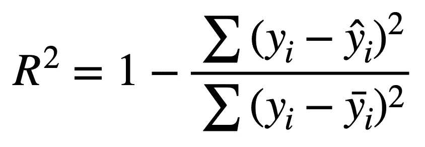

y =因变量值，y_hat =模型预测值，y _ bar =的平均值

R 值，也称为**决定系数，**告诉我们用 y_hat 表示的预测数据，**解释了用 y 表示的**实际数据。换句话说，它代表了拟合的强度，但是它并没有说模型本身的任何事情-它没有告诉你模型是否好，你选择的数据是否有偏差，或者你是否选择了正确的建模方法。我将用下面的例子来说明这一点。

R 值的范围从 0 到 1，较高的值表示强拟合，较低的值表示弱拟合。通常，大家都同意:

> R < 0.5 → Weak fit
> 
> 0.5 ≤ R² ≤ 0.8 → Moderate fit
> 
> R² > 0.8 →强配合

**注意:理论上 R < 0 是可能的，但是这些会出现在*明显*可怕的配合中，因此本文不会讨论。**

你可能会想，如果 R 不代表模型有多好，那么“拟合强度”到底是什么意思？这意味着，**平均而言**，你的预测值(y_hat)与你的实际数据(y)偏差不大。下面的例子将说明这一点。

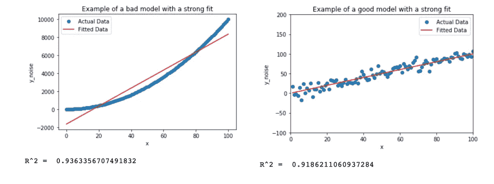

(左)线性预测的二次模型，(右)线性预测的线性模型

上面的两个模型都预测了给出“强”拟合的线，因为它们具有高 R 值，并且还捕捉了实际数据点与拟合线的小偏差。然而，很明显，尽管左边的模型具有更高的 R 值，但是右边的模型是更好的模型。事实上，最左边的模型很糟糕，因为它没有捕捉到数据的曲率。**因此，高 R 并不意味着拟合良好或合适，它只是意味着实际点与拟合点的偏差平均来说很小。**

有时，一个模型可能有一个低 R 值，但实际上是一个很好的数据模型。考虑下面的例子:

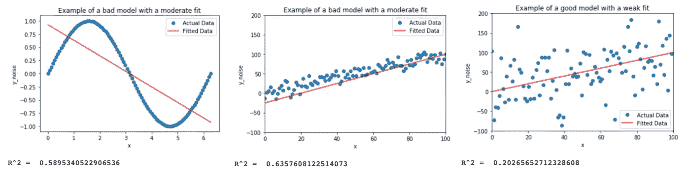

(左)用直线拟合正弦曲线，(中)用有小噪声的直线拟合故意偏斜的直线，(右)用有大噪声的直线拟合正确的直线

与前面的例子一样，左边的模型非常不适合，但“适合度”适中，因此与右边的模型相比，仅根据 R 值，人们可能会认为最左边的模型更好。如图所示，这是错误的。中间款呢？它的 R 是右边模型的三倍，而且，从视觉上看，似乎并不完全离谱。因此，有人可能会得出这样的结论:中间模式比正确模式好得多？

不对。

中间和右边模型中的数据点基于同一条线， **y=x+e** ，其中 **e** 是正态分布中随机产生的误差。它们之间的唯一区别是，误差幅度在最右边的图中被放大了。中间的模型比右边的**更差**，因为我故意扭曲了它，所以它的等式是这样的:

**y_hat = 1.25*x-25**

然而，右边的模型是正确的:它是 **y_hat = x** ，与生成数据点的线完全相同。为了直观地证实这一点，您可以看到中间模型的偏斜，而右边的模型似乎位于数据点的正中心，正如您所料。**因此，具有低 R 的模型仍然可以正确地预测数据的形状，但是会遭受数据的较大变化。**

尽管如此，如果问题的本质是预测值，那么中间模型可能会由于数据点的较低变化而表现得更好，但是这并不一定使它成为更好的模型。

**R 总结**

> R 度量给出了模型与您的数据拟合程度的指示，但无法解释您的模型是否良好

**优点:**

1.  给出模型拟合程度的指示

**缺点:**

1.  向模型中添加预测值可能会由于偶然性而增加 R 的值，使结果具有误导性(参见**调整后的 R**
2.  向模型中添加预测值会导致“过度拟合”，即模型试图预测数据中的“噪声”。这降低了它在以前从未见过的“新”数据上表现更好的能力。
3.  r 对于非线性模型没有意义

## 调整后的 R (Adj. R )

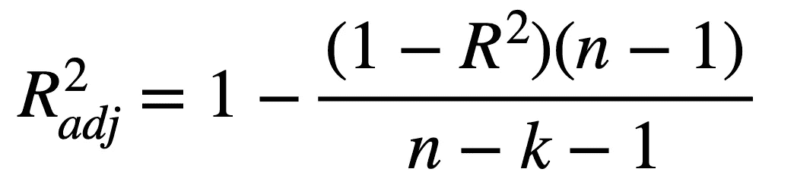

n =样本中数据点的数量，k =包括模型中变量的数量，不包括常数项(截距)

如前所述，**即使模型的性能没有改善，向模型添加预测值也会导致 R 增加。**对此的解决方案是使用调整后的 R 而不是 R 来衡量模型的表现。

从上式可以看出，多了两个变量: ***n*** 和 ***k*** *。*前者代表模型中数据点的数量，后者代表模型中变量的数量，不包括常数项。

例如，如果模型的形式为:

**y_hat =a0 + a1*x1 + a2*x2**

然后你有 ***k = 2*** *，*既然你有两个预测器， **a1** 和 **a2。**

**那么为什么调整后的 R 平方比 R 平方好呢？**

考虑以下两种模型:

**y_hat = x**

**y _ hat = A0+a1 * x1+a2 * x+a3 * x+a4*x⁴⁴+a5*x⁵⁵+a6*x⁶⁶+a7*x⁷⁷**

同样的数据，基于 **y=x+e** 被模型预测，结果如下所示:

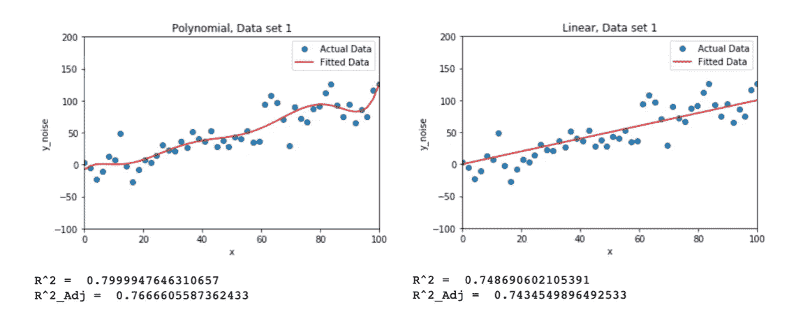

如图所示，左边模型(有更多项)的 R 高于右边模型，这表明它是一个更好的模型。我们知道这不是真的，因为数据是建立在 **y=x+e** 之上的。

当我们检查调整后的 R 值时，我们看到最右侧模型的 R 值基本保持不变，而最左侧模型的 R 值发生了显著变化，这表明增加项数会对 R 值产生影响。在这种特殊情况下，人们可能会选择最左边的模型，因为即使考虑了额外的项，它也具有更高的调整后 R。我们知道这是错误的，它可能只是随机误差的结果。**从本文第一部分我们也知道，R 越高并不代表型号越好！**

我们可以通过使用相同的模型拟合“新数据集”来进一步检验这一点，从而消除“训练偏差”。

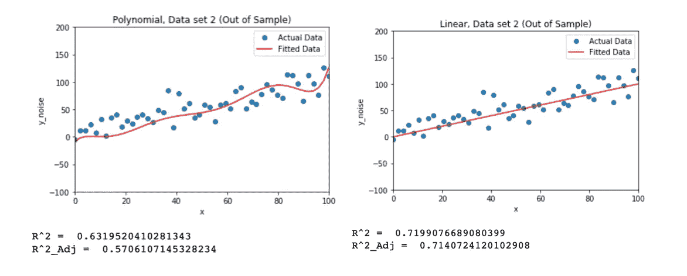

我们可以看到，线性模型的拟合度明显优于多项式模型(左)，R 值和调整后的 R 值与之前的数据集相当。然而，多项式模型的表现很好，因为它“适合”误差和噪声，表现非常糟糕，当根据变量的数量进行调整时，R 甚至下降更多。

与往常一样，对于 R 和 Adj. R，绘制结果模型是一种很好的做法，以直观地检查结果是否有意义，如果结果没有意义，添加额外的数据点或使用不同的“测试”数据集可能会提供更多的洞察力。

**调整后的 R 汇总**

> 调整后的 R 在 R 的基础上有所改进，它让我们了解模型的 R 值是因为拟合度好，还是因为它的复杂性

**优点:**

1.  对过度拟合问题有了更深入的了解
2.  降低随机性对 R 值的影响(即，如果由于随机性而导致 R 值较高，调整后的 R 将会反映这一点)

**缺点:**

1.  仍然存在与 R 相关的其他问题

## **平均绝对误差**

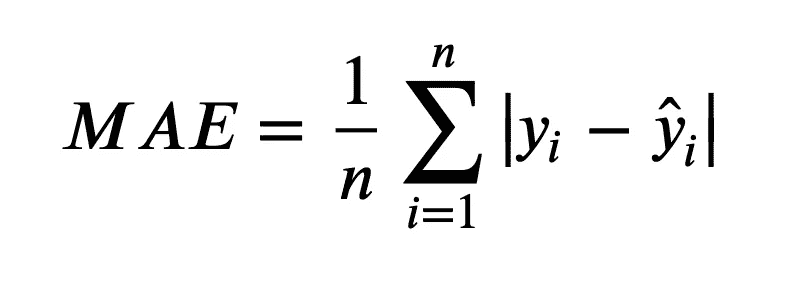

n =点数，y =实际点，y_hat =预测点

MAE 是所有误差幅度的总和除以点数，因此本质上是平均误差。

因此，MAE 越低，模型中的误差越小。

## **均方误差**

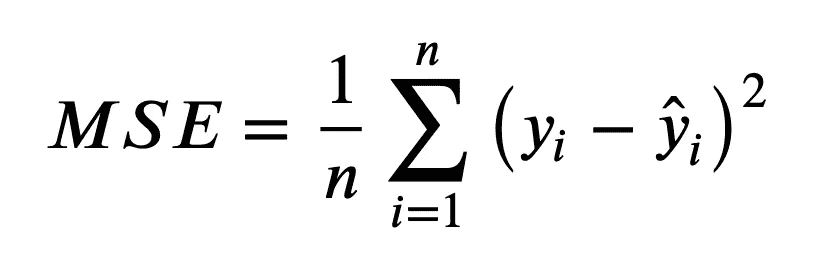

n =点数，y =实际点，y_hat =预测点

MSE 是所有误差的**平方和**除以点数。请注意，由于在每个实例中，误差实际上都是平方的，因此不能直接与 MAE 进行比较，因为它总是更高阶的。

因此，与 MAE 一样，MSE 越低，模型中的误差越小。

## **均方根误差(RMSE)**

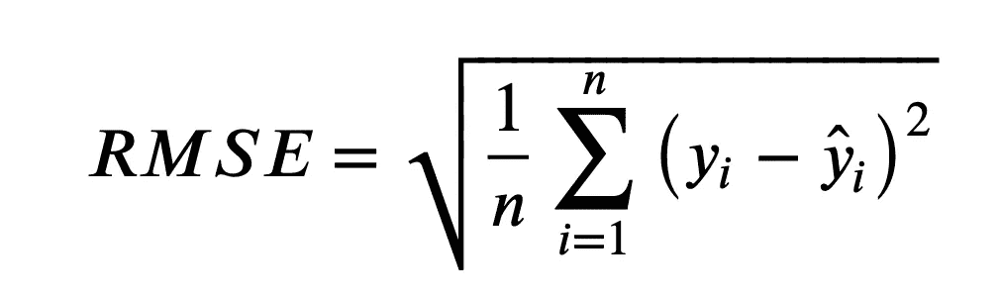

n =点数，y =实际点，y_hat =预测点

RMSE 是均方差的平方根。这在某种程度上是一个更有用的度量，现在因为梅和 RMSE 都有相同的误差“阶”,他们可以互相比较。

与 MAE 和 MSE 一样，较低的 MSAE →较低的误差。

**那么，这在实践中是怎样的呢？**

我这里有两个例子。

第一个非常简单，我已经创建了一条线 **y_hat = 2x +5** ，还有一条带有噪声，所以 **y = 2x + 5 + e.**

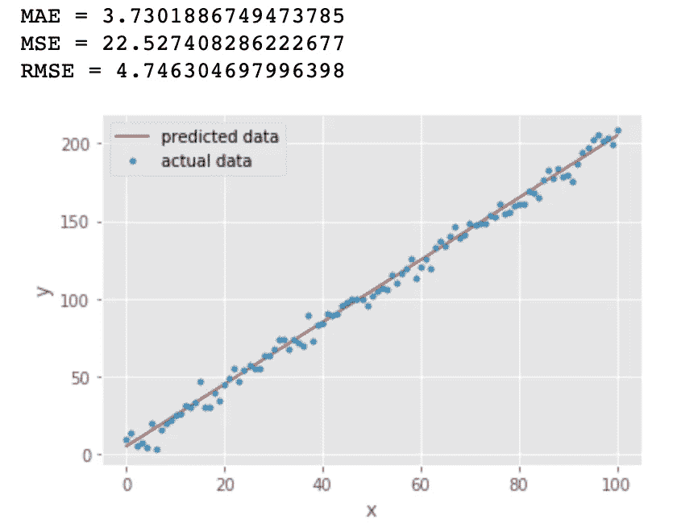

在这里，我们可以看到平均寿命和 RMSE 彼此非常接近，都表明该模型具有相当低的误差(记住，平均寿命或 RMSE 越低，误差越小！).

但是你可能会问，梅和 RMSE 有什么不同？MAE 为什么更低？

这个是有答案的。

当我们看梅和 RMSE 的方程时，我们注意到 RMSE 有一个平方项…因此:大的误差将被平方，因此将增加 RMSE 的值。因此，我们可以得出结论，RMSE 更善于捕捉数据中的大误差，而 MAE 只是给出平均误差。**由于 RMSE 在取平均值之前也对平方和进行求和，因此它必然会高于平均误差。**

要在示例中看到这一点，请考虑以下情况:

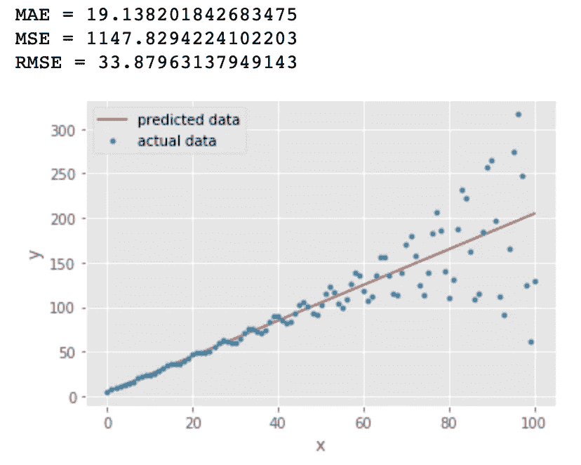

橙色线代表我之前描述的等式**y _ hat = 2x+5**……然而‘y’现在的形式是:

**y = y + sin(x)*exp(x/20) + e**

其中 **exp()** 表示指数函数(因此我们看到点的偏差增加。

如您所见，RMSE 几乎是 MAE 值的两倍，因为它捕捉到了误差的“大”值(尤其是从 **x = 80** 开始的误差)。

**所以你可能会想:总是使用 RMSE 不是更好吗？**

号码

MAE 确实有一些优势。

首先，我们可能希望将小错误视为大错误。例如，假设您正在拟合除了一个大的异常数据点之外，一般没有大误差的数据。**如果你选择基于最小 RMSE 的线性回归模型，你的模型可能会过拟合，因为你会*尝试*捕捉异常。**

在这种情况下，假设您的数据通常是一致的，几乎没有明显的大误差，选择 MAE 最低的回归模型可能更合适。

除此之外，比较不同样本大小的模型的 RMSE 变得有点问题和不一致。

**MAE、MSE 和 RMSE 总结:**

> MAE 是拟合的平均误差；MSE 是误差平方的平均值；RMSE 是均方差的平方根，用于比较。RMSE 惩罚重大失误。

**梅/ RMSE 的优点:**

1.  两者都捕捉到了模型中的“错误”
2.  MAE 是“真正的”平均值，因为它是平均误差的度量；RMSE 稍微有点微妙，因为它被误差大小等因素扭曲了

**美/ RMSE 的缺点:**

1.  MAE 不会拾取非常大的错误；RMSE 会拾取较大的误差，因此对可能不想捕捉的异常值很敏感
2.  两个*都倾向于*随着模型复杂度的增加而增加(即容易过度拟合)，类似于 R 随着复杂度的增加而增加

请注意，也有这些修正的变体，例如 MSEc，其中 c 代表修正的。该等式的不同之处仅在于，平均值不再是 **1/ *n*** ，而是**1/(*n*+*k*+1)，**其中 ***k*** 是预测数(不包括截距)。这类似于调整后的 R，因为它惩罚了模型的复杂程度。

## **赤池的信息准则(AIC)**

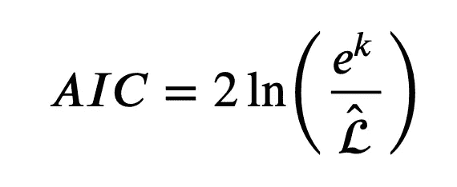

k =预测值的数量(包括系数！)，L =最大对数似然

AIC 有点难以解释:它是对数据符合模型的程度和模型的复杂程度的一种度量。因此，在某种程度上，它是 R 和调整后的 R 的混合。它所做的是**因其复杂性而惩罚**一个模型，但**因其符合数据而奖励**。

这个值几乎总是负的。

从本质上讲，**降低**AIC(即更负)，而**更好**模型如何**拟合**数据，以及它如何**避免** overfitting⁴(记住，复杂性→过度拟合，所以如果 AIC 惩罚复杂性，那么它惩罚过度拟合)。

让我们看一个例子。

回想一下我们用于调整 R 的例子，我们有一个非常复杂的模型来模拟带噪声的线性线。

我重新运行了这个模型，这次还添加了一个 AIC 分数:让我们看看结果。

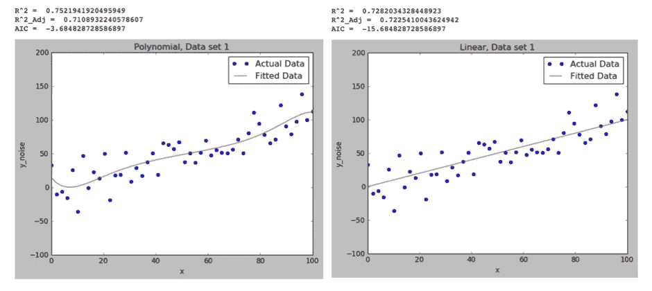

我们可以在这里看到很多东西，这也是很好的复习。

左图的 R 比右图的高，但是我们**知道**最右边的是正确的。对于更复杂的模型，这是 R 变大的一个征兆。

在这种情况下，我们调整后的 R 表明简单模型更好(请记住，由于随机性，情况并不总是如此，但我们仍然可以通过测量调整后的 R 和 R 之间的差异来了解模型有多好→更简单的模型损失更低)

我们也有 AIC 来帮助我们:AIC 越消极，就越适合，越不会过度适合。因此，仅从 AIC 参数，我们可以得出结论，越简单的模型越好(也就是说，记得总是勾画你的情节，并试图推理它们，不要只相信数字！).

让我们看看模型对测试数据的表现:

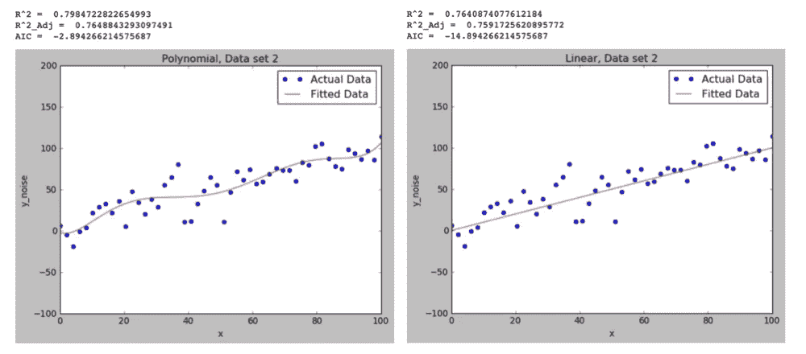

正如预测的那样，更复杂模型的 R 更高。这里我们还注意到，调整后的 R 也更高。我们也有精彩的 AIC，这再次表明，越简单的模式越好。

**AIC 总结:**

> AIC 越低，模型在拟合度和避免过度拟合方面就越好。

**优点:**

1.  AIC 是模型质量的一个很好的指标，因为它既解释了拟合，也解释了模型过拟合的程度

**缺点:**

1.  从数学上讲，AIC 只对无限数据集有效。在计算上，误差可以通过具有非常大的样本大小来抵消。对于较小的样品，必须添加校正系数。

## **结论:**

我希望您已经了解了不同的参数、它们的使用案例以及它们是如何具有欺骗性的。

我想以一个真实的例子来结束这篇文章。

对于这个项目，我试图预测桥梁单位长度(Y)的维护成本，作为桥龄(X1)和长度(X2)的函数。

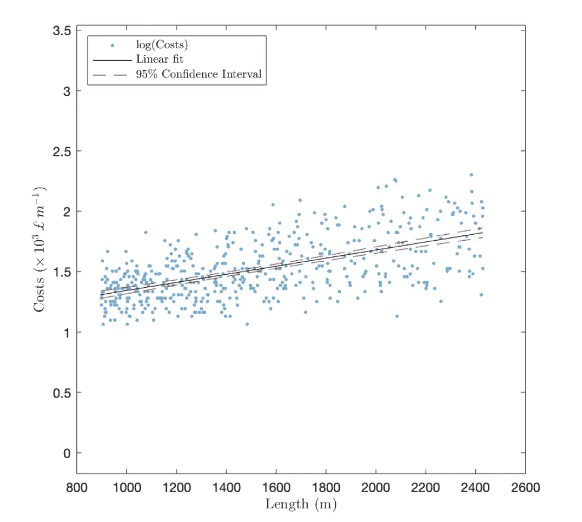

显示桥梁单位长度的维护成本与长度的图表

我想出了许多不同的模型，其中一些非常复杂。

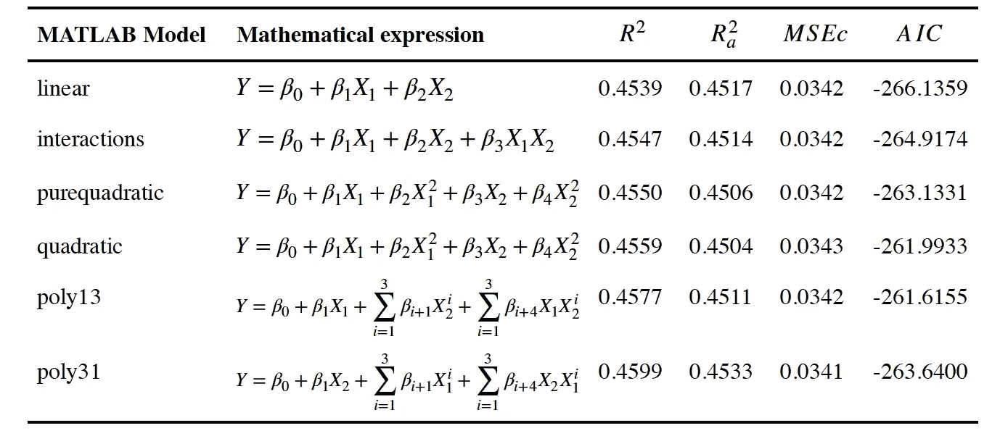

**注:**部分数学表达式有误。X1 代表年龄，X2 代表长度

正如您所看到的，这里涉及到许多不同的东西，但我们看到大多数模型都有非常相似的指标。这就是将不同的指标结合起来使用的时候了，这就是为什么了解所有指标或者尽可能多的指标是好的。

最后，人们认为最差的模型是“二次”型，因为它具有最高的 AIC **和最低的 R 调整值**。

最佳模型被认为是“线性”模型，因为它具有最高的 AIC 和相当低的 R 调整值(实际上，它与 R 调整值最高的“poly31”模型的误差在 1%以内)。

## **读者注意:**

我希望您喜欢阅读本文，并且对所描述的指标有更好的理解。由于这是我的第一篇文章，如果你能给我反馈，我将不胜感激:什么是好的？什么不好？少了什么？我能有什么不同的解释？

非常感谢，我希望你继续你的学习之旅:)

## **来源:**

1.  [https://www . investopedia . com/terms/R/R-squared . ASP #:~:text = R-squared % 20(R2)，变量%20in%20a%20regression%20model。](https://www.investopedia.com/terms/r/r-squared.asp#:~:text=R-squared%20(R2),variables%20in%20a%20regression%20model.)
2.  [https://machine learning mastery . com/over fitting-and-under fitting-with-machine-learning-algorithms/#:~:text = over fitting % 20 refers % 20 to % 20a % 20 model % 20 that % 20 models % 20 training % 20 data % 20 too % 20 well。&text =这% 20 意味着% 20 那% 20 噪音% 20 型号% 20 能力% 20 到% 20 通用化。](https://machinelearningmastery.com/overfitting-and-underfitting-with-machine-learning-algorithms/#:~:text=Overfitting%20refers%20to%20a%20model%20that%20models%20the%20training%20data%20too%20well.&text=This%20means%20that%20the%20noise,the%20models%20ability%20to%20generalize.)
3.  [https://medium . com/human-in-a-machine-world/Mae-and-RMSE-metric-is-better-e 60 AC 3 bde 13d](https://medium.com/human-in-a-machine-world/mae-and-rmse-which-metric-is-better-e60ac3bde13d)
4.  [https://towards data science . com/the-a kaike-information-criterion-c 20 c8 FD 832 f 2](/the-akaike-information-criterion-c20c8fd832f2)

*除非另有说明，所有图片均由作者提供。*