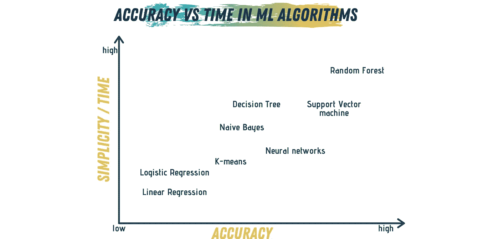

# 如何为您的应用选择正确的机器学习算法

> 原文：<https://towardsdatascience.com/how-to-choose-the-right-machine-learning-algorithm-for-your-application-1e36c32400b9?source=collection_archive---------9----------------------->

## 倾听你的数据，追随你的目标…

米格尔·Á拍摄的照片。来自[佩克斯](https://www.pexels.com/photo/photo-of-golden-cogwheel-on-black-background-3785935/?utm_content=attributionCopyText&utm_medium=referral&utm_source=pexels)的帕德里纳

当我刚开始学习和实践数据科学和机器学习时，我会查找资源和教程来实现和使用特定的机器学习算法。

互联网上到处都是教你如何使用算法、算法如何工作以及如何应用于数据的资料。

然而，当我开始构建我的项目时，我会花很长时间来决定使用哪种算法。

看，大多数关于如何使用特定算法的文章都忽略了何时使用该算法以及如何为您的数据选择最佳算法。

在这篇文章中，我将尝试回顾我在为特定项目选择最佳机器学习算法时遵循的过程。

在开始之前，我们先来了解一下机器学习算法的类型。

# 机器学习算法的类型

机器学习算法可以大致分为*三个主要类别:*

## 监督学习

在监督学习中，算法从训练数据中建立数学模型，该模型具有输入和输出的标签。*数据分类*和 r *回归*算法被认为是监督学习。

## 无监督学习

在无监督学习中，算法在只有输入要素而没有输出标签的数据上建立模型。然后对模型进行训练，在数据中寻找某种结构。*聚类*和 s *分割*是非监督学习算法的例子。

## 强化学习

在强化学习中，模型通过执行一组自己即兴创作的动作和决策来学习执行任务，然后从这些动作和决策的反馈中学习。*蒙特卡洛*是强化学习算法的一个例子。

图片由作者提供(使用 [Canva](https://www.canva.com/) 制作)

# 选择正确的算法

所以，你知道不同的算法类型，你知道它们有什么不同，你知道如何使用它们。现在的问题是什么时候使用这些算法？

要回答这个问题，我们需要考虑我们试图解决的问题的 4 个方面:

## №1:数据

了解您的数据是决定算法的第一步，也是最重要的一步。在开始考虑不同的算法之前，您需要熟悉您的数据。一个简单的方法是将数据可视化，并尝试从中找到模式，尝试观察数据的行为，最重要的是，观察数据的大小。

 [## 数据可视化 101:有效可视化的 7 个步骤

### 用引人注目的视觉效果讲述您的数据故事。

towardsdatascience.com](/data-visualization-101-7-steps-for-effective-visualizations-491a17d974de) 

了解数据的关键信息将有助于您对算法做出初步决定。

1.  **数据大小:**有些算法在处理较大数据时比其他算法表现更好。例如，对于*小*训练数据集，具有 ***高*** bais/ ***低*** 方差分类器的算法将比 ***低******高*** 方差分类器工作得更好。所以，对于小训练数据，*朴素贝叶斯*会比 *kNN* 表现更好。
2.  **数据的特性:**这意味着你的数据是如何形成的。你的数据是线性的吗？那么也许线性模型最适合它，比如*回归*——线性和逻辑——或者 *SVM* (支持向量机)。但是，如果你的数据比较复杂，那么你就需要像*随机森林*这样的算法。
3.  **数据的行为:**你的特征是顺序的还是链式的？如果是顺序的呢？你是想预测天气还是股市？那么如果你使用匹配的算法，比如*马尔可夫模型*和*决策树*，那就最好了。
4.  ***数据类型:*** 你可以对你的输入或输出数据进行分类。如果你的输入数据被**标记为**，那么使用一个*监督的*学习算法；如果不是，很可能是一个*无人监督*的学习问题。另一方面，如果你的输出数据是**数值**，那么就用*回归*，但是如果是一组**组**，那么就是一个*聚类*的问题。

## №2:准确性

既然您已经研究了数据，分析了数据的类型、特征和大小，那么您需要问自己准确性对您试图解决的问题有多重要？

模型的准确性是指它从给定的观察集预测答案的能力，该答案接近于该观察集的正确响应。

有时，对于我们的目标应用程序来说，获得准确的答案并不是必需的。如果一个近似足够好，我们可以通过选择一个近似模型来大大减少我们的训练和处理时间。近似方法避免或不执行对数据的过度拟合，例如对非线性数据的线性回归。

## №3:速度

通常，准确性和速度是对立的；在决定一种算法时，您需要在这两者之间做出一些权衡。更高的精度通常意味着更长的训练和处理时间。

像朴素贝叶斯、线性和逻辑回归这样的算法很容易理解和实现，因此执行速度很快。更复杂的算法，如 SVM、神经网络和随机森林，需要更长的时间来处理和训练数据。

那么，哪个对你的项目更有价值呢？准确度还是时间？如果是时候，使用简单的算法会更好，而如果准确性是最重要的，那么选择更复杂的算法会更好地为您的项目工作。

图片由作者提供(使用 [Canva](https://www.canva.com/) 制作)

## №4:功能和参数

你的问题中的 ***参数*** 是数字，它将影响你选择的算法的表现。参数是诸如误差容限或迭代次数之类的因素，或者算法行为方式的变量之间的选项。训练和处理数据所需的时间通常与您拥有的参数数量有关。

处理和训练模型所需的时间随着参数的数量呈指数增长。然而，拥有许多参数通常意味着算法更加灵活。

在机器学习——或者数据科学中，一般来说，一个 ***特征*** 是你试图分析的问题的一个可量化变量。

拥有大量的特征会降低一些算法的速度，使得训练时间相当长。如果你的问题有很多特征，那么使用 SVM 算法是最好的方法，它非常适合有很多特征的应用程序。

# 最后的想法

许多因素控制着选择算法的过程。我们主要可以把你的决策标准分为两个部分，数据相关方面，问题相关方面。

数据的大小、行为、特征和类型可以为您提供使用何种算法的初步想法。一旦你得到这个最初的决定，你的问题的不同方面将帮助你决定一个最终的决定。

图片由作者提供(使用 [Canva](https://www.canva.com/) 制作)

***最后*** ，永远记住两件事:

1.  更好的数据比复杂的算法带来更好的结果；如果你可以用更简单的算法得到相似的结果，选择简单。
2.  您可以牺牲更多时间来处理和训练数据，从而提高算法的准确性。根据具体项目的优先级做出决定。

在遵循项目目标的同时，始终倾听数据想要表达的内容。