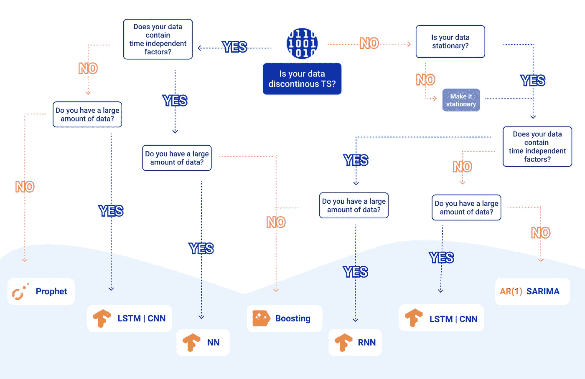

# 如何为您的预测选择正确的 TS 模型

> 原文：<https://towardsdatascience.com/how-to-choose-the-right-ts-model-for-your-prediction-3620ec547243?source=collection_archive---------44----------------------->

## 在时间序列模型丛林中寻找出路

为 TS 选择正确的模型总是一项繁琐的任务。图片由作者提供。

选择正确的模型来预测时间序列总是一件乏味的工作。在本文中，我们将浏览做出正确选择时需要考虑的要点。

## **每个时间序列都不同**

不幸的是，当你面对真实世界的数据时，你会很快意识到你不会面对两次同样的数据，尤其是当你处理时间序列时。

这意味着没有单一的解决方案来建立精确的模型，给出精确的预测。

然而，有一些特征可以很容易地被识别和利用来帮助您更快地收敛到正确的模型。

## **连续性**

当人们想到时间序列时，他们通常想当然地认为这些是平滑、连续的数据。让我们面对现实吧:生活没那么简单。

以风力涡轮机收集的数据为例。一些涡轮机在无风时不记录数据，以节省电力。或者风力涡轮机通常就是这种情况，它们位于人口稀少的地区，那里的互联网连接不稳定。连接丢失是很常见的，会导致数据出现缺口。

处理非连续数据不能用与连续数据相同的模型。ARIMA，萨里玛，指数平滑可能不起作用。在这些情况下，像 [CatBoost](https://catboost.ai/) 这样的梯度推进方法是很好的选择。

## **时间无关数据**

处理时间序列时需要考虑的另一个方面是，通常需要在模型中添加外部的、与时间无关的数据，以实现高水平的精度。

接下来的问题是如何将这些与时间无关的数据整合到一个基于时间的模型中？简而言之，并不总是需要依赖基于时间的模型来实现良好的精度水平。在这些情况下，提取时间相关特征的良好预处理和像 SVM 这样的回归算法可以给出良好的结果。

## **卷**

另一个需要考虑的明显问题是您要处理的数据量。你不可能只用几百个数据点来训练 LSTM 神经网络。神经网络需要更多的数据。

## **平稳性**

此外，您还必须考虑数据的平稳性:即，预测量的平均值和偏差是否随时间而变化？如果是这种情况，可能有必要对数据进行预处理，通常使用时间微分来确保情况如此。

## **那么，我如何挑选合适的型号呢？**

您可以使用下面的简单图表。它依赖于我们在这方面的经验，并根据数据的性质总结了正确模型的选择:

快速收敛到适合您数据的模型。图片由作者提供。

这是一个很好的起点，以获得一个体面的模型。要走得更远，达到更高的精度水平，将需要一种更复杂的方法，混合在以前构建的集群上训练的各种模型。或者使用大型神经网络，构建为自动识别这些集群，并设计最佳特征。

通过将所有这些步骤组合在一个单一的全局优化问题中，您将不再需要选择模型。