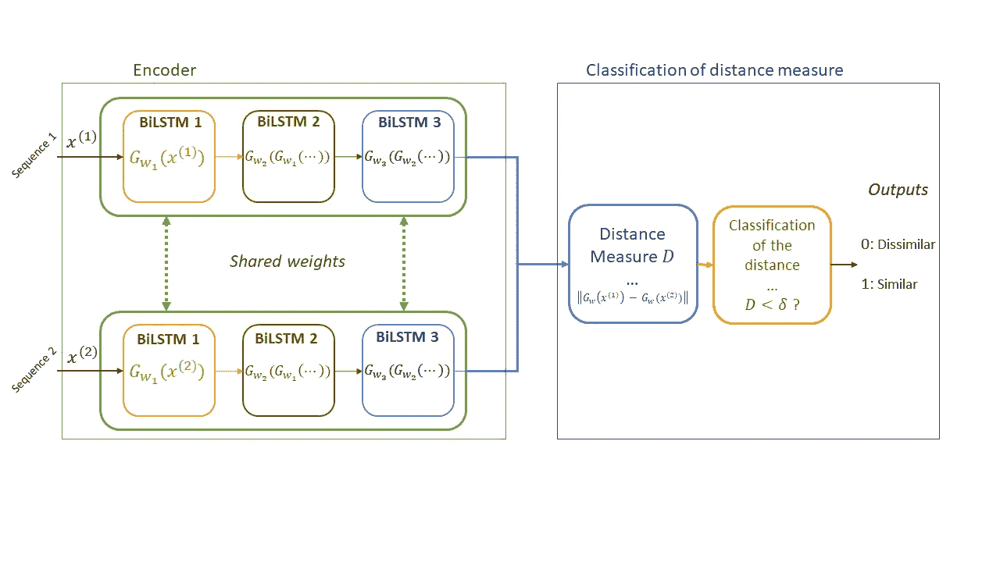
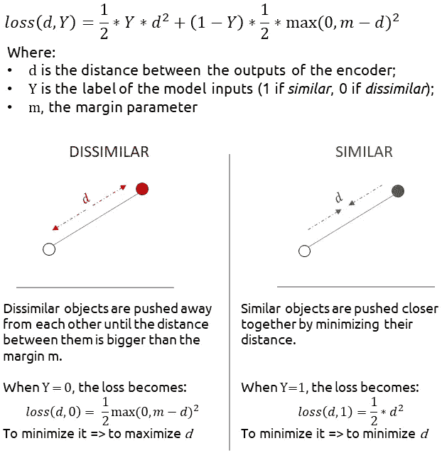
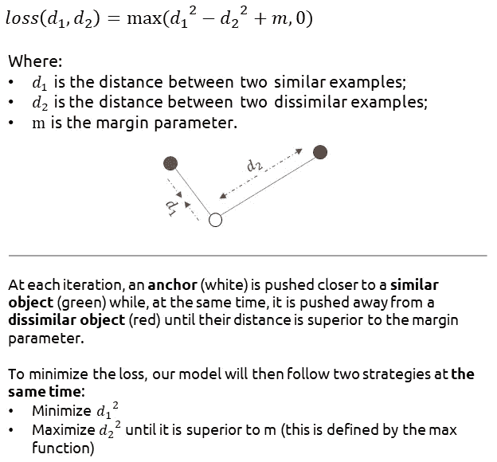
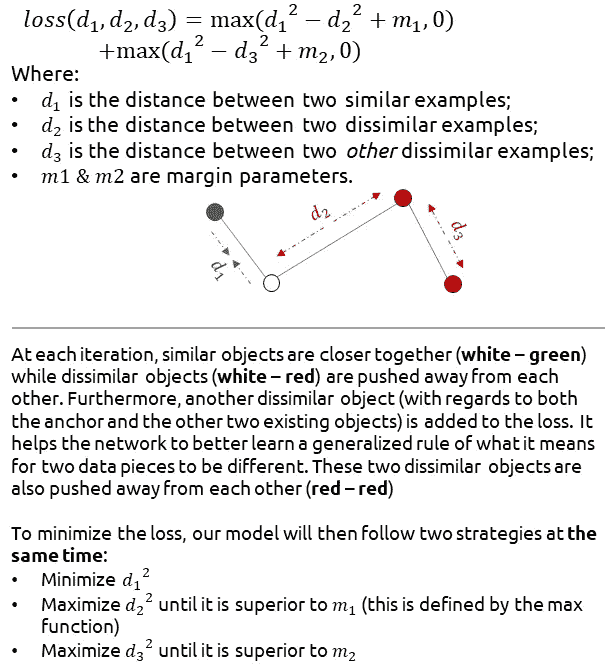
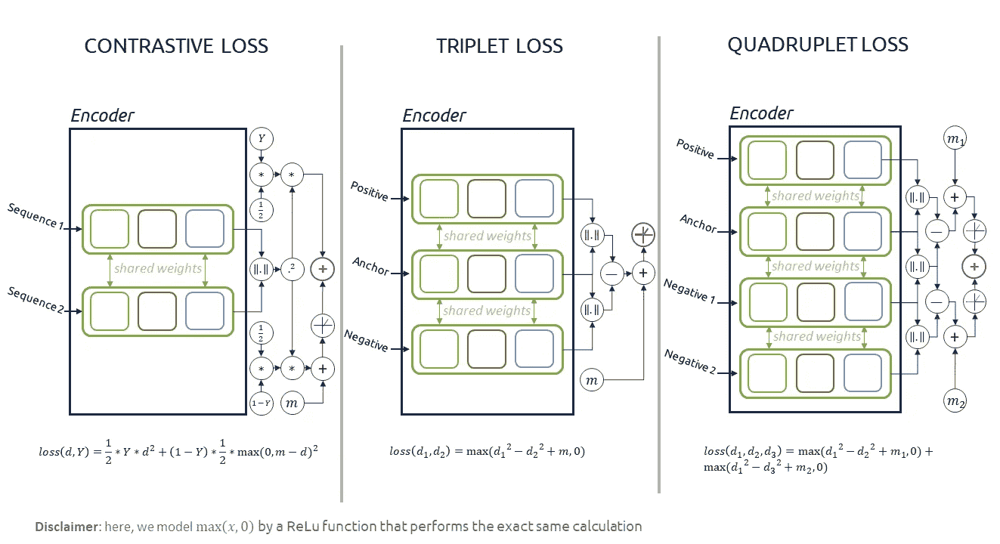
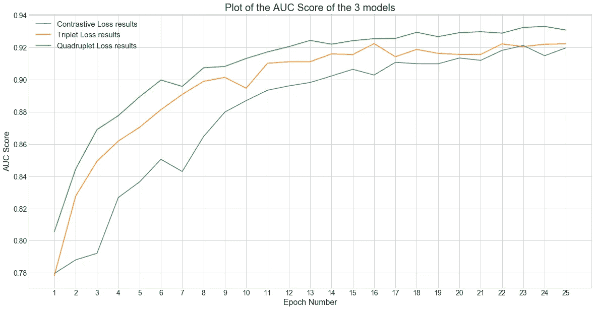

# 设计连体神经网络时如何选择自己的损失？对比，三胞胎还是四胞胎？

> 原文：<https://towardsdatascience.com/how-to-choose-your-loss-when-designing-a-siamese-neural-net-contrastive-triplet-or-quadruplet-ecba11944ec?source=collection_archive---------8----------------------->

## 彻底的比较

## 用于在 [Quora 数据集](https://www.kaggle.com/c/quora-question-pairs) [1]上训练相似性学习算法的三种流行技术(对比、三重和四重损失)的性能比较

由[阿克塞尔·邦尼奥特](https://unsplash.com/@axelbonniot?utm_source=unsplash&utm_medium=referral&utm_content=creditCopyText)在 [Unsplash](https://medium.com/t/wallpapers?utm_source=unsplash&utm_medium=referral&utm_content=creditCopyText) 上拍摄的照片

*通过这篇文章，我将评估和比较深度相似性学习任务的三种不同损失。如果您仍然不能完全理解这个主题，我已经写了一篇文章，介绍了主要的概念和代码示例，以及一个完整的 GitHub 库，您可以查看:*

 [## 序列深度相似性学习简介

### 对用于相似性分类任务的深度学习技术的一系列深入评论的第一部分。

towardsdatascience.com](/introduction-to-deep-similarity-learning-for-sequences-89d9c26f8392) 

# 目录

**一、任务概述**

**二。暹罗循环网络:序列的相似性学习**

**三。深度相似性学习的损失**

**四。** **具体应用:问题对检测**

# 一.任务概述

我在这个任务中使用了著名的 Quora 问题对数据集，其主要目标是预测两个问题对是否有相同的意图。例如:

*   *什么能让物理变得简单易学？/怎样才能让物理变得简单易学？*有**相似的意图**
*   网上赚钱最好的方法是什么？/网上要钱最好的方式是什么？有**不同的意图**

对于这项任务，可以使用不同的解决方案，但我们今天将看到的是:**单词嵌入+暹罗循环网络**。单词嵌入算法不是这里的重点(将使用 Word2Vec)，但我们将专注于训练暹罗递归网络。因此，在谈论培训之前，我们将快速概述一下什么是暹罗循环网络(更多细节可以在我上面的另一篇文章中找到……)。

# 二。暹罗循环网络:序列的相似性学习

暹罗猫的形象

如上所述，连体递归神经网络是这样一种神经网络，其将两个数据序列和**作为**输入**、**并将它们分类为**相似**或**不相似**。****

# 编码器

为此，它使用一个**编码器**，其工作是**将输入数据**转换为特征** s 的**向量**，然后为每个输入创建一个向量，并将其传递给**分类器。**处理图像时，这个*编码器*往往会是一堆*卷积层*，而处理*序列*时，往往会是一堆*rnn*。在我们的例子中，我们使用了 3 个双向 LSTMs 的堆栈。**

# 分类器

**分类器**然后**根据这两个输入计算**、距离**值**(距离函数可以是任何距离:L1、L2……)。这个**距离**然后被**分类为**相似或**不相似**数据实例的距离:这个过程就类似于**找到正确的距离值阈值**，超过该阈值两个数据对象被认为是不相似的。

# 训练一个连体神经网络

给定编码器和分类器的定义，人们可以认识到使用暹罗神经网络的所有困难在于特征向量的创建过程。事实上，这个向量需要以下特性:

*   **足够恰当地描述**，使得两个**相似的**数据(具有可变性)将**具有相似的向量**(因此，距离小)
*   **具有足够的辨别力**，使得两个**不相似的**条**数据**将**具有不相似的矢量**

数据比较过程的动画

因此，我们看到，**训练**这个**网络**就是训练它，一方面，**识别相似的事物**，，另一方面，**识别不相似的事物**:两者都有**良好的信心**。仅仅是**向**教授**一个模型什么是**两个相似的数据**是不够的，它会过度适应训练数据，并倾向于发现所有的数据都是相似的(*高召回率但低精度*):这也是关于**训练**它去**识别不相似的数据** ( *因此，平衡它的召回率和精度*)以及最终是什么产生了两个数据**

为了训练一个连体神经网络，最常用的损失函数是**对比损失**【2】**(在我之前的文章中有更详细的介绍，你可以在上面找到)。然而，它并不是唯一存在的。我将通过详细描述这些损失背后的主要思想以及它们的 PyTorch 实现，将其与另外两个损失进行比较。**

# **三。深度相似性学习的损失**

# **对比损失**

**当训练具有对比损失[2]的连体网络时，在每个时间步将使用**两个输入数据**来比较**。这两个输入数据可能相似，也可能不相似。这由二进制类变量 Y 建模，其值为:****

*   **如果不同，则为 0；**
*   **1 如果相似。**

**这些类别显然可以改变，以适应损失函数的条件。**

****

**对比损失详情说明**

**你可以在下面找到对比损失的 PyTorch 代码:**

# **三重损失**

**当训练具有三重损失[3]的连体网络时，在每个时间步需要**三个输入数据**来比较**。与对比损失相反，**输入**被**有意采样**关于它们的**类**:****

*   **我们对一个**锚对象**进行采样，用作其他两个数据对象的比较点；**
*   **我们采样一个**阳性物体**，已知是**类似于**锚**物体的**；**
*   **然后，我们对一个**负对象**进行采样，已知它与**锚**对象**不同**。**

****

**三重损失细节图**

**您可以在下面找到三联体丢失的 PyTorch 代码:**

# **四联缺失**

**当训练一个有四个损失的连体网络[3]时，将需要**个输入数据**在每个时间步比较**。就像三重丢失一样，**输入**再次被**有意采样**关于它们的**类**:****

*   **我们对一个**锚对象**进行采样，用作其他两个数据对象的比较点；**
*   **我们对一个**阳性对象**进行采样，已知其**与**锚**对象**相似；**
*   **我们采样一个**否定对象**，已知是**与**锚**对象不相似的**；**
*   **然后，我们对另一个否定对象进行采样**，已知它是 3 个**数据对象**的**相异**到**。******

****

**四联丢失详细信息的图示**

**你可以在下面找到四胞胎丢失的代码:**

# **直观比较损失及其对网络的影响**

****

**三种损失的比较及其对暹罗网络架构的影响**

**在此图中， **3 损失**与**并排比较。我们可以很容易地看到**的差异**在**的输入数**中，取决于所使用的损耗。****

**在每个*编码器*的右侧是计算损耗的**图形表示。它可以提供关于如何使用编码器的输出来训练网络的更多见解，还可以显示损失之间的不同复杂程度。每个损失的输出是紫色的计算节点。****

# **四。具体应用**

# **架构和损失定义(PyTorch)**

**我训练了三个不同的模型，每个模型对应一次损失。他们都使用相同的编码器来处理输入，他们之间的唯一区别是输入的数量:**

*   **对比损失模型的 2 个输入；**
*   **三重态损耗模型的 3 个输入；**
*   **四联丢失模型的 4 个输入。**

**该编码器具有以下架构(内置于 PyTorch 中):**

**然后，每个模型将有一个单一版本的编码器，他们将使用它来为他们的输入生成特征向量。例如，对于四联丢失模型，我们有:**

# **培训详情和结果**

**我使用以下超参数并行训练我的网络(使用相同的 for-loop ):**

*   **25 个时代**
*   ***1e-3* 的学习率**
*   **批量为 64 件**
*   **嵌入大小(Word2Vec 建模)为 40**

**我的三个算法的性能是在每个时期结束时使用 AUC 分数来测量的，在验证阶段之后，使用训练、验证和测试集来计算它们的相互 AUC 分数。总体而言，它们都遵循相同的进度，因此我将只显示测试结果:**

****

**每个模型的测试集上的 AUC 分数作为纪元编号的函数的图**

**我们在这里看到，在整个训练中，用四重损失训练的模型明显优于对比损失模型。虽然它们最终似乎都趋于一致，但这两种模型之间仍有 0.01 的 AUC 差异。这证明了四联缺失训练模型将数据转换为特征密集向量是多么有效。**

**我的 github 仓库里有这个项目的全部代码，在这里:**

** [## 文本语义相似度

### 这是运行以下文章中介绍的实验的代码的存储库

github.com](https://github.com/dimartinot/Text-Semantic-Similarity) 

> d**is claimer**:Quora 数据集为了这个实验的目的被稍微修改了一下。虽然它最初包含相似和不相似的问题示例，但只有相似的问题被保留用于我的计算。然后，我会从数据集中随机抽取任何其他问题来创建不同的示例。原始数据集的全部困难在于，一些问题在意义上非常接近，但实际上是不同的。为这一挑战而构建的解决方案的关键不仅在于构建深度相似性网络，还在于手工创建将被使用的*神奇特征*，合并到向量中，用于分类。

# 额外资源

关于暹罗神经网络的另一个具体应用，我向你推荐这篇由[劳尔·戈麦斯·布鲁巴拉](https://www.linkedin.com/in/raulgomezbruballa/)发表在 Neptune.ai 博客部分的关于这个主题的广泛文章。它提出了通过相似嵌入内容的匹配进行图像检索的概念。

 [## 用 PyTorch - neptune.ai 中的连体网络实现基于内容的图像检索

### 图像检索是寻找与给定查询相关的图像的任务。对于基于内容的图像检索，我们指的是…

海王星. ai](https://neptune.ai/blog/content-based-image-retrieval-with-siamese-networks) 

# 参考

[1] Quora。2017. *Quora 问题对*， [Kaggle](https://www.kaggle.com/c/quora-question-pairs/overview)

[2] R .哈德塞尔，s .乔普拉，y .勒昆。通过学习不变映射进行降维。2006.

[3] F .施罗夫、d .卡列尼琴科、j .菲尔宾。FaceNet:人脸识别和聚类的统一嵌入。2015.

[4]陈文伟，陈晓霞，张军，黄国光.超越三重缺失:用于个人再识别的深层四重网络。2017.**