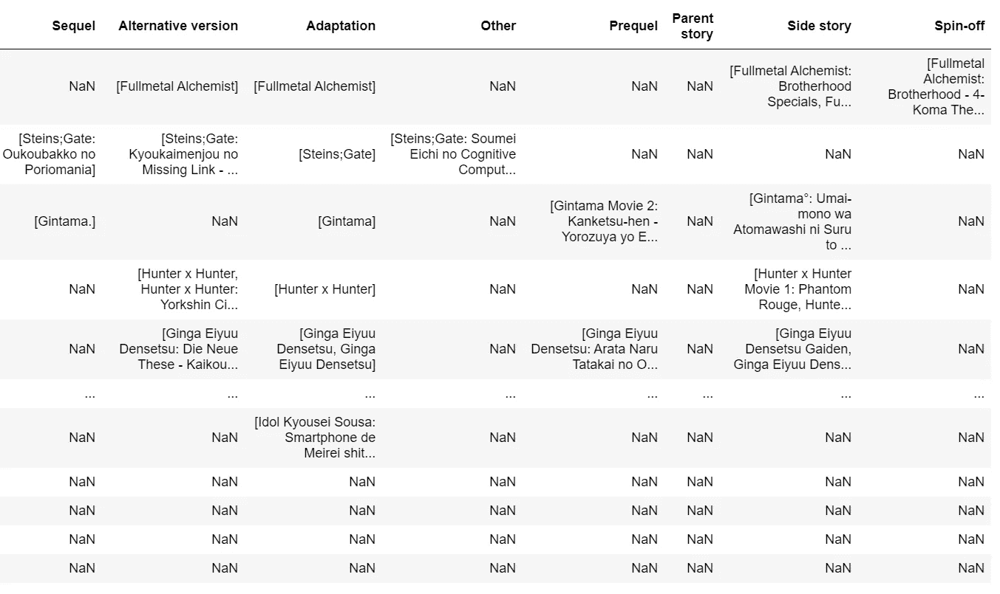
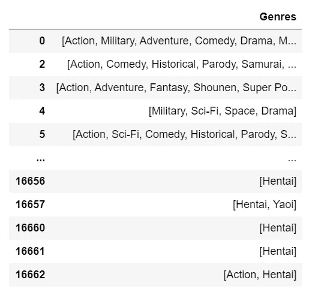
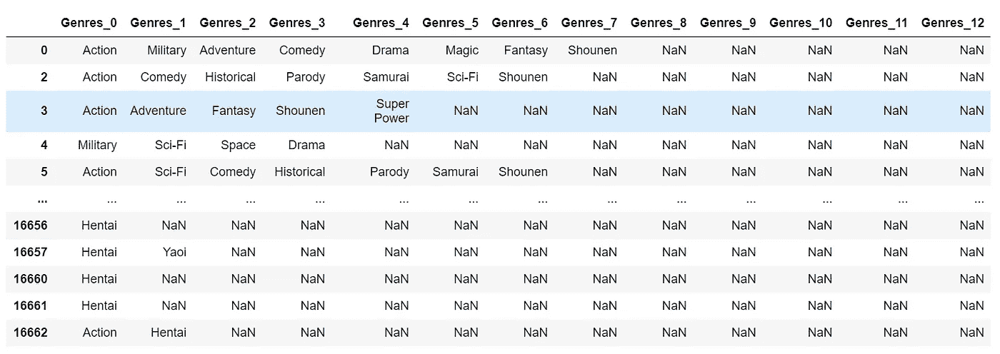
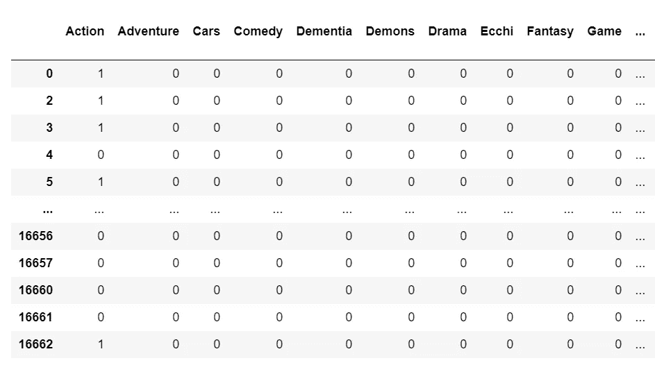

# 如何清理和组合列表的数据框列

> 原文：<https://towardsdatascience.com/how-to-clean-and-combine-dataframe-columns-of-lists-ebd3542559b6?source=collection_archive---------23----------------------->

Joshua Rodriguez 在 [Unsplash](https://unsplash.com/s/photos/columns-of-lists?utm_source=unsplash&utm_medium=referral&utm_content=creditCopyText) 上的照片

在 Metis 数据科学训练营的第二个项目中，我发现自己不得不处理熊猫数据框中的列表。我在谷歌搜索中没有找到这些信息，所以我把它放在这里作为有用的参考/起点。

# 一.问题

相关属性的列，充满列表

我需要完成几件事:

*   包含其他列表栏中所有项目的合并栏，但没有重复项目。因此，第 1 列中有[A，B]而第 2 列中有[B，C]的条目将导致[A，B，C]的合并条目。
*   将所有 NaN 值更改为空列表。
*   从列表中的所有项目生成虚拟列的列表(按照下面的列)。

流派:包含分类特征列表的列

# 二。方法

我编写了下面的助手函数，我将一个一个地介绍它们。

## a)基于列表列创建数据帧

1.  数据帧本质上是一系列系列。所以给定一个列，我**对每个列表项**应用 pandas 系列转换。然后，我将这一系列序列分配给一个新的数据帧。
2.  我用基于原始列名和列表索引的编号系统替换了默认的列名，格式为 <column-name>_ <list-index>。</list-index></column-name>

将它应用到上面的流派专栏，我得到了以下结果:

## b)列表中各列的虚拟变量

1.  我可以使用前面的 helper 函数来获得列表条目的数据帧(让我们称之为 list_df)。
2.  使用 pandas 的 **get_dummies()** ，我获得 list_df 的所有列的虚拟数据帧，然后**将它们加在一起。**这给了我一个整合的虚拟数据框架。

将此应用于“流派”列会得到以下结果:

仅显示了前几个流派虚拟列

## c)合并列表的列

1.  这里的逻辑类似于创建虚拟列的逻辑。我没有使用 add()，而是将所有的数据帧连接在一起成为一个大的数据帧。
2.  我**将大数据帧转换成一个列表**，所以它现在是一个列表的列表。这对于接下来的几个步骤很重要。
3.  我**使用 list comprehension 来只包含列表列表中每个列表中与我们期望的类型**相匹配的条目。在这种情况下，由于所需的类型是一个字符串，这也消除了我所有的 NaN 值。*如果一开始只有 NaN 个值，我们最终得到的是一个空列表。完美！*
4.  最后，我**将 set()和 list()** 映射到 list 列表中。集合论的神奇之处在于，当应用 set()时，所有重复项都会自动丢弃。
5.  注意，结果仍然是列表的列表。我有另一个如下所示的帮助函数，根据父数据帧的索引将它分配给数据帧列，并将其命名为:

# 三。结果

请注意附加的关联列，以及代替 NaN 的空列表

我们做到了！有可能的方法可以进一步收紧，所以请在你的评论中让我知道。