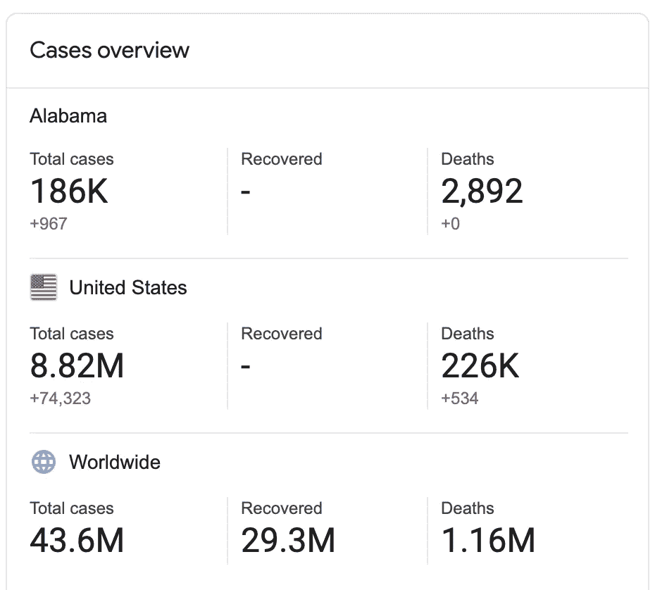

# 如何在命令行清理 CSV 数据

> 原文：<https://towardsdatascience.com/how-to-clean-csv-data-at-the-command-line-4862cde6cf0a?source=collection_archive---------35----------------------->

## 关于使用命令行程序清理新冠肺炎 CSV 文件的深入教程:csvkit 和 xsv 比较各自的性能


[疾控中心](https://unsplash.com/@cdc?utm_source=unsplash&utm_medium=referral&utm_content=creditCopyText)在 [Unsplash](https://unsplash.com/s/photos/covid?utm_source=unsplash&utm_medium=referral&utm_content=creditCopyText) 拍摄的照片

注意:这是在命令行清理 CSV 系列的第 1 部分。第二部分在这里:

[](https://medium.com/the-brainwave/how-to-clean-csv-data-at-the-command-line-part-2-207215881c34) [## 如何在命令行清理 CSV 数据|第 2 部分

### 关于在排序和连接时使用命令行程序 csvkit 和 xsv 清理大型 CSV 文件的教程…

medium.com](https://medium.com/the-brainwave/how-to-clean-csv-data-at-the-command-line-part-2-207215881c34) 

您是否曾经处理过一个非常可怕的 CSV 文件，该文件包含许多您不想要的列和许多记录，从而降低了您过滤和获取所需信息的速度？

本教程是关于使用两个命令行程序来解决这些问题； [csvkit](https://csvkit.readthedocs.io/en/latest/) 和 [xsv](https://github.com/BurntSushi/xsv) 。我们将在最后比较两者，看看各自的性能如何，以及在速度方面何时可以使用一个而不使用另一个，尤其是在处理大型 CSV 文件时。在上一篇博文中，我们讨论了如何在命令行[中清理文本数据，我推荐大家看看:](https://www.ezzeddinabdullah.com/posts/how-to-clean-text-data-at-the-command-line)

[](/how-to-clean-text-files-at-the-command-line-ce2ff361a16c) [## 如何在命令行清理文本文件

### 关于使用命令行工具清理数据的基础教程:tr、grep、sort、uniq、sort、awk、sed 和 csvlook

towardsdatascience.com](/how-to-clean-text-files-at-the-command-line-ce2ff361a16c) 

# 从 covidtracking 下载 COVID 数据

让我们首先从 [COVID 跟踪项目](https://covidtracking.com/data/download)下载美国各地最近的冠状病毒数据，该项目是一个志愿者组织，致力于收集和发布了解美国新冠肺炎疫情所需的数据。顺便说一下，这些数据是在 4.0 许可的[知识共享 CC 下发布的。](https://creativecommons.org/licenses/by/4.0/)

让我们通过手动下载 [CSV 文件](https://covidtracking.com/data/download/all-states-history.csv)或使用 *curl* 来完成:

```
$ curl -LO [https://covidtracking.com/data/download/all-states-history.csv](https://covidtracking.com/data/download/all-states-history.csv)
```

**-LO** 是 **-L** 和 **-O** 的组合

*   **-L** 用于确定 URL 是否已经更改到另一个位置， *curl* 将在新的重定向链接上重做请求
*   **-O** 该选项用于创建一个与所请求文件名同名的输出文件，此处为 **all-states-history.csv**

# 打印 CSV 文件头

让我们首先打印这个**all-States . history . CSV***文件的列名:*

```
*$ csvcut -n all-states-history.csv 
  1: date
  2: state
  3: dataQualityGrade
  4: death
  5: deathConfirmed
  6: deathIncrease
  7: deathProbable
  8: hospitalized
  9: hospitalizedCumulative
 10: hospitalizedCurrently
 11: hospitalizedIncrease
 12: inIcuCumulative
 13: inIcuCurrently
 14: negative
 15: negativeIncrease
 16: negativeTestsAntibody
 17: negativeTestsPeopleAntibody
 18: negativeTestsViral
 19: onVentilatorCumulative
 20: onVentilatorCurrently
 21: pending
 22: positive
 23: positiveCasesViral
 24: positiveIncrease
 25: positiveScore
 26: positiveTestsAntibody
 27: positiveTestsAntigen
 28: positiveTestsPeopleAntibody
 29: positiveTestsPeopleAntigen
 30: positiveTestsViral
 31: recovered
 32: totalTestEncountersViral
 33: totalTestEncountersViralIncrease
 34: totalTestResults
 35: totalTestResultsIncrease
 36: totalTestsAntibody
 37: totalTestsAntigen
 38: totalTestsPeopleAntibody
 39: totalTestsPeopleAntigen
 40: totalTestsPeopleViral
 41: totalTestsPeopleViralIncrease
 42: totalTestsViral
 43: totalTestsViralIncrease*
```

*如您所见，使用带有选项 **-n** 的 **csvcut** 可以列出我们拥有的所有标题及其相关顺序，这可以帮助我们选择一些我们感兴趣的特定列。*

# *选择特定列*

*在本教程中，我们对四列感兴趣，这些是 COVID 跟踪项目报告的对它们的描述:*

1.  *数据:COVID 跟踪项目收集数据的日期。*
2.  *州:州或地区的两个字母缩写。*
3.  *阳性:该州或地区报告的新冠肺炎**确诊病例加上**疑似病例总数*
4.  *死亡:确诊或疑似新冠肺炎病例的死亡总数*

***让我们看看如何在命令行中获取 CSV 文件中这 4 列的前 10 行:***

```
***$ csvcut -c date,state,positive,death all-states-history.csv | head | csvlook 
|       date | state | positive |  death |
| ---------- | ----- | -------- | ------ |
| 2020-10-26 | AK    |   14,413 |     68 |
| 2020-10-26 | AL    |  185,322 |  2,866 |
| 2020-10-26 | AR    |  106,727 |  1,833 |
| 2020-10-26 | AS    |        0 |      0 |
| 2020-10-26 | AZ    |  238,964 |  5,875 |
| 2020-10-26 | CA    |  901,010 | 17,357 |
| 2020-10-26 | CO    |   95,089 |  2,076 |
| 2020-10-26 | CT    |   68,099 |  4,589 |
| 2020-10-26 | DC    |   16,812 |    642 |***
```

***所以这里使用了带有选项 **-c** 的 **csvcut** 来选择后面用逗号分隔的列。这 10 行看起来与 **csvlook** 对齐更好***

***请注意，我们可以使用以下命令之一来完成此操作:***

```
***$ csvcut -c **1,2**,22,4 all-states-history.csv | csvgrep -c state -m CA |head | csvlook
$ csvcut -c **1-2**,22,4 all-states-history.csv | csvgrep -c state -m CA |head | csvlook
$ csvcut -c 1-2,**positive**,4 all-states-history.csv | csvgrep -c state -m CA |head | csvlook***
```

***这意味着您可以选择带有编号或范围的列，或者将编号和列名的组合作为字符串。***

***如果您在撰写本教程之外的某一天使用 COVID 跟踪项目的最新数据，请注意这些 CSV 数据可能与您的不同。***

# ***过滤信息***

***现在让我们过滤掉加利福尼亚州的 COVID 数据:***

```
***$ csvcut -c date,state,positive,death all-states-history.csv | csvgrep -c state -m AL | head | csvlook 
|       date | state | positive | death |
| ---------- | ----- | -------- | ----- |
| 2020-10-26 | AL    |  185,322 | 2,866 |
| 2020-10-25 | AL    |  184,355 | 2,866 |
| 2020-10-24 | AL    |  183,276 | 2,866 |
| 2020-10-23 | AL    |  180,916 | 2,859 |
| 2020-10-22 | AL    |  177,064 | 2,843 |
| 2020-10-21 | AL    |  174,528 | 2,805 |
| 2020-10-20 | AL    |  174,528 | 2,805 |
| 2020-10-19 | AL    |  173,485 | 2,789 |
| 2020-10-18 | AL    |  172,626 | 2,788 |***
```

***我们在这里使用了带有选项 **-c** 的 **csvgrep** 来选择我们正在过滤的列，它是这里的*状态*来匹配 *AL* ，使用 **-m** 选项来匹配我们搜索的模式。***

***我想确定这些数据，所以我去谷歌上问阿拉巴马州有多少病例，答案是:***

******

***作者图片***

***看起来 COVID 跟踪项目报告的数据接近谷歌报告的 186，000 例阳性病例和 2892 例死亡病例。***

***如果你还在另一栏显示前一天阳性病例的增加，你会发现:***

```
***$ csvcut -c date,state,positive,24,death all-states-history.csv | csvgrep -c state -m AL | head | csvlook
|       date | state | positive | positiveIncrease | death |
| ---------- | ----- | -------- | ---------------- | ----- |
| 2020-10-26 | AL    |  185,322 |              967 | 2,866 |
| 2020-10-25 | AL    |  184,355 |            1,079 | 2,866 |
| 2020-10-24 | AL    |  183,276 |            2,360 | 2,866 |
| 2020-10-23 | AL    |  180,916 |            3,852 | 2,859 |
| 2020-10-22 | AL    |  177,064 |            2,536 | 2,843 |
| 2020-10-21 | AL    |  174,528 |                0 | 2,805 |
| 2020-10-20 | AL    |  174,528 |            1,043 | 2,805 |
| 2020-10-19 | AL    |  173,485 |              859 | 2,789 |
| 2020-10-18 | AL    |  172,626 |              964 | 2,788 |***
```

***从 10 月 26 日到 10 月 27 日，967 个阳性病例增加了，这个数字正好与谷歌报告的低于上图中总病例数的(+967)相符。***

# ***连接两个 CSV***

***我不熟悉 state 列中的一些缩写，所以让我们使用第二个 CSV 文件，我们可以加入该文件以获得我们理解的 CSV 数据的更清晰的输出。让我们用 *curl:* 下载它***

```
***$ curl -LO [https://gist.githubusercontent.com/afomi/8824ddb02a68cf15151a804d4d0dc3b7/raw/5f1cfabf2e65c5661a9ed12af27953ae4032b136/states.csv](https://gist.githubusercontent.com/afomi/8824ddb02a68cf15151a804d4d0dc3b7/raw/5f1cfabf2e65c5661a9ed12af27953ae4032b136/states.csv)***
```

***这个**States . CSV***文件有两列:*状态*和*缩写*****

***让我们看看如何在这里实现这种有趣的连接:***

```
***$ csvjoin -c Abbreviation,state states.csv all-states-history.csv | csvcut -c date,State,Abbreviation,positive,death | head | csvlook 
|       date | State   | Abbreviation | positive | death |
| ---------- | ------- | ------------ | -------- | ----- |
| 2020-10-26 | ALABAMA | AL           |  185,322 | 2,866 |
| 2020-10-25 | ALABAMA | AL           |  184,355 | 2,866 |
| 2020-10-24 | ALABAMA | AL           |  183,276 | 2,866 |
| 2020-10-23 | ALABAMA | AL           |  180,916 | 2,859 |
| 2020-10-22 | ALABAMA | AL           |  177,064 | 2,843 |
| 2020-10-21 | ALABAMA | AL           |  174,528 | 2,805 |
| 2020-10-20 | ALABAMA | AL           |  174,528 | 2,805 |
| 2020-10-19 | ALABAMA | AL           |  173,485 | 2,789 |
| 2020-10-18 | ALABAMA | AL           |  172,626 | 2,788 |***
```

***注意这里的 **csvjoin** 命令花费了很多时间，因为它将两个文件都读入内存。***

***在这里，我们将两个 CSV 文件放在一个列中，用于每个 CSV；*缩写*在第一个文件中，*状态*在第二个文件中，然后我们使用 **csvcut -c** 过滤出 5 列进行查看***

***此外，请注意，您在加入时过滤掉的第二列已经消失，这意味着如果您过滤掉 *state (* 是具有州的两个字母缩写的列)，它将给出一个“state”无效的错误，这意味着该列不再存在。***

# ***xsv 和 csvkit 实用程序的比较***

***正如我们注意到的，使用 csvkit 命令行实用程序时，一些命令会花费很多时间。让我们快速比较一下它的命令行工具和 xsv 上的相关工具。***

***所有即将运行的命令都是相对于我的机器而言的，让我们逐一比较:***

# ***xsv 头与 csvcut -n***

```
***$ time csvcut -n all-states-history.csv | head
  1: date
  2: state
  3: dataQualityGrade
  4: death
  5: deathConfirmed
  6: deathIncrease
  7: deathProbable
  8: hospitalized
  9: hospitalizedCumulative
 10: hospitalizedCurrentlyreal **0m0.307s**
user 0m0.224s
sys 0m0.077s***
```

***csvkit 的 **csvcut -n** 时间:~307ms***

```
***$ time xsv headers all-states-history.csv | head
1   date
2   state
3   dataQualityGrade
4   death
5   deathConfirmed
6   deathIncrease
7   deathProbable
8   hospitalized
9   hospitalizedCumulative
10  hospitalizedCurrentlyreal **0m0.013s**
user 0m0.008s
sys 0m0.007s***
```

***xsv 的**头**时间:约 13 毫秒***

# ***xsv 选择与 csvcut -c***

```
***$ time csvcut -c date,state,positive,death all-states-history.csv | head
date,state,positive,death
2020-10-26,AK,14413,68
2020-10-26,AL,185322,2866
2020-10-26,AR,106727,1833
2020-10-26,AS,0,0
2020-10-26,AZ,238964,5875
2020-10-26,CA,901010,17357
2020-10-26,CO,95089,2076
2020-10-26,CT,68099,4589
2020-10-26,DC,16812,642real **0m0.288s**
user 0m0.209s
sys 0m0.073s***
```

***csvkit 的时间 **csvcut -c** : ~288ms***

```
***$ time xsv select date,state,positive,death all-states-history.csv | head
date,state,positive,death
2020-10-26,AK,14413,68
2020-10-26,AL,185322,2866
2020-10-26,AR,106727,1833
2020-10-26,AS,0,0
2020-10-26,AZ,238964,5875
2020-10-26,CA,901010,17357
2020-10-26,CO,95089,2076
2020-10-26,CT,68099,4589
2020-10-26,DC,16812,642real **0m0.035s**
user 0m0.012s
sys 0m0.011s***
```

***xsv 的**选择**的时间:~ 35 毫秒***

# ***xsv 搜索与 csvgrep***

```
***$ time csvcut -c date,state,positive,death all-states-history.csv | csvgrep -c state -m AL |head 
date,state,positive,death
2020-10-26,AL,185322,2866
2020-10-25,AL,184355,2866
2020-10-24,AL,183276,2866
2020-10-23,AL,180916,2859
2020-10-22,AL,177064,2843
2020-10-21,AL,174528,2805
2020-10-20,AL,174528,2805
2020-10-19,AL,173485,2789
2020-10-18,AL,172626,2788real **0m0.438s**
user 0m0.571s
sys 0m0.173s***
```

***csvkit 的**CSV prep**与 **csvcut** 的时间:~438ms***

```
***$ time xsv select date,state,positive,death all-states-history.csv | xsv search -s state AL |head 
date,state,positive,death
2020-10-26,AL,185322,2866
2020-10-25,AL,184355,2866
2020-10-24,AL,183276,2866
2020-10-23,AL,180916,2859
2020-10-22,AL,177064,2843
2020-10-21,AL,174528,2805
2020-10-20,AL,174528,2805
2020-10-19,AL,173485,2789
2020-10-18,AL,172626,2788real **0m0.038s**
user 0m0.026s
sys 0m0.015s***
```

***用**选择**进行 xsv 的**搜索**的时间:约 38 毫秒***

# ***xsv 表与 csvlook***

```
***$ time csvcut -c date,state,positive,death all-states-history.csv | csvgrep -c state -m AL | head | csvlook
|       date | state | positive | death |
| ---------- | ----- | -------- | ----- |
| 2020-10-26 | AL    |  185,322 | 2,866 |
| 2020-10-25 | AL    |  184,355 | 2,866 |
| 2020-10-24 | AL    |  183,276 | 2,866 |
| 2020-10-23 | AL    |  180,916 | 2,859 |
| 2020-10-22 | AL    |  177,064 | 2,843 |
| 2020-10-21 | AL    |  174,528 | 2,805 |
| 2020-10-20 | AL    |  174,528 | 2,805 |
| 2020-10-19 | AL    |  173,485 | 2,789 |
| 2020-10-18 | AL    |  172,626 | 2,788 |real **0m0.476s**
user 0m0.879s
sys 0m0.281s***
```

***csvkit 的 **csvlook** 与**CSV prep**和 **csvcut** 的时间:~476ms***

```
***$ time xsv select date,state,positive,death all-states-history.csv | xsv search -s state AL | head | xsv table
date        state  positive  death
2020-10-26  AL     185322    2866
2020-10-25  AL     184355    2866
2020-10-24  AL     183276    2866
2020-10-23  AL     180916    2859
2020-10-22  AL     177064    2843
2020-10-21  AL     174528    2805
2020-10-20  AL     174528    2805
2020-10-19  AL     173485    2789
2020-10-18  AL     172626    2788real **0m0.041s**
user 0m0.036s
sys 0m0.023s***
```

***xsv 的**工作台**带**搜索**带**选择**的时间:~ 41 毫秒***

# ***xsv join 与 csvjoin***

```
***$ time csvjoin -c Abbreviation,state states.csv all-states-history.csv | csvcut -c date,State,Abbreviation,positive,death | head
date,State,Abbreviation,positive,death
2020-10-26,ALABAMA,AL,185322,2866
2020-10-25,ALABAMA,AL,184355,2866
2020-10-24,ALABAMA,AL,183276,2866
2020-10-23,ALABAMA,AL,180916,2859
2020-10-22,ALABAMA,AL,177064,2843
2020-10-21,ALABAMA,AL,174528,2805
2020-10-20,ALABAMA,AL,174528,2805
2020-10-19,ALABAMA,AL,173485,2789
2020-10-18,ALABAMA,AL,172626,2788real **1m5.788s**
user 1m5.293s
sys 0m0.462s***
```

***csvkit 的 **csvjoin** 与 **csvcut** 的时间:约 1.6 分钟***

```
***$ time xsv join Abbreviation states.csv state all-states-history.csv | xsv select date,State,Abbreviation,positive,death | head
date,State,Abbreviation,positive,death
2020-10-26,ALABAMA,AL,185322,2866
2020-10-25,ALABAMA,AL,184355,2866
2020-10-24,ALABAMA,AL,183276,2866
2020-10-23,ALABAMA,AL,180916,2859
2020-10-22,ALABAMA,AL,177064,2843
2020-10-21,ALABAMA,AL,174528,2805
2020-10-20,ALABAMA,AL,174528,2805
2020-10-19,ALABAMA,AL,173485,2789
2020-10-18,ALABAMA,AL,172626,2788real **0m0.051s**
user 0m0.036s
sys 0m0.018s***
```

***xsv 的**加入**与**选择**的时间:~ 51 毫秒***

***‍***

***你看到刚才发生了什么吗？！51 毫秒 vs 1.6 分钟？！***

***嗯， **xsv** 在这里可以做得比 51 毫秒更好:***

```
***$ xsv index all-states-history.csv***
```

***像这样:***

```
***$ time xsv join Abbreviation states.csv state all-states-history.csv | xsv select date,State,Abbreviation,positive,death | head
date,State,Abbreviation,positive,death
2020-10-26,ALABAMA,AL,185322,2866
2020-10-25,ALABAMA,AL,184355,2866
2020-10-24,ALABAMA,AL,183276,2866
2020-10-23,ALABAMA,AL,180916,2859
2020-10-22,ALABAMA,AL,177064,2843
2020-10-21,ALABAMA,AL,174528,2805
2020-10-20,ALABAMA,AL,174528,2805
2020-10-19,ALABAMA,AL,173485,2789
2020-10-18,ALABAMA,AL,172626,2788real **0m0.036s**
user 0m0.031s
sys 0m0.017s***
```

***但是，如果我们正在调查的文件有更多的记录，我们可以感觉到 xsv 有多快。***

# ***最后的想法***

***根据我们对 COVID 跟踪项目 CSV 文件的 13269 条记录数据的调查，似乎 xsv 正在杀死它，并且它比 csvkit 更有性能。通过以下方式，我们发现清理数据的速度有了巨大的提高:***

*   ***使用 **xsv 头文件**了解 CSV 文件的头文件，并将其与 **csvcut -n** ‍进行比较***
*   ***使用 **xsv select** 过滤出我们想要的列，并与 **csvcut -c** 进行比较***
*   ***使用 **xsv select** 搜索特定模式，并与 **csvgrep** 进行比较***
*   ***使用 **xsv 表**与 **csvlook** 比较，更好地查找 CSV***
*   ***或者使用 **xsv join** 连接两个表，并与 **csvjoin** 进行比较***

***最后，您可以选择从 **csvkit** 或 **xsv** 中选择您想要的任何东西，但是使用让我们的生活变得简单的东西是公平的，这是 **xsv** 尤其是当我们处理大型 CSV 文件时，如果速度和性能不是我们所追求的，尤其是当我们处理小型 CSV 时，我们可以选择 csvkit。***

***您可能已经注意到语法有点类似，只是在一些命令上有所不同，比如连接两个 CSV。所以你总是有选择的权利！***

***本教程主要是受命令行的[数据科学的启发](https://amzn.to/33y5EkR)***

******

***来源:[亚马逊产品](https://amzn.to/33y5EkR)***

> ***披露:*这本书的亚马逊链接(在这一部分)是付费链接，所以如果你买这本书，我会有一个小的佣金****

***这本书试图在您执行数据科学任务时吸引您对命令行功能的注意，这意味着您可以使用命令行获取数据、操作数据、探索数据并做出预测。如果你是一名数据科学家，渴望成为，或者想了解更多，我强烈推荐这本书。你可以从[的网站](https://www.datascienceatthecommandline.com/)上免费在线阅读，或者订购[电子书或平装本](https://amzn.to/33y5EkR)。在本教程中，我们将重点关注使用命令行来清理我们的数据。***

***你可能会对我之前的教程感兴趣，关于[为什么我们使用 docker 教程](https://www.ezzeddinabdullah.com/posts/penguins-in-docker-a-tutorial-on-why-we-use-docker)或者类似的关于[如何在命令行清理文本数据的教程](https://www.ezzeddinabdullah.com/posts/how-to-clean-text-data-at-the-command-line)***

***[](https://medium.com/swlh/penguins-in-docker-a-tutorial-on-why-we-use-docker-ce67cebf65f9) [## Docker 中的企鹅——关于我们为什么使用 Docker 的教程

### 关于 docker 以及如何构建 docker 文件、挂载卷和运行 docker 映像的基础教程

medium.com](https://medium.com/swlh/penguins-in-docker-a-tutorial-on-why-we-use-docker-ce67cebf65f9) [](/how-to-clean-text-files-at-the-command-line-ce2ff361a16c) [## 如何在命令行清理文本文件

### 关于使用命令行工具清理数据的基础教程:tr、grep、sort、uniq、sort、awk、sed 和 csvlook

towardsdatascience.com](/how-to-clean-text-files-at-the-command-line-ce2ff361a16c) 

大家注意安全，我们将在接下来的教程中再见；)

# 动机是

*   [csvkit 文档](https://csvkit.readthedocs.io/en/latest/cli.html#processing) ‍
*   [针对最常见 CSV 文件阅读器问题的 5 个神奇修复| ThoughtSpot](https://www.thoughtspot.com/blog/5-magic-fixes-most-common-csv-file-reader-problems-thoughtspot) ‍
*   [COVID 跟踪数据](https://covidtracking.com/data/download)
*   [国家缩写数据](https://worldpopulationreview.com/states/state-abbreviations)
*   [xsv 回购由 bruntsushi 作者](https://github.com/BurntSushi/xsv) ‍
*   [XSV:用 Rust 编写的快速 CSV 命令行工具包](https://news.ycombinator.com/item?id=17943076)

# 最初共享

[](https://www.ezzeddinabdullah.com/posts/how-to-clean-csv-data-at-the-command-line) [## 如何在命令行清理 CSV 数据

### 你有没有处理过一个大得吓人的 CSV 文件，它有很多你不想要的列和很多记录，会降低速度…

www.ezzeddinabdullah.com](https://www.ezzeddinabdullah.com/posts/how-to-clean-csv-data-at-the-command-line)***