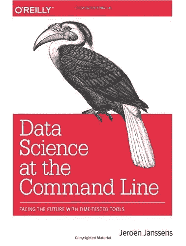

# 如何在命令行清理 JSON 数据

> 原文：<https://towardsdatascience.com/how-to-clean-json-data-at-the-command-line-a1f31803f6d?source=collection_archive---------29----------------------->

## 关于使用命令行程序 jq 清理 JSON 文件的教程


由 [DISRUPTIVO](https://unsplash.com/@sejadisruptivo?utm_source=unsplash&utm_medium=referral&utm_content=creditCopyText) 在 [Unsplash](https://unsplash.com/s/photos/texting?utm_source=unsplash&utm_medium=referral&utm_content=creditCopyText) 拍摄的照片

**jq** 是一个用 c 语言编写的轻量级命令行 JSON 处理器。它遵循了 *Unix 哲学*，即它专注于一件事，并且能做得很好。在本教程中，我们将看到如何使用 jq 来清理 JSONs 并获取一些信息或去掉不需要的信息。

有些数据更适合 JSON 格式，而不是 CSV 或任何其他格式。大多数现代 API 和 NoSQL 数据库都支持 JSONs，如果您的数据是分层的，也很有用，可以认为是可以达到任何深度的树，本质上是任何维度，不像 CSV，它只是 2D，只能形成表格数据，而不是分层数据。

# 聊天机器人:意图识别数据集

今天，我们正在研究一个 JSON 文件(来自 Kaggle)，它包含了[意图识别数据](https://www.kaggle.com/elvinagammed/chatbots-intent-recognition-dataset)。请下载它，因为这是我们在本教程中正在处理的文件。

# 先决条件

## 自制的

如果您使用的是 macOS，请尝试以下方法:

```
$ brew install jq
```

如果您想要最新版本，请点击此处:

```
$ brew install --HEAD jq
```

## 来自 GitHub

```
$ mkdir github		
$ cd github		
$ git clone https://github.com/stedolan/jq.git		
$ cd jq
$ autoreconf -i
$ ./configure --disable-maintainer-mode
$ make
```

## 带巧克力的窗户

```
$ choco install jq
```

如果你需要更多关于如何安装 jq 的信息，请查看 jq wiki 中的[安装页面](https://github.com/stedolan/jq/wiki/Installation)

# 通过索引过滤 JSONs

对于这些聊天机器人数据，我们有一些聊天机器人使用对话意图的概率，对于每个意图，我们有多个关键字，如用户可以键入的意图类型和文本，以及聊天机器人应该回复的响应等等。

## 标识运算符:。

现在让我们通过使用身份过滤器`.`来试验 **jq**

```
$ < intent.json jq '.' | head -n 20
{
  "intents": [
    {
      "intent": "Greeting",
      "text": [
        "Hi",
        "Hi there",
        "Hola",
        "Hello",
        "Hello there",
        "Hya",
        "Hya there"
      ],
      "responses": [
        "Hi human, please tell me your GeniSys user",
        "Hello human, please tell me your GeniSys user",
        "Hola human, please tell me your GeniSys user"
      ],
      "extension": {
        "function": "",
```

## 数组索引:。[0]

让我们看看第一个对象的内容:

```
$ < intent.json jq '.intents[0]'
{
  "intent": "Greeting",
  "text": [
    "Hi",
    "Hi there",
    "Hola",
    "Hello",
    "Hello there",
    "Hya",
    "Hya there"
  ],
  "responses": [
    "Hi human, please tell me your GeniSys user",
    "Hello human, please tell me your GeniSys user",
    "Hola human, please tell me your GeniSys user"
  ],
  "extension": {
    "function": "",
    "entities": false,
    "responses": []
  },
  "context": {
    "in": "",
    "out": "GreetingUserRequest",
    "clear": false
  },
  "entityType": "NA",
  "entities": []
}
```

## 对象标识符-索引:. foo.bar

我们也可以使用索引，让我们得到第一个意图类型:

```
$ < intent.json jq '.intents[0].intent'
"Greeting"
```

## 数组/对象值迭代器:。[]

如果我们想获得聊天机器人能够理解的所有意图类型，该怎么办:

```
$ < intent.json jq '.intents[].intent'
"Greeting"
"GreetingResponse"
"CourtesyGreeting"
"CourtesyGreetingResponse"
"CurrentHumanQuery"
"NameQuery"
"RealNameQuery"
"TimeQuery"
"Thanks"
"NotTalking2U"
"UnderstandQuery"
"Shutup"
"Swearing"
"GoodBye"
"CourtesyGoodBye"
"WhoAmI"
"Clever"
"Gossip"
"Jokes"
"PodBayDoor"
"PodBayDoorResponse"
"SelfAware"
```

# 筛选出特定值

## select(布尔表达式)

**jq** 的一个有用功能是*选择*功能

我们可以用它来筛选一些有用的信息。例如，让我们得到*感谢的对象*的意图:

```
$ < intent.json jq '.intents[] | select(.intent=="Thanks")'
{
  "intent": "Thanks",
  "text": [
    "OK thank you",
    "OK thanks",
    "OK",
    "Thanks",
    "Thank you",
    "That's helpful"
  ],
  "responses": [
    "No problem!",
    "Happy to help!",
    "Any time!",
    "My pleasure"
  ],
  "extension": {
    "function": "",
    "entities": false,
    "responses": []
  },
  "context": {
    "in": "",
    "out": "",
    "clear": false
  },
  "entityType": "NA",
  "entities": []
}
```

让我们来看看它的反应:

```
$ < intent.json jq '.intents[] | select(.intent=="Thanks") | .responses'
[
  "No problem!",
  "Happy to help!",
  "Any time!",
  "My pleasure"
]
```

最后一个例子中的 *intent* 对象只有一个值。如果一个对象有多个值，比如*文本*，那么我们需要使用对象值迭代器*。[]*
比如，我们来看看任意对象中的一个文本是否有文字“*你能看见我吗？”*:

```
$ < intent.json jq '.intents[] | select(.text[]=="Can you see me?")'
{
  "intent": "WhoAmI",
  "text": [
    "Can you see me?",
    "Do you see me?",
    "Can you see anyone in the camera?",
    "Do you see anyone in the camera?",
    "Identify me",
    "Who am I please"
  ],
  "responses": [
    "Let me see",
    "Please look at the camera"
  ],
  "extension": {
    "function": "extensions.gHumans.getHumanByFace",
    "entities": false,
    "responses": [
      "Hi %%HUMAN%%, how are you?",
      "I believe you are %%HUMAN%%, how are you?",
      "You are %%HUMAN%%, how are you doing?"
    ]
  },
  "context": {
    "in": "",
    "out": "",
    "clear": false
  },
  "entityType": "NA",
  "entities": []
}
```

# 从 JSON 中过滤嵌套对象

**jq** 可以得到带有***‘’的嵌套对象*** 标识操作员姓名前的按键:

```
$ < intent.json jq '.intents[] | select(.text[]=="Can you see me?").extension.responses'
[
  "Hi %%HUMAN%%, how are you?",
  "I believe you are %%HUMAN%%, how are you?",
  "You are %%HUMAN%%, how are you doing?"
]
```

所以***. extension . responses****等价于***| . extension . responses****(最后一个过滤器的 stdout 被管道传输到嵌套的对象中)也等价于 ***。扩展名|。回复*****

# **从 JSON 中删除特定的键**

## **del(路径表达式)**

**让我们删除*上下文、* *扩展、实体类型、*和*实体*键:**

```
**$ < intent.json jq '.intents[] | select(.text[]=="Can you see me?") | del(.context,.extension,.entityType,.entities)'
{
  "intent": "WhoAmI",
  "text": [
    "Can you see me?",
    "Do you see me?",
    "Can you see anyone in the camera?",
    "Do you see anyone in the camera?",
    "Identify me",
    "Who am I please"
  ],
  "responses": [
    "Let me see",
    "Please look at the camera"
  ]
}**
```

**请注意，多个键可以用逗号分隔:**

```
**del(.context,.extension,.entityType,.entities)**
```

# **最后的想法**

**从我们对 chatbot intent 的 JSON 数据的实验中，我们了解了如何通过以下方式清理 JSON 数据:**

*   **通过使用标识操作符、数组索引、对象标识符索引和数组/对象值迭代器进行索引，从 JSON 中过滤出特定的信息**
*   **使用*选择*功能过滤掉对象内部的特定值，我们也可以通过将标准输出传送到所需对象来过滤嵌套对象**
*   **使用 *del* 函数从 JSON 中删除特定的键**

**我第一次看到 **jq** 在[数据科学在命令行](https://amzn.to/33y5EkR)，我爱这本书！**

****

**来源:[亚马逊产品](https://amzn.to/33y5EkR)**

> **披露:*这本书的亚马逊链接(在这一部分)是付费链接，所以如果你买这本书，我会有一个小的佣金***

**这本书试图在您执行数据科学任务时吸引您对命令行功能的注意，这意味着您可以使用命令行获取数据、操作数据、探索数据并做出预测。如果你是一名数据科学家，渴望成为，或者想了解更多，我强烈推荐这本书。你可以从[网站](https://www.datascienceatthecommandline.com/)上免费在线阅读，或者订购[电子书或平装本](https://amzn.to/33y5EkR)。**

**您可能对命令行中的一系列清理数据感兴趣:**

*   **[清洗 CSV 数据的第 1 部分](https://www.ezzeddinabdullah.com/posts/how-to-clean-csv-data-at-the-command-line)**

**[](/how-to-clean-csv-data-at-the-command-line-4862cde6cf0a) [## 如何在命令行清理 CSV 数据

### 关于使用命令行程序清理 CSV 文件的深入教程:csvkit 和 xsv 比较…

towardsdatascience.com](/how-to-clean-csv-data-at-the-command-line-4862cde6cf0a) 

*   [清洗 CSV 数据的第 2 部分](https://www.ezzeddinabdullah.com/posts/how-to-clean-csv-data-at-the-command-line-part-2)

[](/how-to-clean-csv-data-at-the-command-line-part-2-207215881c34) [## 如何在命令行清理 CSV 数据|第 2 部分

### 关于在排序和连接时使用命令行程序 csvkit 和 xsv 清理大型 CSV 文件的教程…

towardsdatascience.com](/how-to-clean-csv-data-at-the-command-line-part-2-207215881c34) 

*   [如何在命令行清理文本数据](https://www.ezzeddinabdullah.com/posts/how-to-clean-text-data-at-the-command-line) ‍

[](/how-to-clean-text-files-at-the-command-line-ce2ff361a16c) [## 如何在命令行清理文本文件

### 关于使用命令行工具清理数据的基础教程:tr、grep、sort、uniq、sort、awk、sed 和 csvlook

towardsdatascience.com](/how-to-clean-text-files-at-the-command-line-ce2ff361a16c) 

或者[我们为什么要用 docker 教程](https://www.ezzeddinabdullah.com/posts/penguins-in-docker-a-tutorial-on-why-we-use-docker)

[](https://medium.com/swlh/penguins-in-docker-a-tutorial-on-why-we-use-docker-ce67cebf65f9) [## Docker 中的企鹅——关于我们为什么使用 Docker 的教程

### 关于 docker 以及如何构建 docker 文件、挂载卷和运行 docker 映像的基础教程

medium.com](https://medium.com/swlh/penguins-in-docker-a-tutorial-on-why-we-use-docker-ce67cebf65f9) 

保重，下次教程再见:)

和平！

[**点击此处**](https://upbeat-crafter-1565.ck.page/0f7fd6d5d6) **获取新内容到您的收件箱**

# 资源

*   [聊天机器人:意图识别数据集](https://www.kaggle.com/elvinagammed/chatbots-intent-recognition-dataset) ‍
*   [你应该使用 JSON 而不是 CSV 的 4 个理由](https://blog.datafiniti.co/4-reasons-you-should-use-json-instead-of-csv-2cac362f1943)
*   [如何安装 jq](https://github.com/stedolan/jq/wiki/Installation)
*   作者斯蒂芬·多兰
*   [用于 JSON 处理的 Linux jq 命令指南](https://www.baeldung.com/linux/jq-command-json) ‍
*   [jq 食谱](https://github.com/stedolan/jq/wiki/Cookbook)
*   [JSON 命令行上有 jq](https://shapeshed.com/jq-json/)

# 最初共享

[](https://www.ezzeddinabdullah.com/posts/how-to-clean-json-data-at-the-command-line) [## 如何在命令行清理 JSON 数据

### jq 是一个用 c 编写的轻量级命令行 JSON 处理器。它遵循 Unix 的理念，即它专注于一个…

www.ezzeddinabdullah.com](https://www.ezzeddinabdullah.com/posts/how-to-clean-json-data-at-the-command-line)**