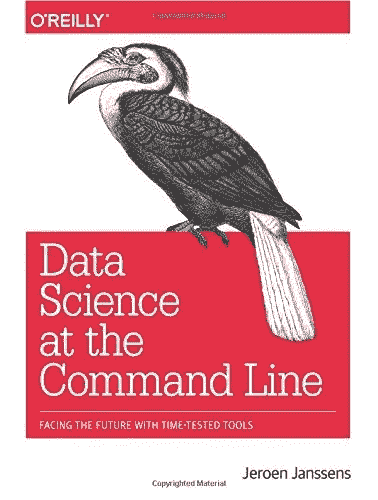

# 如何在命令行清理文本数据

> 原文：<https://towardsdatascience.com/how-to-clean-text-files-at-the-command-line-ce2ff361a16c?source=collection_archive---------32----------------------->

## 关于使用命令行工具清理数据的基础教程:tr、grep、sort、uniq、sort、awk、sed 和 csvlook


[JESHOOTS.COM](https://unsplash.com/@jeshoots?utm_source=unsplash&utm_medium=referral&utm_content=creditCopyText)在 [Unsplash](https://unsplash.com/s/photos/cleaning-kitchen?utm_source=unsplash&utm_medium=referral&utm_content=creditCopyText) 上拍照

清理数据就像清理你家的墙壁，你清除任何乱涂乱画，清除灰尘，过滤掉那些让你的墙壁变丑的不必要的东西，把它去掉。清理数据时也会发生同样的事情，过滤掉我们想要的，去掉我们不想要的，让原始数据变得有用而不再原始。您可以使用 Python、R 或任何您喜欢的语言进行清理，但在本教程中，我将通过一篇研究 clickbait 和非 clickbait 数据的论文来解释如何在命令行文件中清理文本文件。

# 提取并运行 docker 映像

为了消除下载我们处理的文件和我们需要的依赖关系的麻烦，我为你做了一个 docker 镜像，它包含了你需要的所有东西。你只需从 docker hub 中拉出它，就能找到你需要玩的东西，让你专注于清洁部分。所以让我们[提取那个图像](https://hub.docker.com/r/ezzeddin/clean-data)，然后交互地运行它以进入 shell 并编写一些命令行。

*   **docker run** 是运行 docker 镜像的命令
*   选项— **rm** 设置为在容器存在后移除容器
*   选项 **-it** 是 **-i** 和 **-t** 的组合，是为交互进程(shell)设置的
*   **ezzeddin/clean-data** 是 docker 图像名称

如果使用 docker 对你来说还不清楚，你可以看看[为什么我们使用 docker 教程](https://www.ezzeddinabdullah.com/posts/penguins-in-docker-a-tutorial-on-why-we-use-docker)

[](https://medium.com/swlh/penguins-in-docker-a-tutorial-on-why-we-use-docker-ce67cebf65f9) [## Docker 中的企鹅——关于我们为什么使用 Docker 的教程

### 关于 docker 以及如何构建 docker 文件、挂载卷和运行 docker 映像的基础教程

medium.com](https://medium.com/swlh/penguins-in-docker-a-tutorial-on-why-we-use-docker-ce67cebf65f9) 

# 清理文本文件

让我们清理两个文本文件，分别包含 16，000 篇文章的 [clickbait 和非 clickbait](https://github.com/bhargaviparanjape/clickbait/tree/master/dataset) headlines。这个数据来自于 *2016 年 IEEE/ACM 社交网络分析与挖掘进展国际会议(ASONAM)上的一篇题为: [**停止点击诱饵:检测和防止在线新闻媒体**](https://people.mpi-sws.org/~achakrab/papers/chakraborty_clickbait_asonam16.pdf) 中的点击诱饵的论文。*我们的目标是获得点击诱饵和非点击诱饵标题中最常用的词。

如果您列出容器中的内容，您会看到两个文本文件，分别名为 *clickbait_data* 和 *non_clickbait_data* 。让我们先看看我们想要的最终输出是什么。对于 clickbait 数据，我们希望最常见的 20 个单词以如下方式表示，并给出它们的计数:


作者图片

非点击诱饵标题中最常见的 20 个单词:


作者图片

让我们看看如何通过命令行一步一步地获取这些直方图。运行 docker 映像后，我们现在处于一个新环境的新 shell 中。让我们首先通过获取文件的前 10 行来看看 *clickbait_data* 文件有什么:

```
$ head clickbait_data
```

如此看来，这个文件的标题被标记为 clickbait，正如您所看到的:

```
Should I Get BingsWhich TV Female Friend Group Do You Belong InThe New "Star Wars: The Force Awakens" Trailer Is Here To Give You ChillsThis Vine Of New York On "Celebrity Big Brother" Is Fucking PerfectA Couple Did A Stunning Photo Shoot With Their Baby After Learning She Had An Inoperable Brain Tumor 
```

如果您使用 **head** 获取 *non_clickbait_data* 的第一行，您会发现:

```
Bill Changing Credit Card Rules Is Sent to Obama With Gun Measure Included
In Hollywood, the Easy-Money Generation Toughens Up
1700 runners still unaccounted for in UK's Lake District following floodYankees Pitchers Trade Fielding Drills for Putting Practice
Large earthquake rattles Indonesia; Seventh in two daysColdplay's new album hits stores worldwide this weekU.N. Leader Presses Sri Lanka on Speeding Relief to War Refugees in Camps
```

我们感兴趣的是单词而不是短语，所以我们可以得到从 3 个字母到更多字母的单词:

```
$ head clickbait_data | grep -oE '\w{3,}'
```

**这里使用 head clickbait_data** 是因为我们在这里对文件顶部的几个标题进行统计，这些标题通过管道传送到下一个 grep 命令 **grep -oE '\w{3，}'**

```
**grep
   -oE -o** for getting only matching words and **-E** for using extended regular expression which is the next pattern
   **‘\w{3,}’** this pattern is like **‘\w\w\w+’** which matches whole words with 3 letters or more
```

为了获得每个单词的计数，我们需要首先获得唯一的单词，我们可以通过带有选项 **-c** 的 **uniq** 命令获得这些单词，以便给你计数，但是要让 **uniq** 删除重复的单词，你需要首先排序:

```
$ head clickbait_data | grep -oE '\w{3,}' | sort | uniq -c
```

该命令在前 10 行执行，让我们在整个 clickbait 标题中执行:

```
$ cat clickbait_data | grep -oE '\w{3,}' | sort | uniq -c | sort -nr | head
```

*   **cat clickbait _ data | grep-oE ' \ w { 3，}' | sort | uniq -c** 我们现在将这个命令(获取 click bait 数据中的所有单词)放入下一个命令的标准输入中
*   **sort -nr** 以相反的顺序进行数字排序，首先得到最高的计数
*   **头**获取前 10 个常用单词

以下是前一个命令的输出:

```
 5538 You
   4983 The
   2538 Your
   1945 That
   1942 Are
   1812 This
   1645 And
   1396 For
   1326 What
   1242 Will
```

看起来我们现在很接近一个良好的状态，让我们看看我们能做些什么来更好地清理它。

如果我们深入观察


戴维·特拉维斯在 [Unsplash](https://unsplash.com/s/photos/glasses?utm_source=unsplash&utm_medium=referral&utm_content=creditCopyText) 上拍摄的照片

我们可以看到我们遗漏了小写字母和全部大写字母。例如，对于“你”这个词，我们漏掉了“你”，我们也漏掉了“你”。让我们试着看看这些单词是否已经存在:

```
$ cat clickbait_data | grep -oE '\w{3,}' | sort | uniq -c | sort -nr | grep you
$ cat clickbait_data | grep -oE '\w{3,}' | sort | uniq -c | sort -nr | grep YOU
```

所以我们可以看到:

```
 1 your
      1 you
      1 YOUR
      1 YOU
```

我们少了两个单词，每个单词都有助于我们计算“You”和“Your”的出现次数，使它们分别为 5540 和 2540。

我们首先需要做的是使用 **tr** 将每个大写字母转换成小写字母，tr 是一个命令行实用程序，用于翻译字符:

```
$ cat clickbait_data | tr '[:upper:]' '[:lower:]'| grep -oE '\w{3,}' | sort | uniq -c | sort -nr | head
```

**tr '[:upper:]' '[:lower:]'** 这里将 *clickbait_data* 的内容翻译成小写。 **['upper']** 是代表所有大写字符的字符类，而 **['lower']** 是代表所有小写字符的字符类。

为了在标题前添加这些值，我们可以使用 **sed** 来放置两个列名来表示每一列:

```
$ cat clickbait_data | tr '[:upper:]' '[:lower:]'| grep -oE '\w{3,}' | sort | uniq -c | sort -nr | sed '1i count,word' | head
```

**sed '1i count，word'** 所以我们用 *count* 表示出现的次数，用 *word* 显然表示这个单词

**此处使用 1i** 将这两个字写在第一行，文件中的更改将会到位

输出:

```
count,word 
5540 you
4992 the
2540 your
1950 that
1944 are
1812 this
1653 and
1397 for
1326 what
```

为了以漂亮的形状打印出来，我们可以使用 **csvlook** 来得到这个:

```
| count        | word |
| ------------ | ---- |
|    5540 you  |      |
|    4992 the  |      |
|    2540 your |      |
|    1950 that |      |
|    1944 are  |      |
|    1812 this |      |
|    1653 and  |      |
|    1397 for  |      |
|    1326 what |      |
```

一点也不好看。发生这种情况的原因是 **csvlook** 的工作方式正如其名称所表明的那样，是为了更好地寻找 CSV 文件，所以我们应该先有一个 CSV(逗号分隔值)文件。然后，我们应该找到一种方法，用逗号分隔每行的每个值。在这一点上，我们可以使用 **awk** ，它是一种面向模式的扫描和处理语言:

```
**awk '{print $1","$2}'
'{
     print $1** here prints the first field (which is the count column)   followed by…
     **“,”** a comma followed by…
     **$2** the second field which is the word column
**}'**
```

看起来我们现在的情况好多了:

```
| count | word |
| ----- | ---- |
| 5,540 | you  |
| 4,992 | the  |
| 2,540 | your |
| 1,950 | that |
| 1,944 | are  |
| 1,812 | this |
| 1,653 | and  |
| 1,397 | for  |
| 1,326 | what |
```

如果我们想在第一个字段中得到 word 列，在第二个字段中得到 count 列，我们只需要颠倒 **awk** 和 **sed** 命令中的顺序:

```
$ cat clickbait_data | tr '[:upper:]' '[:lower:]'| grep -oE '\w{3,}' | sort | uniq -c | sort -nr | awk '{print $2","$1}' | sed '1i word,count' | head | csvlook
```

为了让非点击诱饵数据得到相同的输出，我们只需更改文件名:

```
$ cat **non_clickbait_data** | tr '[:upper:]' '[:lower:]'| grep -oE '\w{3,}' | sort | uniq -c | sort -nr | awk '{print $2","$1}' | sed '1i word,count' | head | csvlook
```

# 深入了解 clickbait 研究

在由[论文](https://people.mpi-sws.org/~achakrab/papers/chakraborty_clickbait_asonam16.pdf)报道的这项研究中，它解决了点击诱饵和非点击诱饵标题，以便能够检测这两种标题

> 大多数在线新闻媒体严重依赖读者点击产生的收入，由于众多此类媒体的存在，它们需要相互竞争以吸引读者的注意力。

因此，本教程中的内容是一种通过命令行清理数据的方法，以便我们可以对这篇论文的结果有所了解，并看看我们是否可以通过他们的研究获得这篇论文所声称的一些观点。

我们再来看一下这个数据的 clickbait 标题最常见的 20 个词的最终分布情况是:


作者图片

我们可以明显地看到所有格*有*的过度使用，而没有使用第三人称指称像*他，她，*或一个特定的名字

还有*你的*可能会出现在 clickbait 常用的短语中，比如“Will Blow Your Mind”。此外，我们还可以找到常用的限定词，如这个、那个、哪个

> *让用户对所引用的对象好奇，并说服他们进一步探究文章。*

另一方面，非点击诱饵标题的最常见的 20 个单词的分布是:


作者图片

我们可以在这里看到非所有格词，如*澳大利亚人、总统、奥巴马*以及其他一些在两者中都可能出现的词。

# 最后的想法

clickbait 论文建议进行比我们在这里所做的更深入的研究，但是我们可以通过命令行中的一行代码获得一些有价值的见解。我们学习了如何使用 **tr** 翻译字符，使用 **grep** 过滤出从 3 个字母开始的单词，使用 **sort** 和 **uniq** 获得单词出现的直方图，使用 **awk** 在我们想要的位置打印字段，使用 **sed** 将标题放入我们正在处理的文件。

感谢您来到这里！

# 动机是

*   Abhijnan Chakraborty、Bhargavi Paranjape、Sourya Kakarla 和 Niloy Ganguly。“阻止点击诱饵:检测和防止在线新闻媒体中的点击诱饵”。2016 年美国旧金山 2016 年 8 月 IEEE/ACM 社交网络分析和挖掘进展国际会议(ASONAM)论文集
*   [点击诱饵和非点击诱饵数据集](https://github.com/bhargaviparanjape/clickbait/tree/master/dataset) ‍
*   ‍ [数据科学在命令行](https://www.amazon.com/Data-Science-Command-Line-Time-Tested/dp/1491947853) ‍
*   [10 个用于 Linux 数据分析的命令行工具](https://opensource.com/article/17/2/command-line-tools-data-analysis-linux) ‍
*   [信息图:在 Python 中执行文本数据清理的步骤](https://bicorner.com/2015/11/10/infographic-steps-to-perform-text-data-cleaning-in-python/)

本教程主要由命令行的[数据科学推动。](https://amzn.to/33y5EkR)



来源:[亚马逊产品](https://amzn.to/33y5EkR)

> *披露:这本书的亚马逊链接(在这一部分)是付费链接，所以如果你买这本书，我会有一个小的佣金*

这本书试图在您执行数据科学任务时吸引您对命令行功能的注意，这意味着您可以使用命令行获取数据、操作数据、探索数据并做出预测。如果你是一名数据科学家，渴望成为，或者想了解更多，我强烈推荐这本书。你可以从[网站](https://www.datascienceatthecommandline.com/)或[上免费在线阅读，或者订购电子书或平装本](https://amzn.to/33y5EkR)。在本教程中，我们将重点关注使用命令行来清理我们的数据。

# 最初发布

[](https://www.ezzeddinabdullah.com/posts/how-to-clean-text-data-at-the-command-line) [## 如何在命令行清理文本数据

### 清理数据就像清理你家的墙壁，你清除任何乱涂乱画，清除灰尘，并过滤掉那些…

www.ezzeddinabdullah.com](https://www.ezzeddinabdullah.com/posts/how-to-clean-text-data-at-the-command-line) 

‍