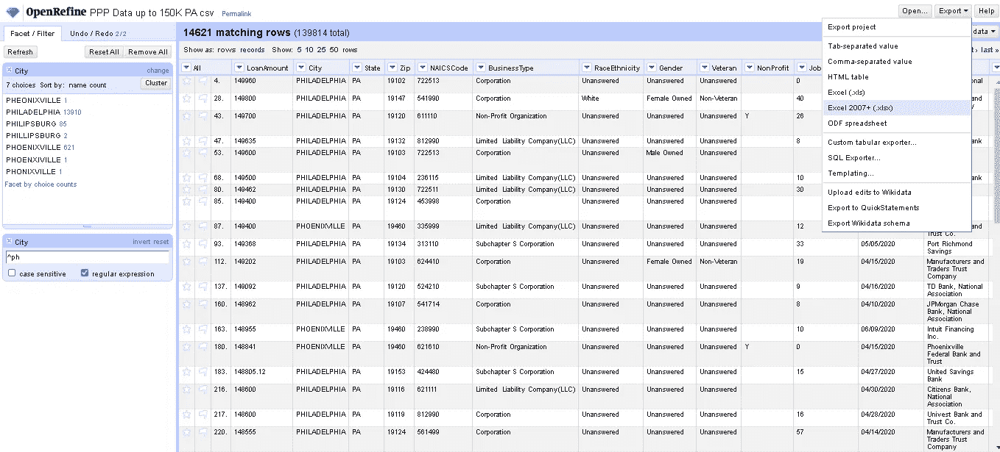

# 如何清理杂乱的数据？

> 原文：<https://towardsdatascience.com/how-to-clean-up-messy-data-9a8376475c67?source=collection_archive---------59----------------------->

## 使用 OpenRefine

图片来源:[基思·麦纽提](https://www.linkedin.com/posts/keith-mcnulty_datascientists-datascience-rstats-activity-6686524168160219136-Lxeb)

我在 Linkedin 上看到一个帖子，提到了一个数据集，其中城市**费城的拼写是 57(！)不同的方式**，并询问数据科学家对处理数据质量问题的看法。来自同一个宾夕法尼亚州的 57 种亨氏酱有什么联系吗？:-)

我看到另外两个[的帖子](https://twitter.com/dataeditor/status/1280278987797942272?s=21)也在讨论这个问题，评论从收集这些数据的应用程序应该有更好的验证到人们应该学习如何拼写。嗯，有时候在数据科学家/数据工程师的工作中，你确实会遇到这样的数据质量问题，你只需要处理它。也许您可以实现更好的控制，以便在将来获得更好的数据，但是如果您想要使用已经收集的数据，就必须对其进行清理。在这篇文章中，我将展示如何用免费数据辩论工具 open refine 解决这个问题。

## OpenRefine

OpenRefine(原名 Google Refine)是一个强大的工具，无需任何编码就可以轻松转换数据。而如果你是程序员，你可以使用 GREL(Google Refine Expression Language，类似于 Excel 公式)来做一些复杂的数据转换。这个工具有趣的一面是，它是免费的、开源的，可以本地安装在你的笔记本电脑上，所有的数据处理都在本地完成。**数据永远不会离开你的电脑**。我在数据迁移项目中使用过 OpenRefine，遗留应用程序有包含地址、姓名等的自由文本字段，需要在迁移到目标系统之前进行标准化和转换，它工作得非常好。

## 我们可以在哪里使用 OpenRefine？

混乱文本的例子

当我们有杂乱的文本数据时，就像在这个例子中一样(顶部条目是正确的)，同一个单词拼写错误，大小写字符混合，有些有前导或尾随空格，空白字符，扩展西文字符，名字和姓氏顺序混淆，日期以不同的方式书写，我们可以使用 Open Refine 来清理它。

**PPP 数据集上的 open refine**

*   数据集:数据来自美国的 PPP(工资保障计划),包含新冠肺炎危机期间小企业贷款的数据。让我们以宾夕法尼亚州的[数据集为例，获取 15 万美元以下的贷款。](https://www.sba.gov/funding-programs/loans/coronavirus-relief-options/paycheck-protection-program?utm_medium=email&utm_source=govdelivery#section-header-11)
*   OpenRefine:下载 [OpenRefine v3.3](https://openrefine.org/download.html) 。安装完成后，运行 OpenRefine.exe 文件，这将在浏览器中打开一个指向 127.0.0.1:3333 的窗口。

**创建一个项目**
该工具会打开一个选项来创建一个项目。我们可以从不同的文件格式(JSON、CSV、固定宽度等)和来源(本地计算机和直接从网络)导入数据。

创建项目-加载数据

OpenRefine 读入文件内容，尝试自动识别不同的列和标题，并显示预览。如果需要，我们可以修改设置。一旦我们对预览感到满意，我们可以点击“创建项目”。

文件解析选项

OpenRefine 然后加载数据并显示一个类似于电子表格的视图。我们可以单击列顶部的向下箭头，查看我们可以对数据进行的各种数据转换。

数据被加载到项目中

让我们来看看列城。我们有兴趣看到费城拼写错误的条目。为了方便地查看分布情况，我们可以过滤以 ph 开头的行(假设至少前两个字符拼写正确:-))。我们可以使用正则表达式'^ph'.字符'^'确保只显示以 ph 开头的城市。这并不是绝对必要的，但是这有助于限制我们在 facet 窗口中容易看到的条目的变化。

文本过滤器

然后，我们添加一个文本方面，它显示列“city”中每个不同值的行数。正如你所看到的，费城的拼写有相当多的变化。

添加文本方面

**编辑文本 inline**
如果有一个条目需要更正，我们可以直接点击该条目旁边的编辑并替换该值。如果我们要替换几个值，这没问题。

编辑单个条目

**集群和编辑** 但是如果我们有太多的变化需要用单个值替换，我们可以选择基于一些内置方法对条目进行集群，然后一次性编辑它们。

聚类和编辑

点击聚类按钮，打开一个窗口，其中的条目根据默认方法“按键碰撞”和功能“指纹”聚类在一起。我们可以改变键控函数，看到条目以不同的方式聚集。

聚类方法和函数

一旦我们对集群满意了，我们就可以继续为这些集群提供新的值。如果“键碰撞”没有得到想要的结果，我们可以尝试另一种方法“最近邻”。我们还可以重复聚类和编辑。我们不需要知道函数的所有内部工作原理来使用它，尽管如果你好奇的话,[文档](https://github.com/OpenRefine/OpenRefine/wiki/Clustering-In-Depth)是一个有趣的读物。

随意试验不同的方法，选择最适合给定数据的方法。对于这个数据集，半径为 8 的 Levensthein 距离给出了最好的结果。

经过几次重新聚类，我们已经纠正了费城所有不正确的条目。

我们到目前为止所做的所有手动**清洁动作**都被**记录**。我们可以看到它们作为一系列步骤列在“撤销/重做”下面。我们可以返回到任何步骤，并在该步骤结束时看到结果。如果我们对某个特定的步骤不满意，我们可以只做另一个清洁动作，然后覆盖这个步骤。

一旦我们对结果满意，我们就可以**导出干净的数据**。

以不同格式导出清理后的数据

总之，OpenRefine 是一个有效的数据辩论工具

1.  你不需要成为一个程序员来使用它。它就像一个电子表格，很容易处理。
2.  **数据清理规则的交互式可视化规范**有助于共同提出动态数据修正规则。当您需要从业务领域的主题专家那里获得意见时，这非常有用，因为他们更喜欢看数据而不是代码。
3.  所有清洁动作都被记录为 JSON 脚本，这有助于**再现性**和**自动化**(将在另一篇文章中具体阐述)

## 对于特定的数据清理来说，这听起来不错，但是我们能在自动化的数据清理管道中使用它吗？

当然，你可以！。

OpenRefine 有一些我们可以使用的客户端库。我会写一篇关于如何使用 **Python 和 OpenRefine** 建立数据清理管道的帖子。敬请关注…

## 资源

我们只讨论了 OpenRefine 的一小部分特性。它能提供更多的东西。伊利诺伊大学和杜克大学 T21 分校有很好的教程让你入门。

> 开始的方法是停止说话，开始行动——华特·迪士尼