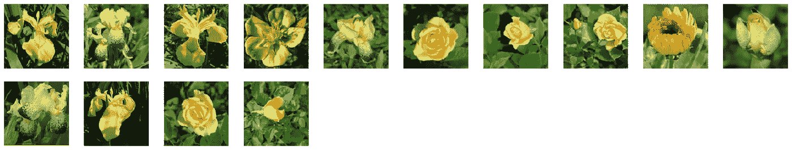
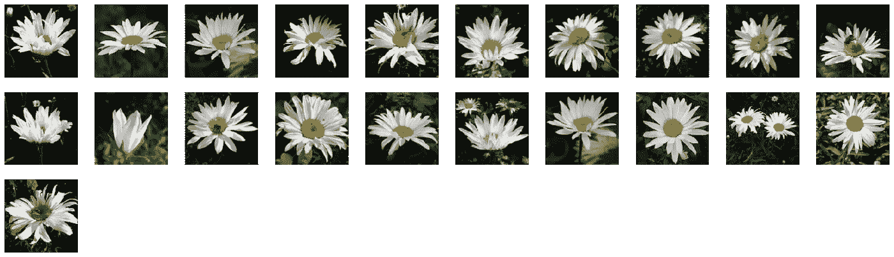
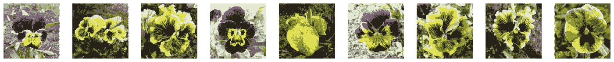

# 如何基于视觉相似性对图像进行聚类

> 原文：<https://towardsdatascience.com/how-to-cluster-images-based-on-visual-similarity-cd6e7209fe34?source=collection_archive---------1----------------------->

## 使用预训练的神经网络进行特征提取，并使用 K-means 对图像进行聚类。


由 [Unsplash](https://unsplash.com?utm_source=medium&utm_medium=referral) 上的 [Pietro Jeng](https://unsplash.com/@pietrozj?utm_source=medium&utm_medium=referral) 拍摄

# 目标

在本教程中，我将指导您使用预训练的神经网络从图像中提取特征向量，并根据特征向量的相似程度对图像进行聚类。

## **车型**

本教程将使用的预训练模型是 VGG16 卷积神经网络(CNN)，它被认为是图像识别任务的最先进技术。我们将仅使用该模型作为特征提取器，这意味着我们将移除最终(预测)层，以便我们可以获得特征向量。

## 数据

这个实现将使用 Kaggle 的 flowers 数据集，您可以从这里下载。该数据集包含 10 种不同花卉的 210 张图片，这些图片将被下载为 *png* 文件。

## 进口

在我们开始之前，我们需要导入所需的模块，以便加载/处理图像以及提取和聚类我们的特征向量的模块。

导入报表

*   **load_img** 允许我们从文件中加载一张图片作为 PIL 对象
*   **img_to_array** 允许我们将 PIL 对象转换成 NumPy 数组
*   **preprocess _ input**用于将图像准备成模型要求的格式。您应该使用 Keras **load_img** 函数加载图像，以便确保您加载的图像与 **preprocess_input** 函数兼容。
*   VGG16 是我们将要使用的预训练模型
*   **k 表示我们将要使用的聚类算法**
*   **PCA** 用于降低我们特征向量的维数

## 加载数据

既然数据已经下载到您的计算机上，我们希望 python 指向图像所在的位置。这样，我们不用加载完整的文件路径，只需使用文件名即可。

加载数据

```
# view the first 10 flower entries
print(flowers[:10])output:
['0001.png', '0002.png', '0003.png', '0004.png', '0005.png', '0006.png', '0007.png', '0008.png', '0009.png', '0010.png']
```

现在我们已经将所有的文件名加载到花的列表中，我们可以开始预处理图像了。

## 数据预处理

这就是我们使用 **load_img()** 和 **preprocess_input()** 方法的地方。加载图像时，我们将目标大小设置为(224，224 ),因为 VGG 模型期望它接收的图像是 224x224 NumPy 数组。

加载图像

目前，我们的阵列只有 3 个维度(行、列、通道),并且该模型在批量样本中运行。所以我们需要扩展我们的数组来增加维度，让模型知道我们给了它多少图像(样本数，行数，列数，通道数)。

图像整形

```
 Number of dimensions: 4 
Number of images (batch size): 1 
Number of rows (0th axis): 224 
Number of columns (1st axis): 224 
Number of channels (rgb): 3
```

最后一步是将整形后的数组传递给 **preprocess_input** 方法，我们的图像就可以加载到模型中了。

预处理输入

## 模型

现在我们可以加载 VGG 模型并手动移除输出层。这意味着新的最终层是具有 4，096 个输出节点的全连接层。这个 4，096 个数字的向量是我们将用来对图像进行聚类的特征向量。

现在，最后一层被删除，我们可以通过我们的图像通过**预测**方法来获得我们的特征向量。

下面是一个函数中的所有代码

特征提取流水线

现在我们可以使用这个 **feature_extraction** 函数从所有图像中提取特征，并将这些特征存储在一个以文件名为关键字的字典中。

```
Wall time: 56.2 s
```

## 降维(PCA)

由于我们的特征向量有 4000 多个维度，如果你将维度数量从 4000 减少到一个更小的数字，你的计算机会感谢你。我们不能简单地通过切片或使用它的子集来缩短列表，因为我们会丢失信息。如果有一种方法可以在保留尽可能多的信息的同时降低维度就好了。

进入主成分分析的领域。

我不打算浪费时间解释什么是 PCA，因为已经有成吨的文章解释它，我将在这里链接。

简单地说，如果您正在处理数据，并且有许多变量需要考虑(在我们的例子中是 4096)，PCA 允许您减少变量的数量，同时尽可能多地保留原始数据集中的信息。

要减少的维度数量由您决定，我相信有一种方法可以找到最佳的组件数量，但在这种情况下，我只是选择 100 作为一个任意的数字。

```
print(f"Components before PCA: **{**f.shape[1]**}**")
print(f"Components after PCA: **{**pca.n_components**}**")Components before PCA: 4096
Components after PCA: 100
```

现在我们有了一个更小的特征集，我们可以对我们的图像进行聚类了。

## [**k 均值**聚类](/k-means-clustering-algorithm-applications-evaluation-methods-and-drawbacks-aa03e644b48a)

> 您将定义一个目标数 k，它是指数据集中所需的质心数。质心是代表群集中心的虚拟或真实位置。

该算法将允许我们将我们的特征向量分组为 k 个簇。每个聚类应该包含视觉上相似的图像。在这种情况下，我们知道有 10 种不同的花，所以 k = 10。

```
kmeans.labels_
```

【6，6，8，6，6，5，4，6，5，6，4，6，3，3，5，6，6，4，4，8，1，
3，8，4，2，8，4，2，6，9，7，4，4，0，5，4，4，9，8，5，9，3，6，6，
5，1，3，9，6，5，0，1，3，9，6，7，4，4，5 5，0，5，1，2，9，5，4，8，1，
7，1，3，5，4，8，5，4，6，9，5，9，5，8，5，8，1，4，9，8，5，4，5，6，
4，1，8，9，4，6，5，7，5，6，4，8，1，4，5，5，8，6，5，2，4，8，8，
5，1，1，1，6，6，6 9，0，4，0，6，4，9，0，3，5，0，3，9，9，4，9，5，0，9，5，5，4，
5，1，8，3，6，4，5，2，6，6，9，5，0，3，3，5，4，5，0，9，4，
2，1，0，9，4，9，1，2，6，1，6，0

列表中的每个标签都是数据集中每个图像的聚类标识符。标签的顺序与每个图像的文件名列表平行。这样，我们可以将图像分组到它们的簇中。

```
# view the filenames in cluster 0
groups[0]output: 
['0035.png',
 '0051.png',
 '0080.png',
 '0149.png',
 '0150.png',
 '0157.png',
 '0159.png',
 '0163.png',
 '0166.png',
 '0173.png',
 '0189.png',
 '0196.png',
 '0201.png',
 '0210.png']
```

我们剩下要做的就是查看一个集群，通过检查集群来了解我们的模型表现如何。

## 群集 0



## 群组 1



## 群组 2



这里我们可以看到我们的模型在花的图像聚类上做得很好。我们甚至可以看到聚类 2 和聚类 0 都有黄色的花，但是每个聚类中的花的类型是不同的。

# 结论

下面是一个文件中的整个过程。

希望你们都学到了新的东西，如果有任何问题或有顿悟时刻，请留下评论:)

## 参考

*   [用于特征提取的迁移学习](https://machinelearningmastery.com/how-to-use-transfer-learning-when-developing-convolutional-neural-network-models/)
*   [PCA](/pca-using-python-scikit-learn-e653f8989e60)