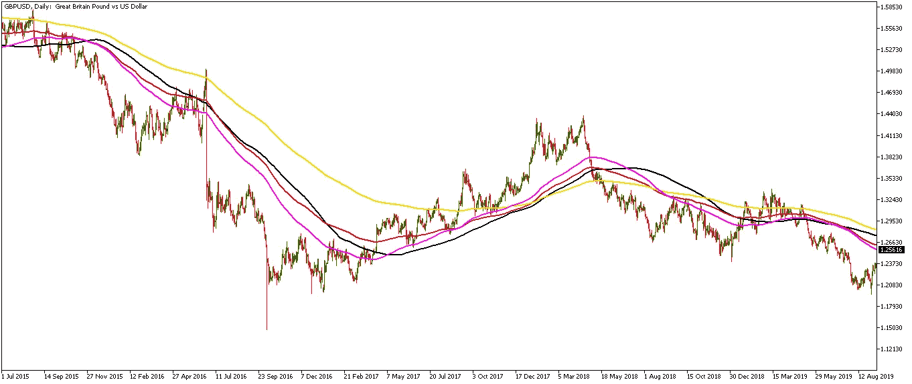
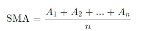
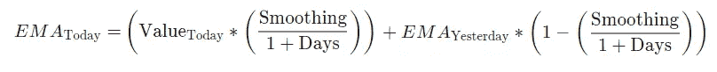
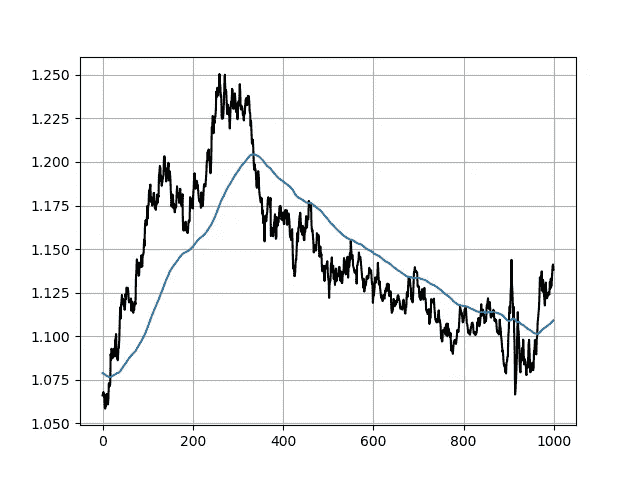
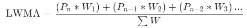
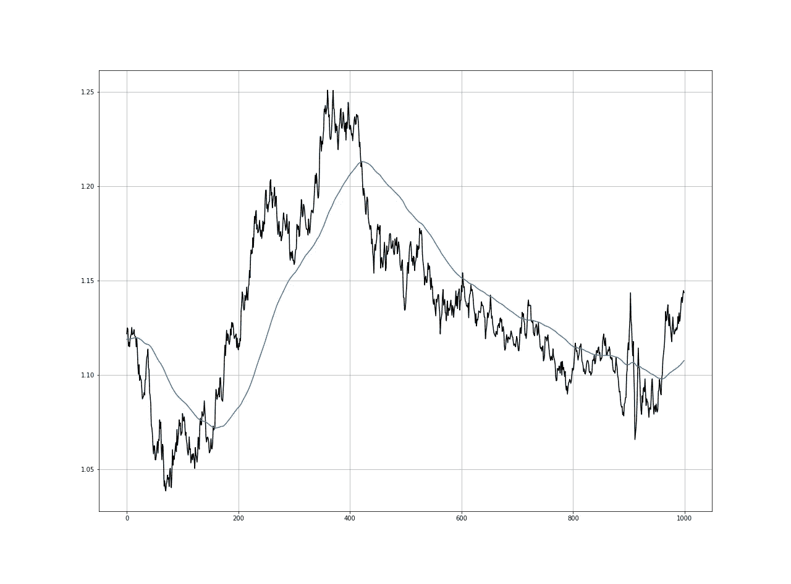

# 如何用 Python 编写不同类型的移动平均线？

> 原文：<https://towardsdatascience.com/how-to-code-different-types-of-moving-averages-in-python-4f8ed6d2416f?source=collection_archive---------15----------------------->

## 用 Python 编写不同类型的移动平均线。

交易软件带有不同类型的移动平均线，已经预先安装并准备好了。但是理解如何计算这些移动平均线是很有趣的，以便在回测潜在策略时能够使用它们。

在 Python 的 ***新技术指标成功后，我刚刚出版了一本新书。它对复杂的交易策略进行了更完整的描述和补充，Github 页面致力于不断更新代码。如果你对此感兴趣，请随时访问下面的链接，或者如果你喜欢购买 PDF 版本，你可以在 Linkedin 上联系我。***

[](https://www.amazon.com/gp/product/B09919GQ22/ref=as_li_tl?ie=UTF8&camp=1789&creative=9325&creativeASIN=B09919GQ22&linkCode=as2&tag=sofien-20&linkId=bc5df3f6ab0f3af2df79641c56b949ba) [## 交易策略之书

### 亚马逊网站:交易策略之书(9798532885707): Kaabar，Sofien:书籍

www.amazon.com](https://www.amazon.com/gp/product/B09919GQ22/ref=as_li_tl?ie=UTF8&camp=1789&creative=9325&creativeASIN=B09919GQ22&linkCode=as2&tag=sofien-20&linkId=bc5df3f6ab0f3af2df79641c56b949ba) 

如果你想要一个自己动手的方法，那么下面的肯定会让你感兴趣。所需要的只是 SPYDER 这样的 python 解释器。不同的“已知”移动平均线类型有:

*   ***简单移动平均线。***
*   **指数移动平均线。**
*   ***平滑移动平均线。***
*   ***线性加权移动平均线。***

我们将逐一介绍，定义，编码，并绘制图表。



GBPUSD 每日图表。黑色的是 200 日均线，深红色的是 200 日均线，黄色的是 200 日平滑均线，粉色的是 200 日线性加权均线。

# 简单移动平均线

顾名思义，这是一个简单的平均数，在统计学和我们生活中的任何地方都会用到。它就是观察值的总和除以观察次数。

从数学上来说，它可以写成:



在 python 中，我们可以定义一个计算移动平均值的函数，如下所示:

```
def ma(Data, period, onwhat, where):

    for i in range(len(Data)):
            try:
                Data[i, where] = (Data[i - period:i + 1, onwhat].mean())

            except IndexError:
                pass
    return Data
```

该函数采用由**数据**变量表示的数据结构，移动平均周期(20、60、200 等。)由 **period** 变量表示，您希望对其应用什么(在 OHLC 数据结构上，选择 3 表示收盘价，因为 python 索引从零开始)由 what 变量表示， **where** 变量是您希望移动平均线列出现的位置。请注意，您必须有一个超过 4 列的数组才能工作，因为它不会自动创建一个新列，而是简单地填充它。


欧元兑美元每日时间跨度，200 天简单移动平均线。

# 指数移动平均线

与简单的移动平均线给所有的观察值相同的权重相反，指数移动平均线给最近的观察值更多的权重。它比简单的移动平均线对最近的变动反应更大。

从数学上来说，它可以写成:



平滑因子通常为 2。请注意，如果我们增加平滑因子(也称为 alpha ),那么最近的观测值将具有更大的权重。

在 python 语言中，我们可以定义一个函数来计算 EMA，如下所示:

```
def ema(Data, alpha, window, what, whereSMA, whereEMA):

    # alpha is the smoothing factor
    # window is the lookback period
    # what is the column that needs to have its average calculated
    # where is where to put the exponential moving average

    alpha = alpha / (window + 1.0)
    beta  = 1 - alpha

    # First value is a simple SMA
    Data[window - 1, whereSMA] = np.mean(Data[:window - 1, what])

    # Calculating first EMA
    Data[window, whereEMA] = (Data[window, what] * alpha) + (Data[window - 1, whereSMA] * beta)# Calculating the rest of EMA
    for i in range(window + 1, len(Data)):
            try:
                Data[i, whereEMA] = (Data[i, what] * alpha) + (Data[i - 1, whereEMA] * beta)

            except IndexError:
                pass
    return Data
```

该函数是不言自明的，因为它只是复制了上面介绍的 EMA 函数。



欧元兑美元每日时间跨度，200 天指数移动平均线。

# 平滑移动平均值

该移动平均线考虑了总体情况，受近期走势的影响较小。这是我最喜欢的趋势跟踪指标。从数学上来说，简单地将 EMA 函数中的 Days 变量乘以 2 再减去 1 就可以得到。这意味着，要将指数移动平均线转换为平滑移动平均线，我们需要遵循 python 语言中的等式，即将指数移动平均线转换为平滑移动平均线:

```
smoothed = (exponential * 2) - 1 # From exponential to smoothed
```


200 天平滑移动平均线的欧元兑美元每日时间范围。

# 线性加权移动平均

这是一个简单的移动平均线，更重视最近的数据。最近的观察值具有最大的权重，并且在它之前的每个观察值具有逐渐减小的权重。直觉上，它比其他移动平均线有更少的滞后，但它也是最少使用的，因此，它在滞后减少方面的收益，失去了受欢迎的程度。

从数学上来说，它可以写成:



在 python 语言中，我们可以定义一个计算移动平均值的函数，如下所示:

```
def lwma(Data, period): weighted = [] for i in range(len(Data)):
            try:
                total = np.arange(1, period + 1, 1) # weight matrix

                matrix = Data[i - period + 1: i + 1, 3:4]
                matrix = np.ndarray.flatten(matrix)
                matrix = total * matrix # multiplication
                wma = (matrix.sum()) / (total.sum()) # WMA
                weighted = np.append(weighted, wma) # add to array except ValueError:
                pass return weighted
```



200 天加权移动平均线的欧元兑美元每日时间范围。

基本上，如果我们有一个由两个数字[1，2]组成的数据集，并且我们想要计算一个线性加权平均值，那么我们将执行以下操作:

*   (2 x 2) + (1 x 1) = 5
*   5 / 3 = 1.66

这假设数字为 2 的时间序列是最近的观察结果。

如果你也对更多的技术指标和使用 Python 创建策略感兴趣，那么我关于技术指标的畅销书可能会让你感兴趣:

[](https://www.amazon.com/gp/product/B08WZL1PNL/ref=as_li_tl?ie=UTF8&camp=1789&creative=9325&creativeASIN=B08WZL1PNL&linkCode=as2&tag=sofien-20&linkId=e3cb9716bb6a07cf6c8b9fb585412b07) [## Python 中的新技术指标

### 亚马逊网站:Python 中的新技术指标(9798711128861): Kaabar，Sofien 先生:书籍

www.amazon.com](https://www.amazon.com/gp/product/B08WZL1PNL/ref=as_li_tl?ie=UTF8&camp=1789&creative=9325&creativeASIN=B08WZL1PNL&linkCode=as2&tag=sofien-20&linkId=e3cb9716bb6a07cf6c8b9fb585412b07) 

# 结论

那么，选哪个呢？这个问题留给交易者的风险状况和她对均线的熟悉程度。一些人更喜欢简单的移动平均线，而另一些人试图通过使用指数和平滑移动平均线的组合来深入研究。找到你最喜欢的一个完全取决于你。我的建议？考虑长期移动平均线。

***注来自《走向数据科学》的编辑:*** *虽然我们允许独立作者根据我们的* [*规则和指导方针*](/questions-96667b06af5) *发表文章，但我们不认可每个作者的贡献。你不应该在没有寻求专业建议的情况下依赖一个作者的作品。详见我们的* [*读者术语*](/readers-terms-b5d780a700a4) *。*


[https://pix abay . com/photos/trading-analysis-forex-chart-643722/](https://pixabay.com/photos/trading-analysis-forex-chart-643722/)