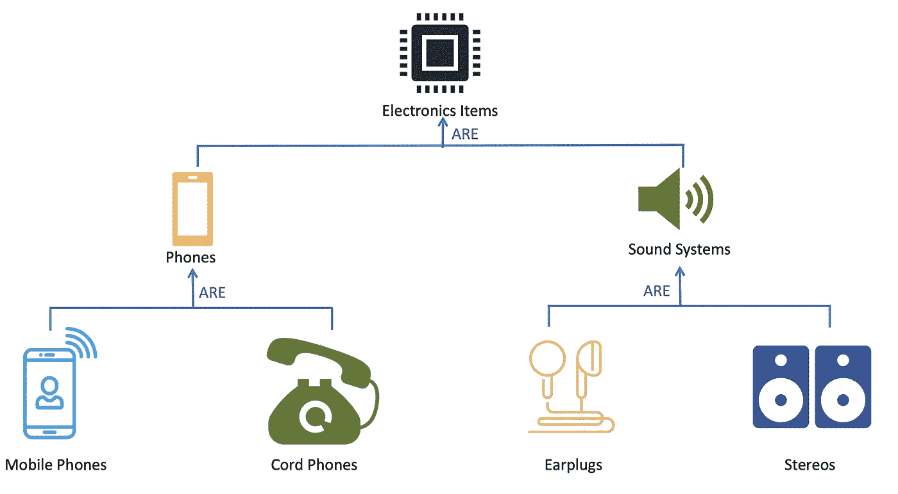
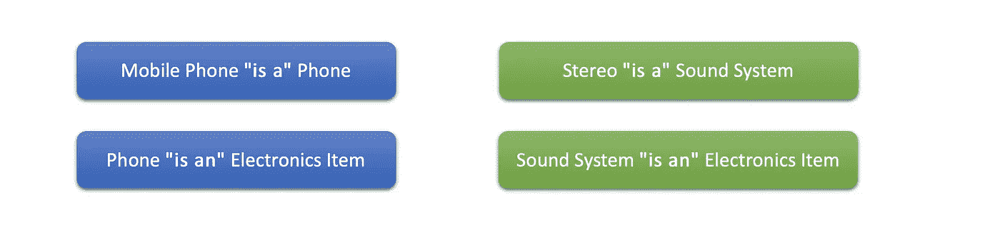
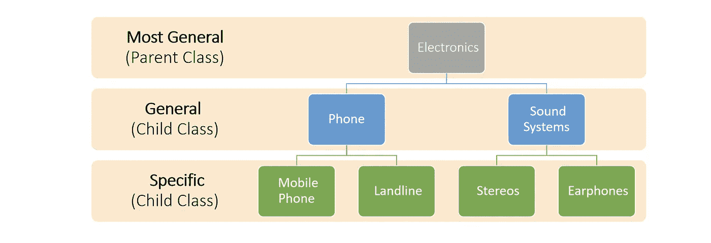
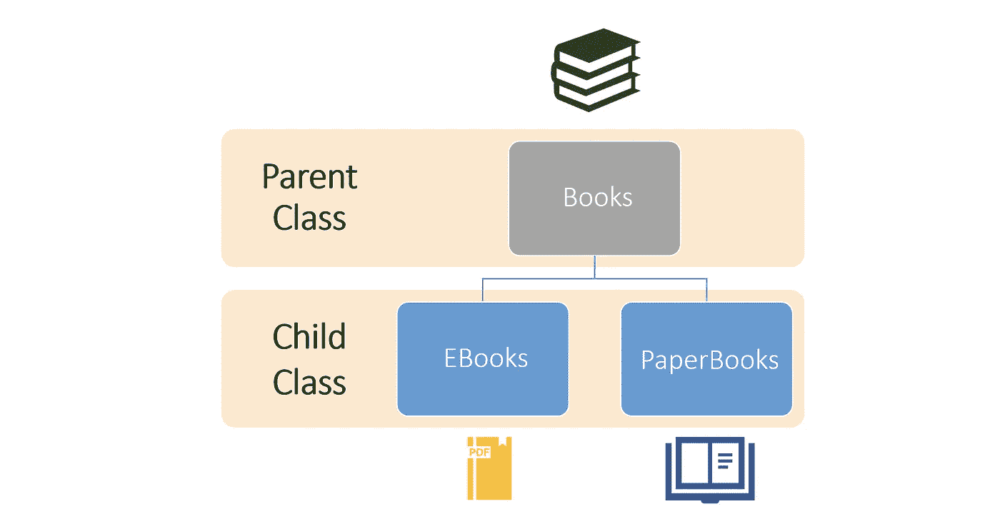
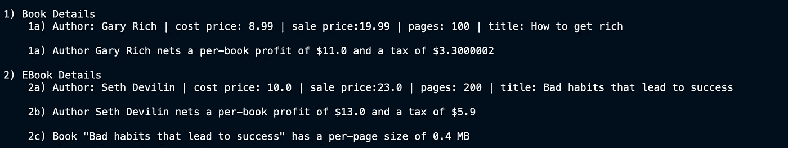
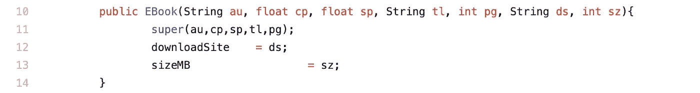

# 如何在 Java 中编写继承代码——面向对象的初学者教程

> 原文：<https://towardsdatascience.com/how-to-code-inheritance-in-java-beginners-tutorial-in-oop-d0fc0a71be98?source=collection_archive---------19----------------------->

## 面向对象编程

## 让我们来理解面向对象编程中“继承”的概念

[亨利&公司](https://unsplash.com/@hngstrm?utm_source=medium&utm_medium=referral)在 [Unsplash](https://unsplash.com?utm_source=medium&utm_medium=referral) 上拍摄的照片

韦氏在线词典将遗传定义为*从过去几代人那里获得一种财产、条件或特征。*在[面向对象设计中](/beginners-in-java-getting-started-with-oop-6398f0dcdf86)继承有相似(不完全相同)的内涵。继承意味着

1.  以层次结构组织班级
2.  较高层次从较低层次继承属性
3.  把相似的东西归入同一类
4.  等级越高，等级就从一般到特殊

层次结构看起来如何|由[像素完美制作的图标](https://www.flaticon.com/authors/pixel-perfect)来自[www.flaticon.com](http://www.flaticon.com/)

这意味着最基本的类，也称为**基类**，将是最通用的一个。它也被称为父类或超类。例如,“电子产品”是基类，它的**子类**将是“手机”或“音响系统”。

> 要了解更多关于构造类的基础知识，关于字段、方法和构造函数的细节，你可以参考这篇文章。

使用数学符号，手机是电子设备的子集，但却是固定电话的超集。级别之间的对应关系通常被称为 ***“是”关系*** ，即电话是电子产品，座机是电话

**是/是**的层次关系

随着我们在等级中的地位越来越高，我们变得越来越具体。

等级和一般性

这种分层设计非常有用，因为它促进了代码的重用。共同的功能可以归入同一个类别，而不同的行为可以形成特定的情况或子类。

用专业术语来说，我们说子类 ***扩展了超类*** 。当使用继承时，子类自动从超类继承所有的**方法**(除了构造函数)。子类通过以下两种方法将其自身与其超类区分开来。

1.  它可以 ***通过添加新字段和新方法来扩充*** 超类。
2.  它 ***通过提供现有方法的新实现来覆盖*** 现有行为。

> 类—一组相似的对象
> 字段—类的属性
> 对象—类的实例
> 方法—可应用于对象的操作
> 构造函数—用于创建对象的操作

# 理论够了。我们来编码吧！

作为一个更简单的例子，让我们考虑下面的层次。图书作为基类，电子书和纸质书作为 2 个子类。

[图标来源](http://Icons made by Pixel perfect from www.flaticon.com)

*   **图书字段** —作者姓名、成本价、售价、书名和页数
*   **记账方法** —净利润()和 getTax()
*   **电子书字段** —下载网站和大小 MB
*   **电子书方法** — pageSize()，printTitle()和 getTax()

请注意，书籍字段是每本书都必须具有的属性。因为电子书将从 book 类继承，所以它将拥有 book 类的字段以及它自己的 2 个字段。

现在要注意的是，ebook 不仅可以访问 book 类的两个方法，即 netProfit()和 getTax()，而且还可以修改它们。请注意下面代码中对税收计算的修改。在下面的代码中，注意 EBook 是如何通过使用关键字 **extends 来继承 Book 的。**

*   **增强** — EBook 类通过添加字段 downloadSite 和 sizeMB 以及添加方法 pageSize()来增强 Book 类。注意，downloadSite 与纸质书无关，所以不能放在 Book 类中。此外，pageSize()是以 MBs 为单位测量的，因此它只适用于电子书。
*   **撤销—** 除了 30%的利润税之外，电子书还要额外支付 2 美元的税。在这里，我们可以看到 EBook 类覆盖了原始的 getTax()方法，在原始税收计算的基础上增加了固定的 2 美元费用。

我们在上一篇文章中看到，当程序运行时，它是实际运行的主方法。因为我们在上面的两个类中没有包含任何 main 方法，所以我们将创建一个单独的测试文件来编写 main 方法并运行这两个类。

testbook 类的输出清楚地显示了继承的作用。我们甚至可以在电子书上打印图书类的字段。

## 注意事项

*   继承通过使用关键字**扩展**来工作
*   构造函数永远不会被继承，只有字段和方法会被继承
*   即使一个类定义没有显式使用 extends 子句，它也会自动继承一个类， **java.lang.Object** ，它是 java 中的通用超类
*   在 Java 中，使用关键字 super 调用超类的构造函数

看看 super()函数——它调用了超类的构造函数

完整的代码在[这个 git repo](https://github.com/rishisidhu/inheritance_java) 里。