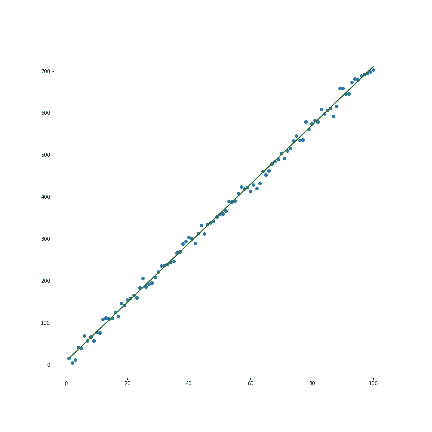
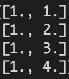
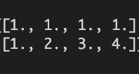

# 如何从头开始编写线性回归代码

> 原文：<https://towardsdatascience.com/how-to-code-linear-regression-from-scratch-9055a672eae0?source=collection_archive---------48----------------------->

## 基于正规方程的数值实现

样本线性回归拟合(图片由作者提供)

如今，很容易用一个或另一个库来适应你能想到的几乎任何模型，但是通过调用你能真正学到多少。fit()和。预测()？虽然使用像 python 的 statsmodels 或 scikit-learn 这样的框架对于正常用例来说肯定更实用，但在学习数据科学时，了解这些模型实际上是如何工作的也同样合乎逻辑。下面我们展示如何使用 numpy 从头开始实现一个基本的线性回归模型。我们开始吧！

# 这都是系数的问题

回想一下你的第一堂代数课:你还记得直线方程吗？如果你说“y = mx + b”，那你绝对是对的。我认为从二维开始也是有帮助的，因为不使用任何矩阵或向量，我们已经可以看到，给定输入 x 和输出 y，我们实际上寻找的不是一个，而是两个系数:m 和 b。

“但是等等！”你可能会说。这是斜率 m，截距 b，你又对了！但是为了找到最符合我们数据的线，我们不仅需要斜率，还需要截距，否则我们将会看到无限多条最佳拟合线，而不仅仅是我们要找的那一条。与其认为 b 被加到了 x 项上，不如将这个简单的等式改写为“y = m*x + b*1”。这使得下一点线性代数更容易理解。

# 关于矩阵和向量就足够了

让我们为我们的斜率截距方程设想一个非常简单的数据集，其中最佳拟合线实际上是完美的拟合。我们会说我们有要点:

(1, 3)

(2, 5)

(3, 7)

(4, 9)

我们想要求解系数 m 和 b，它们能最好地求解我们一会儿要定义的某个成本函数，但是为了更有效地完成这项工作，我们将首先再一次重写我们的方程。我们将定义一个向量 y = [3，5，7，9]，我们将寻找一些系数(通常用θ，theta 或β，beta 表示)。我们的系数向量有多少个元素取决于我们的特征空间 X 中有多少个特征(注意，我们正在切换到大写的 X 来表示一个矩阵，我们现在将要讨论这个矩阵)。代替我们用来定义 y 项的向量，我们将在上面的 x 项列中增加一列 1。按照惯例，我们将在 X 值前面放置一列 1，因为您可以认为我们的常数系数比 X 的阶数低，看起来会像这样:

作者图片

现在我们的等式看起来像这样:

xθ=*y*

接下来我们要做的是使用一个小技巧，不是所有的矩阵代数都像你可能习惯的那样工作，但只要我们的维度兼容，在等式的两边乘以相同的项通常是公平的，这就是我们要做的。我们在两边加上 X 的转置，转置看起来像这样:

作者图片

我们的新方程可以写成这样:

(xᵀx)θ=xᵀ*y*

这就是我们古怪操作的要点。这个方程叫做正规方程，它恰好有一些特殊的性质。 [Wolfram 将这个方程定义为“使 Ax = b 的左右两边的平方距离之和最小化的方程”,虽然他们使用了一些不同的符号，但这正是我们要找的。](https://mathworld.wolfram.com/NormalEquation.html)

我们的最后一个技巧是分离θ，我们将通过取(XᵀX)的[逆](https://mathworld.wolfram.com/MatrixInverse.html)来完成，得到下面的等式，该等式将产生(XᵀX)可逆的所有情况下的解。我们将跳过一些细节，但是只要 X 的列是线性独立的，这应该是可行的。

θ=(xᵀx)⁻*y*

# 代码

这是我们用 Python 写的解决方案，请随意尝试！我认为这段代码的工作原理和 scikit-learn 的线性回归差不多。例如，它将在 Boston Housing 数据集上产生相同的结果，您可以使用[sk learn . datasets . load _ Boston](https://scikit-learn.org/stable/modules/generated/sklearn.datasets.load_boston.html)检索该数据集。你能想出一些它断裂的案例吗？(提示:查看上一节的最后一段)。

最后，对于那些想要一个简单方便的函数来测试该方法的输出与另一个库中的实现的人来说，可以随意使用它: