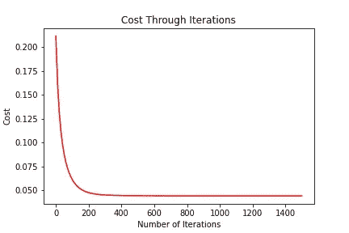

# 如何从头开始编写线性回归代码——快速而简单！

> 原文：<https://towardsdatascience.com/how-to-code-linear-regression-from-scratch-quick-easy-cfd8c8f9eb9d?source=collection_archive---------57----------------------->

## 用不到 50 行 python 代码编写一个最流行的机器学习算法！


[克莱姆·奥诺杰霍](https://unsplash.com/@clemono2?utm_source=medium&utm_medium=referral)在 [Unsplash](https://unsplash.com?utm_source=medium&utm_medium=referral) 拍摄的照片

在本文中，我们将学习如何编写线性回归代码，即机器学习的*“hello world”*，在 python 的**不到 50 行**！数据科学家和程序员经常使用像 *scikit-learn* 这样的第三方库来整合机器学习算法，但却无法理解它们在幕后是如何工作的。

学习如何从头开始编写算法不仅会提高我们的编程能力，还会提供对当前主题的更深入的理解。

如果你需要了解什么是线性回归以及它是如何工作的，请随意查看我最近发表的[直觉文章](/linear-regression-made-easy-702e5dc01f03)。话虽如此，让我们停止浪费时间，把我们的手弄脏吧！

## 建立

显然，我们从导入将要使用的库开始:

*   我不知道你怎么想，但我肯定不想用普通的 python 来处理向量和矩阵数学
*   `***pandas***` *—* Pandas 允许我们导入保存在同一目录下的 [csv 数据](https://www.kaggle.com/fivethirtyeight/the-ultimate-halloween-candy-power-ranking)
*   `***matplotlib***`*——*这个库将帮助我们在本文后面可视化我们的算法

对于我们的初始数据集，我们将使用[这个 kaggle 集合](https://www.kaggle.com/fivethirtyeight/the-ultimate-halloween-candy-power-ranking)并基于某些特征来确定某样东西是否是巧克力！如果你打算继续下去，你应该这样做！)，确保你 [**下载了。csv**](https://www.kaggle.com/fivethirtyeight/the-ultimate-halloween-candy-power-ranking) 并存储在**你正在编码的同一个目录**中。同样，请随意阅读 Kaggle 上的摘要，看看数据集中的每个要素代表什么。

正如承诺的，我们不会使用任何会使我们的旅程太容易的包装！那一点也不好玩。

## 数据

```
This dataset has 85 entries with 11 features 
The shape of X is: (85, 11) 
The shape of y is: (85, 1)
```

这里，我们使用熊猫将巧克力数据加载到我们的程序中；我们还删除了两个在计算中不使用的列: *competitorname* 和 *winpercent* 。

然后我们将数据分割成我们的 ***X*** 和 ***y*** 变量，分别代表我们的**特征**和**标签**。我们的 ***y*** 成为数据集中的第一列，指示我们的特定甜食是巧克力( *1* )还是不是( *0* )。剩余的列用作变量/特征来预测我们的 ***y*** ，并因此成为我们的 ***X.***

如果你对我们为什么在第 *5* 行使用`…[:, 0][:,np.newaxis]`感到困惑，这是为了将 ***y*** 变成一列。我们只需添加一个新的维度，将水平向量转换为垂直列！相信我，这将有助于以后的计算。

在第二个要点中，我们简单地看一下我们拥有的数据。正如所见，该块表示我们的数据集中有 85 个样本，每个样本具有 11 个特征。同样，我们的 ***X*** 有 *85* 行和 *11* 列，我们的 ***y*** 有 *85* 行和 *1* 列。

简单提醒一下，记住每一行代表一个单独的数据点，每一列是与之对应的一个特性。例如，我们在*中有 *85 个条目*，其中一列表示该点是否为*巧克力(1 或 0)* 。*

## *费用*

*这是我们模型的*成本*函数；我们选择了 ***(1/2) x 均方误差*** 来表示(*第 5 行*)。*

*   *`**pred**`代表通过将我们的特征(`***X***`)乘以我们的当前权重(`***params***`)并将它们相加而获得的预测*
*   *然后，我们通过将预测值与预期值/正确值进行比较来计算总误差/成本(*第 5 行)**

> *旁注:如果你不熟悉`@`命令，它只是点积(类似于`np.dot`)*

## *梯度下降*

*考虑到成本，我们现在可以实现算法的核心:*梯度下降*。同样，如果你不熟悉梯度下降是如何工作的，或者需要一些补充，看看[以前的文章](/linear-regression-made-easy-702e5dc01f03)！让我们看看代码在做什么:*

*   *`**iterations**` —我们将经历的梯度下降的迭代次数*
*   *`**cost_history**` —允许我们跟踪成本历史的数组；这将有助于我们可视化算法！*

**第 6 行*是梯度下降的核心，**更新规则** `(**learning_rate**/num_samples) * X.T @ (X @ params — y)`代表代价函数相对于*权重/参数*的*偏导数*。然后，我们取这个值，乘以我们的*学习率*(如前面粗体所示)，并从我们的旧权重/参数值中减去它，以便更新它们！*

## *规范化和初始化*

*在我们把所有东西放在一起之前，我们必须**规范化**和**初始化**我们的数据。*

**规范化*是一种数据准备技术，它只是将数值重新调整为从 *0* 到 *1 的数字。这样做是为了提高我们的准确性，同时降低我们的成本/误差。**

> *旁注:如果你尝试实验，看看如果我们不正常化会发生什么，你会得到额外的荣誉！*

*如果你熟悉线性回归，你应该意识到现在还缺少一些东西:偏差项。事实证明，我们可以将偏差项添加到我们的特征矩阵 ***X*** 中。这就是你在第 *9* 行看到的:我们在我们的 ***X*** 前面堆叠一列 1，作为我们的偏置项。现在，我们不再只考虑 *11* 的初始特征，而是考虑 *12* 的偏差。很漂亮吧？*

*同样，我们也将我们的*权重/* ***参数*** 初始化为零(*第 11 行*)*

## *建立模型！*

*现在，是时候把所有的东西放在一起，整合我们之前做的功能了；让我们来看看当我们点击运行时会发生什么！*

```
*Initial cost:  0.21764705882352942Optimal parameters are: 
[[ 0.43529399]
 [-0.26827445]
 [-0.03002024]
 [ 0.03246823]
 [-0.01615199]
 [ 0.03059432]
 [-0.01911575]
 [ 0.11609403]
 [-0.00797628]
 [ 0.01947274]
 [ 0.05175128]]Most important features determined by the algorithm: 
[('fruity', 0.43529399417329273), 
('caramel', -0.2682744491689681), 
('pluribus', 0.11609403084213005), 
('nougat', 0.032468233412292824), 
('hard', 0.03059432326508639), 
('peanutyalmondy', -0.03002024138032047), 
('pricepercent', 0.019472737570368572), 
('bar', -0.01911575068810122), 
('crispedricewafer', -0.016151994114632157), 
('sugarpercent', -0.00797628452755172)]Final cost:  0.04433152061220413*
```

**

*然后，砰！我们做到了！正如您从输出中看到的，我们显著降低了成本，从 *0.22* 降至 *0.04* 。在上图中，您可以看到每次迭代的成本都在降低！*

*为了帮助进一步理解算法在做什么，我打印了*最优权重*。这表示对应于每个特征的权重，最终用于预测某物是否是巧克力。换句话说，如果我们有另一个*看不见的数据点*具有相同的特征，我们可以用这些权重乘以它的值，并确定它是否是巧克力！*

*同样，我也打印了一个最有影响力的功能的排序列表。这很有趣，因为你可以看到计算机认为什么是最重要的。不出所料，这表明味道是否是水果味是区分糖果和巧克力的一个很好的标准。第二名和第三名分别由*焦糖*和 *pluribus* 获得。Pluribus 只是一种指示，表明这种糖果是否是装在袋子或盒子里的许多糖果中的一种。*

# *类实现*

*既然我们已经从零开始在不相交的部分中构建了线性回归，那么让我们把它们放在一起，稍微调整一下，并把它变成一个类！现在我们有了自己的线性回归模块:*

# *战斗的时间到了！*

*好吧，没什么大不了的，我们从头开始做了一个线性回归实现。*我们怎么知道它有多好？**

*为什么不让我们班和 sklearn 的进行一场生死之战呢！让我们在他们自己的主场作战，使用他们的*波士顿住房数据集*，这样我们就可以为训练和测试集使用更多的数据样本！*

```
 *Our's      Sklearn's
Training Acc.  0.724896   0.727084
Test Acc.      0.771918   0.772993*
```

*我不知道你怎么想，但我认为保持精确度是一项相当可靠的工作！希望这能让你明白隐藏在引擎盖下的东西并不总是像看起来那么复杂。*

*我强烈建议您继续使用 battle and LinearRegression 类来试验不同的数据集，看看它能准确预测什么，另一方面，在这方面做得不太好。欢迎在下面的回复中链接或谈论你的结果和发现！*

# *结论*

**

*[克拉克·杨](https://unsplash.com/@cbyoung?utm_source=medium&utm_medium=referral)在 [Unsplash](https://unsplash.com?utm_source=medium&utm_medium=referral) 上的照片*

*希望你从零开始实现线性回归很有趣，因为我确实做到了！更重要的是，我真心希望你对线性回归的工作原理有更深的理解。*

*如果你对一些术语有点困惑，我强烈建议你去看看[那篇用通俗的语言解释算法如何工作的文章](/linear-regression-made-easy-702e5dc01f03)。*

*如果你想跟随一个完整解释的 jupyter 笔记本或者只是想在最后下载类，请随意查看 [GitHub 库](https://github.com/athreyaanand/ML-from-scratch/tree/master/LinearRegression)。*

*我真诚地希望你喜欢阅读这篇文章，并希望很快见到你，这样我们就可以一起掌握 ML 和数据科学的世界！*