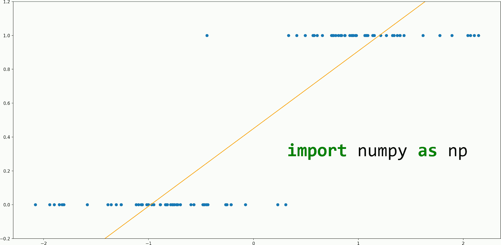
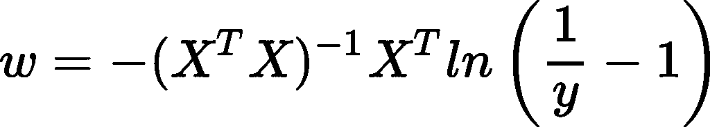
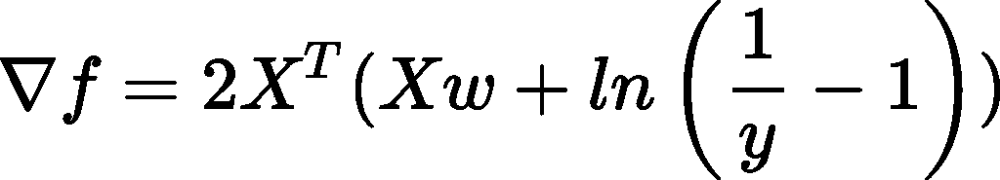
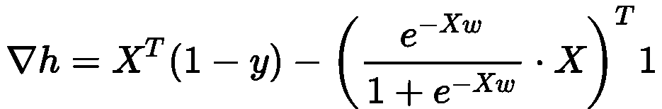

# 如何用 NumPy 从头开始编写逻辑回归代码

> 原文：<https://towardsdatascience.com/how-to-code-logistic-regression-from-scratch-with-numpy-d33c46d08b7f?source=collection_archive---------25----------------------->

## 学习逻辑回归的同时提高你的数字技能

作者图片

我们在 NumPy 中实现逻辑回归的计划是什么？

让我们首先考虑我们想要使用的底层数学。

有许多方法来定义一个损失函数，然后为它找到最佳参数，其中，这里我们将在我们的`LogisticRegression`类中实现以下 3 种学习参数的方法:

*   我们将重写逻辑回归方程，以便将其转化为具有不同标签的最小二乘线性回归问题，然后，我们使用封闭形式的公式来寻找权重:

*   如上所述，我们将逻辑回归转换为最小二乘线性回归，但我们使用具有以下梯度的随机梯度下降，而不是封闭形式的公式:

*   我们使用最大似然估计(MLE)方法，编写似然函数，对其进行处理，将其重新表述为最小化问题，并应用具有以下梯度的 SGD:

在上述等式中，X 是包含行轴上的观察值和列轴上的特征的输入矩阵；y 是包含分类标签(0 或 1)的列向量；f 是误差平方和损失函数；h 是最大似然法的损失函数。

要了解以上方法的更多信息，请查阅本文:

 [## 理解逻辑回归

### 这种方法的数学详细解释

towardsdatascience.com](/understanding-logistic-regression-81779525d5c6) 

所以，这是我们的目标:把上面的方程翻译成代码。为此我们将使用 NumPy。

我们计划使用面向对象的方法来实现。我们将用 3 个公共方法创建一个`LogisticRegression`类:`fit()`、`predict()`和`accuracy()`。

在 fit 的参数中，有一个将决定我们的模型如何学习。这个参数被命名为 method(不要与作为类的函数的方法相混淆)，它可以将下列字符串作为值:“ols _ solve”(OLS 代表普通最小二乘法)、“ols_sgd”和“mle_sgd”。

为了不使`fit()`方法太长，我们想将代码分成 3 个不同的私有方法，每个方法负责一种寻找参数的方法。

我们将使用`__ols_solve()`私有方法来应用封闭公式。

在这种方法和其他使用 OLS 方法的方法中，我们将使用常量 EPS 来确保标签不完全是 0 或 1，而是介于两者之间。这是为了避免在上面的等式中对数的正负无穷大。

在`__ols_solve()`中，我们首先检查 X 是否有完整的列秩，以便我们可以应用这个方法。然后我们强制 y 在 EPS 和 1-EPS 之间。`ols_y`变量保存普通最小二乘线性回归问题的标签，该问题等价于我们的逻辑回归问题。基本上，我们转换了逻辑回归的标签，使它们符合线性回归方程。之后，我们使用 NumPy 函数应用封闭形式的公式。

对于 2 个基于 SGD 的算法，将它们作为 2 个独立的方法是多余的，因为除了计算梯度的部分，它们几乎所有的代码都相同，因为它们有 2 个不同的梯度公式。

我们要做的是创建一个通用的`__sgd()`方法，它不依赖于计算梯度的特定方式。相反，它将期望一个函数作为参数，负责计算`__sgd()`方法将使用的梯度。

在此方法中，我们首先将权重初始化为一个随机列向量，其值取自均值为 0、标准差为 1/(要素数)的正态分布。这个标准差的直觉是，如果我们有更多的特征，那么我们需要更小的权重来收敛(并且不破坏我们的梯度)。然后我们检查所有的数据集，看是否有`iterations`次。在每次这样的迭代开始时，我们随机打乱数据集，然后对于每批数据，我们计算梯度并更新权重。

对于“ols_sgd”和“mle_sgd ”,我们将创建两个私有方法:`__sse_grad()`和`__mle_grad()`,它们计算并返回这两种不同技术的梯度。

对于这两种方法，我们使用 NumPy 简单地应用∇f 和∇h 的公式。

所以，当`fit()`用`method=‘ols_solve’`调用时我们叫`__ols_solve()`，当`method=‘ols_sgd’`用`grad_fn=self.__sse_grad`调用`__sgd()`，当`method=’mle_sgd’`用`grad_fn=self.__mle_grad`调用`__sgd()`。

在`predict()`中，我们首先通过寻找权重属性(fit 方法是创建它的唯一方法)来检查`fit()`是否被调用过。然后我们检查输入矩阵 x 和权重向量的形状是否允许相乘。否则，返回错误消息。如果一切正常，我们做乘法，并通过逻辑函数传递结果。

在`accuracy()`中，我们使用上述方法进行预测。然后检查预测的形状是否与真实标签的形状相匹配，否则，我们会显示一条错误消息。之后，我们通过一个简单的规则来确保预测和真实标签的值都是 0 或 1:如果值是> = 0.5，则认为它是 1，否则为 0。

为了计算精度，我们检查 y 和 y_hat 之间是否相等。这将返回一个布尔值向量。然后将这些布尔值强制转换为 float (False 变为 0.0，True 变为 1.0)。那么，精度就是这些值的平均值。

下面是`LogisticRegression`类的完整代码:

现在，我们想用一些真实世界的数据来测试我们的`LogisticRegression`类。为此，我们将使用来自 [Kaggle](https://www.kaggle.com/ronitf/heart-disease-uci) 的心脏病数据集。你可以在 Kaggle 上阅读关于这个数据集的更多信息，但主要思想是根据其他数据预测“目标”列(如果健康，则为 0，如果有心脏病，则为 1)。

下面的代码展示了我们的`LogisticRegression`类的作用(为了避免重复，下面没有显示单元格 1&2；如上面的代码片段所示)。

正如你所看到的，我们能够在训练和测试中获得相当不错的 **80%+** 的准确率。

你可以在 [Kaggle](https://www.kaggle.com/dorianlazar/predictions-with-logistic-regression-from-scratch) 上看到完整的笔记本。

*我希望这些信息对您有用，感谢您的阅读！*

这篇文章也贴在我自己的网站[这里](https://www.nablasquared.com/how-to-implement-logistic-regression-with-numpy/)。随便看看吧！