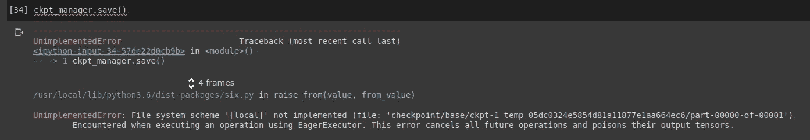

# 如何与 TPU 合作

> 原文：<https://towardsdatascience.com/how-to-colab-with-tpu-98e0b4230d9c?source=collection_archive---------8----------------------->

## 在谷歌实验室 TPU 上训练一个拥抱脸伯特


TPU 演示通过[谷歌云平台博客](https://cloud.google.com/tpu/)

TPU(张量处理单元)是专门为处理矩阵而优化的专用集成电路(ASICs)。

> 云 TPU 资源加速了线性代数计算的性能，线性代数计算在机器学习应用中被大量使用
> 
> — [云 TPU 文档](https://cloud.google.com/tpu/docs/tpus#us)

Google Colab 免费为 TPUs 提供实验支持！在本文中，我们将讨论如何在 Colab 上使用 TPU 训练模型。具体来说，我们将**训练** [**伯特**](https://medium.com/swlh/bert-pre-training-of-transformers-for-language-understanding-5214fba4a9af) **进行** **文本分类**使用[变形金刚包通过 huggingface](https://huggingface.co/transformers/) 上一个 TPU。

# 什么时候该用什么时候不该用 TPU

重要的事情先来。由于 TPU 针对一些特定的操作进行了优化，我们需要检查我们的模型是否实际使用了它们；即**我们需要检查 TPU 是否真的帮助我们的模型**训练得更快。以下是我们可能希望使用[云 TPU 文档](https://cloud.google.com/tpu/docs/tpus#us)中提到的 TPU 的一些用例:

*   由矩阵计算主导的模型
*   主训练循环中没有自定义张量流运算的模型
*   训练数周或数月的模特
*   有效批量非常大的较大和非常大的模型

> **如果你的模型使用了[云 TPU 支持的张量流运算](https://cloud.google.com/tpu/docs/tensorflow-ops)中没有的自定义张量流运算**，你可能宁愿**使用 GPU 加速器**来代替。

# 初始化

TPU 在云上工作，不像 GPU 或 CPU 在本地工作。因此，我们需要在开始之前进行一些初始化:

TPU 用途的设置

如果您观察上面代码片段的输出，我们的 TPU 集群有 **8 个能够并行处理的逻辑 TPU 设备(0–7)**。因此，我们定义了一个**分布策略**，用于在这 8 个设备上进行分布式培训:

```
strategy = tf.distribute.TPUStrategy(resolver)
```

有关分布式培训的更多信息，请参考:[https://www.tensorflow.org/guide/distributed_training](https://www.tensorflow.org/guide/distributed_training)

# 训练模型

在本节中，我们将实际了解如何在 TPU 上训练 BERT。我们将通过两种方式做到这一点:

1.  使用 model.fit()
2.  使用自定义训练循环。

## 使用 model.fit()

由于我们使用的是分布策略，因此必须在每个设备上创建模型以共享参数。因此，需要在战略范围内创建和构建**模型:**

在分销战略的范围内创建和构建模型

然后，我们简单地根据数据拟合模型，就像在常规训练设置中所做的那样:

训练模型

要保存模型权重:

```
model.save_weights("checkpoint/tpu-model.h5")
```

在下一小节中，我们将讨论如何使用自定义训练循环来做同样的事情。

## 使用自定义训练循环

这里，我们只需要手动调整 TensorFlow 在前面的方法中在后端为我们做的一些事情。

首先，我们使用 **tf.data** API 创建一个数据管道:

构建 tf.data 管道

现在，我们在前面的部分中不必担心这个的原因是 TensorFlow 自己处理了这些事情；也就是我们调用 model.fit()的时候。同样，这次，**我们需要在 TPU 设备之间手动分发数据集**:

在 TPU 之间分配数据

接下来，我们**以与前面方法完全相同的方式**创建和构建模型。或者，我们可以在策略范围中添加一些指标，用于手动损失和准确性监控:

在战略范围内定义指标

现在是最重要的部分，即训练步骤功能。但是首先，让我们为分布式数据集创建一个迭代器:

```
train_iterator = iter(train_dataset)
```

然后我们编写 train_step 函数，并像平常一样用@tf.function 修饰它。我们使用 strategy.run()来执行训练步骤:

训练阶跃函数

最后，我们在训练循环中运行这个 train_step 函数几次:

训练循环

这一次，让我们尝试使用**检查点**保存模型。现在这里有一个问题。我们不能就这样拯救这个模型。



本地文件系统访问错误

错误非常明显，它说**当[急切执行](https://www.tensorflow.org/guide/eager)时，您不能访问本地文件系统**，因为执行被带到云中，以便 TPU 执行其操作。

因此，为了克服这一点，我们需要**将检查点保存在 GCS 桶**中。您可以在此创建一个自由级 GCP 账户[。首先，我们需要创建一个云存储桶。](https://cloud.google.com/free)[这里有一个来自官方文档的关于创建 GCS bucket 的教程](https://cloud.google.com/storage/docs/creating-buckets)。

接下来，我们需要使用我们的 GCP 凭据登录，并将 GCP 项目设置为活动配置:

```
from google.colab import authauth.authenticate_user()!gcloud config set project <project-id>
```

> **gcloud config set** 仅在您的活动配置中设置指定的属性。
> 
> — [谷歌云文档](https://cloud.google.com/sdk/gcloud/reference/config/set)

完成后，我们只需使用以下命令即可访问我们的存储桶:

```
gs://<bucket-name>/<file-path>
```

现在，检查点看起来像这样:

保存检查点

而这一次，它会成功地将模型检查点保存到您的桶中！

# 结论

在本文中，我们看到了为什么以及如何调整为训练模型而编写的原始代码，使其与 TPU 兼容。我们还讨论了什么时候使用 TPU，什么时候不使用。

# 参考

[](https://www.tensorflow.org/guide/tpu) [## 使用 TPUs | TensorFlow 核心

### 目前 Keras 和 Google Colab 提供了对云 TPU 的实验性支持。在你运行这个 Colab 之前…

www.tensorflow.org](https://www.tensorflow.org/guide/tpu) [](/10-tensorflow-tricks-every-ml-practitioner-must-know-96b860e53c1) [## 每个 ML 从业者必须知道的 10 个张量流技巧

### 为什么 TensorFlow 是完整的 ML 包

towardsdatascience.com](/10-tensorflow-tricks-every-ml-practitioner-must-know-96b860e53c1) [](https://medium.com/swlh/bert-pre-training-of-transformers-for-language-understanding-5214fba4a9af) [## 伯特:语言理解变形金刚的前期训练

### 了解基于变压器的自监督架构

medium.com](https://medium.com/swlh/bert-pre-training-of-transformers-for-language-understanding-5214fba4a9af)  [## BERT -变压器 3.0.2 文档

### BERT 模型是在 BERT:用于语言理解的深度双向转换器的预训练中提出的…

huggingface.co](https://huggingface.co/transformers/model_doc/bert.html)