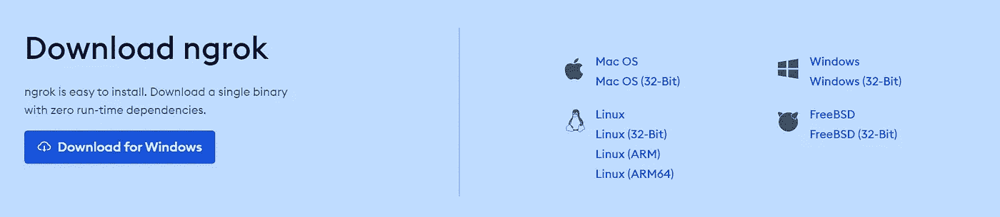
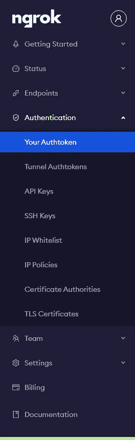
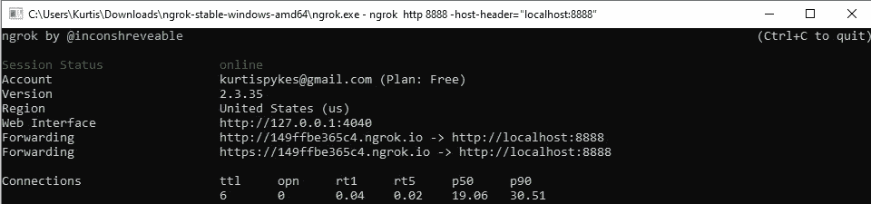

# 如何在本地托管的 Jupyter 笔记本上进行协作

> 原文：<https://towardsdatascience.com/how-to-collaborate-on-your-locally-hosted-jupyter-notebook-28e0dcd8aeca?source=collection_archive---------18----------------------->

## 让 Jupyter 笔记本协作成为一个无缝的过程


约翰·施诺布里奇在 [Unsplash](https://unsplash.com?utm_source=medium&utm_medium=referral) 上的照片

## 背景

不久前，我接到一个正在学习数据科学的好朋友的电话，希望得到一些帮助。由于我们在学习数据科学时经常被告知 Jupyter 笔记本，所以他使用 Jupyter 笔记本并不奇怪，但这立即让我大吃一惊。我们如何在笔记本上合作？

*我们最后打了一个缩放电话，他授权我控制他的屏幕，但等待时间比手头的问题更让我抓狂。*

两个月过去了，风水轮流转，我现在是需要帮助的人。我联系了一位资深数据科学家(在本文中我们称他为 Billy ),告诉他我的苦恼:

比利:那很好，你想做一些结对编程吗？

我:好的，那太好了。**松了一口气**

比利:你在用谷歌 Colabs 吗？

> 注意:事实证明 Colab 非常容易合作。

**我:**不，我在本地使用 Jupyter 笔记本

比利:那很好。我们可以用 [*Ngrok*](https://ngrok.com/) *！*

我:啊，是的，当然！

老实说，我不知道 Ngrok 是什么，但我相信我的谷歌搜索技能。

***注*** *:这个解决方案只有在你希望在本地服务器上协作时才有效。如果你希望在云中合作，请查看* [*土星云*](https://saturncloud.io/) *。*

## Ngrok

Ngrok 通过安全隧道将 NAT 和防火墙后面的本地服务器暴露给公共互联网。随后，我们能够向 web 服务器的端口提供我们的本地服务器，这使我们能够获得我们指定的本地地址——如果这对您没有意义，请不要担心。我要说的是，我们将获得本地托管的 Jupyter 笔记本的公共 URL，我们可以共享并用于合作。

## 安装 Ngrok

设置 Ngrok 包括 3 个简单的步骤:

1.  **报名**

你可以通过点击“注册”轻松创建一个免费账户。只需填写您的证书，您就可以开始了——链接到注册页面 [**这里**](https://ngrok.com/product)

2.**下载**

下载适合你的操作系统的 Ngrok，下载后解压。



> 注意:在 Linux 或 Mac OS X 上，您可以使用以下命令从终端解压缩 ngrok。在 Windows 上，只需双击 ngrok.zip 即可将其解压缩。

```
unzip /path/to/ngrok.zip
```

3.**连接您的帐户**

下一步只是验证您的 Ngrok 代理，只需要做一次，因为 Authtoken 保存在默认配置文件中。

您的身份验证令牌可以通过转到边栏上的*身份验证*，然后转到*您的身份验证令牌来访问，见下图。*



我更喜欢命令行设置，它包括简单地告诉 Ngrok 您的身份验证令牌。

```
./ngrok authtoken 1g3Zd5XeTdmRTYIvOZmGVBW3hAH_2873ypJDaDf6ybyUzmSUj
```

太好了！您现在已经设置好了，但是现在您必须学会共享您的 Jupyter 笔记本。

## 共享笔记本

对于要远程访问的 Jupyter 笔记本，我们必须对我们的 Jupyter 笔记本配置进行一些调整，为了额外的安全性，我们将添加一个密码。

```
jupyter notebook --generate-config
```

这将把链接地址返回到 Jupyter 笔记本的配置文件中。

```
Writing default config to: C:\Users\Kurtis\.jupyter\jupyter_notebook_config.py
```

复制链接地址并运行以下命令

```
echo "NotebookApp.allow_remote_access = True" >> C:\Users\Kurtis\.jupyter\jupyter_notebook_config.py
```

然后我们添加一个密码…

```
jupyter notebook password
```

现在，我们已经具备了运行和连接 Jupyter 笔记本所需的一切，这样就可以远程共享它了。

> **提示**:在下一部分中，我们需要两个独立的终端连接到我们的遥控器，因为一旦我们运行 jupyter，它将占用一个记录日志的窗口。您可以打开第二个终端并再次进入 ssh，或者您可以使用类似于 [tmux](https://www.hamvocke.com/blog/a-quick-and-easy-guide-to-tmux/) 的工具在单个终端中管理它们。(来源:[人工智能 Github](https://gist.github.com/artificialsoph/443a8bf9af3302df9cb0cb54a616f838) )

在你的终端输入`jupyter notebook`打开你的 Jupyter 笔记本。

```
jupyter notebook
```

在我们访问我们的 Jupyter 笔记本之后，我们告诉 Ngrok 我们的 web 服务器正在监听哪个端口。


上图突出显示了港口。因此，我们会告诉 Ngrok 端口是 8888。

```
ngrok http [port] -host-header="localhost:[port]"
```

您的结果应该如下所示



复制转发地址，并与您想与之合作的任何人共享—如果您按照我们的步骤操作并设置了密码，那么您必须告诉他们密码。

太好了，现在你们可以合作了！

但是，如果您希望在云中协作，该怎么办呢？我掩护你。[土星云](https://saturncloud.io/)是一个**免费**可扩展的数据科学平台，专为团队和个人打造。

# 结论

宏伟！现在，每当您需要与本地机器(或您的机器)上的 Jupyter 笔记本电脑上的某人协作时，您不必被踩踏或忍受糟糕的延迟(因为您已经在 zoom 上共享了您的屏幕)，您现在知道如何共享您的 Jupyter 笔记本电脑并在不同的机器上工作。

我喜欢与人交流，我在 LinkedIn 上最容易联系到——联系并了解我正在学习的任何新东西(也可以随意分享你正在学习的东西)。

[](https://www.linkedin.com/in/kurtispykes/) [## Kurtis Pykes -人工智能作家-走向数据科学| LinkedIn

### 在世界上最大的职业社区 LinkedIn 上查看 Kurtis Pykes 的个人资料。Kurtis 有一个工作列在他们的…

www.linkedin.com](https://www.linkedin.com/in/kurtispykes/)