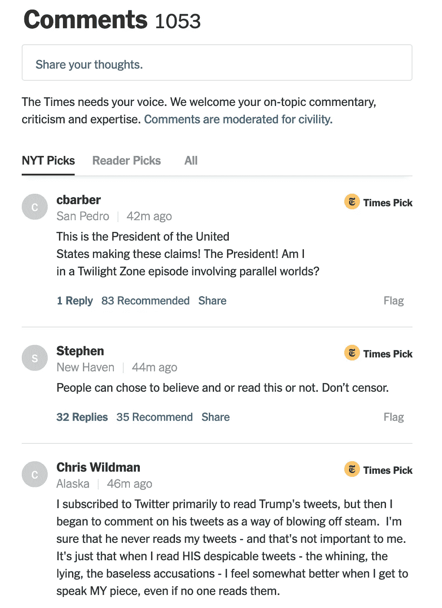
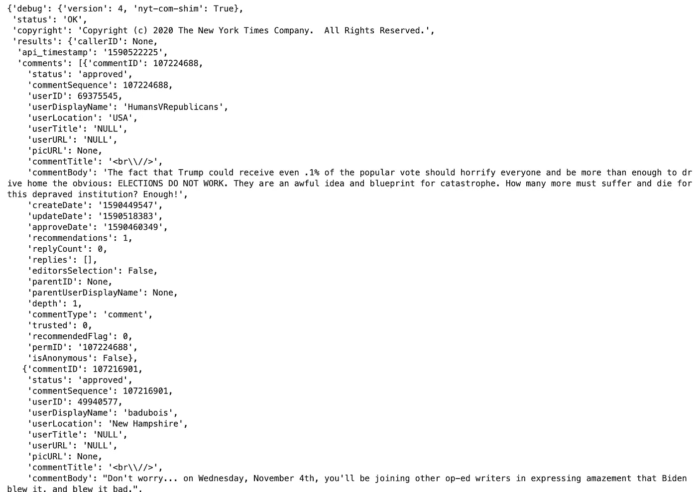
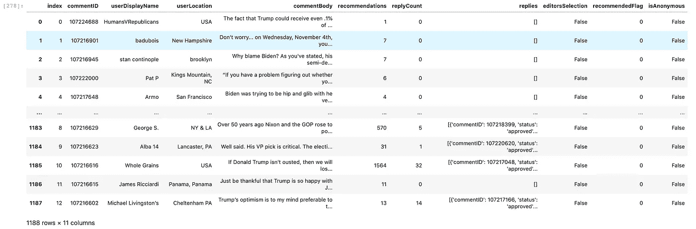

# 如何从《纽约时报》的任何一篇文章中收集对熊猫数据框架的评论

> 原文：<https://towardsdatascience.com/how-to-collect-comments-from-any-new-york-times-article-to-a-pandas-dataframe-a595ec6a1ddf?source=collection_archive---------53----------------------->

[Unsplash](https://unsplash.com?utm_source=medium&utm_medium=referral) 上[视觉](https://unsplash.com/@visuals?utm_source=medium&utm_medium=referral)的照片

## 《纽约时报》( NYT)最精彩的部分是他们对文章积极且高度节制的评论部分。

这确实是一个奇妙的社区，来自世界各地的读者都做出了高质量的贡献。24 小时开放评论，由人类高度管理，因此不存在巨魔评论。一个我在其他出版物上看不到复制的社区。

**我喜欢 NYT 评论区的是它目前的组织方式。**

有三个标签，NYT 选择，读者选择，和所有。

*   在 *NYT 选择*下，NYT 将突出代表一系列观点的评论，并被认为是关于文章主题的最有趣或最有用的评论。
*   *读者选择*，通常按最高社区投票排序。NYT 上的向上投票被视为“推荐”。
*   使用 *All* 选项卡，允许您按最新或最早的评论进行排序。

我最近发现纽约时报发布了一个新的 API，目前处于测试阶段，它可以帮助我们轻松地查询这些精彩的评论。

## 步骤 1:创建一个 NYT 开发者网络帐户来获得你的 API 密匙

1.  转到[https://developer.nytimes.com/](https://developer.nytimes.com/)
2.  登录或创建一个帐户
3.  将鼠标悬停在您的帐户名称上，即可进入应用程序。
4.  创建新应用程序
5.  提供名称和描述
6.  激活社区 API ( *目前处于测试阶段*)
7.  **将您的 API 密钥复制到剪贴板以备将来使用**

## 步骤 2:在 Python 中进行设置

*注意:我们每天只限 4000 个请求，每分钟 10 个请求。*

*注意:我们需要指定偏移量，因为每次我们请求 API 时，它一次只会得到 25 条注释。因此，从 25 到 49 的注释需要我们将偏移量设置为 25。*

*注:对于本教程，我将使用这篇* [*NYT 文章*](https://www.nytimes.com/2020/05/24/opinion/biden-trump-coronavirus.html) *。*

一旦获得了数据，这些数据将看起来像这样。

您从 NYT 社区 API 中收集的 JSON 数据示例

仅从屏幕截图来看，我们可以很容易地看出，如果我们要制作一个数据集，我们可以尝试一些有趣的功能。

**有趣的功能:**

*   *备注*
*   *用户显示名称*
*   *用户位置*
*   *评论主体*
*   *建议*
*   *回复计数*
*   *回复*
*   *编辑选择*
*   *推荐标志*
*   *匿名*

## 步骤 3:提取我们想要的数据到熊猫数据框架中

*注意:注释位于我们数据的“结果”键中。*

## 第 4 步:简单直观的功能来检索一篇文章的所有评论，包括评论回复。

*注意:每次您提交请求时，建议让您的功能等待 6 秒钟，因为我们每分钟仅限 10 个请求。*

## 最终的数据帧将如下所示。

质疑 NYT 文章的评论。

## 但是，NYT 社区 API 有一个单独的请求链接，用于回复特定意见的评论。下面是你如何设置它。

*注意:每个请求仍然被限制为一次 25 个评论回复，我们必须指定我们想要从哪个评论中提取回复。为了指定哪个注释，我们需要输入 commentSequence，它与 commentID 相同，这是我目前所了解的。*

然而，你将会浪费你当天的请求配额，并且你已经从先前的函数中提取了那些回复，并且那些对你的评论的回复不受父评论限制。

这就对了。现在你知道如何从《纽约时报》的一篇文章中提取所有评论了！