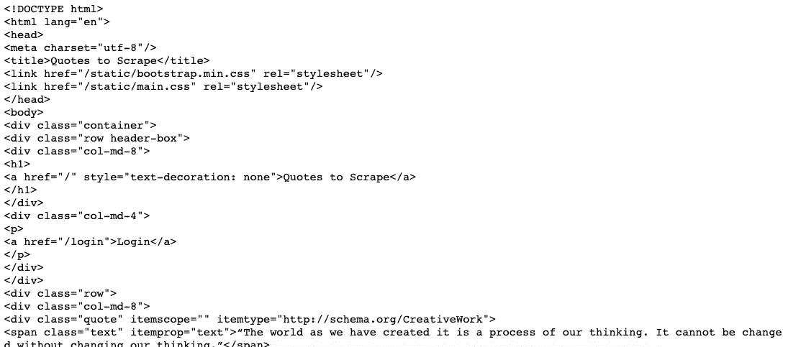
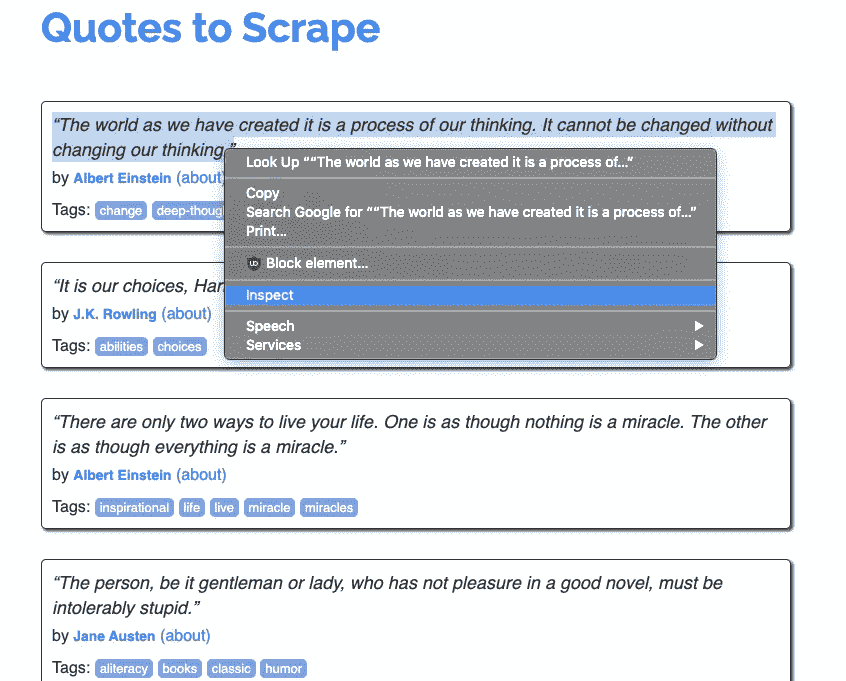
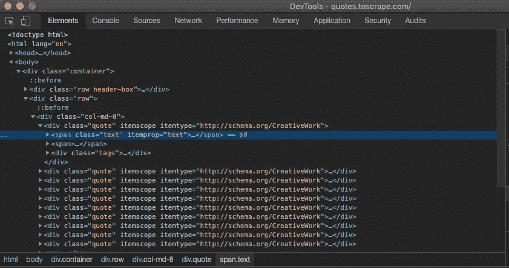
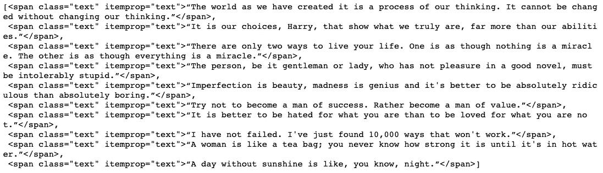
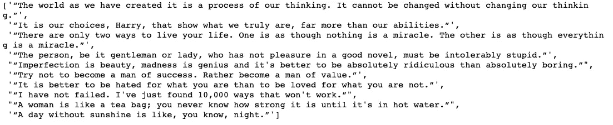
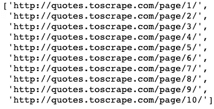
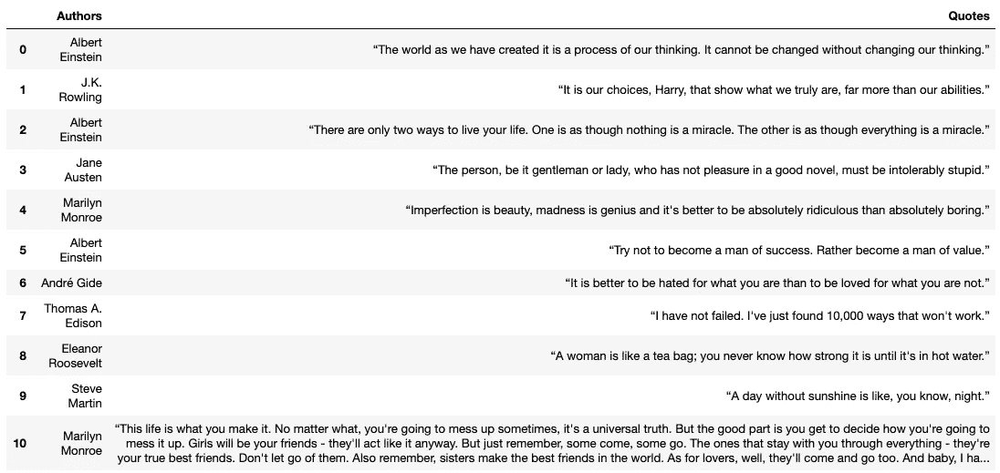

# 我如何使用 Python 从任何网站收集数据

> 原文：<https://towardsdatascience.com/how-to-collect-data-from-any-website-cb8fad9e9ec5?source=collection_archive---------1----------------------->

## 用 Python 和 BeautifulSoup 实现简单的网页抓取


法比安·伊尔萨拉在 [Unsplash](https://unsplash.com?utm_source=medium&utm_medium=referral) 上的照片

在工作中，有些时候你会意识到你可能需要在短时间内获得大量数据。这些可能是当你的老板或客户想要从一个特定的网站得到一组特定的信息。也许他们想让你从上述网站收集一千多条信息或数据。那你是做什么的？

一种选择是查看这个网站，手动输入所需的每一条信息。或者更好的是，您可以让 Python 为您完成所有繁重的工作！

利用 Python 最有用的库之一， **BeautifulSoup** ，我们可以通过编写一些相对简单的代码来收集任何网站上显示的大多数数据。这个动作叫做[](https://en.wikipedia.org/wiki/Web_scraping)**。在接下来的几个部分中，我们将学习和解释 BeautifulSoup 的基础知识，以及如何使用它从几乎所有网站收集数据。**

> **[在这里注册一个中级会员，可以无限制地访问和支持像我这样的内容！在你的支持下，我赚了一小部分会费。谢谢！](https://marco-santos.medium.com/membership)**

# **挑战**

**为了学会如何使用 BeautifulSoup，我们首先要有一个使用它的理由。让我们假设，你有一个客户正在寻找名人的报价。他们希望下一年每周都有新的报价。他们让我们负责向他们展示至少 52 条引文及其作者。**

## **要刮的网站**

**我们或许可以去任何网站找到这些报价，但我们将使用 [**这个网站**](http://quotes.toscrape.com/) 作为报价列表。现在，我们的客户希望将这些报价格式化成一个简单的电子表格。因此，现在我们可以选择在电子表格中键入 52 条引文及其各自的作者，或者我们可以使用 Python 和 BeautifulSoup 来为我们完成所有这些工作。所以为了时间和简单起见，我们宁愿用 Python 和 BeautifulSoup。**

# **开始美丽的 Soup**

**让我们从打开你喜欢的 IDE 开始，但是我们将使用 Jupyter Notebook。(所有这些的 Github 代码将在文章的最后提供)。**

## **导入 Python 库**

**我们将从导入 BeautifulSoup 所需的库开始:**

```
from bs4 import BeautifulSoup as bs
import pandas as pd
pd.set_option('display.max_colwidth', 500)
import time
import requests
import random
```

## **访问网站**

**接下来，我们必须通过运行以下代码来实际访问 BeautifulSoup 的网站以进行解析:**

```
page = requests.get("[http://quotes.toscrape.com/](http://quotes.toscrape.com/)")page# <Response [200]>
```

**这将返回一个响应状态代码，让我们知道请求是否已经成功完成。在这里，我们正在寻找响应[200]，这意味着我们已经成功到达该网站。**

## **解析网站**

**这里我们将使用 BeautifulSoup 解析网站。**

```
soup = bs(page.content)soup
```

**运行此代码将返回类似 HTML 代码中的打印文本文档，如下所示:**

****

**我们可以使用 BeautifulSoup 浏览上面解析过的文档。**

# **在汤里导航**

**现在我们需要在解析后的 HTML 文档中找到我们想要的东西。让我们从寻找引语开始。**

**找到我们要找的东西的一个简单方法是:**

*   **进入网页，找到想要的信息(在我们的例子中是报价)。**
*   **突出显示这条信息(报价)**
*   **点击右键，选择**检查****

****

**这将打开一个新窗口，如下所示:**

****

**突出显示的部分是我们要寻找的报价。只需单击突出显示部分左侧的箭头，就可以看到代码中的引用。**

## **用于导航的 HTML 信息**

**基于我们看到的突出显示的 HTML 代码，我们可以使用该信息来导航汤。我们将在自己的代码中使用`.find_all()`属性来潜在地找到我们正在寻找的报价。这个属性将能够根据我们给它的任何参数返回我们想要的代码行。因为我们可以看到报价的 HTML 代码包含`class=“text”`，所以我们可以在我们的 BeautifulSoup 代码中使用它:**

```
soup.find_all(class_='text')
```

**运行此代码将返回以下结果:**

****

**由此我们可以看到，我们能够成功地定位和检索包含所需报价的代码和文本。**

**为了只检索文本并排除不必要的代码，我们必须在每个结果中使用`.text`属性。为此，我们将使用一个 *"for"* 循环来遍历列表:**

```
quotes = [i.text for i in soup.find_all(class_='text')]quotes
```

**这将为我们提供没有各自 HTML 代码的报价列表:**

****

**现在我们知道了如何访问网站中的报价，并根据我们的目的检索它们。重复前面提到的步骤来检索每个报价的作者姓名:**

```
authors = [i.text for i in soup.find_all(class_='author')]
```

# **访问多个页面**

**现在我们知道了如何从特定的网页中检索数据，我们可以继续下一组页面中的数据。正如我们从网站上看到的，所有的报价都不是存储在一个页面上。我们必须能够导航到网站的不同页面，以便获得更多的报价。**

**请注意，每个新页面的 url 都包含一个不断变化的值:**

*   ***http://quotes.toscrape.com/page/2/***
*   ***http://quotes.toscrape.com/page/3/***
*   **等等。**

**了解这一点后，我们可以创建一个简单的 URL 列表来迭代访问网站中的不同页面:**

```
urls=[f"[http://quotes.toscrape.com/page/{i}/](http://quotes.toscrape.com/page/{i}/)" for i in range(1,11)]urls
```

**这将返回我们可以使用的网站列表:**

****

**从这个列表中，我们可以为“创建另一个*”循环来收集必要数量的引用及其各自的作者。***

## **避免网页抓取检测**

**需要注意的一点是:一些网站不支持网络抓取。这些网站会执行一些方法来检测你是否在使用一个网页抓取工具，比如美丽的汤。例如，一个网站可以检测是否在短时间内有大量的请求，这就是我们正在做的。为了避免潜在的检测，我们可以随机化我们的请求率，以密切模仿人类的互动。我们是这样做的:**

**生成值列表:**

```
rate = [i/10 for i in range(10)]
```

**然后在每个循环结束时，输入下面这段代码:**

```
time.sleep(random.choice(rate))
```

**这里，我们从我们创建的列表中随机选择一个值，并在循环再次开始之前等待选定的时间。这将减慢我们的代码，但会帮助我们避免检测。**

# **将这一切结合在一起**

**现在我们已经有了所有的片段，我们可以构建最后的*“for”*循环，它将收集至少 52 条引用及其各自的作者:**

**整个代码检索至少 52 个报价及其作者**

**一旦我们运行上面的代码，我们将得到一个引用列表和一个作者列表。但是，我们的客户想要电子表格中的报价。为了满足这个请求，我们将不得不使用 Python 库:**熊猫**。**

**将列表输入熊猫数据框架非常简单:**

```
# Creating a DataFrame to store our newly scraped information
df = pd.DataFrame()# Storing the quotes and authors in their respective columns
df['Authors'] = authorsdf['Quotes'] = quotes
```

**因为引文和作者是按顺序刮出的，所以很容易输入到数据框中。**

**一旦我们完成并运行了上面的代码，最终的 DF 将如下所示:**

****

**太棒了。DF 看起来很棒，完全符合客户要求的格式。然后，我们可以将 DF 保存为 excel 电子表格文件，然后发送给客户。**

# **关闭**

**我们希望你从这个循序渐进的教程中学到了一点关于网络抓取的知识。尽管我们使用的例子可能非常简单，但是所使用的技术仍然适用于互联网上的许多不同的网站。需要大量用户交互的更复杂的网站将需要另一个名为 [**Selenium**](https://selenium-python.readthedocs.io/) 的 Python 库。然而，大多数网站将只需要 BeautifulSoup 来抓取数据。我们在这里完成的演练应该足以让您开始。刮的开心！**

## **开源代码库**

**[](https://github.com/marcosan93/Article-Walkthroughs/blob/master/WebScraper.ipynb) [## Marcos an 93/文章-演练

### permalink dissolve GitHub 是超过 5000 万开发人员的家园，他们一起工作来托管和审查代码，管理…

github.com](https://github.com/marcosan93/Article-Walkthroughs/blob/master/WebScraper.ipynb)**