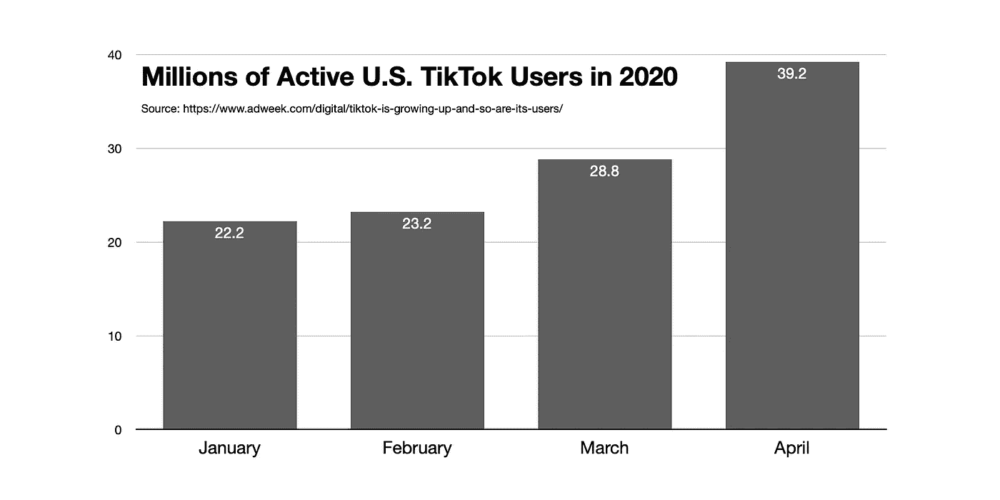

# 如何从抖音收集数据(教程)

> 原文：<https://towardsdatascience.com/how-to-collect-data-from-tiktok-tutorial-ab848b40d191?source=collection_archive---------3----------------------->

## 如何抓取用户发布或喜欢的视频，从种子帐户滚雪球般地收集大量用户列表，以及收集流行视频，所有这些都只需一个简单的 API。


Kon Karampelas 在 [Unsplash](https://unsplash.com/s/photos/tiktok?utm_source=unsplash&utm_medium=referral&utm_content=creditCopyText) 上拍摄的照片

正如 [The Information](https://www.theinformation.com/articles/tiktoks-u-s-revenues-expected-to-hit-500-million-this-year) 所说，抖音已经“像火箭一样在美国和全世界起飞，创造了一种新的移动视频体验，让 YouTube 和脸书争相跟上。”

仅看看 18 岁以上的美国用户，根据康姆斯克提供给《广告周刊》的数据，抖音的独立访客从 1 月份的 2220 万增加到 4 月份的 3920 万。



该平台不仅仅是一个很酷的新应用程序:正如最近的事件所表明的那样，其算法传播的视频可能会产生现实世界的后果。举几个突出的例子，

*   韩国流行乐迷利用抖音在塔尔萨的集会上恶作剧，买了票却没有露面
*   抖音的青少年在 Trump 的商品网站上组织了“放弃购物车”活动，试图向其他人隐藏库存
*   一些用户鼓励特朗普的反对者点击特朗普的广告，以便[抬高竞选的广告成本](https://twitter.com/williamlegate/status/1275614944411746304)
*   这款应用已经传播了乔·拜登的视频

简而言之，抖音及其驾驶算法现在具有相当大的现实世界影响力，特别是考虑到一个典型的用户每天花近一个小时在平台上观看视频。考虑到这一点，了解抖音每天向数百万人展示什么是很重要的，为此，我们需要一些数据。

下面，我包含了如何以各种方式收集抖音数据的代码。我试图保持它的通用性并对大多数用例有帮助，但是你可能需要根据你正在做的事情来调整它。这篇文章的剩余部分讲述了如何做到以下几点:

1.  👤收集用户发布的视频
2.  ❤️收集用户喜欢视频
3.  ⛄️像滚雪球一样扩大了用户名单
4.  📈收集热门视频

(给书呆子们一些提示:如果你打算提出几十个以上的请求，我建议设立一个代理。我还没有测试过，但是我在这里演示的 API 应该很容易与您的代理集成。第二，如果您想跟踪流行程度，您将需要在统计数据中添加时间戳。)

## 1.👤收集用户发布的视频

一个好的起点是从给定的用户那里收集视频。我将使用由[大卫·蒂瑟](https://github.com/davidteather)开发的[抖音-Api](https://github.com/davidteather/TikTok-Api) (运行`pip3 install TikTokApi`以获得软件包)。

要从《华盛顿邮报》抖音账户(我最喜欢的账户之一)收集视频，以下是你在 Python 中需要做的所有事情:

```
from TikTokApi import TikTokApi
api = TikTokApi()n_videos = 100
username = 'washingtonpost'user_videos = api.byUsername(username, count=n_videos)
```

`user_videos`对象现在是 100 个视频字典的列表(这里的示例字典是)。您可能最感兴趣的只是一些统计数据，您可以使用下面的函数从完整的字典中提取这些数据:

```
def simple_dict(tiktok_dict):
  to_return = {}
  to_return['user_name'] = tiktok_dict['author']['uniqueId']
  to_return['user_id'] = tiktok_dict['author']['id']
  to_return['video_id'] = tiktok_dict['id']
  to_return['video_desc'] = tiktok_dict['desc']
  to_return['video_time'] = tiktok_dict['createTime']
  to_return['video_length'] = tiktok_dict['video']['duration']
  to_return['video_link'] = 'https://www.tiktok.com/@{}/video/{}?lang=en'.format(to_return['user_name'], to_return['video_id']) to_return['n_likes'] = tiktok_dict['stats']['diggCount']
  to_return['n_shares'] = tiktok_dict['stats']['shareCount']
  to_return['n_comments'] = tiktok_dict['stats']['commentCount']
  to_return['n_plays'] = tiktok_dict['stats']['playCount'] return to_return
```

然后，我们可以从 API 输出的`user_videos`列表转到一个漂亮、干净的表格(即 Pandas 数据框)，只有三行代码:

```
user_videos = [simple_dict(v) for v in user_videos]
user_videos_df = pd.DataFrame(user_videos)
user_videos_df.to_csv('{}_videos.csv'.format(username),index=False)
```

下面是输出文件的样子(为了便于阅读，我删除了一些行和列):

## 2.❤️收集用户喜欢视频

在这种情况下，您可能对给定用户“喜欢”的视频感兴趣。这很容易收集。来看看[抖音官方账号](https://www.tiktok.com/@tiktok)最近都喜欢哪些视频:

```
username = 'tiktok'
n_videos = 10liked_videos = api.userLikedbyUsername(username, count=n_videos)
liked_videos = [simple_dict(v) for v in liked_videos]liked_videos_df = pd.DataFrame(liked_videos)
liked_videos_df.to_csv('{}_liked_videos.csv'.format(username), index=False)
```

输出文件看起来与上次的相似，因为它也保存了一个视频列表:

## 3.⛄️像滚雪球一样扩大了用户名单

假设您想要创建一个大型用户列表，从中您可以收集他们发布的视频和他们喜欢的视频。你可以使用 [50 个最受关注的抖音账户](https://en.wikipedia.org/wiki/List_of_most-followed_TikTok_accounts)，但 50 个账户可能无法产生足够广泛的样本。

另一种方法是使用建议的用户从一个用户滚雪球式地增加用户列表。首先，我们将为四个不同的帐户执行此操作:

*   `tiktok`是 app 的官方账号
*   `washingtonpost`是我最喜欢的账户之一
*   `charlidamelio`是抖音最受欢迎的账户
*   `chunkysdead`在 app 上领导一个自称“邪教”的人

以下是我使用的代码:

```
seed_users = ['tiktok', 'washingtonpost', 'charlidamelio', 'chunkysdead']seed_ids = [api.getUser(user_name)['userInfo']['user']['id'] for user_name in seed_users]suggested = [api.getSuggestedUsersbyID(count=20, startingId=s_id) for s_id in seed_ids]
```

以下是推荐的用户:

值得注意的是，`washingtonpost`和`chunkysdead`的推荐列表是相同的，其他推荐之间有很多重叠，所以这种方法可能无法满足您的需求。

创建大型用户列表的另一种方法是使用`getSuggestedUsersbyIDCrawler`来保持雪球滚动。要使用`tiktok`作为种子帐户创建 100 个建议帐户的列表，您只需要以下代码:

```
tiktok_id = api.getUser('tiktok')['userInfo']['user']['id']suggested_100 = api.getSuggestedUsersbyIDCrawler(count=100, startingId=tiktok_id)
```

这将创建一个包含各种不同名人账户的列表，以下是一些:

```
@lizzo (lizzo, 8900000 fans)
@wizkhalifa (Wiz Khalifa, 1800000 fans)
@capuchina114 (Capuchina❗️👸🏼, 32600 fans)
@silviastephaniev (Silvia Stephanie💓, 27600 fans)
@theweeknd (The Weeknd, 1400000 fans)
@theawesometalents (Music videos, 33400 fans)
...
```

从我的观察来看，`getSuggestedUsersbyIDCrawler`方法开始扩展，寻找更小、更小众的账户，这些账户拥有数万名粉丝，而不是数十万或数百万。如果您想要一个有代表性的数据集，这是一个好消息。

> 如果您想从抖音收集广泛的数据样本，我建议从推荐的用户爬虫开始。

## 4.📈收集热门视频

最后，也许你只是想收集流行视频进行简单的内容分析，或者只是为了跟上潮流🙂。API 使这变得非常简单，如下所示:

```
n_trending = 20trending_videos = api.trending(count=n_trending)
trending_videos = [simple_dict(v) for v in trending_videos]
trending_videos_df = pd.DataFrame(trending_videos)
trending_videos_df.to_csv('trending.csv',index=False)
```

以下是周四下午(2020 年 7 月 2 日)趋势视频的输出文件:

本教程到此结束，感谢您的阅读！这里有一个文件，里面有我使用的所有代码。