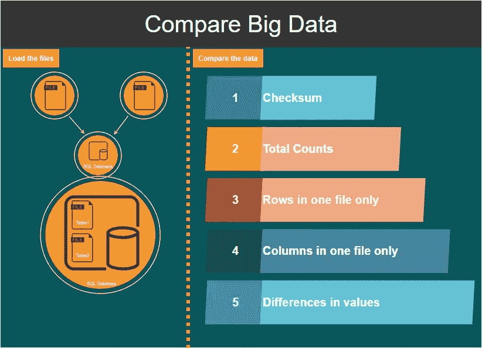
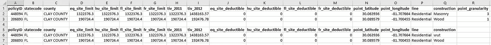

# 如何比较大文件

> 原文：<https://towardsdatascience.com/how-to-compare-large-files-f58982eccd3a?source=collection_archive---------4----------------------->

## 了解如何使用 Python 比较大文件


在这篇博客中，我们将学习如何比较两个大文件，同时创建一个快速而有意义的差异摘要。我已经以这样一种方式组织了这个博客，你可以按照端到端解决方案中的一步一步的指导。

一般来说，比较两个数据集并不是很难。主要的困难来自于能够快速获得有意义的见解。虽然前面提到的困难可以通过预先存在的比较库(如 dataComPy)快速解决，但当数据变得如此之大，以至于无法保存在内存中时，问题就会变得更加严重。

[](/building-a-python-ui-for-comparing-data-13c10693d9e4) [## 构建用于比较数据的 Python UI

### 如何快速让您的非技术团队能够比较数据

towardsdatascience.com](/building-a-python-ui-for-comparing-data-13c10693d9e4) 

令我失望的是，我找不到一个现有的数据比较库来处理更大的数据集。我找到的所有这些都要求所有的数据都在内存中。

看到这是一个需要解决的问题，我开始寻找解决这个问题的最佳方法。

# 确定解决方案

为了帮助确定解决方案，我从清楚地定义问题开始。我希望能够比较大文件。问题是数据太大了，我无法在内存中保存所有的数据。我也希望解决方案是简单的。

> 说得好的问题是解决了一半的问题。
> 
> —查尔斯·凯特林

我考虑过的解决这个问题的一个方法是将部分内容加载到内存中。这意味着比较内存中的数据；找出匹配的和不匹配的(内存外)，然后转移到更多的数据上。这些类型的操作是一个完整的后勤噩梦，需要复杂的逻辑来跟踪一切。


我希望有一种更简单的做事方法。抱着看看；我想到了另一个主意。如果我使用一个 SQL 数据库来进行所有的比较会怎么样。

毕竟，这不是数据库的主要目的吗？持有数据，快速进行以数据为中心的操作？

# 构建比较脚本，利用 SQL 的强大功能

我希望比较的结果易于理解，并提供有意义的见解。这意味着我更感兴趣的是一个快速总结，和一些例子比较突破。如果需要，我总是可以深入研究数据。

[](/an-introduction-to-sql-4c9eb27995df) [## SQL 简介

### 通过示例学习 SQL 的基础知识

towardsdatascience.com](/an-introduction-to-sql-4c9eb27995df) 

那么，它是如何工作的呢？



在我们运行完整的比较之前，我们应该快速查看文件是否 100%相似。为此，我们可以进行校验和检查。

## 校验和:用 SHA1 比较数据

```
import hashlibdef sha1(fname):
    sha1hash = hashlib.sha1()
    with open(fname) as handle: #opening the file one line at a time for memory considerations
        for line in handle:
            sha1hash.update(line.encode('utf-8'))
    return(sha1hash.hexdigest())

def comparefiles(files,datakey):
    print('########################################')
    print('Checking the files\' hash.')
    if sha1(files[0]) == sha1(files[1]):
        print('100% Match')
    else:
        print('Hash not matched. Proceeding to detailed checks.')comparefiles(files, datakey)
```

仔细观察上面的脚本，我们实际上是一行一行地加载文件，并计算出它们的 SHA1 输出。然后在两个文件之间进行比较。

要运行上面的脚本，我们只需传入:

```
comparefiles(['path2file1', 'path2file2'], '')
```

假设文件之间存在差异，那么我们想知道差异是在记录的数量上还是在它们的值上。因此，我们可以研究做一些快速计数。

[](https://medium.com/financeexplained/3-quick-ways-to-compare-data-in-python-65201be10b6) [## 在 Python 中比较数据的 3 种快速方法

### 对于任何从事分析工作的人来说，收到比较数据的请求都太熟悉了。不管那是…

medium.com](https://medium.com/financeexplained/3-quick-ways-to-compare-data-in-python-65201be10b6) 

## 将数据加载到 SQL

首先，我们需要在不超出可用内存的情况下将数据加载到 SQL 中，并创建索引来加快查询操作。

从下面的脚本中，您可以看到我们首先需要定义我们的输入:

*   文件:我们要比较的两个文件的文件路径列表
*   colsep:两个文件的分隔符列表
*   数据键:我们数据集的键列表
*   conn:我们将用于比较的连接；它可以在内存中，也可以在物理数据库中

下面的脚本中需要注意的另一件事是，我们正在逐块加载文件以避免耗尽内存，并且我们用下划线替换了所有的列空格。

```
import sqlite3, pandas as pd#################Set Up#############
files = [r'C:\Temp\FL_insurance.csv', r'C:\temp\FL_insurance - Copy.csv']
colsep = [',',',']
datakey = ['policyID', 'statecode', 'county']conn = sqlite3.connect(':memory:')
#conn = sqlite3.connect('meh.sqlite3')
#####################################cur = conn.cursor()
static = ['Table1','Table2']def loadDataToSQL(files, static):
    chunksize = 10000
    i=0
    createindexfortable = lambda a, b : f'CREATE INDEX  {a} Index ON {b} ({a})'
    for file in files:
        i = i+1
        for chunk in pd.read_csv(file, chunksize=chunksize, delimiter=colsep[i-1]): #load the file in chunks in case its too big
            chunk.columns = chunk.columns.str.replace(' ', '_') #replacing spaces with underscores for column names
            chunk.to_sql(name= static[i-1], con=conn, if_exists='append')
    for item in datakey: #create indexes so it runs faster
        createindexfortable(item, 'Table1')
        createindexfortable(item, 'Table2')
```

假设数据现在已经全部加载到 SQL DB 中，接下来要做的事情就是执行计数。为了控制命令的执行和输出，我们可以创建一个可以调用的函数。

```
def returnSQLresults(statement, noprint = 0):
    cur.execute(statement)
    i=0
    temp = []
    for row in cur:
        if noprint == 0 and len(row) > 1:
            if i == 0: #if there are multiple records, only print the header once
                names = list(map(lambda x: x[0], cur.description)) #column names
                print(names)
            print(row)
        else:
            temp.append(row)
        i=i+1
    if noprint == 1 and i != 0:
        return(temp)
    elif i==0: return(None)
```

分解上面的脚本:

1.  我们检查光标中是否有任何结果返回，以及是否已经定义了 *noprint*
2.  *noprint* 本质上导致函数*返回*数据而不是打印
3.  如果光标返回任何结果，我们在*打印*任何内容之前*打印*结果中的列名

完成上述设置后，我们现在可以开始比较操作了。

## 总计数

现在是时候利用我们到目前为止在程序中定义的所有函数，开始构建数据比较摘要了。然后，让我们通过定义一个可以调用的新函数来大致了解一下总计数。

```
def SQLComp(files, keys, compDegree):
    print('########################################')
    print('Checking Counts across the two data sets:')
    print('Total Counts')    
    statement_counts =   '''SELECT "Table1" AS "TABLE", COUNT(1)                                                                                               FROM Table1
                            UNION
                            SELECT "Table2" AS "TABLE", COUNT(1) FROM Table2'''
    returnSQLresults(statement_counts)
```


照片由[沙哈达特·拉赫曼](https://unsplash.com/@hishahadat?utm_source=medium&utm_medium=referral)在 [Unsplash](https://unsplash.com?utm_source=medium&utm_medium=referral) 上拍摄

## 比较行(根据预定义的键)

此时，我们知道这两个文件不是 100%匹配，并且我们也知道每个文件的计数。我们现在需要看得更深一点，了解是否有任何条目与我们预定义的键不匹配。

也就是说，我们需要做一个完整的外部连接，并突出显示不在一个文件或另一个文件中的记录(按照我们预定义的键)。从技术上讲，进行这种连接的 SQL 查询并不复杂；然而，由于我们希望从我们的输入中自动生成查询，所以我们需要有创造性。

为此，我使用了一个循环和 f 字符串。让我们更详细地看看这一点。

```
def SQLComp(files, keys, compDegree):
    for key in keys:
        if key == keys[0]:
            joinstatement = f'x.{key} = y.{key}'
            wherestatement = f' WHERE y.{key} IS NULL'
            wherenotstatement = f' WHERE y.{key} IS NOT NULL'
        else: 
            joinstatement += f' AND x.{key} = y.{key}'
            wherestatement += f' AND y.{key} IS NULL'
            wherenotstatement += f' AND y.{key} IS NOT NULL'print('########################################')
    print('Checking Rows based on data Key.')
    statement1 = f'''SELECT * FROM Table1 x
                    LEFT JOIN Table2 y ON {joinstatement} {wherestatement}'''
    statement2 = f'''SELECT * FROM Table2 x
                    LEFT JOIN Table1 y ON  {joinstatement} {wherestatement}'''

    if returnSQLresults(statement1) is None and returnSQLresults(statement2) is None:
        print('No differences found.')
    else:
        print('Data in file 1, but not in file 2')
        returnSQLresults(statement1)

        print('Data in file 2, but not in file 1')
        returnSQLresults(statement2)
```

我们通过左右连接来实现完全的外部连接，在每个点突出显示孤立条目。

## 比较标题(列)

接下来，是列检查。我们想知道这些文件的头是否有差异。

我们可以通过 PRAGMA 命令在 SQLite 中检索头，所以这是相对简单的。

```
def SQLComp(files, keys, compDegree):
    print('########################################')
    print('Checking Columns between the two files.')
    statement3 = lambda a : 'PRAGMA TABLE_INFO(' + a + ')'
    statement3Table1results = returnSQLresults(statement3('Table1'),1)
    statement3Table2results = returnSQLresults(statement3('Table2'),1)
    if (statement3Table1results == statement3Table2results):
        print('No differences found.')
    else:
        print('Columns in one but not the other.')
        print(set(statement3Table1results)-set(statement3Table2results))
```

这里唯一值得强调的是集合上减法运算的使用，它允许我快速比较列表。


阿诺·弗朗西斯卡在 [Unsplash](https://unsplash.com?utm_source=medium&utm_medium=referral) 上的照片

## 详细的值比较

完成上述检查后，我们现在要开始探索一些价值差异。为此，我们首先要确定两个文件之间的共同列，这将允许我们对它们进行比较。

```
def list2csv(l1):
    for i, item in enumerate(l1):
        if i == 0:
            csvlist = 'x.' + item
        else:
            csvlist += ', x.'+ item
    return(csvlist)def SQLComp(files, keys, compDegree):
    print('########################################')
    print('Differences identified in the following columns.')
    columnsInCommon1 = list(set(statement3Table1results).intersection(set(statement3Table2results)))
    columnsInCommon = []
    for cols in columnsInCommon1:
        columnsInCommon.append(cols[1])
    columnsInCommon.remove('index')
    cols2select = list2csv(datakey)for item in columnsInCommon:
        statement4 = f'''SELECT {cols2select}, x.{item}, y.{item} FROM Table1 x
                      JOIN Table2 y ON {joinstatement} {wherenotstatement}
                      AND x.{item} <> y.{item}'''
        returnSQLresults(statement4)
```

# 对其进行测试

为了帮助我测试上面的脚本并展示结果，我取了一个样本数据文件，克隆它并做了一些修改。您可以在这里看到不同之处:



您可以看到，我更改了标题结构下的一个值，并删除了其中一列。

运行脚本，返回以下内容:

```
########################################
Checking the files' hash.
Hash not matched. Proceeding to detailed checks.
########################################
Checking Counts across the two data sets:
Total Counts
['TABLE', 'COUNT(1)']
('Table1', 36633)
('Table2', 36633)
########################################
Checking Rows based on data Key.
No differences found.
########################################
Checking Columns between the two files.
Columns in one but not the other.
{(18, 'point_granularity', 'INTEGER', 0, None, 0)}
########################################
Differences identified in the following columns.
['policyID', 'statecode', 'county', 'construction', 'construction']
(448094, 'FL', 'CLAY COUNTY', 'Masonry', 'wut')
```

# 结论

总之，上面的脚本允许您将无法保存在内存中的大型数据集进行比较，同时最终为您提供一个漂亮的摘要视图。

将来可以通过以下方式轻松扩展它:

*   详细的值比较可以扩展为每个数据键的列表，而不是返回多行结果
*   包括特定属性的忽略标志
*   引入公差(绝对、相对)
*   包括一个用户界面

如果我继续使用它，我会努力扩展它，但请随意扩展它或评论您的建议。

# 完整的剧本

```
import hashlib, sqlite3, pandas as pdconn = sqlite3.connect(':memory:')
#conn = sqlite3.connect('meh.sqlite3')
cur = conn.cursor()files = [r'C:\Temp\FL_insurance.csv', r'C:\temp\FL_insurance - Copy.csv']
colsep = [',',',']
datakey = ['policyID', 'statecode', 'county']
static = ['Table1','Table2']def list2csv(l1):
    for i, item in enumerate(l1):
        if i == 0:
            csvlist = 'x.' + item
        else:
            csvlist += ', x.'+ item
    return(csvlist)def sha1(fname):
    sha1hash = hashlib.sha1()
    with open(fname) as handle: #opening the file one line at a time for memory considerations
        for line in handle:
            sha1hash.update(line.encode('utf-8'))
    return(sha1hash.hexdigest())def loadDataToSQL(files, static):
    chunksize = 10000
    i=0
    createindexfortable = lambda a, b : f'CREATE INDEX  {a} Index ON {b} ({a})'
    for file in files:
        i = i+1
        for chunk in pd.read_csv(file, chunksize=chunksize, delimiter=colsep[i-1]): #load the file in chunks in case its too big
            chunk.columns = chunk.columns.str.replace(' ', '_') #replacing spaces with underscores for column names
            chunk.to_sql(name= static[i-1], con=conn, if_exists='append')
    for item in datakey: #create indexes so it runs faster
        createindexfortable(item, 'Table1')
        createindexfortable(item, 'Table2')def returnSQLresults(statement, noprint = 0):
    cur.execute(statement)
    i=0
    temp = []
    for row in cur:
        if noprint == 0 and len(row) > 1:
            if i == 0: #if there are multiple records, only print the header once
                names = list(map(lambda x: x[0], cur.description)) #column names
                print(names)
            print(row)
        else:
            temp.append(row)
        i=i+1
    if noprint == 1 and i != 0:
        return(temp)
    elif i==0: return(None)def sha1(fname):
    sha1hash = hashlib.sha1()
    with open(fname) as handle: #opening the file one line at a time for memory considerations
        for line in handle:
            sha1hash.update(line.encode('utf-8'))
    return(sha1hash.hexdigest())def SQLComp(files, keys, compDegree):
    for key in keys:
        if key == keys[0]:
            joinstatement = f'x.{key} = y.{key}'
            wherestatement = f' WHERE y.{key} IS NULL'
            wherenotstatement = f' WHERE y.{key} IS NOT NULL'
        else: 
            joinstatement += f' AND x.{key} = y.{key}'
            wherestatement += f' AND y.{key} IS NULL'
            wherenotstatement += f' AND y.{key} IS NOT NULL'
    print('########################################')
    print('Checking Counts across the two data sets:')
    print('Total Counts')    
    statement_counts =   '''SELECT "Table1" AS "TABLE", COUNT(1) FROM Table1
                            UNION
                            SELECT "Table2" AS "TABLE", COUNT(1) FROM Table2'''
    returnSQLresults(statement_counts)
    print('########################################')
    print('Checking Rows based on data Key.')
    statement1 = f'''SELECT * FROM Table1 x
                    LEFT JOIN Table2 y ON {joinstatement} {wherestatement}'''
    statement2 = f'''SELECT * FROM Table2 x
                    LEFT JOIN Table1 y ON  {joinstatement} {wherestatement}'''
    if returnSQLresults(statement1) is None and returnSQLresults(statement2) is None:
        print('No differences found.')
    else:
        print('Data in file 1, but not in file 2')
        returnSQLresults(statement1)
        print('Data in file 2, but not in file 1')
        returnSQLresults(statement2)
    print('########################################')
    print('Checking Columns between the two files.')
    #statement3 = 'PRAGMA table_info(Table1);'
    statement3 = lambda a : 'PRAGMA TABLE_INFO(' + a + ')'
    statement3Table1results = returnSQLresults(statement3('Table1'),1)
    statement3Table2results = returnSQLresults(statement3('Table2'),1)
    if (statement3Table1results == statement3Table2results):
        print('No differences found.')
    else:
        print('Columns in one but not the other.')
        print(set(statement3Table1results)-set(statement3Table2results))
    print('########################################')
    print('Differences identified in the following columns.')
    columnsInCommon1 = list(set(statement3Table1results).intersection(set(statement3Table2results)))
    columnsInCommon = []
    for cols in columnsInCommon1:
        columnsInCommon.append(cols[1])
    columnsInCommon.remove('index')
    cols2select = list2csv(datakey)
    for item in columnsInCommon:
        statement4 = f'''SELECT {cols2select}, x.{item}, y.{item} FROM Table1 x
                      JOIN Table2 y ON {joinstatement} {wherenotstatement}
                      AND x.{item} <> y.{item}'''
        returnSQLresults(statement4)
        #print(statement4)def comparefiles(files,datakey):
    print('########################################')
    print('Checking the files\' hash.')
    if sha1(files[0]) == sha1(files[1]):
        print('100% Match')
    else:
        print('Hash not matched. Proceeding to detailed checks.')
        loadDataToSQL(files, static)
        SQLComp(files, datakey, [])comparefiles(files, datakey)
```

如果你喜欢这个故事，你可能也会喜欢:

[](/building-a-python-ui-for-comparing-data-13c10693d9e4) [## 构建用于比较数据的 Python UI

### 如何快速让您的非技术团队能够比较数据

towardsdatascience.com](/building-a-python-ui-for-comparing-data-13c10693d9e4) [](https://medium.com/financeexplained/3-quick-ways-to-compare-data-in-python-65201be10b6) [## 在 Python 中比较数据的 3 种快速方法

### 对于任何从事分析工作的人来说，收到比较数据的请求都太熟悉了。不管那是…

medium.com](https://medium.com/financeexplained/3-quick-ways-to-compare-data-in-python-65201be10b6)