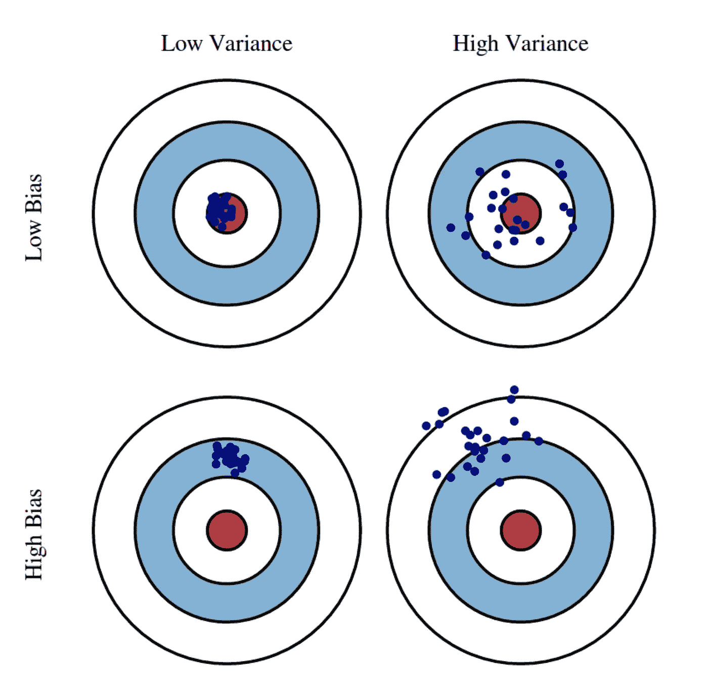

# 如何比较机器学习算法

> 原文：<https://towardsdatascience.com/how-to-compare-machine-learning-algorithms-ccc266c4777?source=collection_archive---------4----------------------->

## “当你改变看待事物的方式时，你所看待的事物也会改变。”―马克斯·普朗克

来源:https://unsplash.com/photos/qwtCeJ5cLYs

T 人类已经发明了不计其数的机器学习(ML)算法。当然，大多数时候只有一小部分用于研究和工业。然而，对于一个人来说，理解和记住所有这些 ML 模型的所有本质细节仍然有点困难。有些人可能还会有一个错误的印象，认为所有这些算法都是完全不相关的。更重要的是，当两种算法看起来都是有效的算法时，人们怎么可能选择使用算法 A 而不是 B 呢？

本文旨在为读者提供不同的角度来看待最大似然算法。有了这些观点，算法可以在共同的基础上进行比较，并且可以很容易地进行分析。写这篇文章的时候考虑了两个主要的 ML 任务——回归和分类。

## 时间复杂度

在 RAM 模型[1]下，算法所花费的“时间”是通过算法的基本运算来衡量的。虽然用户和开发人员可能更关心算法训练模型所需的挂钟时间，但使用标准最坏情况计算时间复杂性来比较模型训练所需的时间会更公平。使用计算复杂性的好处是忽略运行时使用的计算机能力和架构以及底层编程语言等差异，允许用户专注于算法基本操作的基本差异。

请注意，在训练和测试期间，时间复杂度可能会有很大的不同。例如，像线性回归这样的参数模型可能需要很长的训练时间，但它们在测试期间是有效的。

## 空间复杂性

空间复杂度根据输入大小来衡量算法运行需要多少内存。如果 ML 算法将过多的数据加载到机器的工作存储器中，那么 ML 程序就不能成功运行。

## 样本复杂性

样本复杂度测量训练网络所需的训练样本的数量，以保证有效的概括。例如，深度神经网络具有高样本复杂性，因为需要大量训练数据来训练它。

## 偏差-方差权衡

不同的 ML 算法将具有不同的偏差-方差权衡。偏差误差来自于模型偏向于特定的解决方案或假设。例如，如果线性决策边界适合非线性数据，则偏差会很高。另一方面，方差度量来自模型方差的误差。它是一个模型的预测和期望模型的预测的均方差[2]。

偏差-方差权衡，摘自[2]。

不同的模型做出不同的偏差-方差权衡。例如，朴素贝叶斯被认为是一个高偏差、低方差的模型，因为它做出了过于简单的假设。

## 线上和线下

线上线下学习是指一个机器学习软件学习更新模型的方式。在线学习意味着训练数据可以一次呈现一个，以便当新数据可用时参数可以立即更新。然而，离线学习需要在出现新数据时重新开始训练(重新训练整个模型),以便更新参数。如果算法是在线算法，那么它将是高效的，因为生产中使用的参数可以实时更新，以反映新数据的影响。

ID3 决策树算法是离线学习的一个例子。ID3 的工作方式是全局查看数据，并进行贪婪搜索以最大化信息增益。当新的数据点出现时，整个模型需要重新训练。相比之下，随机梯度下降(SGD)是一种在线算法，因为当新数据到达时，您可以随时使用它来更新训练模型的参数。

## 并行性

并行算法是指一个算法可以在给定的时间内完成多个操作。这可以通过将工作负载分配给不同的工作人员来实现，比如一台机器或多台机器上的处理器。像梯度推进决策树(GBDT)这样的顺序算法很难并行化，因为下一个决策树是基于上一个决策树所犯的错误构建的。

k-最近邻(k-NN)模型的性质允许它容易地同时在多台机器上运行。这是在机器学习中使用 MapReduce 的一个经典例子。

## 参数化

参数化概念被广泛应用于统计学习领域。简单地说，参数模型意味着模型的参数数量是固定的，而当更多的数据可用时，非参数模型的参数数量会增加[3]。定义参数模型的另一种方式是基于其关于数据概率分布形状的基本假设。如果没有提出假设，那么它就是一个非参数模型[4]。

参数模型在机器学习中非常常见。例子是线性回归、神经网络和许多其他 ML 模型。另一方面，k-NN 和 SVM(支持向量机)是非参数模型[5]。

## 方法、假设和目标

本质上，所有的机器学习问题都是优化问题。机器学习模型背后总有一种方法论，或者一个底层的目标函数需要优化。算法背后的主要思想的比较可以增强对它们的推理。

例如，线性回归模型的目标是最小化预测和实际值的平方损失(均方误差，MSE)，而 Lasso 回归旨在最小化 MSE，同时通过添加额外的正则化项来限制学习参数，以防止过度拟合。

机器学习模型的一些分类包括 a)生成性对鉴别性，b)概率性对非概率性，c)基于树对非基于树，等等。

总之，可以基于不同的标准来分析最大似然算法。这些标准实际上有助于衡量不同 ML 模型的有效性和效率。

🚀🚀你能想到其他角度来比较 ML 算法吗？🤗🤗

## 参考

[1]计算的 RAM 模型[https://www 8 . cs . umu . se/kur ser/tdba 77/VT06/algorithms/BOOK/BOOK/node 12。HTM](https://www8.cs.umu.se/kurser/TDBA77/VT06/algorithms/BOOK/BOOK/NODE12.HTM)

[2]第 12 讲:偏倚-方差权衡[https://www . cs . Cornell . edu/courses/cs 4780/2018 fa/lectures/Lecture note 12 . html](https://www.cs.cornell.edu/courses/cs4780/2018fa/lectures/lecturenote12.html)

[3]拉什卡。"参数学习算法和非参数学习算法有什么区别？"[https://sebastianraschka . com/FAQ/docs/parametric _ vs _ parametric . html](https://sebastianraschka.com/faq/docs/parametric_vs_nonparametric.html)

[4] T. Hoskin，“参数和非参数:揭开术语的神秘面纱”，载于梅奥诊所，2012 年，第 1–5 页。

[5]第十七讲:决策树[https://www . cs . Cornell . edu/courses/cs 4780/2018 fa/lectures/Lecture note 17 . html](https://www.cs.cornell.edu/courses/cs4780/2018fa/lectures/lecturenote17.html)