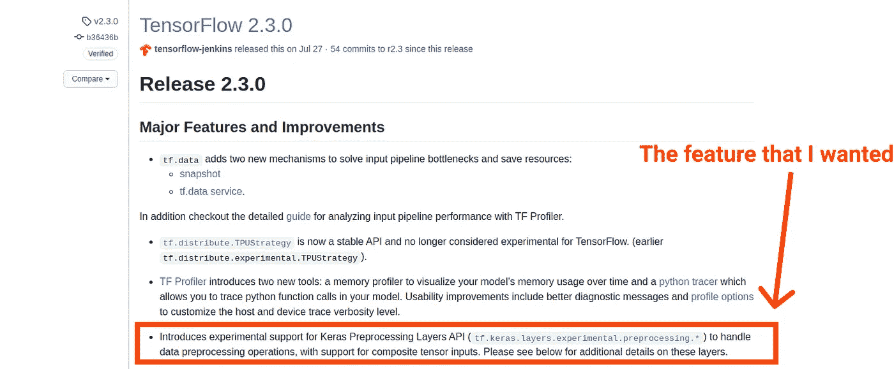
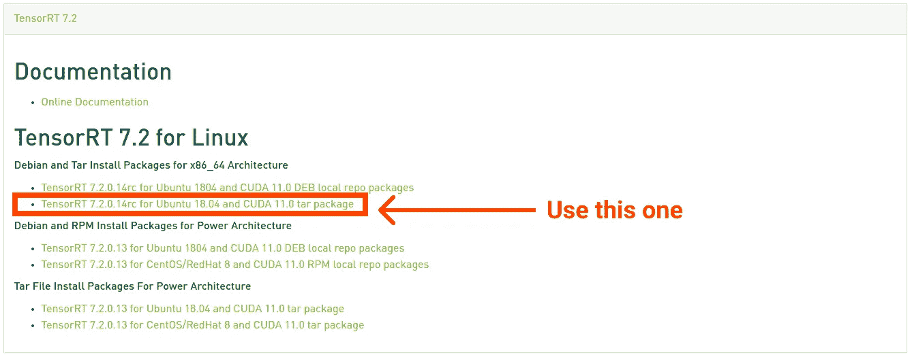

# 如何用 CUDA 11.1 编译 TensorFlow 2.3

> 原文：<https://towardsdatascience.com/how-to-compile-tensorflow-2-3-with-cuda-11-1-8cbecffcb8d3?source=collection_archive---------5----------------------->

## 当一切都不工作时，将它用作 TensorFlow 安装的最后手段

照片由[罗伯特拜拜](https://unsplash.com/@robertbye?utm_source=unsplash&utm_medium=referral&utm_content=creditCopyText)在 [Unsplash](https://unsplash.com/s/photos/mess?utm_source=unsplash&utm_medium=referral&utm_content=creditCopyText)

TensorFlow 是一个用于构建机器学习项目的框架，非常易于使用。然而，这并不意味着它总是很容易设置，尤其是当你在玩前沿功能的时候。

# 这篇文章是为了将来的参考

在过去几年中，我多次遇到 TensorFlow 在某些环境下无法工作的情况。每次发生这种情况，我都要花几个小时在网上搜索支离破碎的信息，还要额外花几个小时把碎片拼在一起。这一次，我决定写一个详细的教程，以挽救未来的情况下，没有工作。

# 这次出了什么问题？

今天早些时候，我用一个基于 GAN 的网络构建了一个快速实验，我发现实验性的 Keras 预处理 API 很有帮助，但不幸的是，它刚刚被添加到 2.3 版中(我是在 2.2 版上):

对于一个普通的 Python 包，一个简单的`pip install -U tensorflow`就可以了，如果没有，`conda install tensorflow`将是备份，但是，不幸的是，TensorFlow 一点也不普通。

在完成了`pip install -U`之后，各种 CUDA 和 TensorRT“未找到”的错误开始出现，更糟糕的是，ANACONDA 还在之前的版本中。

在努力修复这些库一段时间后，我决定从源代码编译 TensorFlow 可能是挽救这种局面的唯一方法。

如果我们要从源代码编译，为什么不同时使用最新的 CUDA 和 tensort(那些是 TensorFlow 依赖的 Nvidia 库)，所以计划是安装 TensorFlow 2.3 和 CUDA 11.1、CuDNN 8.0 和 TensorRT 7(预编译 TensorFlow 使用 CUDA 10.1、CuDNN 7.6 和 TensorRT 6)。

# 步骤 1:安装开发库

因为我们正在编译 Python 库，所以需要开发库和头文件。我们可以得到那些带有`sudo apt install python3-dev python3-pip`的。

同时，我们还需要 TensorFlow 的纯 Python 部分，是外挂而不是编译的。我们可以安装它们:

我们还需要 Nvidia 库:

*   [CUDA 11.1](https://developer.nvidia.com/cuda-toolkit)
*   [CuDNN 8](https://developer.nvidia.com/rdp/cudnn-download#)
*   [TensorRT 7.2](https://developer.nvidia.com/nvidia-tensorrt-7x-download) (注意:用 zip 文件而不是 DEB 文件安装，因为它会抱怨 CUDA 版本是 11.1 而不是 11.0)

注意:你不必得到确切的版本，因为本教程是关于安装任何最新版本。

最后需要的是 Bazel，TensorFlow 使用的构建系统，你可以在这里找到如何安装它[。](https://docs.bazel.build/versions/master/install-ubuntu.html)

注意:到目前为止，您需要 Bazel 3.1.0 来编译 TensorFlow，但是 TensorFlow 会在编译设置期间提示您更改 Bazel 版本的命令。

# 步骤 2:配置安装并开始编译

由于我们是从源代码编译，所以需要先用`git clone [https://github.com/tensorflow/tensorflow.git](https://github.com/tensorflow/tensorflow.git)`获取源代码。

为了配置编译，我们需要在克隆的存储库中运行`./configure`。

该命令将提示我们一些选项，我们需要选择 CUDA 为版本 11，TensorRT 为版本 7，并提供以下路径来查找 Nvidia 库:

注意:列表中的最后一个是 TensorRT 7.2 zip 文件解压缩到的位置。

完成配置后，我们可以使用以下命令开始编译 TensorFlow:

# 步骤 3:修复错误

不幸的是，一旦开始编译，各种错误就会开始出现，但最有可能的是，您会看到类似这样的内容:

这就是说，没有找到所需的特定版本的 Nvidia 库。如果您严格遵循了上面的库安装步骤，那么您应该能够排除它确实丢失的可能性，剩下的只是 TensorFlow 正在对它们如何版本化做出一些假设。

对我来说，就是抱怨`libcudart.so.11.1`不见了。用`locate libcudart.so`快速搜索发现，不是 11.1，我有`libcudart.so.11.0`。这意味着，尽管 CUDA 在 11.1 版本中，但`libcudart.so`可能没有变化，所以它仍然是 11.0。

为了解决这个问题，我们需要打开`third_party/gpus/cuda_configure.bzl`(感谢 [Pwuertz](https://medium.com/u/1f89df37e1b0?source=post_page-----8cbecffcb8d3--------------------------------) 指出一个错别字！)并替换以下代码:

注意:如果您遇到问题的库不是`cudart`，您仍然可以通过修改其他组件的配置来修复它。

修复后，它应该开始编译(编译需要一段时间，所以要准备好过夜)。

要点是，对于 TensorFlow 安装，您应该总是从 Anaconda 或 Virtualenv 安装开始，如果它不起作用，并且您可以忍受一直使用 docker，那么使用官方 Docker 映像，但是如果所有这些都不起作用，请将这篇文章作为您的最后手段，这样至少您可以开始构建东西。

# 更新

感谢 [Pwuertz](https://medium.com/u/1f89df37e1b0?source=post_page-----8cbecffcb8d3--------------------------------) 指出，有时你也必须为`libcublas`指定“11”，因为 Nvidia 将后缀减少为`libcublas.so.11`，但 TensorFlow 使用`libcublas.so.11.2.1.74`或其他变量，这取决于确切的版本。

# 参考

感谢来自以下人员的精彩建议:

*   [https://github.com/tensorflow/tensorflow/issues/43588](https://github.com/tensorflow/tensorflow/issues/43588)
*   [https://github.com/tensorflow/tensorflow/issues/26289](https://github.com/tensorflow/tensorflow/issues/26289)
*   [https://github.com/tensorflow/tensorflow/issues/26150](https://github.com/tensorflow/tensorflow/issues/26150)