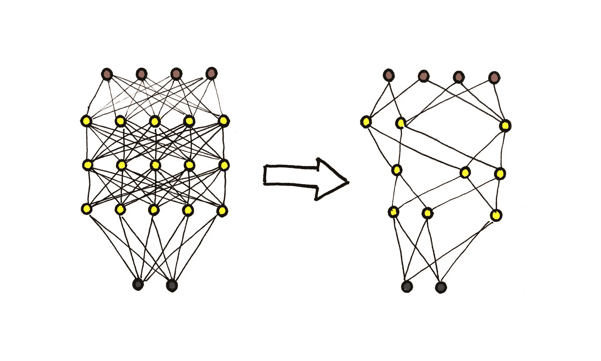
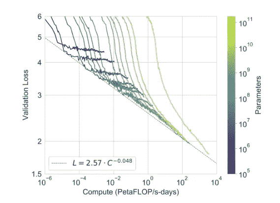
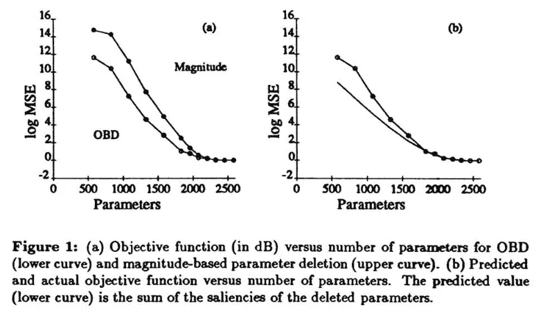
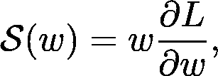
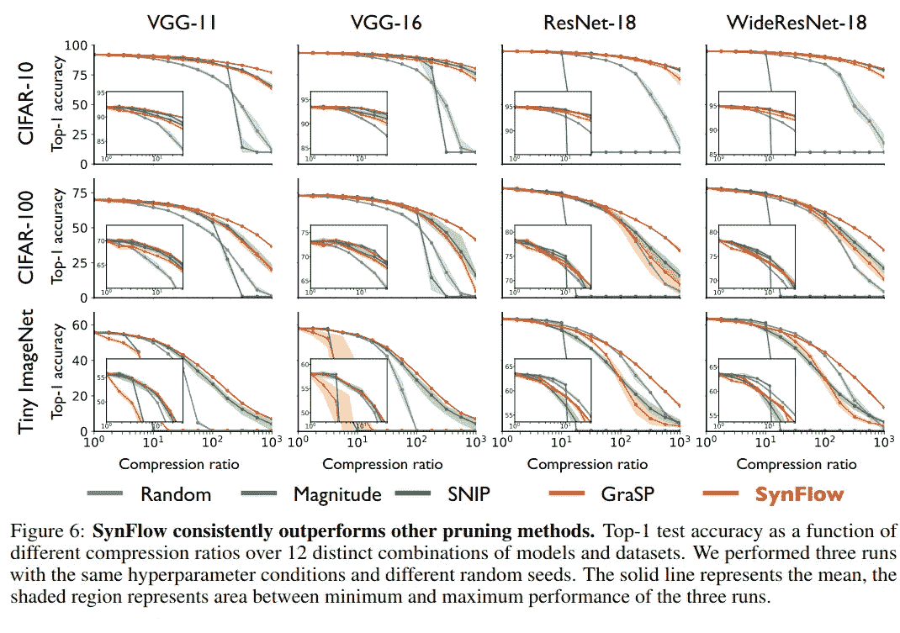
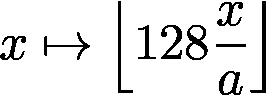
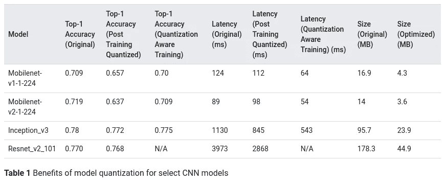
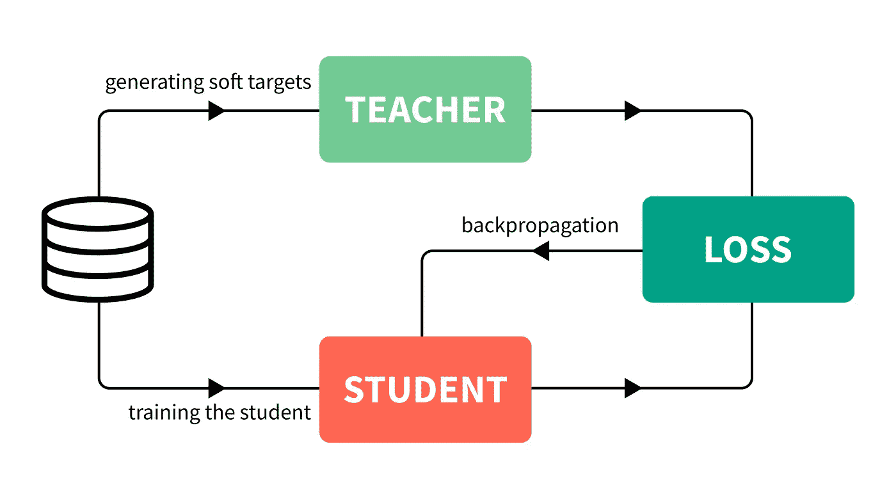
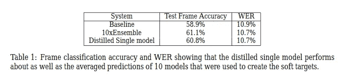

# 如何压缩神经网络

> 原文：<https://towardsdatascience.com/how-to-compress-a-neural-network-427e8dddcc34?source=collection_archive---------17----------------------->

作者图片

## 权重修剪、量化和知识提炼导论

现代最先进的神经网络架构非常庞大。例如，你可能听说过 GPT-3，OpenAI 最新的革命性 NLP 模型，能够写诗和互动讲故事。

GPT 3 号有大约 1750 亿个参数。

为了让您了解这个数字有多大，请考虑以下情况。一张 100 美元的钞票大约有 6.14 英寸宽。如果你开始把钞票一张一张地放在一起，这条线将会延伸 169，586 英里。相比之下，地球的周长是 24901 英里，沿着赤道测量。所以，在我们用完钱之前，大约需要 6.8 次往返。

不幸的是，与金钱相反，当涉及到参数的数量时，有时并不是越多越好。当然，更多的参数似乎意味着更好的结果，但也意味着更大的成本。[根据原论文](https://arxiv.org/pdf/2005.14165.pdf),“GPT-3”需要 3.14E+23 flops 的训练时间，计算成本本身就在数百万美元。

GPT-3 是如此之大，以至于它不容易被转移到其他机器上。它目前可以通过 OpenAI API 访问，所以你不能只是克隆一个 GitHub 库并在你的计算机上运行它。

然而，这只是冰山一角。部署小得多的模型也可能给机器学习工程师带来重大挑战。在实践中，小而快的模型要比笨重的模型好得多。

正因为如此，研究人员和工程师在压缩模型上投入了大量的精力。通过这些努力，出现了几种解决问题的方法。

# 为什么和如何

如果我们重温一下 GPT-3，我们可以看到参数的数量和训练时间是如何影响性能的。

GPT-3 模型不同变体中验证损失与计算时间的关系。颜色代表参数的数量。来源:[汤姆·布朗等人的《语言模型是很少出手的学习者》](https://arxiv.org/abs/2005.14165)

趋势似乎很明显:更多的参数导致更好的性能和更高的计算成本。后者不仅影响培训时间，还影响服务器成本和环境影响。([训练大型模特比一辆汽车一生排放的二氧化碳还多。](https://www.technologyreview.com/2019/06/06/239031/training-a-single-ai-model-can-emit-as-much-carbon-as-five-cars-in-their-lifetimes/))然而，训练只是神经网络生命周期的第一部分。从长远来看，推理成本占了上风。

为了通过压缩模型来优化这些成本，出现了三种主要方法:

*   权重剪枝，
*   量化，
*   知识的升华。

在本文中，我的目标是向您介绍这些，并概述它们是如何工作的。

我们开始吧！

# 权重修剪

减少神经网络规模的最古老方法之一是*权重修剪*，消除神经元之间的特定连接。实际上，消除意味着被去除的重量被零代替。

乍一看，这个想法可能令人惊讶。这难道不会消除神经网络所学习的知识吗？

当然，去除所有的联系无疑会导致失去所有学到的东西。另一方面，只删除一个连接可能并不意味着准确性的降低。

问题是，在预测性能开始下降之前，你能去除多少？

## 最佳脑损伤

最先研究这个问题的是 Yann LeCun、John S. Denker 和 Sara A. Solla，他们在 1990 年*发表的论文 [*最佳大脑损伤*](http://papers.nips.cc/paper/250-optimal-brain-damage.pdf) 。他们开发了以下迭代方法。*

1.  训练一个网络。
2.  通过观察重量扰动后损失如何变化来估计每个重量的重要性。较小的变化意味着不太重要。(这个重要性被称为*显著性*。)
3.  移除重要性较低的权重。
4.  回到步骤 1。并且重新训练网络，永久地将去除的权重固定为零。

在他们为 MNIST 分类修剪 [LeNet 的实验中，他们发现可以移除很大一部分权重，而不会明显增加损失。](http://yann.lecun.org/exdb/publis/pdf/lecun-89e.pdf)

来源: [*最佳大脑损伤*](http://papers.nips.cc/paper/250-optimal-brain-damage.pdf) 作者 Yann LeCun，John S. Denker 和 Sara A. Solla

然而，修剪后的再培训是必要的。这被证明是相当棘手的，因为*较小的型号意味着较小的容量*。此外，如上所述，训练量占计算成本的很大一部分。这种压缩只对推理时间有帮助。

有没有一种方法需要较少的修剪后训练，但仍能达到未修剪模型的预测性能？

## 彩票假说

麻省理工学院的研究人员在 2008 年取得了一项重要突破。在他们题为 [*彩票假说*](https://arxiv.org/abs/1803.03635) 的论文中，Jonathan Frankle 和 Michael Carbin 在他们的假说中指出

> 一个随机初始化的密集神经网络包含一个子网络，该子网络被初始化为当被隔离训练时，它可以在最多相同次数的迭代训练后匹配原始网络的测试精度。

这样的子网叫做*中奖彩票*。让我们假设你买了 10 张⁰⁰⁰彩票。(这比可观察到的宇宙中的原子数量还要多，但我们暂且不谈这个。)因为你有那么多，所以有极小的概率没有一个是赢家。这类似于训练神经网络，我们随机初始化权重。

**如果这个假设是真的**，并且可以找到这样的子网络，训练可以更快更便宜地完成，因为单个迭代步骤将花费更少的计算。

问题是，假设成立吗，如果成立，我们如何找到这样的子网？作者提出了以下迭代方法。

1.  随机初始化网络并存储初始权重以备后用。
2.  按照给定的步数训练网络。
3.  移除一定百分比的具有最低幅度的权重。
4.  将剩余重量恢复到第一次初始化时给出的值。
5.  转到步骤 2。并迭代修剪。

在基于简单数据集训练的简单架构上，如 MNIST 的 LeNet，这种方法提供了显著的改进，如下图所示。

来源:[彩票假说:寻找稀疏的、可训练的神经网络](https://arxiv.org/abs/1803.03635)，作者乔纳森·弗兰克尔和迈克尔·卡宾

然而，尽管它很有前途，但在像 ResNets 这样更复杂的体系结构上表现不佳。此外，修剪仍然发生在训练之后，这是一个显著的问题。

## 合成流

最近一次在训练前进行修剪的算法发表于 2020 年。(这是我写这篇文章的年份。在他们的论文中，来自斯坦福的田畑秀则·田中、丹尼尔·库宁、丹尼尔·l·k·亚明斯和 Surya Ganguli 开发了一种方法，这种方法走得更远，可以在没有训练的情况下进行修剪*。*

首先，他们引入了*层塌陷*的概念，

> 整个层的过早修剪使得网络不可跟踪，

这在理论中起着重要的作用。任何修剪算法都应该避免层折叠。困难的部分是确定一类满足这个标准的算法。

为此，作者在网络中引入了给定权重的*突触显著性得分*,定义如下

其中 *L* 是网络输出给定的损失函数， *w* 是权重参数。每个神经元*保持这个量*:在激活函数的某些约束下，传入突触显著性得分的总和等于传出突触显著性得分的总和。

该分数用于选择修剪哪些权重。(回想一下，为了这个目的，*最佳大脑损伤*方法使用了基于扰动的量，而彩票假设论文的作者使用了量级。)

事实证明，突触显著性分数在层之间是守恒的，粗略地说，如果迭代剪枝算法尊重这种逐层守恒，就可以避免层崩溃。

SynFlow 算法是一种类似于前面算法的迭代剪枝算法，但是选择是基于突触显著性分数的。

来源:[通过迭代保存突触流，在没有任何数据的情况下修剪神经网络](https://arxiv.org/abs/2006.05467)作者:田畑秀则·田中、丹尼尔·库宁、丹尼尔·l·k·亚明斯和 Surya Ganguli

然而，工作远未完成。正如 Jonathan Frankle 和他的合作者在他们最近的论文中所指出的，不存在通用的解决方案。每种方法在特定的场景中表现出色，但在其他场景中表现出色。此外，预训练剪枝方法优于基线随机剪枝，但仍不如一些后训练算法，尤其是基于幅度的剪枝。

## 履行

修剪在 TensorFlow 和 PyTorch 中都可用。

 [## 修剪教程- PyTorch 教程 1.6.0 文档

### 作者:Michela Paganini 最先进的深度学习技术依赖于过度参数化的模型，这些模型很难…

pytorch.org](https://pytorch.org/tutorials/intermediate/pruning_tutorial.html)  [## TensorFlow 模型优化工具包-修剪 API

### 2019 年 5 月 14 日——自从我们推出了模型优化工具包(Model Optimization Toolkit)以来，这是一套开发人员(无论是新手……

blog.tensorflow.org](https://blog.tensorflow.org/2019/05/tf-model-optimization-toolkit-pruning-API.html?hl=es-uy) 

接下来，我们要来看看神经网络压缩的另一个工具:*量化*。

# 量化

本质上，神经网络只是一堆线性代数和一些其他运算。默认情况下，大多数系统使用 *float32* 类型来表示变量和权重。

然而，一般来说，其他格式的计算比如 int8 比 float 32 T21 更快，内存占用更少。(当然，这些可以取决于硬件，但我们在这里并不试图额外具体。)

*神经网络量化*是一套旨在利用这一点的方法。例如，如果我们想要从上述的 *float32* 到 *int8* ，并且对于某个实数 *a* ，我们的值在范围 *[-a，a】*内，我们可以使用转换

转换权重并以新的形式继续计算。

当然，事情没那么简单。两个 *int8* 数相乘很容易溢出到 *int16* ，以此类推。在量化过程中，必须小心避免由此产生的误差。

与所有压缩方法一样，这也带来了信息的损失，并可能影响预测性能。问题和之前一样:要找到一个最优的取舍。

量化有两种主要风格:*训练后量化*和*量化感知训练*。前者更简单，但会导致比后者更大的精度损失。

[TensorFlow Lite](https://www.tensorflow.org/lite/) 中的量化方法及其性能。来源: [TensorFlow Lite 文档](https://www.tensorflow.org/lite/performance/model_optimization)

正如您在上表中看到的，在某些情况下，这可以将推断时间缩短一半。然而，从 *float32* 转换到 *int8* 并不是一个平滑的转换；因此，当渐变景观杂乱无章时，可能会导致次优结果。

有了量化感知训练，这种方法也有可能改善训练时间。

## 履行

与权重修剪类似，量化在 TensorFlow 和 PyTorch 中也可用。

 [## 模型优化| TensorFlow Lite

### 边缘设备通常具有有限的内存或计算能力。可以对模型进行各种优化，以便…

www.tensorflow.org](https://www.tensorflow.org/lite/performance/model_optimization)  [## 量化- PyTorch 1.6.0 文档

### 警告量化处于测试阶段，可能会有变化。量化指的是执行计算的技术…

pytorch.org](https://pytorch.org/docs/stable/quantization.html) 

在撰写本文时，PyTorch 中的这个特性还处于试验阶段，这意味着它可能会发生变化。所以，你应该期待在即将到来的版本中会有突破性的变化。

到目前为止，我们看到的方法都有一个共同的原理:训练网络，丢弃一些信息进行压缩。正如我们将会看到的，第三种，即*知识提炼*，与这些有显著的不同。

# 知识的升华

虽然量化和修剪可能是有效的，但它们最终是破坏性的。Geoffrey Hinton、Oriol Vinyals 和 Jeff Dean 在他们的论文[提取神经网络中的知识](https://arxiv.org/abs/1503.02531)中开发了一种替代方法。

他们的想法很简单:训练一个大模型(*老师*)来获得最佳表现，并用它的预测来训练一个小模型(*学生*)。

知识的升华。(图片由作者提供。)

他们的工作表明，通过这种方式，大型集合模型可以用更简单的架构压缩，更适合生产。

**知识提炼提高了提炼模型的推理时间，而不是训练时间。**这是其他两种方法的本质区别，因为培训时间通常成本很高。(如果我们回想一下 GPT-3 的例子，它是数百万美元。)

你可能会问，为什么不从一开始就使用紧凑的架构呢？秘方是通过使用学生模型的预测，教会学生模型像老师一样进行归纳。在这里，学生模型不仅可以看到大模型的训练数据，还可以看到新的数据，这些数据可以用来近似老师的输出。

从 Geoffrey Hinton、Oriol Vinyals 和 Jeff Dean 的论文[中提取神经网络中的知识](https://arxiv.org/abs/1503.02531)中的语音识别问题中提取知识

模型越小，就需要越多的训练数据来很好地概括。因此，它可能需要一个复杂的架构，如一个集合模型，以达到最先进的挑战性任务的表现。不过，它的知识可以用来推动学生模型的性能超过基线。

知识提炼的第一个用例是压缩集合，使它们适合生产。在卡格尔比赛中，合奏是臭名昭著的。几个获奖的模型由几个较小的模型组成，提供了出色的结果，但在实践中无法使用。

从那以后，它被成功地应用于其他架构，最著名的是 BERT，NLP 的著名变压器模型。

 [## 🏎更小，更快，更便宜，更轻:介绍伯特，伯特的精华版本

### 你可以在这里找到代码来重现呆伯特的训练以及呆伯特的预训练权重。

medium.com](https://medium.com/huggingface/distilbert-8cf3380435b5) 

除了 Hinton 等人的基线蒸馏方法，还有其他几种方法，试图推动技术的发展。如果您想了解这些方法的概况，我推荐下面的调查报告。

 [## 知识蒸馏:一项调查

### 近年来，深度神经网络在工业界和学术界都取得了很大的成功，特别是在神经网络领域

arxiv.org](https://arxiv.org/abs/2006.05525v1) 

## 履行

由于知识提炼不需要像修剪或量化那样操纵权重，因此它可以在您选择的任何框架中执行。

这里有一些例子让你开始！

 [## Keras 文件:知识蒸馏

### 作者:Kenneth Borup 创建日期:2020/09/01 最后修改时间:2020/09/01 描述:实现经典…

keras.io](https://keras.io/examples/vision/knowledge_distillation/)  [## aber Hu/知识-提炼-动物园

### Pytorch 实现了各种知识蒸馏(KD)方法。这个库是一个简单的参考，主要是…

github.com](https://github.com/AberHu/Knowledge-Distillation-Zoo) 

# 结论

随着神经网络变得越来越大，压缩模型变得更加重要。随着问题和架构复杂性的增加，计算成本和环境影响也在增加。

这种趋势似乎只会加速:GPT-3 包含 1750 亿个参数，与以前的巨型模型相比，这是 10 倍的数量级。因此，压缩这些网络是一个基本问题，这在未来将变得更加重要。

你准备好迎接这个挑战了吗？

[***如果你喜欢把机器学习概念拆开，理解是什么让它们运转，我们有很多共同点。看看我的博客，我经常在那里发表这样的技术文章！***](https://www.tivadardanka.com/blog)

 [## 你能移除 99%的神经网络而不损失准确性吗？

### 权重剪枝简介

towardsdatascience.com](/can-you-remove-99-of-a-neural-network-without-losing-accuracy-915b1fab873b)  [## 如何用量化加速和压缩神经网络

### 从浮点数到整数

towardsdatascience.com](/how-to-accelerate-and-compress-neural-networks-with-quantization-edfbbabb6af7)  [## 一个神经网络可以训练其他网络吗？

### 知识提炼导论

towardsdatascience.com](/can-a-neural-network-train-other-networks-cf371be516c6)