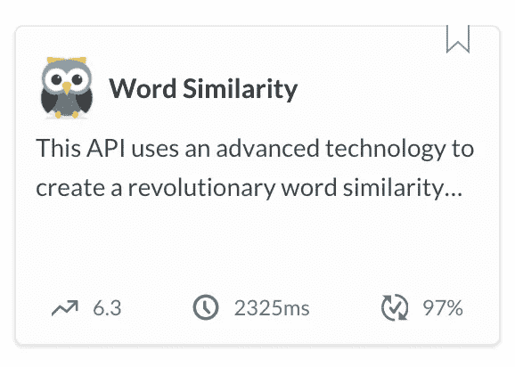

# 如何计算词语相似度——比较分析

> 原文：<https://towardsdatascience.com/how-to-compute-word-similarity-a-comparative-analysis-e9d9d3cb3080?source=collection_archive---------14----------------------->

## [NLP-in-Production](https://pedram-ataee.medium.com/list/nlpinproduction-98dbb687a868)

## Owl API 是一个强大的单词相似性服务，使用高级文本聚类技术和各种 word2vec 模型


在 [Unsplash](https://unsplash.com?utm_source=medium&utm_medium=referral) 上由[zdenk macha ek](https://unsplash.com/@zmachacek?utm_source=medium&utm_medium=referral)拍摄的照片

在自然语言处理或 NLP 中，大多数任务都是基于提取单词、句子或文档的语义而构建的。例如，我们通过提取句子的语义并基于它们在文档中的重要性对它们进行聚类来构建提取摘要。或者，我们通过提取最能表征一组文档的词组来构建主题建模解决方案。

有意义的语言的第一个要素是单词。所以，你可以猜测在 NLP 任务中正确提取单词的语义关系有多重要。**提取单词语义最强大的工具之一是 word2vec 模型。**这些 word2vec 模型针对不同的上下文进行训练，并提供单词的高维向量表示。然而，由于高维空间和结果缺乏质量，分析是复杂的。

在这篇文章中，我想介绍一个强大的单词相似性 API，名为 Owl，它可以帮助您提取与目标单词最相似的单词。与 NLP 项目非常需要的当前解决方案相比，该 API 以更大的粒度提取最相似的单词。

# owl——一个强大的词语相似度 API

这个 Owl API 使用各种 word2vec 模型和高级文本聚类技术来创建比行业标准更好的粒度。事实上，它将 spaCy 创建的最大的 word2vec 英文模型(即 [en-core-web-lg](https://spacy.io/models/en#en_core_web_lg) )用于**通用**上下文，并将斯坦福大学创建的 word2vec 模型之一(即[glove-wiki-gigaword-300](https://nlp.stanford.edu/projects/glove/)**)**用于**新闻**上下文。

在这里，我比较了这三个模型引入的最相似服务的结果。这有助于你找出为什么 **Owl 是你的答案**。



Owl——一个强大的单词相似度 API

# 一、word2vec 模型(spaCy 或 Glove)哪个更好提取最相似的词？

答案是没有。为什么？因为这些模型是在使用不同文本语料库的各种上下文中训练的。要提取最相似的词，首先必须确定上下文，如新闻、体育或一般。根据上下文，最相似的服务的结果可能完全不同。当您选择上下文时，您应该选择更适合您的问题的 word2vec 模型。

en-core-web-lg 模型已经在通用英语语料库上接受了训练，而 *glove-wiki-gigaword-300* 已经在维基百科和 gigaword 数据集(新闻专线文本数据的综合档案)上接受了训练。它们在两个不同的文本语料库上被训练，目的是提取不同的语义关系。下面，您可以看到使用这两种不同模型的单词“apple”的单词相似度的结果。

```
"spaCy (en-core-web-lg)": 
**[**"apples","blackberry","iphone","fruit","blueberry","strawberry",
"ipad","pineapple","pear","cider"**]**"Glove (glove-wiki-gigaword-300)": 
**[**"iphone","macintosh","ipod","microsoft","ipad","intel","ibm",
"google","imac","software"**]**
```

> 我们需要一个粒度更细的最相似的单词服务，它可以系统地区分子组。这正是 Owl 介入并解决问题的地方。

正如你所看到的，spaCy 的结果更多的是关于日常用语，而 Glove 的结果更多的是关于你能在新闻上找到的东西。现在，你可以很容易地理解为什么结果是不同的，而两者都是正确的。为了更好地阐明这一点，我们来看看对“丰田”最相似的词的结果。

```
"spaCy (en-core-web-lg)": **[**"honda","subaru","ford","bmw","chevy","volvo","jeep","prius",
"mercedes","dodge"**]**

"Glove (glove-wiki-gigaword-300)":**[**"honda","nissan","automaker","camry","prius","mazda","lexus",
"motor","automakers","ford"**]**
```

您可以看到这两个服务的结果是与原始单词相关的单词的组合，但不能在桶中报告。例如，spaCy 报告了两种不同类型的“苹果”词:水果和小工具。或者，Glove 报告了“丰田”的两种不同类型的词:型号和制造商。我们需要一个粒度更细的最相似的服务，可以系统地区分子群。这正是 Owl 介入并解决问题的地方。

# 二。为什么 Owl API 可以成为单词相似度服务的行业标准？

word2vec 模型通常在高维空间中生成向量。虽然这些模型保留了许多关于内部语言的信息，但它们很难分析。这就是为什么当前最相似单词服务的结果还不成熟的原因。Owl API 使用先进的文本聚类技术来改进当前的工具。

你可以找到 Owl API 使用下面的 *glove-wiki-gigaword-300* 模型生成的与“Toyota”最相似的单词的结果。你可以看到结果被很好地划分为模型、制造者和一般子群；一个你在原始模型中找不到的粒度。

```
"Owl (glove-wiki-gigaword-300)": **{**
0: **[**"camry","prius","lexus"**],** 1: **[**"honda","nissan", "mazda", "motor", "ford"**],** 2: **[**"automaker", "automakers"**]
}**
```

此外，您可以找到 Owl API 使用 *en-core-web-lg* 模型生成的与“apple”最相似的单词的结果。你可以看到结果被很好地分成代表水果、小工具和浆果的组。

```
"Owl (en-core-web-lg)": **{**
0: **[**"apples","fruit","pineapple", "pear", "cider"**],** 1: **[**"iphone","ipad"**],** 2: **[**"blueberry", "strawberry", "blackberry"**]
}**
```

# 三。如何使用 Owl API 提取最相似的单词？

很简单。首先，你需要从 [RapidAPI](https://rapidapi.com/) 获取自己的 API 密匙。然后，您必须选择符合您需求的端点。目前，Owl API 公开列出的端点为您提供了以下服务。

*   **Top_10_G** :一般语境下最相似的前 10 个词
*   **Top_50_G:** 一般语境下最相似的前 50 个词
*   **Top_10_N** :新闻语境中最相似的前 10 个词
*   **Top_50_N** :新闻语境中最相似的前 50 个词

然后，您必须提交请求并等待您的回复**🙂**。如果您使用 Python，您可以在下面找到 Top_10_N 端点的代码。

```
import requests

url = "https://word-similarity.p.rapidapi.com/news/10/apple"

headers = {
    'x-rapidapi-host': "word-similarity.p.rapidapi.com",
    'x-rapidapi-key': *** YOUR API KEY ***
    }

response = requests.request("GET", url, headers=headers)

print(response.text)
```

你可以在 [RapidAPI](https://rapidapi.com/pedram.ataee/api/word-similarity) 上找到使用 Python 和许多其他编程语言的 Owl API 的完整说明。

# 外卖食品

有很多工具可以提取最相似的单词，来定位单词。然而，上述工具是最常见的。我强烈建议尝试一下 [Owl API](https://rapidapi.com/pedram.ataee/api/word-similarity) ,因为它是建立在最好的 word2vec 模型之上的，与它的祖先相比，它能生成更有意义的结果。

# 感谢阅读！

如果你喜欢这个帖子，想支持我…

*   *跟我上* [*中*](https://medium.com/@pedram-ataee) *！*
*   *在* [*亚马逊*](https://www.amazon.com/Pedram-Ataee/e/B08D6J3WNW) *上查看我的书！*
*   *成为* [*中的一员*](https://pedram-ataee.medium.com/membership) *！*
*   *连接上*[*Linkedin*](https://www.linkedin.com/in/pedrama/)*！*
*   *跟我上* [*推特*](https://twitter.com/pedram_ataee) *！*

[](https://pedram-ataee.medium.com/membership) [## 通过我的推荐链接加入 Medium—Pedram Ataee 博士

### 作为一个媒体会员，你的会员费的一部分会给你阅读的作家，你可以完全接触到每一个故事…

pedram-ataee.medium.com](https://pedram-ataee.medium.com/membership)