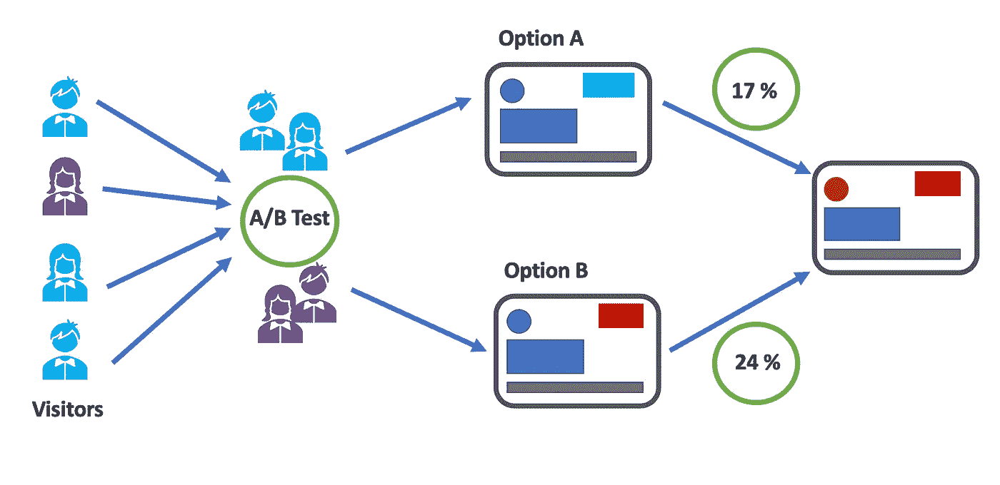

# 如何进行 A/B 测试？

> 原文：<https://towardsdatascience.com/how-to-conduct-a-b-testing-3076074a8458?source=collection_archive---------8----------------------->

## 如何执行 A/B 测试的分步指南

作者图片

A/B 测试的想法是向不同的变体(用户组)呈现不同的内容，收集他们的反应和用户行为，并使用结果来构建未来的产品或营销策略。

> A/B 测试是一种比较功能、页面、按钮、标题、页面结构、表单、登录页面、导航和定价等多个版本的方法。通过向客户或潜在客户展示不同的版本，并通过某种度量标准(点击率、购买、任何行动号召等)评估交互质量。).

在一个数据驱动的世界里，这变得越来越重要，因为商业决策需要事实和数字的支持。

# 如何进行标准的 A/B 测试

1.  阐明你的假设
2.  决定拆分和评估指标
3.  创建您的对照组和测试组
4.  A/B 测试的长度
5.  进行测试
6.  得出结论

## 1.阐明你的假设

在进行 A/B 测试之前，您需要陈述您的零假设和替代假设:

****无效假设*** *是指对照组和变异组之间没有***差异。* ***替代假设*** *是一种说法，即* ***是*** *对照组和变异组之间的一种区别。***

**想象一下，一家软件公司正在想方设法增加为他们的软件付费的人数。该软件目前的设置方式是，用户可以免费下载和使用该软件，试用期为 7 天。该公司希望改变主页的布局，用红色标志而不是蓝色标志来强调该公司的软件有 7 天的试用期。**

**这里举一个假设检验的例子:
**默认动作:**批准蓝色标志。
**替代动作:**批准红色标志。
**无效假设:**蓝色标志 ***不会导致*** 比红色标志至少多 10%的许可购买量。
**替代假设:**红色标识 ***确实导致*** 比蓝色标识至少多 10%的许可购买量。**

**需要注意的是，在执行 A/B 测试时，所有其他变量都需要保持不变。**

## **2.决定拆分和评估指标**

**我们应该考虑两件事:在进入网站时，我们应该在哪里以及如何将用户分成实验组，以及我们将使用什么指标来跟踪实验操作的成功或失败。转移单位的选择(我们将观察结果分组的点)可能会影响我们可以使用的评估指标。**

**控制组或“A”组将看到旧的主页，而实验组或“B”组将看到强调 7 天试验的新主页。**

****三种不同的分裂度量技术:****

****a)基于事件的转移
b)基于 Cookie 的转移
c)基于账户的转移****

**一个基于事件的转移(像一个页面视图)可以提供许多观察结果来得出结论，但是如果每个页面视图的情况发生变化，那么访问者可能会在每次主页访问中获得不同的体验。当用户不容易看到变化时，基于事件的转移更好，以避免体验中断。**

**此外，基于事件的转移可以让我们知道每个条件下下载页面被访问了多少次，但不能进一步跟踪每个条件下实际产生了多少次下载。**

****基于账户的**可以稳定，但不适合这种情况。由于访问者在到达下载页面后才注册，所以现在向应该被分配到实验条件下的人介绍新主页已经太晚了。**

**因此，这就剩下了考虑**基于 cookie 的转移**，这感觉像是正确的选择。Cookies 还允许跟踪每个访问者访问每个页面的情况。基于 cookie 的分流的缺点是，如果用户通过匿名窗口、不同的浏览器或在下载前过期或被删除的 cookie 进入网站，会导致计数不一致。然而，作为一种简化，我们将假设这种分配稀释很小，并忽略其潜在的影响。**

**在**评估指标**方面，我们更倾向于使用相对于 cookie 数量的**下载率** (# downloads / # cookies)和**购买率** (# licenses / # cookies)作为评估指标。**

**产品使用统计数据，比如软件在试用期间的平均使用时间，是潜在的有趣特性，但与我们的实验没有直接关系。当然，这些统计数据可能会帮助我们在实验完成后更深入地挖掘观察到的效应的原因。但是就实验的成功而言，产品的使用不应该被认为是一个评估标准。**

## **3.创建您的对照组和测试组**

**一旦你确定了你的无效假设和替代假设，下一步就是创建你的控制和测试(变量)组。这一步有两个重要的概念需要考虑，抽样和样本大小。**

****抽样**
随机抽样是最常见的抽样技术之一。总体中的每个样本都有均等的机会被选中。随机抽样在假设检验中很重要，因为它消除了抽样偏差，而**消除偏差很重要，因为你希望你的 A/B 检验的结果能代表整个群体，而不是样本本身。****

**A/B 测试的一个问题是，如果你没有恰当地定义你的目标群体，或者你处于产品的早期阶段，你可能不太了解你的客户。如果你不确定他们是谁(试着创建一些[用户角色](https://www.justinmind.com/blog/uxers-guide-to-user-personas-free-downloadable/)开始吧！)那么你可能会得到误导性的结果。了解哪种采样方法适合您的使用案例非常重要。**

****样本量** 在进行 A/B 测试之前，您必须确定最小样本量，这样您就可以消除**覆盖偏差**，即由于采样太少而产生的偏差。**

## **4.A/B 测试的长度**

**像[这个](https://vwo.com/ab-split-test-duration/)这样的计算器可以帮助你确定从你的 A/B 测试中获得任何真正意义所需要的时间长度。**

## **示例案例**

**我们现在将带您看一个例子。历史数据显示，每天大约有 3250 个独立访问者。每天大约有 520 个软件下载(比率为**. 16**)和大约 65 个许可证购买(比率为**. 02**)。在理想情况下，下载率和许可证购买率都应该随着新主页而增加；统计上显著的负面变化应该是不部署主页变化的标志。然而，如果我们的指标中只有一个显示出统计上显著的积极变化，我们应该很乐意部署新的主页**

***使用上面的链接进行测试天数的计算:* **估计的现有转化率(%):** 16%
**您想要检测的转化率的最小改善(%):** 50/520*100 %
**变化/组合的数量(包括控制):** 2
**平均每日访客数量:** 3250 **测试中包含的访客百分比？** 100% (3250) **运行测试的总天数:** 6 天**

****预计现有转化率(%):** 2 %
**你要检测的转化率最小提升(%):** 10/65*100 %
**变异/组合数(含对照):** 2
**日均访客数:** 3250 **测试中包含的访客百分比？** 100% (3250) **运行测试的总天数:** 21 天**

**对于具有 Bonferroni 校正和 80%功率的 5%的总体类型 I 错误率，我们应该需要 6 天来可靠地检测每天 **50 下载增加**和 21 天来检测每天 **10 许可证购买增加**。以 0.05 的错误率执行两个单独的测试会带来犯太多 I 型错误的风险。因此，我们将应用 Bonferroni 校正，以 **.025 的错误率**运行每个测试，以防止出现太多错误。**

**在基本实验长度计算中没有考虑到的一点是，用户下载软件和实际购买许可证之间会有一段时间的延迟。也就是说，当我们开始实验时，在与 cookie 相关联的用户帐户实际回来进行购买之前，可能有大约七天的时间。在第一周内观察到的任何购买行为可能都不能归因于任何一种实验条件。考虑到这一点，我们将再运行大约一周的实验，让那些在第三周进入的用户有机会回来，并被计入许可证购买记录。**

**至于偏见，我们并不期望用户定期回到主页。下载和许可证购买是我们希望每个用户只发生一次的行为，所以没有真正的“回报率”需要担心。不过有一种可能是，如果新首页下下载软件的人多了，那么扩大的用户群就和原来首页下来页面的人有了质的不同。这可能会导致在网站上寻找支持页面的人更多地点击主页，从而导致每种情况下唯一 cookies 的数量不同。如果我们确实在不变指标(cookies 的数量)中看到了一些错误或不合适的地方，那么这可能是一个需要在进一步调查中探索的领域。**

## **5.进行测试**

****

**一旦你进行了实验并收集了数据，你想确定你的控制组和变异组之间的差异是否有统计学意义。确定这一点有几个步骤:**

*   **首先，你要设置你的 **alpha 值。阿尔法是**犯第一类错误的概率。通常，alpha 设置为 5%或 0.05**
*   **其次，您希望通过首先使用上面的公式计算 t 统计量或使用 **z 得分**(也称为标准**得分**)来确定 **p 值**(概率值)，这可以让您了解数据点离平均值有多远..).**
*   **最后，比较 **p 值**和**α值**。*如果 p 值大于 alpha，不拒绝 null！***

## ****5.1 使用实际统计数据比较结果****

**不要依赖简单的一对一比较指标来决定什么可行，什么不可行。"*版本 A* 产生 20%的转换率，而*版本 B* 产生 22%的转换率，因此我们应该切换到版本 B！"请不要这样做。使用实际的置信区间、z 分数和统计显著性数据。**

## ****5.2 产品增长****

**改变颜色和布局可能会对您的关键绩效指标产生轻微影响。然而，这些成果似乎很短暂。产品的增长并不是因为把一个按钮从红色变成蓝色，而是来自于制造一个人们想用的产品。**

> **不要选择你*认为*可能有效的特性，你可以使用 A/B 测试来*知道*什么有效。**

## **5.3 分析数据**

**对于第一个评估指标，下载率，有一个非常令人信服的效果。从 0.1612 到 0.1805 的绝对增加导致 z 值为 7.87 (z 值= 0.1805–0.1612/0.0025)，p 值小于 0.00001，远远超过任何标准显著性界限。但是，第二个评估指标，即许可证购买率，仅显示出从 0.0210 到 0.0213 的小幅增长(假设只有前 21 天的 cookies 占所有购买量)。这导致 p 值为 0.398 (z = 0.26)。**

## **6.得出结论**

**尽管购买许可证的数量没有达到统计学意义，但新主页似乎对下载数量有很大的影响。基于我们的目标，这似乎足以建议用新主页替换旧主页。无论是通过购买率还是通过主页访问量的增加来确定许可证购买数量是否有显著增加，都需要等待进一步的实验或数据收集。**

**我们可能会做出的一个推论是，新主页吸引了通常不会尝试该程序的新用户，但这些新用户并没有以与现有用户群相同的速度转化为购买者。这是一个很好的故事，但根据给定的数据，我们实际上不能这么说。为了做出这个推论，我们需要更多关于个人访问者的详细信息，而这些信息是不可用的。然而，如果软件确实有报告使用统计的能力，这可能是一种查看某些配置文件是否更有可能购买许可证的方式。这可能会带来更多增加收入的想法。**