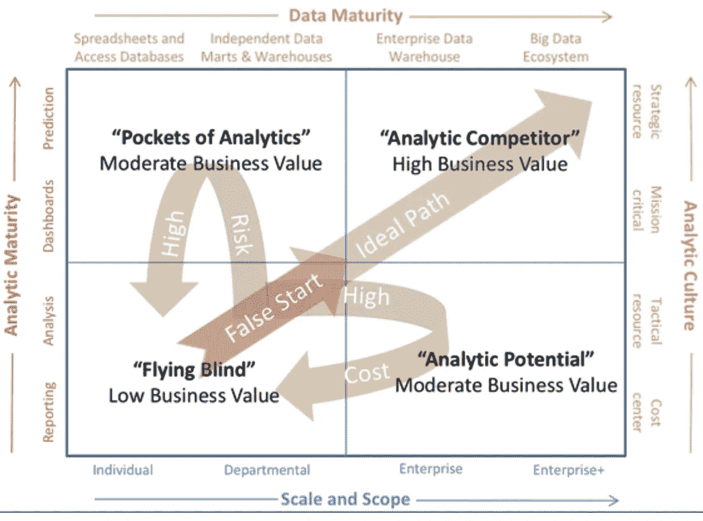
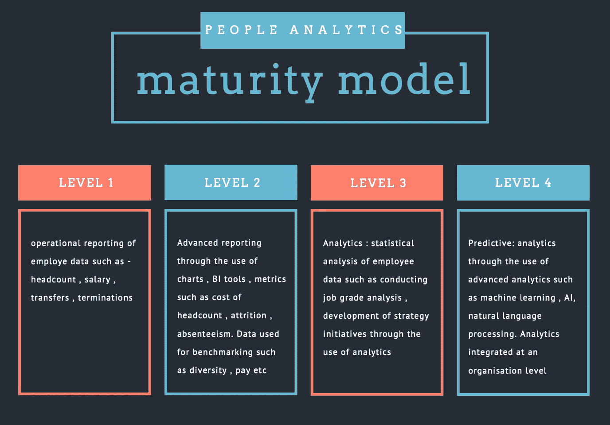

# 如何进行人员分析成熟度模型评估

> 原文：<https://towardsdatascience.com/how-to-conduct-a-people-analytics-maturity-model-assessment-569275eae5f8?source=collection_archive---------30----------------------->

## 使用埃克尔森的分析成熟度模型评估人员分析成熟度

约书亚·厄尔在 [Unsplash](https://unsplash.com/?utm_source=unsplash&utm_medium=referral&utm_content=creditCopyText) 上的照片

本文改编自我在西北大学数据科学硕士项目中的商业领导力和沟通课程。这是一种分析任何组织的分析智商的方法。我希望通过我的工作，我也能够强调一些在一个组织中推动分析成功的关键因素。

本文包含以下几个部分:

1.  介绍
2.  埃克森的分析成熟度模型综述
3.  人员分析成熟度模型概述
4.  如何衡量人员分析功能的分析成熟度
5.  如何衡量数据成熟度、人员分析计划的范围和规模
6.  衡量分析文化以进一步支持人员分析计划
7.  关键要点

**简介**

作为一名咨询出身的人，我记得我参加了那些强制性的在线培训课程，这些课程侧重于项目管理、交付原则和客户满意度。当我 2000 年开始职业生涯时，很少有公司关注内部事务。2008 年，谷歌启动了[Project oxy ge](https://rework.withgoogle.com/blog/the-evolution-of-project-oxygen/)n——一种数据驱动的分析方法，用来回答关于他们自己的人的问题，例如:

*   怎样才能成为一名优秀的经理
*   我们如何解锁员工敬业度
*   我们如何理解自己的员工，并帮助他们在工作中表现出色

根据 Bersin 关于人员分析的文章，自过去几年以来，随着越来越多的公司开始关注人力资本，叙事已经发生了变化。*人力资本代表着我们员工的天赋、技能和经验* (Arena，M 2018)，它们是公司在当今颠覆性领域取得成就的核心。公司开始探索的一个大问题是，我们如何利用数据、分析工具和方法来更好地了解和开发我们的人力资本，并为企业获得最佳价值。本文的目的是展示一种进行成熟度模型评估的方法，以确定他们在分析成熟度模型中的位置。

**埃克森的分析成熟度模型**

在他的名著《分析型领导者的秘密》中，Wayne Eckerson 描述了一个分析成熟度模型，该模型有 4 个主要的分析智商维度:数据成熟度、分析成熟度、分析文化以及规模和范围。他说，当公司从左下象限移到右上象限时，它们会获得更高的商业价值。 ***特别感谢韦恩·埃克森准许我使用这张图片***

照片由韦恩·埃克森通过[埃克森](https://www.eckerson.com/articles/data-strategy-pathways-part-iv-only-one-road-gets-you-home)

**左侧的分析成熟度**涵盖了公司的分析能力，例如从标准报告到预测报告的使用。

**数据成熟度**是一个具有挑战性的象限，因为它涉及到从整个组织的各个部门收集数据并将其整合以实现企业级分析的集成策略。为了让一家公司能够在分析上竞争(像亚马逊、谷歌等)，企业数据仓库战略至关重要。

**分析文化**在公司内部成功交付分析项目的过程中发挥着重要作用。因此，就像我们传统的转型计划一样，强大的赞助商、变革倡导者和管理层的支持为公司的分析工作定下了基调。

**随着公司开始在整个企业内以协调的方式交付分析，组织内分析项目的规模和范围**会增加。换句话说，人员分析不仅仅是关于人力资源部门可用的数据。为了了解业务驱动因素，我们还需要来自财务、销售、IT 和采购部门的数据。

**人员分析成熟度模型**

有几种方法可以在线获得人员分析成熟度模型。Josh Bersin 和他的团队在 2012 年提出了一个被广泛阅读的方法。根据我的调查研究，我试图重现下图中的关键级别。人员分析成熟度模型与左侧象限中埃克尔森的分析成熟度 4 个关键维度紧密相关。对于这项工作，我假设人员分析成熟度模型的第 1 级和第 2 级与埃克森的左下象限相关，而第 3 级和第 4 级将与埃克森的左上象限相关。

作者照片

现在，让我们来看看如何衡量公司人员分析功能的有效性。这是一个基于问卷的评估方法，包含一系列问题来支持我们的目标。所有问题的答案选项都是——强烈不同意、不同意、同意、强烈不同意

**衡量人员分析的分析成熟度**

为了衡量一个组织的分析成熟度，我们收集了对 3 个问题的回答(你可以和你的团队一起讨论更多的问题) :

*   **问题 1** :人力资源部门是否向经理和高管提供员工总数、离职、调动、休假、招聘等相关指标的仪表板(回答选项:完全不同意、不同意、同意、完全同意)
*   **问题 2** :人力资源部能否根据员工的表现、服务年限等，分析不同员工群体的多样性、薪酬和流失率。如果人员流失不是公司的问题，你可以将问题转化为对多样性的研究(回答选项:强烈不同意、不同意、同意、强烈不同意)
*   **问题 3:**HR 是否对员工数据进行外部对标，如职位分级、薪酬调查(答案选项:强烈不同意、不同意、同意、强烈不同意)
*   **问题 4** :人力资源不断开发预测模型以支持战略决策，例如进行 A/B 测试以测试人力资源干预是否有效。专家小组将研究为期 2 天的面对面入职培训与在线入职培训计划的有效性。请看我的文章[这里](/learning-analytics-13a409156d7c)

**测量数据成熟度，规模&范围**

以下一组问题有助于衡量任何组织内的数据成熟度、规模和范围:

*   **问题 5 :** 您是否在数据库中捕获员工数据
*   **问题 6 :** 人力资源部门是否与其他部门合作收集和利用数据，以提供企业范围的分析，例如去年的 7 大支柱学习计划如何帮助个人或团队提高销售业绩
*   **问题 7 :** 人力资源部门是否与其他部门合作，通过组织或部门范围的调查、入职或离职调查、视频来获取数据，并能够进行高级分析，如主题建模、情感分析，以了解主题和通过员工反馈提出的主题

**测量分析文化**

我在这里引入了一个问题来理解组织内的赞助，但人们可以围绕变革管理添加更多这样的问题。

*   **问题 8 :** 公司在董事会中是否有人力资源代表(人力资源主管)

**计算分数**

对于每个问题，适用以下点数分配:

a.强烈不同意:0 分

b.不同意:1 分

c.同意:2 分

d.非常同意:3 分

基于人员分析成熟度模型的组织分析成熟度级别可以根据以下分布进行计算:

1.  0–4 分:人员分析模型的第 1 级和埃克尔森模型的左下象限
2.  5-10 分:人员分析模型的第 2 级和埃克尔森模型的左下象限
3.  11- 16 分:人员分析模型的第 3 级和埃克尔森模型的左上角象限
4.  17 分及以上:人员分析模型的第 4 级和埃克尔森模型的左上角象限

**关键要点**

从我的研究中得到的关键是，在一个组织内建立一种分析文化是一个迷人的旅程，需要时间。从左下角象限(埃克尔森模型)或基于 excel 的报告的第 1 级(人员分析模型)开始，并在几年内上升到第 4 级，这一挑战令人生畏，但却非常令人兴奋。在我的演讲中，我经常听到和感受到人力资源专业人士的问题，他们后悔数据的混乱状态，缺乏赞助，缺乏来自单一数据库的国家级员工数据。我想告诉他们，通过最初的繁重工作和基于简短原型的分析方法的小小推动，随着时间的推移，也可以极大地帮助奠定分析文化的关键基础。去年在救世军，我们开始了一个疯狂的想法，将数据从多个工资系统到一个系统工作日的整个数据迁移过程自动化。那时，我们谁也不知道如何实现这一壮举。我对类似工作的搜索导致了一篇在线研究论文，激励我们继续这个想法。今天，我们有来自不同部门的人来找我们，了解更多关于这个工具的信息，以及他们如何在其他项目中利用它。在一家了不起的公司里，成为构建数据文化的一部分，这的确是一次美好的经历。点击这里，了解我们的数据之旅[。](https://community.alteryx.com/t5/Alteryx-Use-Cases/Workday-Data-Migration-How-we-saved-over-2000-hours-of-manual/ta-p/515688)

***引用:***

Arena，M (2018)适应性空间

Eckerson，W (2012)分析型领导者的秘密

AIHR 分析:[发现您组织的人力资源分析成熟度等级](https://www.analyticsinhr.com/blog/test-hr-analytics-maturity-level/)

Bersin 的[人才分析成熟度模型](https://www.slideshare.net/jbersin/bigdata-in-human-resources-making-it-happen/36-Talent_Analytics_Maturity_Model_Level)方法